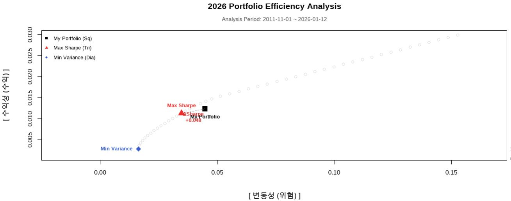

## Part II: 생각을 대신해 주는 투자 시스템 : R로 구축하는 개인 자산관리 시스템(PMS)

특징 : “이 Part는 세상에 거의 없는 책”

### Chapter 11. 왜 엑셀도 앱도 아닌 R이었는가

왜 나는 파이썬이 아니라 R을 선택하게 되었는가

처음 개인 자산관리 시스템을 만들어 보겠다고 마음먹었을 때, 언어 선택에 대해 깊이 고민하지는 않았다.
사실 그럴 필요조차 없어 보였다. 요즘 인공지능 시대에 데이터와 자동화를 이야기하면서 파이썬(Python)을 떠올리지 않는 것이 오히려 이상해 보였기 때문이다. 그 전에도 파이썬으로 코딩을 하는 경우가 훨씬 많았다. 그래서 자연스럽게 파이썬으로 시작했다. 주가 데이터를 불러오고, 수익률을 계산하고, 시뮬레이션을 돌리고, 그 결과를 정리해 보고 싶었다. 실제로 파이썬으로 금융데이터를 분석하는 기능과 예제는 인터넷에 많이 있다. 그리고 그 출발점에는 많은 사람들이 그렇듯 yfinance라는 라이브러리가 있었다. 그래서 처음에는 주피터 노트북 환경에서 yfinance 패키지를 이용하여 금융데이터를 수집하려고 했다. 보통 주가 데이터는 OHLC라고 부르는 데이터를 수집하는데 각각 Open(시가, 장시작할 때 가격), H(고가, 같은 날짜에서 가장 높은 가격), L(저가, 같은 날짜에서 가장 낮은 가격), C(종가, 장마감 가격)을 가져오는데 실무에서는 수정 종가(Adjuste Close Price)를 많이 쓴다. 그 이유는 액면분할과 배당을 감안하여 산출한 종가로 주식 시뮬레이션을 편하게 하기 때문이다. 그러니까 수정 종가를 가지고 많이 과거 백테스트를 하고 리스크 관리 지표를 산출한다.

처음에는 잘 되는 것처럼 보였다. 몇 줄의 코드로 미국 주식과 한국 주식의 가격 데이터를 불러오고, 그래프를 그릴 수 있었다. “이 정도면 충분하겠는데?”라는 생각도 들었다. 문제는 그 다음부터였다. 어느 날은 데이터가 잘 내려오다가, 어느 날은 특정 종목만 비어 있었다. 아예 보안이나 인증문제로 동작을 잘 안하는 경우도 많았다. 어제까지 되던 코드가 아무 이유 없이 에러를 내기도 했다. 같은 코드를 다시 실행하면 이번에는 또 되는 경우도 있었다. 보통 야후에서 무료로 데이터를 가져오게 되는데 아무래도 무료 데이터를 이용하다보니 책임문제가 없어서인지 불안정한 경우가 많았다. 나중에 인터넷으로 찾아보니 R은 통계 분석을 목적으로 태어난 언어이므로, 금융 데이터 처리와 관련된 패키지들(TTR, PerformanceAnalytics 등)이 상호 간의 의존성이 매우 견고하게 유지되는 반면 Python은 범용 언어이기 때문에 yfinance가 의존하는 pandas나 requests 등의 버전 업데이트에 따라 예상치 못한 호환성 문제가 발생할 가능성이 상대적으로 높다는 것을 알게 되었다. 이런 내용을 알려주는 책이 없었으므로 순전히 시행착오와 인터넷 검색을 통해 알야야 했다.

잘 모르는 처음에는 내 코드 문제라고 생각했다. 먼저 인터넷을 찾아보고, 옵션을 바꿔 보고, 챗지피티에게도 물어보고 라이브러리 버전을 확인했다. 하지만 시간이 지날수록 문제의 본질이 조금씩 보이기 시작했다. 문제는 코드가 아니라 데이터 소스의 불안정성이었다. 투자 시스템에서 데이터는 단순한 입력값이 아니다. 데이터는 판단의 출발점이고, 모든 계산의 전제이며, 시스템 전체를 지탱하는 기반이다. 그런데 그 데이터가 어느 날은 있고, 어느 날은 없고, 어느 날은 조용히 틀린 값을 준다면, 그 위에 어떤 논리도 쌓을 수 없다.

나는 점점 이런 생각을 하게 되었다. “이건 내가 투자 판단을 설계하는 문제가 아니라, 데이터가 오늘은 말을 들을지 말지를 매번 확인해야 하는 문제가 되고 있다.” 이 순간부터 파이썬이라는 언어 자체보다 금융 데이터를 다루는 생태계에 대해 다시 생각하게 되었다.

그러다 R을 떠올렸다. 정확히 말하면, R이라는 언어라기보다 quantmod라는 패키지가 먼저였다. 나중에 찾아보니 금융 데이터 분석과 운용의 신뢰성 확보 측면에서는 파이썬 yfinance 패키지는 비공식적인 스크래핑 방식을 쓰는데 이보다는 앞서 말했듯 R의 quantmod 라이브러리가 제공하는 데이터 처리 방식이 더 높은 안정성을 보장한다는 것을 알게 되었다.

사실 R은 전혀 새로운 언어가 아니었다. 예전에 대학원에서 통계 분석을 하며 잠깐 써본 적도 있었고, 학술분야나 금융 쪽에서 많이 쓰인다는 이야기도 알고 있었다. 그때는 사실 학계에서는 쓰는 도구이고 사회에서 쓰는 사람이 있을까 하는 막연한 생각만 가지고 있었다. 왜냐면 주위에 R언어를 쓰는 사람을 보지 못했기 때문이다. 그래서 “지금 다시 쓸 이유”는 없었다. 또 세상이 인공지능 시대로 들어서서 텐서플로, 파이토치 등 많은 생태계를 가진 파이썬이 우선적으로 떠올리게 된 것도 당연했다. 그러나 실제 코딩을 해보니 데이터의 안정성면에서 R이 월등했고 만족하면서 개발을 하게 되었다. R이라는 언어가 매우 저평가된 프로그래밍 언어가 아닌가 한다. 어쨌든 quantmod로 금융데이터를 수집하는 동일한 작업을 해 보았다. 같은 종목, 같은 기간, 같은 목적이었다. 놀라웠던 것은 매우 안정적으로 작동하며 동작과 관련하여 에러는 물론 아무 일도 일어나지 않았다는 점이었다.

에러도 없었고, 금융데이터 누락도 없었으며, 어제와 오늘의 결과가 달랐다는 느낌도 없었다. 데이터는 조용히, 묵묵히, 내가 요청한 그대로 내려왔다. 며칠을 반복해서 실행해 보았고, 다른 종목을 추가해 보았으며, 기간을 늘려 보기도 했다. 자동화도 해보았는데 결과는 늘 같았다. 그 순간, 아주 단순한 결론에 도달했다. “아, 이 언어는 금융 데이터를 다루는 일을 오랫동안 해온 전문 언어이구나”

이 깨달음은 생각보다 컸다. 왜냐하면 내가 만들고 싶은 것은 화려한 프로그램이 아니라 오래 돌아가는 안정적이고 강건한 시스템이었기 때문이다. 투자 시스템은 하루 이틀 쓰는 코드가 아니다. 몇 년, 어쩌면 몇십 년 동안 같은 논리를 반복 실행해야 한다. 그 과정에서 가장 중요한 것은 속도도 아니고, 확장성도 아니고, 문법의 세련됨도 아니다. 가장 중요한 것은 내일도 오늘과 같은 데이터를 받을 수 있는가다. 파이썬이건 R이건 소기의 목적을 달성하는데 이용하는 도구인데 R쪽에 훨씬 마음이 기울었다. 입출력데이터로 주로 CSV파일을 쓰는데 크게 불편함이 없었다.

파이썬으로는 항상 한 가지가 마음에 걸렸다. “오늘도 데이터가 제대로 내려올까?”라는 질문이다. R과 quantmod 라이브러리를 쓰기 시작하면서 그 질문은 사라졌다. 대신 이런 질문이 남았다. “이 데이터를 가지고 나는 어떤 판단을 내릴 것인가?” 이 차이는 작아 보이지만, 실제로는 시스템의 성격을 완전히 바꾼다. 전자는 도구를 관리하는 사고이고, 후자는 판단을 설계하는 사고다. 내가 작성한 프로그램을 파이썬으로 해도 되겠지만 R이 내가 원하는 모든 기능을 라이브러리를 통해 제공하고 있다. 특히 통계 부문에서는 신뢰도가 높다는 것을 알게 되었다. 애초에 통계학자가 만든 언어라 그럴 것이다. 그리고 정교한 그래픽을 표현하는데도 매우 많은 기능을 제공하는 부가적인 장점도 있다.

그 이후의 선택은 사실 선택이라고 부르기도 어려웠다. 언어의 우열을 따진 것이 아니라, 신뢰할 수 있는 기반을 택한 것에 가까웠다. 그런데 R은 친절한 언어가 아니다. 문법도 낯설고, 처음에는 불편하다. 하지만 대신, 한 번 작동하기 시작하면 묵묵히 같은 일을 반복한다. 백테스트, 이메일 전송 등 많은 기능을 검증된 라이브러리를 통해 신뢰성 높은 결과를 제공한다. 그리고 그것이 개인 투자자가 시스템을 만들 때 가장 중요한 덕목이라는 생각이 들었다. 그래서 나는 엑셀도, 앱도, 그리고 파이썬도 아닌 R을 선택하게 되었다. 데이터가 작을 때는 엑셀이 최고다. 그렇지만 엑셀로 자동화하기에는 한계가 있다. 이 책에서 소개하는 제미나이 생성형 AI에게 API로 프롬프트 엔지니어링을 통해 물어보고 메일도 자동으로 발송해주는 기능을 엑셀에게 기대하기는 무리다. R언어는 기술적으로 더 뛰어나서가 아니라, 투자라는 문제에 더 성실한 도구였기 때문이다. 왜 이리 금융패키지가 R언어에 많은가 하고 찾아 보니 많은 금융 및 계량경제학 교수와 연구자들이 자신의 최신 연구 결과(예: 새로운 리스크 모델, 알고리즘)를 R 패키지 형태로 가장 먼저 공개하는 전통이 있다고 한다. 이 덕분에 상업용 소프트웨어보다 더 정교하고 최신 기법이 담긴 금융 패키지들이 꾸준히 축적되어 왔고 이 때문에 통계학자가 만들고 금융 전문가들이 다듬은 언어라는 말을 듣는다는 것도 알게 되었다.

R설치하는 홈페이지에 가 보면 90년대 구닥다리 텍스트만 거의 잔뜩있는 촌스러운 모습을 보게 된다. 이것이 바로 실용성을 강조하는 R의 모습이 아닌가 한다. 화려한 인터페이스보다 묵묵히 할 일을 하는 R을 보면서 참 잘만든 언어라는 생각이 들었다. 혼자만의 생각이지만 고딕체로 단조로운 글자만 만은 코스트코 매장이 생각난다. 광고도 없이 품질좋은 물건을 고객에게 제공하는 것 하나만을 목표로 운영하는 매장같다는 생각이 든다. 어쨌든 R로 코드를 개발할 때 사실상 Rstudio라는 통합개발환경(IDE)를 사용하게 되는데 여기서도 매우 편리하게 개발할 수 있다. Rstudio안에서 도스창을 열 수도 있고 파일을 탐색할 수도 있으며 문법 하일라이트 기능과 심지어 git(버전관리해주는 도구)까지 그래픽으로 제공함으로써 개발자에게 많은 편의성을 제공하고 있다. 독자 여러분도 많이 편리함을 느끼길 바라겠다.

---
### Chapter 12. PMS의 전체 구조 이해하기

이 프로그램의 목적은 금융데이터는 수집하고 받아서, 시스템은 판단하며, 사람은 해석만 한다는 것이다. 앞으로 개인형 포트폴리오 모니터링 시스템 PMS라고 간단히 부르겠다. PMS를 처음 설명하면 많은 사람들이 이렇게 묻는다. “이게 결국 자동 매매 프로그램인가?” 혹은 “AI가 대신 투자해 주는 건가?” 이 질문에는 공통점이 있다. 사람들은 무언가를 자동화한다고 하면 곧바로 결정을 위임하는 시스템을 떠올린다. 비슷하긴 하지만 정확하지는 않다. 하지만 필자가 만들고 싶었던 PMS는 결정을 대신 내려주는 도구가 아니었다. 오히려 그 반대였다. 결정의 자리를 최대한 비워두고, 사람이 해석해야 할 자리만 남기는 시스템이다. 그것이 PMS의 출발점이었다. PMS로부터 매일 이메일을 받으면 90%이상의 확률로 할일이 아무것도 없다. 아무것도 하지말라는 것보다는 아무것도 하지 말아야겠다는 결론 내용의 이메일을 받는 것이다.

PMS의 구조는 의외로 단순하다. 기대하는 화려한 인공지능도 없고, 복잡한 예측 모델도 없다. 그냥 매일 받는 이메일을 보고 주식관련 유머 하나 읽고 끝이다. 그 대신 네 단계가 항상 같은 순서로 반복된다.

데이터 → 분석 → 판단 → 보고

먼저 데이터 수집 단계이다. 이 순서는 단순한 처리 흐름이 아니라 투자를 바라보는 하나의 태도다. 먼저 데이터가 들어온다. 사용자가 입력한 보유 주식의 종목명과 매수가격 정도이다. 주식 종목의 현재가는 사람이 작성한 데이터가 아니라, 미리 정의된 규칙에 따라 quantmod 라이브러리에 의해 자동으로 수집된 데이터다. 가격, 수익률, 변동성, 그리고 내가 중요하다고 판단한 몇 가지 지표들이 나오는데 아무런 해석도 하지 않는다. 좋다, 나쁘다, 비싸다, 싸다 같은 말은 아직 등장하지 않는다.

그 다음은 분석단계이다. 여기서도 사람은 개입하지 않는다. 과거 데이터로부터 수익률을 계산하고, 각종 리스크를 추정하고, 시나리오를 시뮬레이션한다. 이 단계에서 중요한 것은 분석의 정교함보다 일관성이다. 이번 달만 다르게 계산하지 않고, 시장 상황이 바뀌었다고 갑자기 기준을 바꾸지도 않는다. 분석은 늘 같은 방식으로 수행된다. 그리고 그 결과가 판단 단계로 넘어간다.

판단단계는 사람이 아니라 ‘규칙’이 한다. PMS에서 가장 오해받기 쉬운 부분이 바로 이 지점이다. 판단이라는 단어 때문에 사람들은 감정이나 직관을 떠올린다. 하지만 PMS에서 판단은 감정이 아니라 조건 비교에 가깝다. 예를 들어 이 변동성은 내가 정해둔 범위 안에 있는가 이 드리프트는 리밸런싱 기준을 넘었는가 인출 시나리오에서 파산 확률은 허용 범위 이내인가 등이다. 이 질문들은 사람에게 던져지지 않는다. 이미 코드 안에 들어 있다. 그래서 PMS의 판단은 늘 조용하다. 경고를 울리지도 않고, 지금 당장 무언가를 하라고 재촉하지도 않는다. 그저 이렇게 말할 뿐이다. “현재 상태는 네가 미리 정의한 규칙 안에 있다.” 또는 “이 지점은 규칙상 한 번 다시 바라봐야 한다.” 그 이상도, 그 이하도 아니다. 

마지막 보고단계는 결론이 아니라 ‘상태 설명’이다. 많은 투자 보고서는 결론을 먼저 보여준다. 이번 달 수익률, 잘한 점과 못한 점, 앞으로의 전망 등이다. 하지만 PMS의 보고서는 다르다. PMS는 전망을 말하지 않는다. 대신 상태를 설명한다. 현재 포트폴리오는 어떤 구조인가 변동성은 평소와 비교해 어느 수준인가 인출 시나리오에서 시스템은 얼마나 여유가 있는가 이 보고서를 읽는 사람은 바로 나 자신이다. 그래서 이 보고서는 설득을 위한 문서가 아니라 확인을 위한 문서에 가깝다.

중요한 것은 보고서가 나에게 행동을 지시하지 않는다는 점이다. “사라”, “팔아라”, “지금이 기회다” 이런 문장은 의도적으로 배제되어 있다. 사람은 해석만 한다. PMS를 쓰기 시작하면서 내 역할은 분명히 달라졌다. 과거에는 데이터를 직접 모으고, 계산하고, 그래프를 보며 감정을 섞어 판단했다. 지금은 다르다. 데이터는 시스템이 가져오고, 분석은 시스템이 수행하며, 판단은 미리 정해진 규칙이 대신한다.

사람인 나는 마지막에 남은 해석만 한다. “이 상태를 나는 감내할 수 있는가?”, “이 규칙은 여전히 나에게 맞는가?” 이 질문은 어떤 시스템도 대신해 줄 수 없다. 그래서 PMS는 이 질문을 사람에게 남겨 둔다. 이 구조가 중요한 이유는 단순하다. 투자에서 가장 위험한 순간은 사람이 계산과 판단을 동시에 하려고 할 때이기 때문이다. 계산하면서 감정이 개입되고, 감정이 개입되면서 기준이 흔들린다. PMS는 이 두 역할을 의도적으로 분리한다.

PMS가 대신 해주는 것들을 알아보자. PMS가 대신 해주는 일은 화려하지 않다. 하지만 그 소소한 대체가 장기적으로는 엄청난 차이를 만든다. 매일 같은 기준으로 데이터를 모아준다. 매일 자동으로 실행해주고 자동으로 자산현황을 기록관리해준다. 매번 같은 방식으로 리스크를 계산한다. 시장 상황과 상관없이 규칙을 먼저 적용한다. 보고서를 감정 없이 정리해 준다. 제미나이 생성형 AI를 활용해 시황분석까지 담은 이메일을 매일 오후에 보내준다.

그 결과, 나는 더 이상 매일 시장을 들여다볼 필요가 없다. 내 회사 업무에 집중하면 된다. 내가 휴가를 가더라도 내 컴퓨터는 매일 정해진 시간에 보고서를 만들어 나에게 메일로 전송해서 보고해준다. 이메일 내용과 첨부된 1페이지 현황 보고서만 보면된다. 첨부된 pdf 보고서도 글이 아니라 그래프로 직관적으로 이해하기 쉽게 나와 있다. 대신, 바쁘면 정해진 주기에 한 번 보고서를 열어본다. 그리고 묻는다. “아직도 이 구조가 맞는가?”

이 질문에 차분하게 답할 수 있다면, 그날의 투자 판단은 이미 끝난 것이나 다름없다. 시스템이 판단을 대신할수록, 사람은 자유로워진다. 아이러니하게도 판단을 시스템에 맡길수록 사람은 더 자유로워진다. 아무것도 하지 않아도 되는 날이 늘어나고, 시장을 보지 않는 시간이 늘어난다. PMS는 투자를 더 자주 하게 만들지 않는다. 오히려 덜 하게 만든다. 그리고 그 덜 하는 선택이 장기 투자에서는 대부분 더 나은 결과로 이어진다.

---

### Chapter 13. ETF 중심 포트폴리오 설계 원칙

결론만 말하면 나는 개별 종목을 포기한 것이 아니라, 끝까지 유지할 수 있는 구조를 선택한 것이다. 포트폴리오를 설계한다는 말을 들으면 많은 사람들은 자연스럽게 무엇을 담을 것인가부터 떠올리지만, 실제로 시스템을 만들겠다고 마음먹은 순간부터 사고의 방향은 서서히 바뀌기 시작한다. 무엇을 담을 것인가보다 무엇을 의도적으로 배제해야 하는가가 먼저 고민거리로 떠오르고, 그 질문은 곧 투자에서 내가 통제할 수 있는 영역과 그렇지 않은 영역을 가르는 기준이 된다. 그렇게 생각을 이어가다 보면, 개별 종목이라는 선택지는 언제나 가장 먼저, 그리고 가장 오래 검토하게 되는 대상이 된다.

개별 종목 투자는 언제나 강한 유혹을 동반한다. 한 기업의 성장 서사에 올라타는 경험, 시장보다 더 똑똑한 판단을 했다는 확신, 그리고 실제로 큰 수익이 났을 때의 성취감은 다른 어떤 투자 방식에서도 쉽게 대체되지 않는다. 문제는 이 유혹이 단순히 수익의 가능성만을 보여줄 뿐, 그 이면에 깔린 구조적인 불안정성을 거의 드러내지 않는다는 점이다. 개별 종목 투자는 맞히는 능력의 문제가 아니라, 같은 수준의 집중과 판단을 얼마나 오랫동안 유지할 수 있는가의 문제이며, 대부분의 개인 투자자는 그 지속성을 과소평가한 채 시장에 들어온다.

기업 하나를 투자 대상으로 삼는 순간, 투자자는 숫자보다 이야기를 더 많이 다루게 된다. 분기 실적의 미세한 변화가 갖는 의미를 해석하고, 경영진의 발언에서 의도를 읽어내며, 산업 전망과 거시 환경을 연결해 스스로 납득할 만한 서사를 만들어낸다. 이러한 과정은 매우 인간적이고, 동시에 매우 피로한 작업이기도 하다. 더 중요한 문제는 이 판단들이 대부분 명확한 규칙으로 환원되지 않는다는 점인데, 그 결과 판단은 언제나 “이번에는 예외”라는 말로 수정될 여지를 남긴다. 시스템은 예외를 싫어하지만, 개별 종목 투자는 예외 위에서 작동한다.

PMS를 설계하며 내가 가장 경계했던 것은 바로 이 예외의 누적이었다. 나는 시장에서 틀릴 수 있다는 사실보다, 왜 그런 판단을 했는지를 나중에 설명할 수 없는 상황을 더 불안하게 느꼈다. 시스템이란 본래 결과를 예측하기 위해 존재하는 것이 아니라, 과정에 대해 책임을 질 수 있게 만들기 위해 존재하는데, 개별 종목 투자는 그 과정의 상당 부분을 직관과 감각에 의존하게 만든다. 이 지점에서 개별 종목은 투자 실력의 문제가 아니라 시스템 설계의 관점에서 탈락하게 된다.

이와 대비되는 위치에 ETF가 있다. ETF는 특정 기업의 미래를 맞히는 도구가 아니라, 이미 정의된 규칙에 따라 구성된 집합에 노출되는 수단이며, 하나의 사건이 아니라 다수의 사건이 평균화된 결과를 받아들이는 구조를 전제로 한다. ETF를 선택하는 순간, 투자자는 개별 기업 리스크를 의식적으로 내려놓는 대신 자산군이라는 더 큰 단위의 성격을 받아들이게 되고, 이는 투자 판단의 차원을 근본적으로 바꾼다. 무엇이 급등할지를 맞히는 게임에서, 어떤 종류의 위험과 변동성을 감내할 것인지를 선택하는 문제로 전환되는 것이다.

ETF가 제공하는 자동 분산이라는 특징은 흔히 장점으로 언급되지만, PMS의 관점에서 보면 그보다 더 중요한 것은 분산이 기본값으로 주어진다는 사실이다. 분산을 해야겠다고 매번 결심할 필요가 없고, 특정 자산이 과도하게 커졌는지를 감정적으로 판단할 필요도 없다. 이미 분산된 상태에서 출발하기 때문에, 시스템은 그 위에 비중과 규칙만 얹으면 된다. 이 단순함은 투자 전략을 단순하게 만드는 것이 아니라, 오히려 유지 가능하게 만든다. 복잡한 구조는 언제나 관리 비용을 요구하고, 관리 비용은 시간이 지나면 판단을 흐리게 만든다.

ETF 중심 포트폴리오로 전환하면서, 내가 투자에서 다루는 질문의 성격도 점점 달라졌다. 개별 기업의 실적이 예상치를 상회했는지를 따지는 대신, 자산군 간의 상관관계가 어떻게 변하고 있는지를 보게 되었고, 특정 산업의 성장성보다는 포트폴리오 전체의 변동성이 감내 가능한 범위 안에 있는지를 먼저 확인하게 되었다. 이러한 변화는 투자를 덜 자극적으로 만들었을지도 모르지만, 대신 훨씬 덜 소모적으로 만들었다. PMS가 지향하는 것은 흥분을 유지하는 능력이 아니라, 지루함을 견디는 능력이기 때문이다.

개인 투자자에게 ETF가 특히 적합한 이유는 여기에서 분명해진다. 개인 투자자는 정보 접근성에서도, 시간 투입에서도, 감정 관리 측면에서도 기관 투자자와 같은 위치에 서기 어렵다. 그렇다면 경쟁해야 할 대상은 시장이 아니라, 자기 자신의 판단 오류와 감정 기복이 된다. ETF는 이 싸움에서 개인 투자자에게 유리한 환경을 제공한다. 상품의 구조가 비교적 단순하고, 운용 방식이 투명하며, 장기 보유를 전제로 설계되어 있기 때문이다. 이는 PMS의 보고 단계에서도 중요한 차이를 만든다. 보고서는 결정을 정당화하기 위한 문서가 아니라, 현재 구조가 여전히 유효한지를 확인하는 도구이기 때문이다.

“왜 이 자산을 들고 있는가?”라는 질문에 ETF는 비교적 변하지 않는 답을 제공한다. 미국 주식 시장 전체에 대한 노출, 글로벌 채권을 통한 변동성 완화, 단기 금리에 연동된 현금성 자산이라는 설명은 시간이 지나도 크게 흔들리지 않는다. 이 설명 가능성은 PMS가 사람에게 요구하는 역할을 최소화한다. 시스템이 대부분의 판단을 수행하고, 사람은 그 판단이 여전히 자신의 삶과 맞는지를 해석하는 데 집중할 수 있게 된다.

ETF 중심 설계를 택했다는 말은 종종 소극적인 선택처럼 들리지만, 실제로는 상당히 단호한 결단에 가깝다. 이 선택에는 분명한 포기가 포함되어 있다. 시장을 이길 수 있다는 기대, 대박을 맞힐 수 있다는 환상, 남들보다 더 똑똑하게 행동할 수 있다는 자기 확신을 의도적으로 내려놓는 것이다. 대신 얻는 것은 시스템이 무너지지 않는다는 확신이며, 최악의 해를 겪고도 구조가 유지된다는 안정감이다. PMS가 궁극적으로 추구하는 것은 최고의 수익률이 아니라, 파산하지 않는 구조이며, 그 목표 앞에서 ETF 중심 포트폴리오는 가장 현실적인 해답에 가깝다.

결국 ETF 중심 포트폴리오란 수익률을 극대화하기 위한 전략이라기보다, 판단의 일관성을 극대화하기 위한 선택이다. 일상적인 판단은 구조에 맡기고, 정말 중요한 순간에만 사람이 개입할 수 있도록 여백을 남겨두는 것, 그것이 내가 PMS를 통해 이루고 싶었던 투자 방식이었다. 개별 종목을 배제한 것은 그래서 방어적인 선택이 아니라, 시스템이라는 틀을 끝까지 유지하기 위해 감행한 가장 적극적인 결정이었다. 또한 현실적으로 미국 SPY ETF를 구성하는 기업의 수명이 그리 길지 않아 매번 SPY에서 알아서 편입 편출을 해주는 편리함도 누릴 수 있다. 그러고 보면 기업의 흥망성쇠가 불과 수십년에 불과한데 그런 것을 일일이 신경쓰지 않고 장기투자를 할 수 있는 ETF라는 것이 투자자로서는 대단한 발명품으로 여겨지게 된다. 그외에도 미국ETF로 투자하게 되면 미국 달러로 투자하는 효과가 있어서 금융위기에는 보통환율이 상승하게 되는데 이 환율 상승효과로 하락분이 방어되는데도 좋은 역할을 하는 장점이 있다. 어떤 사람은 이를 환율 쿠션이라고 부르기도 한다. 거의 유일한 단점은 아무래도 ETF 운용사에 내는 약간의 수수료인데 가급적 수수료가 적은 ETF를 사도록 하자. 예를들어 SPY ETF보다는 SPYI ETF를 매수한다든지 QQQ도 QQQM으로 매수한다든지 하는 방법을 이용하면 소액 투자자인 경우에는 약간이나마 도움이 될 것이다.

---

### Chapter 14. 왜 이 ETF 비율인가

포트폴리오 비중은 취향이 아니라, 감당 가능한 세계의 크기다. 포트폴리오에서 가장 오해받는 요소는 종목이 아니라 비중이다. 사람들은 어떤 ETF를 담았는지에는 관심을 가지지만, 왜 그 비율인지에 대해서는 상대적으로 쉽게 넘어간다. 그러나 시스템의 관점에서 보면, 자산의 종류보다 훨씬 중요한 것은 비율이며, 포트폴리오의 성격은 개별 상품이 아니라 비중에서 결정된다. 같은 ETF 묶음이라도 비율이 달라지는 순간, 전혀 다른 포트폴리오가 된다.

PMS를 설계하면서 내가 가장 경계했던 것은 바로 이 지점이었다. 이 비율이 그럴듯해 보이기 때문에 선택한 것인지, 아니면 이 비율이 내가 실제로 감당할 수 있는 세계의 크기이기 때문에 선택한 것인지를 분리하지 않으면, 시스템은 결국 취향의 집합으로 전락하게 된다. 투자에서 취향은 존중받을 수 있지만, 시스템에서는 언제나 위험 요소가 된다.

그래서 나는 비중을 정하기 전에, 먼저 이 질문을 던졌다. “이 포트폴리오가 최악의 순간을 맞았을 때, 나는 이 구조를 유지할 수 있는가?” 

그래서 미리 겪어보는 미래로 PortfolioVisualizer라는 도구를 필자는 사용하였다. 이 질문에 감정으로 답하는 것은 의미가 없었다. 대부분의 사람은 하락장을 머릿속으로 상상할 때 실제보다 훨씬 완만한 그림을 그리기 때문이다. 그래서 나는 미래를 예측하기보다는, 과거를 가능한 한 많이 겪어보는 쪽을 택했다. 이때 사용한 도구가 바로 PortfolioVisualizer였다. 사이트명이 portfoliovisualizer.com이다. 한 번 들어가서 과거 백테스트를 직접 해보자. PortfolioVisualizer는 정답을 알려주는 도구가 아니다. 대신 이렇게 말하는 도구에 가깝다. “당신이 선택한 구조(포트폴리오 비중)는, 과거의 이 순간들에서는 이렇게 행동했다(백테스트 결과가 이렇다)”는 판단을 하는데 도움을 준다.

이용하는 방법은 portfoliovisualizer.com에 가서 Portfolio Optimization 메뉴로 들어간다. 여기서 Backtest Portfolio를 선택하고 원하는 주식의 티커를 넣고 비중을 넣으면 알아서 최근 백테스트를 통한 성과를 보여준다. 무료인데다 시각적인 그래프도 잘 나와서 과거 백테스트를 쉽게 하는데는 최고의 도구라고 생각한다.

여기서 중요한 것은 수익률 그래프의 끝점이 아니라, 그 중간에 등장하는 낙폭과 변동성이다. 어느 해에 얼마나 벌었는지는 시간이 지나면 잊히지만, 어느 순간에 얼마나 버텨야 했는지는 몸에 남는다. PortfolioVisualizer를 통해 내 포트폴리오를 과거 금융위기, 테이퍼 텐트럼, 팬데믹 구간에 겹쳐보았을 때, 나는 처음으로 비율이라는 것이 단순한 숫자가 아니라 심리적 내구성을 측정하는 도구라는 사실을 실감하게 되었다.

PMS의 비중 결정 로직은 질문에서 출발한다. PMS에서 비중을 결정하는 로직은, “얼마를 벌고 싶은가”가 아니라 “얼마를 잃을 수 있는가”에서 출발한다. 이 순서가 바뀌는 순간, 시스템은 희망 회로를 품게 된다. 기대수익률은 언제나 매력적으로 보이지만, 변동성과 낙폭은 그렇지 않다. 그러나 실제로 투자자를 시장에서 탈락시키는 것은 낮은 기대수익률이 아니라, 감당하지 못하는 변동성이다.

그래서 PMS에서는 비중을 정할 때, 먼저 각 자산군이 포트폴리오 전체 변동성에 어떤 기여를 하는지를 확인하고, 그다음 이 조합이 만들어낼 최대 낙폭이 어느 수준까지 확장되는지를 숫자로 확인한다. 이 과정에서 중요한 것은 정밀함이 아니라 일관성이다. 동일한 가정, 동일한 계산 방식, 동일한 기준으로 여러 비율을 비교해 보았을 때, 어떤 조합이 가장 오래 버틸 수 있는 구조인지를 보는 것이다.

기대수익률과 변동성은 언제나 함께 움직인다. 투자에서 가장 흔한 오해 중 하나는 기대수익률과 변동성을 서로 다른 항목으로 생각하는 것이다. 하지만 이 둘은 사실상 같은 문장의 앞뒤에 붙은 단어에 가깝다. 기대수익률을 조금 더 원하면, 그만큼 변동성도 함께 따라온다. 문제는 이 추가된 변동성이 실제로 내 삶의 리듬과 충돌하는지 여부다.

PMS 포트폴리오의 비중은 이 충돌 지점을 피하기 위해 조정되어 있다. 주식 비중을 무작정 낮추지도 않았고, 그렇다고 공격적으로 끌어올리지도 않았다. 대신 여러 시뮬레이션을 통해, 기대수익률이 일정 수준 이상 유지되면서도 변동성이 급격히 증가하지 않는 구간, 다시 말해 추가적인 수익 대비 추가적인 스트레스가 급격히 커지지 않는 지점을 찾고자 했다. 이 지점은 사람마다 다르지만, 적어도 나에게는 이 비율이 그 경계선에 가장 가까워 보였다.

주관이 아닌 수치로 결정한다는 것의 의미에 대해 생각해 보자. 비중을 숫자로 결정한다는 말은 흔히 들리지만, 실제로 그 과정을 끝까지 밀어붙이는 사람은 많지 않다. 왜냐하면 숫자는 종종 우리가 듣고 싶지 않은 이야기를 해주기 때문이다. “이 비율은 수익률은 높지만, 네가 견딜 수 없는 낙폭을 동반한다”거나, “이 구조는 이론적으로는 훌륭하지만, 실제 하락장에서는 네가 중간에 포기했을 가능성이 높다”는 메시지는 불편하다.

하지만 PMS에서는 이 불편함을 회피하지 않는다. 오히려 그 불편함을 시스템 설계의 중심에 둔다. 비중을 정하는 과정에서 느끼는 찜찜함은, 실제 하락장에서 느끼게 될 공포의 예고편에 가깝기 때문이다. 이 예고편을 감당할 수 없다면, 비율은 반드시 조정되어야 한다.

“이 정도 낙폭을 감당할 수 있는가?”를 숫자로 확인해보자. PMS에서 가장 중요한 검증 질문은 이것이다.
“이 포트폴리오가 -30%를 기록했을 때, 나는 이 구조를 유지할 수 있는가?” 이 질문은 결코 추상적이지 않다. PortfolioVisualizer와 PMS의 시뮬레이션은 이 질문을 구체적인 숫자로 바꿔준다. 어떤 해에, 어떤 속도로, 얼마나 깊게 빠졌는지를 미리 확인한 뒤에야 비로소 비중에 대한 논의가 가능해진다. 그리고 이 과정을 거친 뒤에 남은 비율은, 더 이상 ‘공격적이다’거나 ‘보수적이다’라는 말로 설명되지 않는다. 그저 “내가 감당할 수 있는 구조”라는 표현만이 남는다.

우리는 이 비율이 타당한가에 대한 답을 해 볼 수 있다. 그래서 “이 PMS 포트폴리오의 투자 비율이 타당한가?”라는 질문에 대한 나의 대답은, 특정 수익률 숫자가 아니라 이 과정 자체에 있다. 이 비율은 시장을 이기기 위해 설정된 것이 아니라, 시장이 나를 시험할 때 끝까지 유지될 수 있도록 설정된 비율이다. 기대수익률과 변동성, 낙폭과 회복 속도를 반복해서 점검한 끝에, 더 줄이면 아쉬웠고, 더 늘리면 불안해지는 지점에서 멈춰 있다.

투자 비율의 타당성은 미래 성과로만 증명되는 것이 아니다. 오히려 그 비율을 정하는 과정이 얼마나 정직했는지, 그리고 그 과정이 시간이 지나도 다시 설명 가능한지에 의해 평가된다. PMS의 비중 결정 로직은 바로 이 설명 가능성을 위해 존재한다. 결국 이 ETF 비율은 하나의 답이 아니라, 하나의 고백에 가깝다. “나는 이 정도의 변동성과 이 정도의 낙폭까지는, 숫자로 확인한 뒤에 받아들이기로 했다” 그리고 이 고백을 코드로 남겼다는 사실이, 이 포트폴리오를 단순한 투자 조합이 아니라 시스템으로 만들어 준다. 

ETF로 투자하기로 했으면 어떤 ETF로 할지 정하면 된다. 필자는 가급적 대중이 많이 투자하는 ETF로 정하기로 했다. 그래서 정한 것이 미국 대표 500개 기업에 투자하는 가장 유명한 SPY ETF, 배당금을 지속적으로 증가시켜주는 대표적인 배당주 모음 SCHD ETF, 나스닥 기술주 100개 종목에 투자하는 QQQ, 그리고 QQQ를 3배로 추종하는 가장 유명한 레버리지 ETF인 TQQQ, 채권으로는 미국 중기채인 IEF ETF, 그리고 금투자를 하는 GLD ETF, 그리고 사실상 현금역할을 하는 BIL ETF(또는 SGOV ETF도 비슷하다)를 선택하기로 했다. 여기에는 대중적인 ETF를 골랐는데 독자가 나중에 서로 다른 ETF를 조합하여 투자해도 상관없다. 하지만 대원칙은 마코위츠의 이론대로 서로 상관계수가 낮은 ETF를 섞어서 투자해야 한다는 것이다. 예를 들어 주식ETF만 왕창 투자하면 안되고 채권이나 금 ETF를 섞어서 사야 한다는 말이다. 그 섞어 사는 비율은 젊고 앞으로 투자할 기간이 아주 긴 경우, 그리고 하락폭을 많이 견딜 수 있다면 보통 위험자산이라고 부르는 주식형 ETF비율을 높이고 은퇴시점이 얼마 남지 않았거나 원금 손실을 매우 싫어하는 투자자는 안전자산이라고 부르는 ETF를 더 높은 비율로 투자하면 된다. 어떤 글을 보니까 이를 쉽게 공식처럼 만들어 놓았다. 100에서 자신의 나이를 빼고 그 비율만큼 위험자산에 투자하고 나머지는 안전자산에 투자하는 방법이다. 예를 들어 45세라면 100에서 45를 뺀 55%만큼 위험자산에 투자하고 나머지 45%는 안전자산에 투자하는 방법을 쓰면 된다. 아무래도 젊은 사람은 약간 투자손실이 있어도 꾸준한 수입으로 더 장기투자를 할 수 있기 때문일 것이다.

포트폴리오 비중에 대해서는 정답이 없으므로 독자여러분이 판단해서 정하면 된다. 만약 그래도 잘 모르겠으면 아래와 같이 질문하여 구글 제미나이 생성형AI의 도움을 받아보자. 

"은퇴를 10년 앞둔 일반 직장인이 SPY ETF 정도 수익률과 그보다는 좀 낮은 변동성을 위해 SPY, QQQ, IEF, GLD, BIL  ETF를 섞어 매월 꾸준히 매수한다고 가정했을 때 최적의 투자 비중은 어떤 것인지 추천해줘"

위과 같이 문의하면 SPY:QQQ:IEF:GLD:BIL = 30%:15%:30%:15%:10% 정도의 비율을 추천해주며 SPY의 연평균 수익률과 비슷하지만 약간 낙폭을 줄일 수 있는 비중으로 추천해준다. 실행 시점이나 생성형AI 종류에 따라 위의 비율이 다르게 나올 수 있다. 심지어 같은 생성형AI도 때에 따라 비중이 달라지기도 했다. 투자세계에서 최적의 마법의 비율이란 존재하지 않는 것이다. 그도 그럴 것이 아무리 인공지능이라고 해도 물어보는 사람의 성향이나 위험 감수 정도를 알 수 없기 때문이다. 다시 말하면 절대적인 마법의 포트폴리오 비율이란 없고 위의 추천비율도 과거 사례(백테스트)를 바탕으로 만들었을 터이므로 독자들이 최종판단해야 한다. 단 하나의 원칙이라면 앞서 말한대로 분산투자의 효과를 최대로 보기 위해 주식형과 채권형, 금 등을 적절히 섞어서 투자해야 한다는 것이다. 해리 마코위츠가 무려 70여년 전에 이미 수학으로 증명한 사실을 우리는 실천만 하면 된다. 친절하게도 생성형AI는 위의 비율로 사되 주기적으로 리밸런싱을 하고 은퇴를 앞두고는 안전자산 비율을 올리라는 공자님 말씀 같은 안내도 해준다.

그런데 한국에도 KOSPI200 지수추종 ETF가 있는데 왜 미국 ETF위주로 구성했는지 질문한다면 일단 미국 주식이 주주 친화적이고 오랜 역사를 가지고 있기 때문이기도 하지만 혁신과 세계 시장에서 차지하는 비중 등을 고려하여 미국ETF를 선택했다. 전세계 주식시장에서 우리나라 주식시장이 차지하는 비중이 2% 정도밖에 되지 않는다. 그외에도 미국 ETF를 투자하는 이유는 훨씬 많이 나열할 수 있다. 무엇보다 인구가 줄어드는 우리나라보다 전세계의 두뇌들이 몰려드는 미국에 대한 장기 성장을 기대하기 때문이라고 하는 편이 좀 더 솔직한 이유가 될 것이다. 만약 우리나라 ETF를 투자하고 싶으면 KOSPI200을 추종하는 ETF를 일정 비율로 매수하는 것도 좋은 생각이라고 생각한다. 

어쨌든 여기서는 은퇴를 10년 정도 앞둔 가상의 인물인 대기업 다니는 김부장을 예시로 들도록 하겠다. 10년 후 은퇴를 앞두고 있고 맞벌이하는 부인과 함께 꾸준히 월 5백만원을 투자하는 경우를 들겠다. 여러 투자 포트폴리오 중에서 SPY ETF를 투자하는 것도 좋은 방법이지만 약간의 변동성을 희생해서 그 보다는 더 많은 기대 수익률을 얻으려고 하는 투자자로 가정해 보겠다.

이 경우 SPY:SCHD:QQQ:TQQQ:GLD:IEF:BIL = 36%:20%:15%:10%:10%:5%:4%로 정했다. 다시 한 번 말하자면 이 비율은 임의적인 것이므로 독자 여러분이 정해서 운용하면 된다. 이 비율이 SPY 단독 투자에 비해서 얼마나 기대수익과 변동성이 있는지 알아보자.

portfoliovisualizer.com에서는 아래와 같이 답변해준다. 기준은 2026년 초를 기준으로 최근 약 170개월을 기준으로 백테스트를 하였다. 약 170개월을 가정한 이유는 위의 ETF중에서 최근에 출시한 SCHD가 2011년 말에 출시했는데 2026년 초 기준으로 SCHD ETF 출시 이후 약 170여개월이 흘렀기 때문이다. 표본수를 늘린다고 그 전의 기간까지 산정하면 없는 역사를 가지고 만드는 인위적인 데이터를 사용하여여 하고 170개 표본수 정도면 어느 정도 충분한 기간으로 가정했기 때문이기도 하다.

|구분| "김부장" 포트폴리오 | SPY ETF|
|   |---:|---:|
|연수익률|18.3%|14.9%|
|변동성|16.3%|15.1%|
|MDD|-26.0%|-23.9%|
|Shape 비율|0.99|0.85|

위에서 Shape비율은 연수익률을 변동성으로 나눈 것이다. 정확히는 연수익률에서 무위험이자율을 빼야 하지만 무위험이자율은 0으로 가정하였다. 변동성(위험) 대비 얼마나 수익을 얻는지에 대한 비율로 일종의 가성비 지표라고 볼 수 있다. 어쨌든 SPY ETF보다 약간의 변동성과 MDD를 희생하니 연수익률이 더 높았기 때문에 Sharpe 비율이 SPY ETF 단독 투자보다 더 높게 나왔다. 중요한 것은 비율보다 얼마나 오랫동안 일관되게 투자를 할 수 있는지 실행력이 될 것이다.

위의 분산투자의 사례가 마코위츠의 효율적 프론티어에 비추어 어디에 해당하는지 한 번 알아보자.  https://github.com/shbang-cmd/PMS_Core/blob/master/pf_efficient_frontier_simul.R 소스를 실행시켜 보면 아래와 같은 그래프가 나온다.(현금을 종목으로 넣을 수 없어서 현금비중 4%를 SPY에 넣어서 SPY 40%로 가정했다) 위의 "김부장"포트폴리오는 효율적 프론티어의 접선에 있지는 않지만 거의 가까운 것을 볼 수 있다. 

그렇다면 최근 170개월동안 위의 종목에 투자했을때 가장 최적의 포트폴리오는 무엇이었을까 한 번 최적의 해를 찾아보자. https://github.com/shbang-cmd/PMS_Core/blob/master/Find_max_Sharpe_from_monthly_returns.R 소스를 실행해보면 알 수 있다. 이 책이 다른 책들과 다른 점은 어디어디서 결과만 가져와서 보여주는 수준이 아니라 그 결과를 가져오는 소스코드를 모두 공개하는데 있다. 관심이 많은 독자는 이리 저리 파라미터를 변경하면서 시뮬레이션 해 볼 수 있다. 어쨌든 최적의 Sharpe비율을 찾는 결과는 QQQ 49.90% GLD 23.16% SCHD 23.03% IEF 3.92% TQQQ/SPY ≈ 0(수치오차 수준) 으로 나오는데 QQQ에 거의 절반을 투자하고 나머지 반반은 금과 SCHD 그리고 소수의 미국중기채에 투자했어야 했다 라고 나왔다. Ann.Return 14.14%, Ann.Vol 11.74%, Sharpe(Ann) 1.205으로 나오는데 Sharpe 비율이 1을 넘으면 매우 우수한 성과라고 본다. 필자가 이런 비율로 투자하지 않는 이유는 과거의 사례가 반드시 미래의 성과로 보장되지 않기 때문이다. 그러고 보면 최근 170개월동안 미국 기술주 중심으로 많은 상승을 해왔기 때문에 QQQ의 전성시대였기 때문일 것이다. 거기에 금과 변동성이 상대적으로 적은 SCHD를 섞어서 투자해서 전체적인 리스크를 낮추는데 도움이 되었을 것으로 추척한다. 현대포트폴리오 이론에 따르면 효율적 프론티어의 현실적 단점은 과거데이터에 과도하게 의존한다는 점, 극단적인 사건을 무시하는 점 등으로 참고는 하되 꼭 따라할 필요는 없다고 본다. 그래서 필자는 가상의 김부장 포트폴리오(SPY:SCHD:QQQ:TQQQ:GLD:IEF:BIL = 36%:20%:15%:10%:10%:5%:4%)대로 투자하기로 했다. 독자 생각에 더 좋은 포트폴리오가 있다면 그것이 정답이다. 계속 강조하지만 한 번 만든 포트폴리오는 꾸준히 실행해야 하고 그것이 포트폴리오 비중조절보다 열배 백배는 더 중요하다.

### Chapter 15. 기대수익률을 어떻게 계산하는가

과거 수익률의 한계

CAGR, 평균수익률, 복리 효과

“예측”이 아닌 “범위”로 접근하기

백테스트를 믿되, 맹신하지 않는 법

### Chapter 16. 리스크를 숫자로 보는 법

변동성(Volatility)

최대낙폭(MDD) : 최고 성과보다 중요한 최악의 구간

Sharpe / Calmar Ratio

왜 이 지표들만으로 충분한가

수익률보다 중요한 손실 관리

국민연금의 진짜 목표는 ‘망하지 않는 것’

### Chapter 17. 스트레스 테스트와 시나리오 분석

2008년, 2020년을 다시 겪어본다면

대형 기관은 어떻게 리스크를 관리하는가

내 포트폴리오는 살아남을 수 있는가

최악을 상정하는 투자

### Chapter 18. 월 1회 리밸런싱이라는 선택

잦은 조정이 오히려 해로운 이유

리밸런싱의 진짜 목적

자산배분의 힘을 증명한 사례 : 예일대학 기금은 어떻게 전설이 되었는가

퇴직연금 DC형에 시스템을 연결하다

규칙 예시와 실제 코드 구조

### Chapter 19. 현금 관리까지 시스템화하기

6개월 생활비 분리

투자금과 비상금의 분리

현금도 자산이다

### Chapter 20. PMS 자동화: 사람이 할 일을 없애라

스케줄링

시장 휴장일 자동 인식

사람이 개입하지 않아도 굴러가는 구조

### Chapter 21. 인공지능과 PMS의 결합

AI에게 맡길 것과 맡기지 말 것

일일 리포트 자동 해석

“조언”이 아니라 “해석”

### Chapter 22. 이메일·모바일로 받는 일일 리스크 리포트

하루 1페이지 리포트의 힘

해외여행 중에도 포트폴리오 점검하기

정보 과잉을 피하는 보고서 설계

### Chapter 23. PMS를 10년 동안 유지하기 위한 원칙

코드를 이해하지 않아도 되는 이유

시스템은 단순해야 오래 간다

추가하고 싶은 유혹과의 싸움

고도화보다 안정성

---

