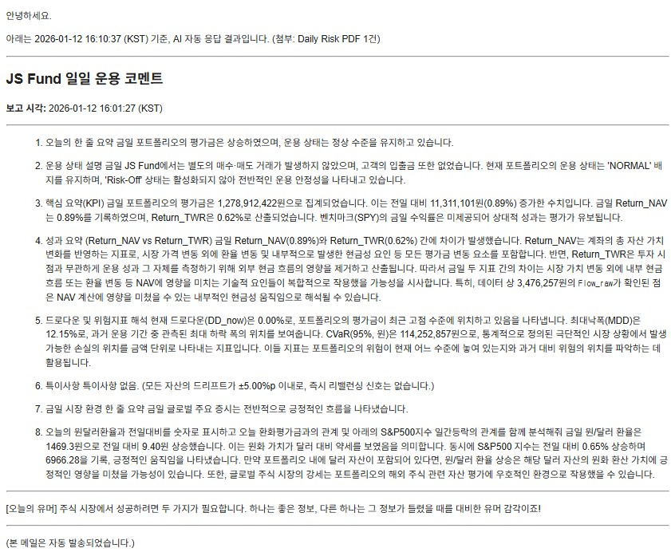
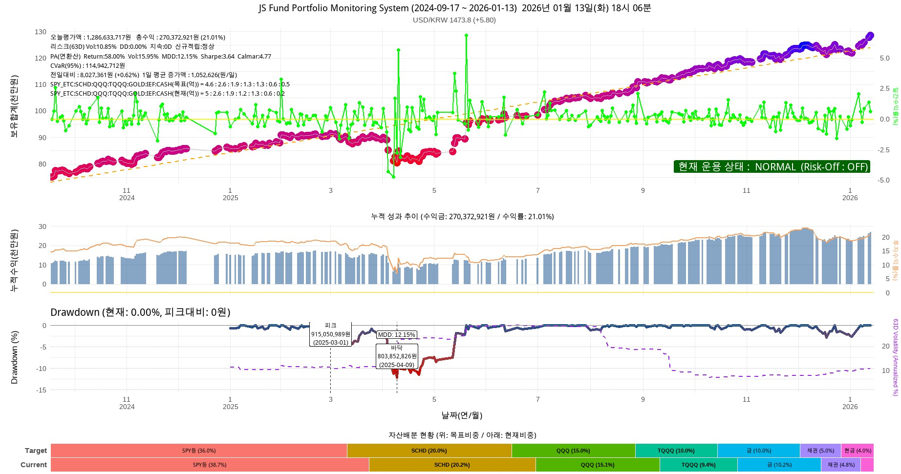

## Part II: 생각을 대신해 주는 투자 시스템 : R로 구축하는 개인 자산관리 시스템(PMS)

특징 : “이 Part는 세상에 거의 없는 책”

### Chapter 11. 왜 엑셀도 파이썬도 아닌 R이었는가

엑셀의 한계

파이썬의 현실적 문제

R이 개인 투자자에게 주는 자유도

### Chapter 12. PMS의 전체 구조 이해하기

데이터 → 분석 → 판단 → 보고

사람은 해석만 한다

PMS가 대신 해주는 것들

### Chapter 13. ETF 중심 포트폴리오 설계 원칙

개별 종목을 배제한 이유

ETF가 제공하는 자동 분산

개인투자자에게 최적화된 상품군

### Chapter 14. 왜 이 ETF 비율인가

PortfolioVisualizer로 미리 점검해보는 내 포트폴리오

PMS 비중 결정 로직

기대수익률과 변동성의 균형

주관이 아닌 수치로 결정하는 방식

“이 정도 낙폭을 감당할 수 있는가?”를 숫자로 확인하기

### Chapter 15. 기대수익률을 어떻게 계산하는가

과거 수익률의 한계

CAGR, 평균수익률, 복리 효과

“예측”이 아닌 “범위”로 접근하기

백테스트를 믿되, 맹신하지 않는 법

### Chapter 16. 리스크를 숫자로 보는 법

변동성(Volatility)

최대낙폭(MDD) : 최고 성과보다 중요한 최악의 구간

Sharpe / Calmar Ratio

왜 이 지표들만으로 충분한가

수익률보다 중요한 손실 관리

국민연금의 진짜 목표는 ‘망하지 않는 것’

### Chapter 17. 스트레스 테스트와 시나리오 분석

2008년, 2020년을 다시 겪어본다면

대형 기관은 어떻게 리스크를 관리하는가

내 포트폴리오는 살아남을 수 있는가

최악을 상정하는 투자

### Chapter 18. 월 1회 리밸런싱이라는 선택

잦은 조정이 오히려 해로운 이유

리밸런싱의 진짜 목적

자산배분의 힘을 증명한 사례 : 예일대학 기금은 어떻게 전설이 되었는가

퇴직연금 DC형에 시스템을 연결하다

규칙 예시와 실제 코드 구조

### Chapter 19. 현금 관리까지 시스템화하기

6개월 생활비 분리

투자금과 비상금의 분리

현금도 자산이다

### Chapter 20. PMS 자동화: 사람이 할 일을 없애라

스케줄링

시장 휴장일 자동 인식

사람이 개입하지 않아도 굴러가는 구조

### Chapter 21. 인공지능과 PMS의 결합

AI에게 맡길 것과 맡기지 말 것

일일 리포트 자동 해석

“조언”이 아니라 “해석”

### Chapter 22. 이메일·모바일로 받는 일일 리스크 리포트

하루 1페이지 리포트의 힘

해외여행 중에도 포트폴리오 점검하기

정보 과잉을 피하는 보고서 설계

### Chapter 23. PMS를 10년 동안 유지하기 위한 원칙

코드를 이해하지 않아도 되는 이유

시스템은 단순해야 오래 간다

추가하고 싶은 유혹과의 싸움

고도화보다 안정성


### Chapter 24. PMS 세부 설명

설치하는 방법

구글 이메일 앱 API 키와 제미나이 AI 키 받기

집에 남는 노트북 또는 PC에서 구동하기

필자 경험에 의한 각종 트러블슈팅


### 에필로그 : 주식으로 돈을 벌었다는 의미

---

### Chapter 11. 왜 엑셀도 파이썬도 아닌 R이었는가

왜 나는 파이썬이 아니라 R을 선택하게 되었는가

처음 개인 자산관리 시스템을 만들어 보겠다고 마음먹었을 때, 언어 선택에 대해 깊이 고민하지는 않았다.
사실 그럴 필요조차 없어 보였다. 요즘 인공지능 시대에 데이터와 자동화를 이야기하면서 파이썬(Python)을 떠올리지 않는 것이 오히려 이상해 보였기 때문이다. 그 전에도 파이썬으로 코딩을 하는 경우가 훨씬 많았다. 그래서 자연스럽게 파이썬으로 시작했다. 주가 데이터를 불러오고, 수익률을 계산하고, 시뮬레이션을 돌리고, 그 결과를 정리해 보고 싶었다. 실제로 파이썬으로 금융데이터를 분석하는 기능과 예제는 인터넷에 많이 있다. 그리고 그 출발점에는 많은 사람들이 그렇듯 yfinance라는 라이브러리가 있었다. 그래서 처음에는 주피터 노트북 환경에서 yfinance 패키지를 이용하여 금융데이터를 수집하려고 했다. 보통 주가 데이터는 OHLC라고 부르는 데이터를 수집하는데 각각 O(시가, 장시작할 때 가격), H(고가, 같은 날짜에서 가장 높은 가격), L(저가, 같은 날짜에서 가장 낮은 가격), C(종가, 장마감 가격)을 가져오는데 실무에서는 수정 종가(Adjuste Close Price)를 많이 쓴다. 그 이유는 액면분할과 배당을 감안하여 산출한 종가로 주식 시뮬레이션을 편하게 하기 때문이다. 그러니까 수정 종가를 가지고 많이 과거 백테스트를 하고 리스크 관리 지표를 산출한다.

처음에는 잘 되는 것처럼 보였다. 몇 줄의 코드로 미국 주식과 한국 주식의 가격 데이터를 불러오고, 그래프를 그릴 수 있었다. “이 정도면 충분하겠는데?”라는 생각도 들었다. 문제는 그 다음부터였다. 어느 날은 데이터가 잘 내려오다가, 어느 날은 특정 종목만 비어 있었다. 아예 보안이나 인증문제로 동작을 잘 안하는 경우도 많았다. 어제까지 되던 코드가 아무 이유 없이 에러를 내기도 했다. 같은 코드를 다시 실행하면 이번에는 또 되는 경우도 있었다. 보통 야후에서 무료로 데이터를 가져오게 되는데 아무래도 무료 데이터를 이용하다보니 책임문제가 없어서인지 불안정한 경우가 많았다. 나중에 인터넷으로 찾아보니 R은 통계 분석을 목적으로 태어난 언어이므로, 금융 데이터 처리와 관련된 패키지들(TTR, PerformanceAnalytics 등)이 상호 간의 의존성이 매우 견고하게 유지되는 반면 Python은 범용 언어이기 때문에 yfinance가 의존하는 pandas나 requests 등의 버전 업데이트에 따라 예상치 못한 호환성 문제가 발생할 가능성이 상대적으로 높다는 것을 알게 되었다. 이런 내용을 알려주는 책이 없었으므로 순전히 시행착오와 인터넷 검색을 통해 알야야 했다.

잘 모르는 처음에는 내 코드 문제라고 생각했다. 먼저 인터넷을 찾아보고, 옵션을 바꿔 보고, 챗지피티에게도 물어보고 라이브러리 버전을 확인했다. 하지만 시간이 지날수록 문제의 본질이 조금씩 보이기 시작했다. 문제는 코드가 아니라 데이터 소스의 불안정성이었다. 투자 시스템에서 데이터는 단순한 입력값이 아니다. 데이터는 판단의 출발점이고, 모든 계산의 전제이며, 시스템 전체를 지탱하는 기반이다. 그런데 그 데이터가 어느 날은 있고, 어느 날은 없고, 어느 날은 조용히 틀린 값을 준다면, 그 위에 어떤 논리도 쌓을 수 없다.

나는 점점 이런 생각을 하게 되었다. “이건 내가 투자 판단을 설계하는 문제가 아니라, 데이터가 오늘은 말을 들을지 말지를 매번 확인해야 하는 문제가 되고 있다.” 이 순간부터 파이썬이라는 언어 자체보다 금융 데이터를 다루는 생태계에 대해 다시 생각하게 되었다.

그러다 R을 떠올렸다. 정확히 말하면, R이라는 언어라기보다 quantmod라는 패키지가 먼저였다. 나중에 찾아보니 금융 데이터 분석과 운용의 신뢰성 확보 측면에서는 파이썬 yfinance 패키지는 비공식적인 스크래핑 방식을 쓰는데 이보다는 앞서 말했듯 R의 quantmod 라이브러리가 제공하는 데이터 처리 방식이 더 높은 안정성을 보장한다는 것을 알게 되었다.

사실 R은 전혀 새로운 언어가 아니었다. 예전에 대학원에서 통계 분석을 하며 잠깐 써본 적도 있었고, 학술분야나 금융 쪽에서 많이 쓰인다는 이야기도 알고 있었다. 그때는 사실 학계에서는 쓰는 도구이고 사회에서 쓰는 사람이 있을까 하는 막연한 생각만 가지고 있었다. 왜냐면 주위에 R언어를 쓰는 사람을 보지 못했기 때문이다. 그래서 “지금 다시 쓸 이유”는 없었다. 또 세상이 인공지능 시대로 들어서서 텐서플로, 파이토치 등 많은 생태계를 가진 파이썬이 우선적으로 떠올리게 된 것도 당연했다. 그러나 실제 코딩을 해보니 데이터의 안정성면에서 R이 월등했고 만족하면서 개발을 하게 되었다. R이라는 언어가 매우 저평가된 프로그래밍 언어가 아닌가 한다. 어쨌든 quantmod로 금융데이터를 수집하는 동일한 작업을 해 보았다. 같은 종목, 같은 기간, 같은 목적이었다. 놀라웠던 것은 매우 안정적으로 작동하며 동작과 관련하여 에러는 물론 아무 일도 일어나지 않았다는 점이었다.

에러도 없었고, 금융데이터 누락도 없었으며, 어제와 오늘의 결과가 달랐다는 느낌도 없었다. 데이터는 조용히, 묵묵히, 내가 요청한 그대로 내려왔다. 며칠을 반복해서 실행해 보았고, 다른 종목을 추가해 보았으며, 기간을 늘려 보기도 했다. 자동화도 해보았는데 결과는 늘 같았다. 그 순간, 아주 단순한 결론에 도달했다. “아, 이 언어는 금융 데이터를 다루는 일을 오랫동안 해온 전문 언어이구나”

이 깨달음은 생각보다 컸다. 왜냐하면 내가 만들고 싶은 것은 화려한 프로그램이 아니라 오래 돌아가는 안정적이고 강건한 시스템이었기 때문이다. 투자 시스템은 하루 이틀 쓰는 코드가 아니다. 몇 년, 어쩌면 몇십 년 동안 같은 논리를 반복 실행해야 한다. 그 과정에서 가장 중요한 것은 속도도 아니고, 확장성도 아니고, 문법의 세련됨도 아니다. 가장 중요한 것은 내일도 오늘과 같은 데이터를 받을 수 있는가다. 파이썬이건 R이건 소기의 목적을 달성하는데 이용하는 도구인데 R쪽에 훨씬 마음이 기울었다. 입출력데이터로 주로 CSV파일을 쓰는데 크게 불편함이 없었다.

파이썬으로는 항상 한 가지가 마음에 걸렸다. “오늘도 데이터가 제대로 내려올까?”라는 질문이다. R과 quantmod 라이브러리를 쓰기 시작하면서 그 질문은 사라졌다. 대신 이런 질문이 남았다. “이 데이터를 가지고 나는 어떤 판단을 내릴 것인가?” 이 차이는 작아 보이지만, 실제로는 시스템의 성격을 완전히 바꾼다. 전자는 도구를 관리하는 사고이고, 후자는 판단을 설계하는 사고다. 내가 작성한 프로그램을 파이썬으로 해도 되겠지만 R이 내가 원하는 모든 기능을 라이브러리를 통해 제공하고 있다. 특히 통계 부문에서는 신뢰도가 높다는 것을 알게 되었다. 애초에 통계학자가 만든 언어라 그럴 것이다. 그리고 정교한 그래픽을 표현하는데도 매우 많은 기능을 제공하는 부가적인 장점도 있다.

그 이후의 선택은 사실 선택이라고 부르기도 어려웠다. 언어의 우열을 따진 것이 아니라, 신뢰할 수 있는 기반을 택한 것에 가까웠다. 그런데 R은 친절한 언어가 아니다. 문법도 낯설고, 처음에는 불편하다. 하지만 대신, 한 번 작동하기 시작하면 묵묵히 같은 일을 반복한다. 백테스트, 이메일 전송 등 많은 기능을 검증된 라이브러리를 통해 신뢰성 높은 결과를 제공한다. 그리고 그것이 개인 투자자가 시스템을 만들 때 가장 중요한 덕목이라는 생각이 들었다. 그래서 나는 엑셀도 아니고 파이썬도 아닌 R을 선택하게 되었다. 데이터가 작을 때는 엑셀이 최고다. 그렇지만 엑셀로 자동화하기에는 한계가 있다. 이 책에서 소개하는 제미나이 생성형 AI에게 API로 프롬프트 엔지니어링을 통해 물어보고 메일도 자동으로 발송해주는 기능을 엑셀에게 기대하기는 무리다. R언어는 기술적으로 더 뛰어나서가 아니라, 투자라는 문제에 더 성실한 도구였기 때문이다. 왜 이리 금융패키지가 R언어에 많은가 하고 찾아 보니 많은 금융 및 계량경제학 교수와 연구자들이 자신의 최신 연구 결과(예: 새로운 리스크 모델, 알고리즘)를 R 패키지 형태로 가장 먼저 공개하는 전통이 있다고 한다. 이 덕분에 상업용 소프트웨어보다 더 정교하고 최신 기법이 담긴 금융 패키지들이 꾸준히 축적되어 왔고 이 때문에 통계학자가 만들고 금융 전문가들이 다듬은 언어라는 말을 듣는다는 것도 알게 되었다. 오해할까 덧붙이자면 파이썬이 더 열등하다거나 믿을 수 없다거나 한 것이 절대 아니다. 대세는 파이썬임을 인정하되 나는 내 편의상 R을 선택한 것 뿐이다. 언어의 우열이 아니라 필요한 안정성면에서 기호가 갈렸을 뿐이다.

R설치하는 홈페이지에 가 보면 90년대 구닥다리 텍스트만 거의 잔뜩있는 촌스러운 모습을 보게 된다. 이것이 바로 실용성을 강조하는 R의 모습이 아닌가 한다. 화려한 인터페이스보다 묵묵히 할 일을 하는 R을 보면서 참 잘만든 언어라는 생각이 들었다. 혼자만의 생각이지만 고딕체로 단조로운 안내 글자만 많은 코스트코 매장이 생각난다. 광고도 없이 품질좋은 물건을 고객에게 제공하는 것 하나만을 목표로 운영하는 매장같다는 생각이 든다. 어쨌든 R로 코드를 개발할 때 사실상 Rstudio라는 통합개발환경(IDE)를 사용하게 되는데 여기서도 매우 편리하게 개발할 수 있다. Rstudio안에서 도스창을 열 수도 있고 파일을 탐색할 수도 있으며 문법 하일라이트 기능과 심지어 git(버전관리해주는 도구)까지 그래픽으로 제공함으로써 개발자에게 많은 편의성을 제공하고 있다. 독자 여러분도 많이 편리함을 느끼길 바라겠다.

---
### Chapter 12. PMS의 전체 구조 이해하기

이 프로그램의 목적은 금융데이터는 수집하고 받아서, 시스템은 판단하며, 사람은 해석만 한다는 것이다. 앞으로 개인형 포트폴리오 모니터링 시스템 PMS라고 간단히 부르겠다. PMS를 처음 설명하면 많은 사람들이 이렇게 묻는다. “이게 결국 자동 매매 프로그램인가?” 혹은 “AI가 대신 투자해 주는 건가?” 이 질문에는 공통점이 있다. 사람들은 무언가를 자동화한다고 하면 곧바로 결정을 위임하는 시스템을 떠올린다. 비슷하긴 하지만 정확하지는 않다. 하지만 필자가 만들고 싶었던 PMS는 결정을 대신 내려주는 도구가 아니었다. 오히려 그 반대였다. 결정의 자리를 최대한 비워두고, 사람이 해석해야 할 자리만 남기는 시스템이다. 그것이 PMS의 출발점이었다. PMS로부터 매일 이메일을 받으면 90%이상의 확률로 할일이 아무것도 없다. 아무것도 하지말라는 것보다는 아무것도 하지 말아야겠다는 결론 내용의 이메일을 받는 것이다.

PMS의 구조는 의외로 단순하다. 기대하는 화려한 인공지능도 없고, 복잡한 예측 모델도 없다. 그냥 매일 받는 이메일을 보고 주식관련 유머 하나 읽고 끝이다. 그 대신 네 단계가 항상 같은 순서로 반복된다.

데이터 → 분석 → 판단 → 보고

먼저 데이터 수집 단계이다. 이 순서는 단순한 처리 흐름이 아니라 투자를 바라보는 하나의 태도다. 먼저 데이터가 들어온다. 사용자가 입력한 보유 주식의 종목명과 매수가격 정도이다. 주식 종목의 현재가는 사람이 작성한 데이터가 아니라, 미리 정의된 규칙에 따라 quantmod 라이브러리에 의해 자동으로 수집된 데이터다. 가격, 수익률, 변동성, 그리고 내가 중요하다고 판단한 몇 가지 지표들이 나오는데 아무런 해석도 하지 않는다. 좋다, 나쁘다, 비싸다, 싸다 같은 말은 아직 등장하지 않는다.

그 다음은 분석단계이다. 여기서도 사람은 개입하지 않는다. 과거 데이터로부터 수익률을 계산하고, 각종 리스크를 추정하고, 시나리오를 시뮬레이션한다. 이 단계에서 중요한 것은 분석의 정교함보다 일관성이다. 이번 달만 다르게 계산하지 않고, 시장 상황이 바뀌었다고 갑자기 기준을 바꾸지도 않는다. 분석은 늘 같은 방식으로 수행된다. 그리고 그 결과가 판단 단계로 넘어간다.

판단단계는 사람이 아니라 ‘규칙’이 한다. PMS에서 가장 오해받기 쉬운 부분이 바로 이 지점이다. 판단이라는 단어 때문에 사람들은 감정이나 직관을 떠올린다. 하지만 PMS에서 판단은 감정이 아니라 조건 비교에 가깝다. 예를 들어 이 변동성은 내가 정해둔 범위 안에 있는가 이 드리프트는 리밸런싱 기준을 넘었는가 인출 시나리오에서 파산 확률은 허용 범위 이내인가 등이다. 이 질문들은 사람에게 던져지지 않는다. 이미 코드 안에 들어 있다. 그래서 PMS의 판단은 늘 조용하다. 경고를 울리지도 않고, 지금 당장 무언가를 하라고 재촉하지도 않는다. 그저 이렇게 말할 뿐이다. “현재 상태는 네가 미리 정의한 규칙 안에 있다.” 또는 “이 지점은 규칙상 한 번 다시 바라봐야 한다.” 그 이상도, 그 이하도 아니다. 

마지막 보고단계는 결론이 아니라 ‘상태 설명’이다. 많은 투자 보고서는 결론을 먼저 보여준다. 이번 달 수익률, 잘한 점과 못한 점, 앞으로의 전망 등이다. 하지만 PMS의 보고서는 다르다. PMS는 전망을 말하지 않는다. 대신 상태를 설명한다. 현재 포트폴리오는 어떤 구조인가 변동성은 평소와 비교해 어느 수준인가 인출 시나리오에서 시스템은 얼마나 여유가 있는가 이 보고서를 읽는 사람은 바로 나 자신이다. 그래서 이 보고서는 설득을 위한 문서가 아니라 확인을 위한 문서에 가깝다.

중요한 것은 보고서가 나에게 행동을 지시하지 않는다는 점이다. “사라”, “팔아라”, “지금이 기회다” 이런 문장은 의도적으로 배제되어 있다. 사람은 해석만 한다. PMS를 쓰기 시작하면서 내 역할은 분명히 달라졌다. 과거에는 데이터를 직접 모으고, 계산하고, 그래프를 보며 감정을 섞어 판단했다. 지금은 다르다. 데이터는 시스템이 가져오고, 분석은 시스템이 수행하며, 판단은 미리 정해진 규칙이 대신한다.

사람인 나는 마지막에 남은 해석만 한다. “이 상태를 나는 감내할 수 있는가?”, “이 규칙은 여전히 나에게 맞는가?” 이 질문은 어떤 시스템도 대신해 줄 수 없다. 그래서 PMS는 이 질문을 사람에게 남겨 둔다. 이 구조가 중요한 이유는 단순하다. 투자에서 가장 위험한 순간은 사람이 계산과 판단을 동시에 하려고 할 때이기 때문이다. 계산하면서 감정이 개입되고, 감정이 개입되면서 기준이 흔들린다. PMS는 이 두 역할을 의도적으로 분리한다.

PMS가 대신 해주는 것들을 알아보자. PMS가 대신 해주는 일은 화려하지 않다. 하지만 그 소소한 대체가 장기적으로는 엄청난 차이를 만든다. 매일 같은 기준으로 데이터를 모아준다. 매일 자동으로 실행해주고 자동으로 자산현황을 기록관리해준다. 매번 같은 방식으로 리스크를 계산한다. 시장 상황과 상관없이 규칙을 먼저 적용한다. 보고서를 감정 없이 정리해 준다. 제미나이 생성형 AI를 활용해 시황분석까지 담은 이메일을 매일 오후에 보내준다.

그 결과, 나는 더 이상 매일 시장을 들여다볼 필요가 없다. 내 회사 업무에 집중하면 된다. 내가 휴가를 가더라도 내 컴퓨터는 매일 정해진 시간에 보고서를 만들어 나에게 메일로 전송해서 보고해준다. 이메일 내용과 첨부된 1페이지 현황 보고서만 보면된다. 첨부된 pdf 보고서도 글이 아니라 그래프로 직관적으로 이해하기 쉽게 나와 있다. 대신, 바쁘면 정해진 주기에 한 번 보고서를 열어본다. 그리고 묻는다. “아직도 이 구조가 맞는가?”

이 질문에 차분하게 답할 수 있다면, 그날의 투자 판단은 이미 끝난 것이나 다름없다. 시스템이 판단을 대신할수록, 사람은 자유로워진다. 아이러니하게도 판단을 시스템에 맡길수록 사람은 더 자유로워진다. 아무것도 하지 않아도 되는 날이 늘어나고, 시장을 보지 않는 시간이 늘어난다. PMS는 투자를 더 자주 하게 만들지 않는다. 오히려 덜 하게 만든다. 그리고 그 덜 하는 선택이 장기 투자에서는 대부분 더 나은 결과로 이어진다.

PMS 시스템의 메인 모듈인 pms_main.R 프로그램의 입출력 파일은 아래와 같다.

+ 입력 파일

    input_stock.csv    : 한국주식 목록(종목명, 종목번호, 증권사, 매수가격, 수량)

    input_stock_us.csv : 미국주식 목록(종목명, 종목번호, 증권사, 매수가격, 수량)

    output_sum.csv     : 전일 평가액총액, 수익금(입력이자 출력파일)
	
+ 출력 파일

    output_stock_{YYYY-MM-DD}.xlsx      : 한국주식 평가액

    output_stock_us_{YYYY-MM-DD}.xlsx   : 미국주식 평가액

    output_sum.csv                      : 평가액총액, 수익금
                                          (최소 100일이상 데이터 필요)

    reports/Daily_Risk_{YYYYMMDD}.pdf   : 1페이지 그래프 보고서

    reports/gemini_prompt.txt           : 제미나이 질의어(프롬프트)
		 
위의 출력파일중에서 Daily_Risk_{YYYYMMDD}.pdf를 메인모듈에서 작성하는데 제미나이 생성형 AI가 프롬프트 엔지니어링(Prompt Engineering)을 통해 이메일 내용을 작성해서 첨부로 매일 사용자에게 자동으로 보내준다. {YYYYMMDD}은 오늘기준 연월일(예를 들어 20260112)의 숫자이다. 이메일을 자동으로 보내준다고? 그게 가능한가? 가능하다. R에 보면 blastula 라이브러리가 있는데 그것을 이용하면 된다. 집에 남는 노트북에서 윈도우 "작업 스케줄러"에 등록하면 매일 장종료후 알아서 이메일을 보내준다. 너무 딱딱하지 않게 매일 주식관련 농담까지도 하나씩 추가해서 보내준다. 인공지능이 시황을 분석해 메일을 작성해준다고? 어떻게 그게 가능한가? 어떻게 이런 시스템이 가능한지 하나하나씩 천천히 따라오길 바란다.


---

### Chapter 13. ETF 중심 포트폴리오 설계 원칙

결론만 말하면 나는 개별 종목을 포기한 것이 아니라, 끝까지 유지할 수 있는 구조를 선택한 것이다. 포트폴리오를 설계한다는 말을 들으면 많은 사람들은 자연스럽게 무엇을 담을 것인가부터 떠올리지만, 실제로 시스템을 만들겠다고 마음먹은 순간부터 사고의 방향은 서서히 바뀌기 시작한다. 무엇을 담을 것인가보다 무엇을 의도적으로 배제해야 하는가가 먼저 고민거리로 떠오르고, 그 질문은 곧 투자에서 내가 통제할 수 있는 영역과 그렇지 않은 영역을 가르는 기준이 된다. 그렇게 생각을 이어가다 보면, 개별 종목이라는 선택지는 언제나 가장 먼저, 그리고 가장 오래 검토하게 되는 대상이 된다.

개별 종목 투자는 언제나 강한 유혹을 동반한다. 한 기업의 성장 서사에 올라타는 경험, 시장보다 더 똑똑한 판단을 했다는 확신, 그리고 실제로 큰 수익이 났을 때의 성취감은 다른 어떤 투자 방식에서도 쉽게 대체되지 않는다. 문제는 이 유혹이 단순히 수익의 가능성만을 보여줄 뿐, 그 이면에 깔린 구조적인 불안정성을 거의 드러내지 않는다는 점이다. 개별 종목 투자는 맞히는 능력의 문제가 아니라, 같은 수준의 집중과 판단을 얼마나 오랫동안 유지할 수 있는가의 문제이며, 대부분의 개인 투자자는 그 지속성을 과소평가한 채 시장에 들어온다.

기업 하나를 투자 대상으로 삼는 순간, 투자자는 숫자보다 이야기를 더 많이 다루게 된다. 분기 실적의 미세한 변화가 갖는 의미를 해석하고, 경영진의 발언에서 의도를 읽어내며, 산업 전망과 거시 환경을 연결해 스스로 납득할 만한 서사를 만들어낸다. 이러한 과정은 매우 인간적이고, 동시에 매우 피로한 작업이기도 하다. 더 중요한 문제는 이 판단들이 대부분 명확한 규칙으로 환원되지 않는다는 점인데, 그 결과 판단은 언제나 “이번에는 예외”라는 말로 수정될 여지를 남긴다. 시스템은 예외를 싫어하지만, 개별 종목 투자는 예외 위에서 작동한다.

PMS를 설계하며 내가 가장 경계했던 것은 바로 이 예외의 누적이었다. 나는 시장에서 틀릴 수 있다는 사실보다, 왜 그런 판단을 했는지를 나중에 설명할 수 없는 상황을 더 불안하게 느꼈다. 시스템이란 본래 결과를 예측하기 위해 존재하는 것이 아니라, 과정에 대해 책임을 질 수 있게 만들기 위해 존재하는데, 개별 종목 투자는 그 과정의 상당 부분을 직관과 감각에 의존하게 만든다. 이 지점에서 개별 종목은 투자 실력의 문제가 아니라 시스템 설계의 관점에서 탈락하게 된다.

이와 대비되는 위치에 ETF가 있다. ETF는 특정 기업의 미래를 맞히는 도구가 아니라, 이미 정의된 규칙에 따라 구성된 집합에 노출되는 수단이며, 하나의 사건이 아니라 다수의 사건이 평균화된 결과를 받아들이는 구조를 전제로 한다. ETF를 선택하는 순간, 투자자는 개별 기업 리스크를 의식적으로 내려놓는 대신 자산군이라는 더 큰 단위의 성격을 받아들이게 되고, 이는 투자 판단의 차원을 근본적으로 바꾼다. 무엇이 급등할지를 맞히는 게임에서, 어떤 종류의 위험과 변동성을 감내할 것인지를 선택하는 문제로 전환되는 것이다.

ETF가 제공하는 자동 분산이라는 특징은 흔히 장점으로 언급되지만, PMS의 관점에서 보면 그보다 더 중요한 것은 분산이 기본값으로 주어진다는 사실이다. 분산을 해야겠다고 매번 결심할 필요가 없고, 특정 자산이 과도하게 커졌는지를 감정적으로 판단할 필요도 없다. 이미 분산된 상태에서 출발하기 때문에, 시스템은 그 위에 비중과 규칙만 얹으면 된다. 이 단순함은 투자 전략을 단순하게 만드는 것이 아니라, 오히려 유지 가능하게 만든다. 복잡한 구조는 언제나 관리 비용을 요구하고, 관리 비용은 시간이 지나면 판단을 흐리게 만든다.

ETF 중심 포트폴리오로 전환하면서, 내가 투자에서 다루는 질문의 성격도 점점 달라졌다. 개별 기업의 실적이 예상치를 상회했는지를 따지는 대신, 자산군 간의 상관관계가 어떻게 변하고 있는지를 보게 되었고, 특정 산업의 성장성보다는 포트폴리오 전체의 변동성이 감내 가능한 범위 안에 있는지를 먼저 확인하게 되었다. 이러한 변화는 투자를 덜 자극적으로 만들었을지도 모르지만, 대신 훨씬 덜 소모적으로 만들었다. PMS가 지향하는 것은 흥분을 유지하는 능력이 아니라, 지루함을 견디는 능력이기 때문이다.

개인 투자자에게 ETF가 특히 적합한 이유는 여기에서 분명해진다. 개인 투자자는 정보 접근성에서도, 시간 투입에서도, 감정 관리 측면에서도 기관 투자자와 같은 위치에 서기 어렵다. 그렇다면 경쟁해야 할 대상은 시장이 아니라, 자기 자신의 판단 오류와 감정 기복이 된다. ETF는 이 싸움에서 개인 투자자에게 유리한 환경을 제공한다. 상품의 구조가 비교적 단순하고, 운용 방식이 투명하며, 장기 보유를 전제로 설계되어 있기 때문이다. 이는 PMS의 보고 단계에서도 중요한 차이를 만든다. 보고서는 결정을 정당화하기 위한 문서가 아니라, 현재 구조가 여전히 유효한지를 확인하는 도구이기 때문이다.

“왜 이 자산을 들고 있는가?”라는 질문에 ETF는 비교적 변하지 않는 답을 제공한다. 미국 주식 시장 전체에 대한 노출, 글로벌 채권을 통한 변동성 완화, 단기 금리에 연동된 현금성 자산이라는 설명은 시간이 지나도 크게 흔들리지 않는다. 이 설명 가능성은 PMS가 사람에게 요구하는 역할을 최소화한다. 시스템이 대부분의 판단을 수행하고, 사람은 그 판단이 여전히 자신의 삶과 맞는지를 해석하는 데 집중할 수 있게 된다.

ETF 중심 설계를 택했다는 말은 종종 소극적인 선택처럼 들리지만, 실제로는 상당히 단호한 결단에 가깝다. 이 선택에는 분명한 포기가 포함되어 있다. 시장을 이길 수 있다는 기대, 대박을 맞힐 수 있다는 환상, 남들보다 더 똑똑하게 행동할 수 있다는 자기 확신을 의도적으로 내려놓는 것이다. 대신 얻는 것은 시스템이 무너지지 않는다는 확신이며, 최악의 해를 겪고도 구조가 유지된다는 안정감이다. PMS가 궁극적으로 추구하는 것은 최고의 수익률이 아니라, 파산하지 않는 구조이며, 그 목표 앞에서 ETF 중심 포트폴리오는 가장 현실적인 해답에 가깝다.

결국 ETF 중심 포트폴리오란 수익률을 극대화하기 위한 전략이라기보다, 판단의 일관성을 극대화하기 위한 선택이다. 일상적인 판단은 구조에 맡기고, 정말 중요한 순간에만 사람이 개입할 수 있도록 여백을 남겨두는 것, 그것이 내가 PMS를 통해 이루고 싶었던 투자 방식이었다. 개별 종목을 배제한 것은 그래서 방어적인 선택이 아니라, 시스템이라는 틀을 끝까지 유지하기 위해 감행한 가장 적극적인 결정이었다. 또한 현실적으로 미국 SPY ETF를 구성하는 기업의 수명이 그리 길지 않아 매번 SPY에서 알아서 편입 편출을 해주는 편리함도 누릴 수 있다. 그러고 보면 기업의 흥망성쇠가 불과 수십년에 불과한데 그런 것을 일일이 신경쓰지 않고 장기투자를 할 수 있는 ETF라는 것이 투자자로서는 대단한 발명품으로 여겨지게 된다. 그외에도 미국ETF로 투자하게 되면 미국 달러로 투자하는 효과가 있어서 금융위기에는 보통환율이 상승하게 되는데 이 환율 상승효과로 하락분이 방어되는데도 좋은 역할을 하는 장점이 있다. 어떤 사람은 이를 환율 쿠션이라고 부르기도 한다. 거의 유일한 단점은 아무래도 ETF 운용사에 내는 약간의 수수료인데 가급적 수수료가 적은 ETF를 사도록 하자. 예를들어 SPY ETF보다는 같은 지수를 추종하지만 수수료가 약간 저렴한 SPYM ETF를 매수한다든지 QQQ도 QQQM ETF로 매수한다든지 하는 방법을 이용하면 소액 투자자인 경우에는 약간이나마 도움이 될 것이다.


---

### Chapter 14. 왜 이 ETF 비율인가

포트폴리오 비중은 취향이 아니라, 감당 가능한 세계의 크기다. 포트폴리오에서 가장 오해받는 요소는 종목이 아니라 비중이다. 사람들은 어떤 ETF를 담았는지에는 관심을 가지지만, 왜 그 비율인지에 대해서는 상대적으로 쉽게 넘어간다. 그러나 시스템의 관점에서 보면, 자산의 종류보다 훨씬 중요한 것은 비율이며, 포트폴리오의 성격은 개별 상품이 아니라 비중에서 결정된다. 같은 ETF 묶음이라도 비율이 달라지는 순간, 전혀 다른 포트폴리오가 된다.

PMS를 설계하면서 내가 가장 경계했던 것은 바로 이 지점이었다. 이 비율이 그럴듯해 보이기 때문에 선택한 것인지, 아니면 이 비율이 내가 실제로 감당할 수 있는 세계의 크기이기 때문에 선택한 것인지를 분리하지 않으면, 시스템은 결국 취향의 집합으로 전락하게 된다. 투자에서 취향은 존중받을 수 있지만, 시스템에서는 언제나 위험 요소가 된다.

그래서 나는 비중을 정하기 전에, 먼저 이 질문을 던졌다. “이 포트폴리오가 최악의 순간을 맞았을 때, 나는 이 구조를 유지할 수 있는가?” 

그래서 미리 겪어보는 미래로 PortfolioVisualizer라는 도구를 필자는 사용하였다. 이 질문에 감정으로 답하는 것은 의미가 없었다. 대부분의 사람은 하락장을 머릿속으로 상상할 때 실제보다 훨씬 완만한 그림을 그리기 때문이다. 그래서 나는 미래를 예측하기보다는, 과거를 가능한 한 많이 겪어보는 쪽을 택했다. 이때 사용한 도구가 바로 PortfolioVisualizer였다. 사이트명이 portfoliovisualizer.com이다. 한 번 들어가서 과거 백테스트를 직접 해보자. PortfolioVisualizer는 정답을 알려주는 도구가 아니다. 대신 이렇게 말하는 도구에 가깝다. “당신이 선택한 구조(포트폴리오 비중)는, 과거의 이 순간들에서는 이렇게 행동했다(백테스트 결과가 이렇다)”는 판단을 하는데 도움을 준다.

이용하는 방법은 portfoliovisualizer.com에 가서 Portfolio Optimization 메뉴로 들어간다. 여기서 Backtest Portfolio를 선택하고 원하는 주식의 티커를 넣고 비중을 넣으면 알아서 최근 백테스트를 통한 성과를 보여준다. 무료인데다 시각적인 그래프도 잘 나와서 과거 백테스트를 쉽게 하는데는 최고의 도구라고 생각한다.

여기서 중요한 것은 수익률 그래프의 끝점이 아니라, 그 중간에 등장하는 낙폭과 변동성이다. 어느 해에 얼마나 벌었는지는 시간이 지나면 잊히지만, 어느 순간에 얼마나 버텨야 했는지는 몸에 남는다. PortfolioVisualizer를 통해 내 포트폴리오를 과거 금융위기, 테이퍼 텐트럼, 팬데믹 구간에 겹쳐보았을 때, 나는 처음으로 비율이라는 것이 단순한 숫자가 아니라 심리적 내구성을 측정하는 도구라는 사실을 실감하게 되었다.

PMS의 비중 결정 로직은 질문에서 출발한다. PMS에서 비중을 결정하는 로직은, “얼마를 벌고 싶은가”가 아니라 “얼마를 잃을 수 있는가”에서 출발한다. 이 순서가 바뀌는 순간, 시스템은 희망 회로를 품게 된다. 기대수익률은 언제나 매력적으로 보이지만, 변동성과 낙폭은 그렇지 않다. 그러나 실제로 투자자를 시장에서 탈락시키는 것은 낮은 기대수익률이 아니라, 감당하지 못하는 변동성이다.

그래서 PMS에서는 비중을 정할 때, 먼저 각 자산군이 포트폴리오 전체 변동성에 어떤 기여를 하는지를 확인하고, 그다음 이 조합이 만들어낼 최대 낙폭이 어느 수준까지 확장되는지를 숫자로 확인한다. 이 과정에서 중요한 것은 정밀함이 아니라 일관성이다. 동일한 가정, 동일한 계산 방식, 동일한 기준으로 여러 비율을 비교해 보았을 때, 어떤 조합이 가장 오래 버틸 수 있는 구조인지를 보는 것이다.

기대수익률과 변동성은 언제나 함께 움직인다. 투자에서 가장 흔한 오해 중 하나는 기대수익률과 변동성을 서로 다른 항목으로 생각하는 것이다. 하지만 이 둘은 사실상 같은 문장의 앞뒤에 붙은 단어에 가깝다. 기대수익률을 조금 더 원하면, 그만큼 변동성도 함께 따라온다. 문제는 이 추가된 변동성이 실제로 내 삶의 리듬과 충돌하는지 여부다.

PMS 포트폴리오의 비중은 이 충돌 지점을 피하기 위해 조정되어 있다. 주식 비중을 무작정 낮추지도 않았고, 그렇다고 공격적으로 끌어올리지도 않았다. 대신 여러 시뮬레이션을 통해, 기대수익률이 일정 수준 이상 유지되면서도 변동성이 급격히 증가하지 않는 구간, 다시 말해 추가적인 수익 대비 추가적인 스트레스가 급격히 커지지 않는 지점을 찾고자 했다. 이 지점은 사람마다 다르지만, 적어도 나에게는 이 비율이 그 경계선에 가장 가까워 보였다.

주관이 아닌 수치로 결정한다는 것의 의미에 대해 생각해 보자. 비중을 숫자로 결정한다는 말은 흔히 들리지만, 실제로 그 과정을 끝까지 밀어붙이는 사람은 많지 않다. 왜냐하면 숫자는 종종 우리가 듣고 싶지 않은 이야기를 해주기 때문이다. “이 비율은 수익률은 높지만, 네가 견딜 수 없는 낙폭을 동반한다”거나, “이 구조는 이론적으로는 훌륭하지만, 실제 하락장에서는 네가 중간에 포기했을 가능성이 높다”는 메시지는 불편하다.

하지만 PMS에서는 이 불편함을 회피하지 않는다. 오히려 그 불편함을 시스템 설계의 중심에 둔다. 비중을 정하는 과정에서 느끼는 찜찜함은, 실제 하락장에서 느끼게 될 공포의 예고편에 가깝기 때문이다. 이 예고편을 감당할 수 없다면, 비율은 반드시 조정되어야 한다.

“이 정도 낙폭을 감당할 수 있는가?”를 숫자로 확인해보자. PMS에서 가장 중요한 검증 질문은 이것이다.
“이 포트폴리오가 -30%를 기록했을 때, 나는 이 구조를 유지할 수 있는가?” 이 질문은 결코 추상적이지 않다. PortfolioVisualizer와 PMS의 시뮬레이션은 이 질문을 구체적인 숫자로 바꿔준다. 어떤 해에, 어떤 속도로, 얼마나 깊게 빠졌는지를 미리 확인한 뒤에야 비로소 비중에 대한 논의가 가능해진다. 그리고 이 과정을 거친 뒤에 남은 비율은, 더 이상 ‘공격적이다’거나 ‘보수적이다’라는 말로 설명되지 않는다. 그저 “내가 감당할 수 있는 구조”라는 표현만이 남는다.

우리는 이 비율이 타당한가에 대한 답을 해 볼 수 있다. 그래서 “이 PMS 포트폴리오의 투자 비율이 타당한가?”라는 질문에 대한 나의 대답은, 특정 수익률 숫자가 아니라 이 과정 자체에 있다. 이 비율은 시장을 이기기 위해 설정된 것이 아니라, 시장이 나를 시험할 때 끝까지 유지될 수 있도록 설정된 비율이다. 기대수익률과 변동성, 낙폭과 회복 속도를 반복해서 점검한 끝에, 더 줄이면 아쉬웠고, 더 늘리면 불안해지는 지점에서 멈춰 있다.

투자 비율의 타당성은 미래 성과로만 증명되는 것이 아니다. 오히려 그 비율을 정하는 과정이 얼마나 정직했는지, 그리고 그 과정이 시간이 지나도 다시 설명 가능한지에 의해 평가된다. PMS의 비중 결정 로직은 바로 이 설명 가능성을 위해 존재한다. 결국 이 ETF 비율은 하나의 답이 아니라, 하나의 고백에 가깝다. “나는 이 정도의 변동성과 이 정도의 낙폭까지는, 숫자로 확인한 뒤에 받아들이기로 했다” 그리고 이 고백을 코드로 남겼다는 사실이, 이 포트폴리오를 단순한 투자 조합이 아니라 시스템으로 만들어 준다. 

ETF로 투자하기로 했으면 어떤 ETF로 할지 정하면 된다. 필자는 가급적 대중이 많이 투자하는 ETF로 정하기로 했다. 그래서 정한 것이 미국 대표 500개 기업에 투자하는 가장 유명한 SPY ETF, 배당금을 지속적으로 증가시켜주는 대표적인 배당주 모음 SCHD ETF, 나스닥 기술주 100개 종목에 투자하는 QQQ, 그리고 QQQ를 3배로 추종하는 가장 유명한 레버리지 ETF인 TQQQ, 채권으로는 미국 중기채인 IEF ETF, 그리고 금투자를 하는 GLD ETF, 그리고 사실상 현금역할을 하는 BIL ETF(또는 SGOV ETF도 비슷하다)를 선택하기로 했다. 레버리지ETF인 TQQQ에 대해 설명하자면 약간의 변동성을 허용하면서 약간의 수익성을 추구하고자 해서 선택하게 되었다. 참고로 2025년말부터 증권사 앱에서 레버리지ETF에 투자하려면 별도의 동영상 교육을 받야아 한다. 다른 ETF를 살펴보면 대충 대중적인 ETF를 골랐는데 독자가 나중에 서로 다른 ETF를 조합하여 투자해도 상관없다. 하지만 대원칙은 마코위츠의 이론대로 서로 상관계수가 낮은 ETF를 섞어서 투자해야 한다는 것이다. 예를 들어 주식ETF만 왕창 투자하면 안되고 채권이나 금 ETF를 섞어서 사야 한다는 말이다. 그 섞어 사는 비율은 젊고 앞으로 투자할 기간이 아주 긴 경우, 그리고 하락폭을 많이 견딜 수 있다면 보통 위험자산이라고 부르는 주식형 ETF비율을 높이고 은퇴시점이 얼마 남지 않았거나 원금 손실을 매우 싫어하는 투자자는 안전자산이라고 부르는 ETF를 더 높은 비율로 투자하면 된다. 어떤 글을 보니까 이를 쉽게 공식처럼 만들어 놓았다. 100에서 자신의 나이를 빼고 그 비율만큼 위험자산에 투자하고 나머지는 안전자산에 투자하는 방법이다. 예를 들어 45세라면 100에서 45를 뺀 55%만큼 위험자산에 투자하고 나머지 45%는 안전자산에 투자하는 방법을 쓰면 된다. 아무래도 젊은 사람은 약간 투자손실이 있어도 꾸준한 수입으로 더 장기투자를 할 수 있기 때문일 것이다.

포트폴리오 비중에 대해서는 정답이 없으므로 독자여러분이 판단해서 정하면 된다. 만약 그래도 잘 모르겠으면 아래와 같이 질문하여 구글 제미나이 생성형AI의 도움을 받아보자. 

"은퇴를 10년 앞둔 일반 직장인이 SPY ETF 정도 수익률과 그보다는 좀 낮은 변동성을 위해 SPY, QQQ, IEF, GLD, BIL  ETF를 섞어 매월 꾸준히 매수한다고 가정했을 때 최적의 투자 비중은 어떤 것인지 추천해줘"

위과 같이 문의하면 SPY:QQQ:IEF:GLD:BIL = 30%:15%:30%:15%:10% 정도의 비율을 추천해주며 SPY의 연평균 수익률과 비슷하지만 약간 낙폭을 줄일 수 있는 비중으로 추천해준다. 실행 시점이나 생성형AI 종류에 따라 위의 비율이 다르게 나올 수 있다. 심지어 같은 생성형AI도 때에 따라 비중이 달라지기도 했다. 투자세계에서 최적의 마법의 비율이란 존재하지 않는 것이다. 그도 그럴 것이 아무리 인공지능이라고 해도 물어보는 사람의 성향이나 위험 감수 정도를 알 수 없기 때문이다. 다시 말하면 절대적인 마법의 포트폴리오 비율이란 없고 위의 추천비율도 과거 사례(백테스트)를 바탕으로 만들었을 터이므로 독자들이 최종판단해야 한다. 단 하나의 원칙이라면 앞서 말한대로 분산투자의 효과를 최대로 보기 위해 주식형과 채권형, 금 등을 적절히 섞어서 투자해야 한다는 것이다. 해리 마코위츠가 무려 70여년 전에 이미 수학으로 증명한 사실을 우리는 실천만 하면 된다. 친절하게도 생성형AI는 위의 비율로 사되 주기적으로 리밸런싱을 하고 은퇴를 앞두고는 안전자산 비율을 올리라는 공자님 말씀 같은 안내도 해준다. 포트폴리오에 대한 감이 없다면 레이달리오의 올웨더 포트폴리오대로 투자해도 괜찮다고 생각한다.

그런데 한국에도 KOSPI200 지수추종 ETF가 있는데 왜 미국 ETF위주로 구성했는지 질문한다면 일단 미국 주식이 주주 친화적이고 오랜 역사를 가지고 있기 때문이기도 하지만 혁신과 세계 시장에서 차지하는 비중 등을 고려하여 미국ETF를 선택했다. 전세계 주식시장에서 우리나라 주식시장이 차지하는 비중이 2% 정도밖에 되지 않는다. 그외에도 미국 ETF를 투자하는 이유는 훨씬 많이 나열할 수 있다. 무엇보다 인구가 줄어드는 우리나라보다 전세계의 두뇌들이 몰려드는 미국에 대한 장기 성장을 기대하기 때문이라고 하는 편이 좀 더 솔직한 이유가 될 것이다. 단점인지 모르겠지만 미국 위주의 ETF라 미국 시장의 등락 영향을 많이 받는 것은 당연하고 특히 환율의 등락폭에 많이 좌우되는 경향이 있다는 것을 미리 알아두면 좋을 것 같다. 그리고 환전해서 미국 오리지널 ETF를 직구로 살 것인가 우리나라에 상장된 미국 지수추종 ETF를 살 것인가 고민된다면 반반씩 투자하는 것도 좋은 방법이지만 필자는 환전을 해서 직구 투자하는 것을 권한다. 환전이라는 작업 자체가 번거롭기 때문에 가급적 큰 일이 아니라면 투자금을 빼고 싶은 생각이 안드는 심리적 효과가 있기 때문이다. 인터넷에 찾아보면 양도소득세와 배당소득세를 기준으로 일장일단이 있다는 많은 기사가 나와 있으므로 여기서는 논하지 않으려고 한다. 애초에 특정 방법이 훨씬 유리하다면 우리나라 금융당국이 그렇게 놔두지를 않았을 것이다. 그리고 만약 우리나라의 미래를 믿고 우리나라 지수추종 ETF를 투자하고 싶으면 KOSPI200을 추종하는 ETF를 일정 비율로 매수하는 것도 분산투자 관점에서 좋은 생각이라고 생각한다. 

어쨌든 여기서는 은퇴를 10년 정도 앞둔 가상의 인물인 대기업 다니는 김부장을 예시로 들도록 하겠다. 10년 후 은퇴를 앞두고 있고 맞벌이하는 부인과 함께 꾸준히 월 5백만원을 투자하는 경우를 들겠다. 여러 투자 포트폴리오 중에서 SPY ETF를 투자하는 것도 좋은 방법이지만 약간의 변동성을 희생해서 그 보다는 더 많은 기대 수익률을 얻으려고 하는 투자자로 가정해 보겠다.

이 경우 SPY:SCHD:QQQ:TQQQ:GLD:IEF:BIL = 36%:20%:15%:10%:10%:5%:4%로 정했다. 다시 한 번 말하자면 이 비율은 임의적인 것이므로 독자 여러분이 정해서 운용하면 된다. 이 비율이 SPY 단독 투자에 비해서 얼마나 기대수익과 변동성이 있는지 알아보자.

서울 자가에 대기업다니고 은퇴 10년 앞둔 김부장 포트폴리오(예시)
| SPY  | SCHD | QQQ  | TQQQ | GLD  | IEF  | BIL(현금) | (합계) |
|-----:|-----:|-----:|-----:|-----:|-----:|-----:    | -----:|
| 36%  | 20%  |  15% | 10%  | 10%  |  5%  |    4%    | 100%  |

portfoliovisualizer.com에서는 위의 김부장 포트폴리오와 100% SPY ETF의 수익률 및 변동성 등의 비교를 아래와 같이 답변해준다. 기준은 2026년 초를 기준으로 최근 약 170개월을 기준으로 백테스트를 하였다. 약 170여개월을 가정한 이유는 위의 ETF중에서 최근에 출시한 SCHD가 2011년 말에 출시했는데 2026년 초 기준으로 SCHD ETF 출시 이후 약 170여개월이 흘렀기 때문이다. 위에서 '현금'은 종목으로서의 현금을 의미하는데 그냥 두면 이자를 안주므로 금리 상승 또는 하락 발표에 거의 영향을 안받는 BIL 또는 SGOV ETF를 현금으로 가정하였다. 표본수를 늘린다고 그 전의 기간까지 산정하면 없는 역사를 가지고 만드는 인위적인 데이터를 사용하여야 해서 찜찜하고, 약 170개 표본수 정도면 어느 정도 충분한 기간으로 생각하고 가정했기 때문이기도 하다. 독자여러분이 시뮬레이션 실행한다면 ETF 가격이 변동하기 때문에 당연히 실행시점에 따라 약간 다르게 나올 수 있다.


| 구분 | "김부장" 포트폴리오 | SPY ETF |
|:-----|-------------------:|-------------------:|
| 연수익률 | 18.3% | 14.9% |
| 변동성 | 16.3% | 15.1% |
| MDD | -26.0% | -23.9% |
| Sharpe 비율 | 0.99 | 0.85 |


위에서 Sharpe비율은 연수익률을 변동성으로 나눈 것이다. 정확히는 연수익률에서 무위험이자율을 빼야 하지만 무위험이자율은 0으로 가정하였다. 변동성(위험) 대비 얼마나 수익을 얻는지에 대한 비율로 일종의 가성비 지표라고 볼 수 있다. 어쨌든 SPY ETF보다 약간의 변동성과 MDD를 희생하니 연수익률이 더 높았기 때문에 Sharpe 비율이 SPY ETF 단독 투자보다 더 높게 나왔다. 연수익률 나누기 변동성의 정확한 수치가 위 표에서는 정확히 Sharpe지수와 일치하지 않는데 아무래도 portfoliovisualizer 내부적인 로직이 따로 있는 것 같다. 어쨌든 김부장 포트폴리오가 SPY보다 Sharpe비율이 더 높다. 어느 방법을 선택하든 중요한 것은 Sharpe비율보다 얼마나 오랫동안 일관되게 투자를 할 수 있는지 실행력이 될 것이다.

위의 분산투자의 사례가 마코위츠의 효율적 프론티어에 비추어 어디에 해당하는지 한 번 알아보자.  https://github.com/shbang-cmd/PMS_Core/blob/master/pf_efficient_frontier_simul.R 소스를 실행시켜 보면 아래와 같은 그래프가 나온다.(현금을 종목으로 넣을 수 없어서 현금비중 4%를 SPY에 넣어서 SPY 40%로 가정했다) 위의 "김부장"포트폴리오는 효율적 프론티어의 접선에 있지는 않지만 거의 가까운 것을 볼 수 있다. 검은 네모가 현재 김부장 포트폴리오이고 Sharpe비율이 최대인 최적의 해는 빨간색 세모로 나타내어 진다. Sharpe비율이 최적의 해에 비해서 0.048정도의 아주 작은 차이만 보이는 것을 알 수 있다. 그래프에서 보면 알겠지만 Max. Sharpe 지점에 비해 변동성과 수익성이 약간씩 올라간 것을 알 수 있다. 즉 최적의 해에 비해 변동성을 약간 희생해서 약간의 수익률을 더 올리는 전략이라고 볼 수 있다.


그렇다면 최근 170개월동안 위의 종목에 투자했을때 가장 최적의 포트폴리오는 무엇이었을까 한 번 최적의 해를 찾아보자. https://github.com/shbang-cmd/PMS_Core/blob/master/Find_max_Sharpe_from_monthly_returns.R 소스를 실행해보면 알 수 있다. 이 책이 다른 책들과 다른 점은 어디어디서 결과만 가져와서 보여주는 수준이 아니라 그 결과를 가져오는 소스코드를 모두 공개하는데 있다. 관심이 많은 독자는 이리 저리 파라미터를 변경하면서 시뮬레이션 해 볼 수 있다. 어쨌든 최적의 Sharpe비율을 찾는 결과는 QQQ 49.90% GLD 23.16% SCHD 23.03% IEF 3.92% TQQQ/SPY ≈ 0(수치오차 수준) 으로 나오는데 QQQ에 거의 절반을 투자하고 나머지 반반은 금과 SCHD 그리고 소수의 미국중기채에 투자했어야 했다 라고 나왔다. Ann.Return(연환산수익률) 14.14%, Ann.Vol(연간변동성) 11.74%, Sharpe(Ann) 1.205으로 나오는데 Sharpe 비율이 1을 넘으면 매우 우수한 성과라고 본다. 필자가 이런 비율로 투자하지 않는 이유는 과거의 사례가 반드시 미래의 성과로 보장되지 않기 때문이다. 그러고 보면 최근(이글을 쓰는 2026년초 기준) 약 170개월동안 미국 기술주 중심으로 많은 상승을 해왔기 때문에 QQQ의 전성시대였기 때문일 것이다. 거기에 금과 변동성이 상대적으로 적은 SCHD를 섞어서 투자해서 전체적인 리스크를 낮추는데 도움이 되었을 것으로 추측한다. 현대포트폴리오 이론에 따르면 효율적 프론티어의 현실적 단점은 과거데이터에 과도하게 의존한다는 점, 극단적인 사건을 무시하는 점 등인데 이에 따라 참고는 하되 꼭 따라할 필요는 없다고 본다. 그래서 필자는 은퇴를 약 10년 앞둔 가상의 대기업 다니는 김부장 포트폴리오(SPY:SCHD:QQQ:TQQQ:GLD:IEF:BIL = 36%:20%:15%:10%:10%:5%:4%)대로 투자하기로 했다. 독자 생각에 더 좋은 포트폴리오가 있다면 그것이 정답이다. 왜 위험하게 레버리지 ETF인 TQQQ를 섞었느냐, 현금비중은 왜 5%가 아니고 4%인가, 채권은 왜 IEF ETF를 가정했는냐고 꼬치 꼬치 물으면 사실 질문과 답변이 끝이 없을 것이다. 독자 여러분의 마음에 안들면 바꾸면 된다. 참고로 자기계발분야의 명사 토니 로빈스의 저서 <머니>에서는 헤지펀드 매니저인 레이 달리오에게 최적의 포트폴리오를 물어본 내용을 소개한다. 그게 유명한 올웨더 포트폴리오인데 TLT:SPY:IEF:GLD:DBC = 40:30:15:7.5:7.5 비율로 소개해주고 있다. 딱 봐도 안전자산과 위험자산이 골고루 잘 분산되어 있는 것을 알 수 있다. 게다가 원자재에 투자하는 DBC ETF까지 있어서 오히려 김부장 포트폴리오보다 더 분산된 느낌이 든다. 필자가 위에서 김부장 예시를 든 비율은 portfoliovisualizer에서 여러 포트폴리오를 백테스트해보고 얻은 임의의 적절한 숫자일 뿐이다. 계속 강조하지만 한 번 만든 잘 분산된 포트폴리오는 꾸준히 실행해야 하고 그것이 포트폴리오 비중조절보다 열배 백배는 더 중요하다. 부동산을 살 때 위치가 제일 중요하다고 한다. 어떤 이는 "로케이션! 로케이션! 로케이션!" 세번을 외치고 부동산 투자해야 한다고 하는데 주식투자를 한다면 비슷하게 "분산투자! 분산투자! 분산투자!"이렇게 세번을 외치고 투자해보자. 최근 인기드라마 <서울자가에 대기업다니는 김부장이야기>에서도 퇴직금을 빚까지 얻어서 상가부동산에 몰빵투자해서 망한이야기가 나온다. 가상의 허구지만 참고해야 할 것이다. 옆길로 새는 이야기지만 분산투자가 중요하다면서 부동산, 가상화폐, 원자재, 농산물, 미술품, 저작권 등 투자분야는 무궁무진할텐데 왜 그런 곳에는 분산투자하라는 말을 하지 않느냐고 독자께서 반문하실 수 있다. 일단 필자는 그런 분야는 잘 모르기 때문에 거래 편의성면에서 주식시장에 상장된 ETF를 중심으로 이야기하는 것일 뿐 분산투자 자체에 대해서는 찬성하는 편임을 밝힌다. 현재 블록체인을 이용한 조각투자에 대한 준비를 각 금융사에서 준비하고 있으므로 나중에는 비금융 자산에 대한 소액 분산투자도 활발해질 것으로 기대한다. 어쨌든 비중을 잘 맞추어 일관성 있게 투자하게 될 때 현금비중이 적게 되면 현금을 더 쌓아 놓게 되고 주식시장이 안좋을 때는 현금보유 대신 주식투자를 하게 되어 자동으로 주가가 저평가일 때는 주식을 하게 되고 주식이 고평가일 때는 안전자산인 현금 또는 채권을 쌓게 된다. 참 단순하지만 참 대단한 도구이다.

미국의 브린슨(Brinson)외 2명이 발표한 논문에 의하면 1974년부터 1983년까지의 91개 미국 대형연기금 데이터를 분석한 결과에 따르면 자산배분이 투자전략(마켓타이밍과 종목선택)보다 중요하며 총수익률 변동성이 95.6%를 설명한다는 연구결과가 있다. 우리는 경제신문을 보면 거의 대부분 내년 전망은 어떻게 어떤 섹터가 전망이 유리하며 코스닥의 어떤 종목이 오를 것 같다는 기사를 본다. 그렇지만 총수익률의 95%가 넘는 영향력을 미치는는 자산배분에 대해서는 거의 찾아볼 수 없다. 그래서 우리는 주식과 관련된 뉴스를 한 귀로 듣고 한 귀로 흘릴 필요가 있다.

---

### Chapter 15. 기대수익률을 어떻게 계산하는가

투자에 있어 기대수익률이라는 말만큼 자주 등장하면서도, 동시에 가장 오해받는 개념은 드물다. 많은 투자자들은 기대수익률을 마치 미래를 예측한 결과값처럼 받아들이고, 그 숫자를 기준으로 계획을 세우며, 때로는 그 숫자가 어긋났다는 이유로 자신의 투자 시스템 전체를 부정하기도 한다. 그러나 기대수익률은 본질적으로 미래를 맞히는 도구가 아니라, 과거를 해석하는 하나의 언어에 가깝고, 그 언어를 어떻게 읽느냐에 따라 전혀 다른 결론에 도달하게 된다.

대부분의 개인투자자는 기대수익률을 계산할 때 자연스럽게 과거 수익률을 출발점으로 삼는다. 지난 5년, 10년, 혹은 20년 동안 어떤 자산이 얼마를 벌어주었는지를 확인하고, 그 평균값을 앞으로의 기대치로 설정하는 방식이다. 이 접근은 직관적이며, 숫자로 명확하게 표현할 수 있다는 장점이 있다. 그러나 이 지점에서 이미 중요한 전제가 빠져 있다. 과거 수익률은 ‘선택된 시간 구간’의 결과일 뿐이며, 그 구간이 달라지는 순간 전혀 다른 이야기를 들려준다는 사실이다.

예를 들어 동일한 자산이라 하더라도 시작점을 금융위기 직후로 잡느냐, 버블의 정점으로 잡느냐에 따라 기대수익률은 극적으로 달라진다. 당장 2025년 상반기 트럼프의 관세전쟁으로 인한 폭락때 주식투자를 했더라면 큰 돈을 벌었을 것이다. 과거의 특정 시기는 구조적으로 반복되기 어려운 환경을 포함하고 있을 가능성이 크다. 저금리와 대규모 유동성이 동시에 존재했던 시기, 특정 국가나 산업이 세계 경제를 압도하던 시기, 혹은 기술 변화가 수익률을 일시적으로 끌어올리던 시기들은 하나의 역사적 사건이지, 언제든 재현 가능한 조건이 아니다. 그럼에도 불구하고 우리는 그 결과만을 떼어내어 미래에 투영하려는 유혹을 받는다. 대체로 주식투자 기법에서 대단한 비법을 발견한 것같은 사람들은 시장이 폭락한 시기부터 출발해서 버블때까지를 샘플 구간으로 잡는 구간이 많다. 조심해야 한다.

이런 오해는 평균수익률이라는 개념에서 더욱 강화된다. 단순 평균수익률은 매년의 수익률을 더해 나눈 값이기 때문에 계산은 쉽지만, 실제 투자 경험과는 상당한 괴리가 있다. 변동성이 존재하는 현실의 투자에서 단순 평균은 체감 성과를 과장하는 경향이 있으며, 손실과 회복의 경로를 전혀 반영하지 못한다. 그래서 장기 투자 성과를 이야기할 때는 CAGR(Compound Annual Growth Rate), 즉 연복리수익률이 더 자주 사용된다.

CAGR은 시작 시점과 종료 시점만을 기준으로, 그 사이를 하나의 일정한 성장률로 환산한 값이다. 이 지표는 “이 투자가 매년 같은 비율로 성장했다면 얼마였을까”라는 가정을 통해 장기 성과를 요약한다. 특히 서로 다른 기간의 투자 성과를 비교할 때 CAGR은 매우 유용하며, 복리 효과의 위력을 직관적으로 보여준다. 시간이 길어질수록 작은 수익률 차이가 얼마나 큰 결과 차이를 만들어내는지도 명확히 드러난다.

그러나 CAGR 역시 만능은 아니다. CAGR은 중간 과정에서 발생한 모든 변동성을 제거한 채 결과만을 남긴 숫자다. 그 수익률을 얻기까지 몇 번의 큰 하락을 겪었는지, 어느 시점에서 최대 낙폭이 발생했는지, 회복에는 얼마나 시간이 걸렸는지는 전혀 설명하지 않는다. CAGR의 중간 A가 Annual이니 1년간을 기간으로 잡은 것이다. 다시 말해 CAGR은 “끝까지 버텼다면”이라는 가정 위에서만 의미를 갖는다. 하지만 실제 투자에서 가장 어려운 일은 끝까지 버티는 것이며, 많은 투자자들은 CAGR이 가정하는 이상적인 경로를 현실에서 따라가지 못한다.

이 때문에 기대수익률을 계산할 때 가장 경계해야 할 태도는 ‘정확한 숫자를 하나 정하려는 욕망’이다. 연 7%인지, 8%인지, 혹은 10%인지에 집착하는 순간, 기대수익률은 분석 도구가 아니라 심리적 기준점이 되어버린다. 그리고 그 기준점은 시장이 조금만 어긋나도 실망과 불안을 증폭시키는 역할을 하게 된다. 기대수익률이 목표가 되는 순간, 투자는 이미 예측의 영역으로 넘어가 있다.

보다 성숙한 접근은 기대수익률을 하나의 점이 아니라 범위로 인식하는 것이다. 예를 들어 장기적으로 연평균 5~9% 사이의 결과가 충분히 가능한 영역이라는 식의 사고다. 이 범위에는 평균적인 경우뿐만 아니라, 운이 나쁜 경우와 운이 좋은 경우가 모두 포함된다. 중요한 것은 이 범위 안의 결과가 ‘실패’가 아니라 ‘정상적인 결과’로 받아들여지는 구조를 만드는 것이다.

이러한 관점은 투자자의 질문 자체를 바꾼다. “얼마를 벌 수 있는가”라는 질문 대신, “이 범위의 결과라면 나는 계속 투자할 수 있는가”, “최악의 경우에도 이 시스템을 포기하지 않을 수 있는가”라는 질문이 앞서게 된다. 기대수익률은 더 이상 희망사항이 아니라, 리스크를 전제로 한 결과의 스펙트럼이 된다.

이 과정에서 백테스트는 중요한 역할을 한다. 과거 데이터를 이용해 특정 자산배분과 규칙이 어떤 성과를 보였는지를 확인하는 작업은, 적어도 비현실적인 기대를 제거하는 데에는 매우 효과적이다. 특히 장기간의 백테스트를 통해 수익률 분포, 최대 낙폭, 회복 기간을 함께 살펴보면, 단일 수익률 숫자보다 훨씬 현실적인 그림이 그려진다. 이는 기대수익률을 계산하는 과정이 단순한 수학 문제가 아니라, 투자자의 감정과 행동을 점검하는 과정임을 보여준다.

하지만 백테스트 역시 절대적인 진실은 아니다. 백테스트는 언제나 과거의 데이터에 기반하며, 그 자체로 미래를 보장하지 않는다. 오히려 백테스트 결과가 지나치게 매끄럽고, 낙폭이 작으며, 수익률이 안정적으로 보일수록 의심해볼 필요가 있다. 지나치게 많은 조건이 들어간 규칙, 사후적으로 선택된 자산 구성, 특정 구간에만 잘 맞도록 조정된 전략은 실제 투자 환경에서 쉽게 무너진다.

그래서 백테스트를 믿되, 맹신하지 않는다는 말의 의미는 명확하다. 백테스트는 가능성의 하한선을 보여주는 도구이지, 확정된 미래를 보여주는 예언서가 아니다. 여러 시기를 통과했는지, 위기 국면에서도 시스템이 완전히 붕괴되지 않았는지, 그리고 무엇보다 그 결과를 본 투자자가 실제로 감정적으로 견딜 수 있을지를 함께 점검해야 한다. 숫자가 아무리 좋아 보여도, 그것을 현실에서 실행할 수 없다면 기대수익률은 존재하지 않는 것과 다름없다.

결국 기대수익률을 계산하는 목적은 미래를 정확히 맞히기 위함이 아니다. 그것은 투자자가 선택한 시스템이 만들어낼 수 있는 결과의 범위를 이해하고, 그 범위 안에서 흔들리지 않기 위한 준비 과정에 가깝다. 기대수익률은 약속이 아니라 가정이며, 목표가 아니라 조건이다. 이 장에서 기대수익률을 길게 이야기하는 이유도, 더 많이 벌기 위해서가 아니라, 더 오래 살아남기 위해서라는 점을 분명히 하기 위함이다. 숫자를 통해 미래를 통제하려는 욕망을 내려놓는 순간, 비로소 투자 시스템은 현실과 호흡하기 시작한다.

---
### Chapter 16. 리스크를 숫자로 보는 법

투자를 오래 해본 사람일수록 수익률보다 리스크라는 단어에 더 민감해진다. 처음에는 누구나 “얼마나 벌 수 있는가”에 관심을 갖지만, 몇 번의 큰 변동과 예상치 못한 하락을 경험하고 나면 질문은 자연스럽게 바뀐다. “이 투자에서 나는 얼마나 흔들릴 수 있는가”, “최악의 경우에도 이 시스템을 유지할 수 있는가”라는 질문이 그 자리를 대신한다. 이때 비로소 리스크를 숫자로 바라보는 법이 필요해진다.

많은 개인투자자들이 리스크를 막연한 감정으로만 인식한다. 계좌가 크게 흔들릴 때 느끼는 불안, 뉴스 헤드라인을 보고 잠을 설치는 밤, 혹은 손실이 커질까 봐 버튼을 누르지 못하는 순간들이 리스크의 전부처럼 느껴진다. 그러나 이런 감정은 측정할 수 없고, 반복적으로 비교할 수도 없다. 시스템적인 투자를 위해서는 리스크 역시 수익률처럼 숫자로 표현되어야 하며, 그 숫자는 투자자의 행동을 바꾸는 기준점으로 작동해야 한다.

가장 먼저 등장하는 지표는 변동성, 즉 Volatility다. 변동성은 자산의 수익률이 평균값을 기준으로 얼마나 크게 흔들리는지를 나타내는 지표로, 통계적으로는 표준편차로 표현된다. 변동성이 크다는 것은 그만큼 수익률의 분산이 크다는 뜻이며, 이는 곧 투자 결과가 예측 범위에서 자주 벗어난다는 의미다. 많은 투자자들이 변동성을 ‘위험’과 동일시하지만, 엄밀히 말하면 변동성은 위험 그 자체라기보다 불확실성의 크기에 가깝다.

문제는 인간이 이 불확실성을 매우 비대칭적으로 받아들인다는 점이다. 같은 크기의 변동이라도 상승은 쉽게 받아들이는 반면, 하락은 훨씬 큰 심리적 고통으로 인식된다. 따라서 변동성이 높다는 것은 단순히 수익률이 출렁인다는 뜻이 아니라, 투자자가 감정적으로 개입할 가능성이 커진다는 뜻이기도 하다. 이 지점에서 변동성은 단순한 통계 지표를 넘어, 투자자의 행동을 자극하는 위험 요소로 변한다.

그러나 변동성만으로 리스크를 설명하기에는 분명한 한계가 있다. 변동성은 상승과 하락을 구분하지 않으며, 큰 상승 변동성도 동일하게 ‘위험’으로 계산한다. 실제 투자자가 두려워하는 것은 자산 가격이 오르는 것이 아니라, 크게 떨어지는 순간이다. 그래서 리스크를 이야기할 때 변동성보다 훨씬 직관적으로 다가오는 지표가 바로 최대낙폭, 즉 MDD(Maximum Drawdown)다.

MDD는 일정 기간 동안 자산이 기록한 최고점 대비 최저점의 하락 폭을 의미한다. 이 지표가 중요한 이유는 단순하다. 투자자는 평균적인 상황보다 최악의 순간에 의해 행동을 결정하기 때문이다. 아무리 장기적으로 높은 수익률을 기록한 투자라 하더라도, 중간에 감당할 수 없는 낙폭이 존재했다면 대부분의 사람들은 그 구간을 통과하지 못한다. 결국 MDD는 “이 투자에서 내가 견뎌야 했던 최악의 고통은 무엇이었는가”를 한 줄의 숫자로 요약해준다.

흥미로운 점은, 최고 성과보다 최악의 구간이 투자 성과를 더 강하게 규정한다는 사실이다. 계좌가 두 배로 불어났던 순간보다, 반 토막이 났던 경험이 훨씬 오래 기억에 남는다. 그리고 그 기억은 다음 투자 결정에 깊게 영향을 미친다. MDD는 단순한 과거 기록이 아니라, 투자자의 심리적 한계를 수치로 드러내는 지표다.

너무 딱딱한 이야기만 하는 것같아 과거 재미있게 보았던 드라마 이야기를 한 번 하겠다. 아래는 2022년 제작발표한 “개미가 타고 있어요”라는 드라마의 줄거리 일부이다.

> 백화점 명품매장에서 일하는 한 여자주인공이 친구가 바이오 주식이 오를 것 같다고 귀띔을 받는다. 팔랑귀인 주인공은 결혼 자금으로 바이오주식을 사게 되고 갑자기 단기간에 바이오 주식이 급등하게 되어 행복감을 느낀다. 곧 결혼할 남자친구와 쇼핑도 하고 좋은 시간을 보내는데 갑자기 바이오 주식이 폭락하게 된다. 어쩔줄 몰라하며 이 사실을 남자친구에게 이야기하자 경제관념도 없다고 야단맞으며 결혼도 깨져버린다. 낙심한 주인공이 백화점에서 다시 풀이죽어 일하는데 바이오 주식을 추천해준 친구를 우연히 다시 만난다. 서로 안부를 서로 묻다가 주인공은 폭락한 바이오 주식을 팔았다고 친구에게 말하자 친구가 대뜸 존버해야지 왜 팔았냐고 핀찬을 준다. 주가창을 다시 열어보니 폭락했던 주식이 다시 떡상한 것이 아닌가. 팔지만 않았다면 큰 돈을 벌 수 있었을 것을 알게 되고 망연자실한다.

이런게 보통 사람의 삶이다. 이렇게 변동성과 MDD는 밤잠을 못자게 만들고 일반 사람들의 영혼까지 뒤흔든다. MDD가 깊어질 수록 보통의 일반인의 행동패턴에 대해 챗지피티가 알려준 내용을 한 번 아래에 기술해 본다.

+ MDD 구간별 일반적인 투자자 행동(챗지피티의 요약)

🔹 MDD 0 ~ -5% : 대부분 리스크 인식 거의 없음, “조정이다”, “시장 숨 고르기” 정도로 인식, 
뉴스·지표를 거의 보지 않음, 투자 행동 변화 없음 👉 정상 상태

🔹 MDD -5% ~ -10% : 체감 손실이 시작됨, 계좌를 하루 1~2번 확인하기 시작, “지금이 추가 매수 기회일까?” 고민, 아직 시스템 이탈은 거의 없음 👉 불안의 시작

🔹 MDD -10% ~ -15% : 심리적 분기점, 상당수 개인투자자가 전략을 의심, “이게 맞는 전략인가?”라는 생각이 반복됨, 일부는 비중 축소 또는 매수 중단 👉 첫 이탈 구간

🔹 MDD -15% ~ -20% : 대부분의 일반 투자자에게 한계 구간, 매일 계좌 확인, 뉴스 과몰입, 손실 회피 본능이 강하게 작동, “일단 줄이고 보자” → 현금화 시작 👉 행동 변화가 본격화됨

🔹 MDD -20% ~ -30% : 대규모 포기 구간, 시스템·장기투자 포기, “다시는 투자 안 한다”는 말이 등장, 최악의 타이밍에 손절 발생 빈번 👉 전략 붕괴

🔹 MDD -30% 이상 : 일반 개인투자자에게는 사실상 파국, 계좌를 안 보거나, 극단적 손절, 이후 수년간 시장 복귀 못 하는 경우 다수, “투자는 위험하다”는 인식이 고착 👉 시장 영구 이탈자 발생

나는 다르다고? 인간의 감정이 투자에 얼마나 편향으로 작용하는지 이 책 Part I을 한 번 다시 읽어보기 바란다.

이러한 변동성과 낙폭을 함께 고려하기 위해 등장한 지표들이 Sharpe Ratio와 Calmar Ratio다. Sharpe Ratio는 단위 리스크당 얼마나 많은 초과수익을 냈는지를 보여주는 지표로, 변동성을 분모로 사용한다. 즉, 같은 수익률이라면 변동성이 낮을수록 Sharpe Ratio는 높아진다. 이는 무작정 높은 수익률을 추구하는 전략보다, 안정적으로 수익을 쌓아가는 전략을 선호하도록 유도한다.

Calmar Ratio는 이와 유사하지만, 분모로 변동성 대신 최대낙폭을 사용한다. 연환산 수익률을 MDD로 나눈 이 지표는, “이 전략은 최악의 손실을 감수한 대가로 얼마나 벌어주었는가”라는 질문에 답한다. Calmar Ratio가 높다는 것은, 큰 낙폭 없이도 의미 있는 수익을 냈다는 뜻이며, 이는 장기 투자자에게 매우 중요한 특성이다.

이쯤에서 많은 투자자들은 의문을 품는다. 왜 이렇게 지표가 많은가, 그리고 정말 이 정도 지표만으로 충분한가. 사실 개인투자자의 관점에서 보면, 변동성, MDD, Sharpe, Calmar 정도면 이미 핵심은 모두 담겨 있다. 이 지표들은 서로 다른 각도에서 같은 질문을 반복한다. “이 투자는 얼마나 흔들렸는가”, “최악의 순간은 어땠는가”, “그 고통을 감수할 만한 보상이 있었는가”.

지표가 많아질수록 분석은 정교해질 수 있지만, 동시에 행동은 마비되기 쉽다. 수십 개의 리스크 지표를 나열하는 순간, 투자자는 오히려 판단을 미루게 된다. 반면 몇 개의 핵심 지표를 반복적으로 관찰하면, 리스크에 대한 감각은 점점 몸에 익는다. 결국 중요한 것은 지표의 개수가 아니라, 그 지표가 실제 행동을 바꾸는지 여부다.

이러한 관점에서 보면, 수익률보다 중요한 것은 언제나 손실 관리다. 수익은 시장이 주는 것이지만, 손실은 투자자가 통제할 수 있는 영역이기 때문이다. 손실을 제한하지 못하면, 아무리 높은 기대수익률을 설정해도 그것은 종이 위의 숫자에 불과하다. 반대로 손실이 관리되는 구조에서는 수익률이 다소 낮더라도 장기적으로 살아남을 가능성이 커진다.

이 점에서 대형 기관투자자의 사고방식은 개인투자자에게 많은 시사점을 준다. 예를 들어 국민연금과 같은 장기 투자 기관의 목표는 단기 성과를 극대화하는 것이 아니다. 그들의 진짜 목표는 단 하나, ‘망하지 않는 것’이다. 수십 년에 걸쳐 자산을 운용해야 하는 조직에게 있어 가장 큰 리스크는 일시적인 저성과가 아니라, 회복 불가능한 손실이다.

그래서 이들 기관은 언제나 최악의 시나리오를 먼저 계산한다. 평균적인 수익률보다도, 금융위기와 같은 극단적인 상황에서 자산이 얼마나 버틸 수 있는지를 우선적으로 점검한다. 이는 공격적인 수익률을 포기하겠다는 의미가 아니라, 장기적으로 지속 가능한 구조를 선택하겠다는 선언에 가깝다. 개인투자자 역시 이 관점을 자신의 투자 시스템에 적용할 수 있다.

1988년 우리나라에 국민연금이 생겼는데 연평균수익률이 2025년까지 약 6.8% 수준이다. 반면 동기간 S&P500지수의 연평균 수익률은 12.6%이다. 수익률만 본다면 국민연금은 해체하고 미국 지수에 투자하는게 더 낫지 않은가? 독자 여러분은 어떻게 생각하는가? 만약 1988년 수면제를 먹고 2025년에 깨어날 수 있다면 국민연금 대신 S&P500지수에 투자하는 것이 훨씬 낫다. 혹시 직접 S&P500지수의 수익률을 보고 싶으면 편하게 알려주는 사이트가 있다. 인터넷에서 구간별로 SPY투자수익률을 계산해주는 사이트(https://dqydj.com/sp-500-return-calculator/ )가 있다. 가서 확인해보면 된다. 국민연금이 존재하는 이유는 수익률 극대화가 아니라 정치·사회적 허용 가능한 변동성 관리 때문이다. 아무리 돈을 많이 벌어도 단기간 손실을 많이 보면 국민들이 가만히 있지 않는다. 언론이 국민연금 손실에 대해 가만히 있지 않을 것이며 단기 실적을 이유로 이사장도 바뀔 것이기 때문이다. 국민연금의 진짜 존재이유는 국민에게 비난 받지 않을 정도의 MDD를 유지하면서 최대한 수익률을 올리는 것이다.(저소득층의 사회보장과 그리고 수천명 직원의 고용창출의 의미도 있지 않을까) 보통의 펀드매니저도 마찬가지이다. 20년 정도 장기투자하면 모두 돈버는 것은 다 아는 역사적 사실이지만 본인 임기내에 폭락이라도 몇 번 맞으면 잘릴 각오를 해야한다. 퇴직연금 DB형의 수익률이 저조한 것도 이 방식으로 설명이 된다. 수익률이 높으면 좋겠지만 원금손실이 나면 회사로서는 직원들에게 많은 비난을 받을 것이다. 회사에서는 원금보전만 된다면 퇴직연금DB형의 수익률을 올릴 큰 동기요인이 없는 것이다. 따라서 퇴직연금DB형은 수익률이 매우 낮다.

결국 리스크를 숫자로 본다는 것은, 두려움을 제거하기 위함이 아니라 두려움을 관리 가능한 대상으로 바꾸기 위함이다. 숫자로 표현된 리스크는 더 이상 막연한 공포가 아니라, 감내 가능한 범위인지 아닌지를 판단할 수 있는 기준이 된다. 이 장에서 다룬 지표들이 중요한 이유도, 그것들이 미래를 예측해주기 때문이 아니라, 투자자가 흔들리지 않기 위한 언어를 제공해주기 때문이다. 수익률은 결과지만, 리스크 관리는 선택이며, 그 선택이 장기 투자 성패를 결정한다.

앞서 소개한 가상의 인물인 김부장 포트폴리오의 변동성을 한 번 정량적으로 분석해보자. 아래 그래프는 최근 약 170개월 정도 매월 ETF별로 수익률을 분석해 본것이다.


박스플롯(Boxplot)오른쪽에 점들이 각 1개월의 수익률을 ETF별로 그린 것이다. 매우 직관적으로 보여지도록 코드를 만들었다. 실제 코드는  https://github.com/shbang-cmd/PMS_Core/blob/master/Monthly%20Returns%20Boxplot.R 의 코드를 실행해 보면 된다. (메인 로직인 pms_main.R을 실행한 뒤 볼 수 있다)그냥 보기에도 채권형 ETF인 IEF에 비해 TQQQ의 변동성이 어마어마한 것을 알 수 있다. 그냥 보기엔 SPY, SCHD, QQQ, GLD의 변동성은 크지 않아 보인다. 하지만 서로의 상관관계는 양의 관계가 있을 수 있고 음의 관계가 있을 수 있고 별로 상관없는 자산일 수도 있다. 정확하기 알기 위해 표 아래 상관분석을 해놨는데 이게 중요하다. 분산투자 효과를 누리기 위해서는 상관계수가 0에 가까운 자산군을 섞어 사야 한다. 위의 표에서는 0에 가까운 숫자를 파란색으로 표시했는데 그런 면에서 세로줄 GLD라면 상관관계가 낮은 SPY, SCHD, QQQ, TQQQ와 섞어 사면된다. SPY, SCHD, QQQ, TQQQ는 상관계수가 높아서 서로 비슷한 자산군이라는 것을 볼 수 있다. 즉 SPY, SCHD, QQQ, TQQQ는 그냥 아무 ETF나 하나로 통일해서 사는 것과 비슷하다고 볼 수 있다. 하지만 상관계수가 1은 아니므로 현실적으로 섞어 사는 것으로 이해하면 될 것이다. 그래프에서는 채권형 ETF인 IEF가 가장 변동성이 낮은 것을 볼 수 있다. 이렇게만 분석해도 어떤 자산이 어떤 변동성을 가지고 있는지 쉽게 알 수 있다.

마지막으로 이 책에 자주 인용되는 인물인 나심 탈레브가 말하는 에르고딕성(ergodicity)에 대해 잠시 언급하고자 한다. 이게 무엇인지 길게 설명하자면 그의 명작 <행운에 속지마라>를 읽으면 된다. 짧게 설명하면 “많은 사람을 한 번씩 모아 평균낸 결과(앙상블 평균)와, 한 사람이 오랜 시간 겪은 결과(시간 평균)가 같아지는 성질”을 말한다. 이게 여기서 소개하는 PMS와 어떤 관계가 있을까? 좀 어려운 내용이지만 쉽게 풀어보고자 한다.

“에르고딕하지 않은 세계”에서 시간 평균을 지키는 4개의 안전장치 : Return_TWR(시간가중수익률)/NAV(순자산가치), MDD, 리스크오프, 6개월 현금 버퍼

투자에서 많은 사람들이 착각하는 지점은, 수익률이란 것이 마치 ‘평균값’처럼 공평하게 분배된다는 믿음이다. 누구는 한 번의 큰 수익으로 인생이 바뀌고, 누구는 비슷한 전략을 썼는데도 끝내 손실에서 벗어나지 못한다. 여기에는 운이 작용한다. 하지만 더 중요한 이유는, 투자라는 게임 자체가 ‘에르고딕하지 않기’ 때문이다. 즉, 많은 사람이 한 번씩 겪은 평균(앙상블 평균)과, 한 사람이 시간 속에서 계속 겪는 평균(시간 평균)이 일치하지 않는다. 그리고 개인 투자자에게 중요한 것은 언제나 후자, 즉 내 계좌가 시간이 흐르며 실제로 어떻게 변해 가는가다.

이 관점에서 보면, 장기투자에서 가장 무서운 것은 “수익률이 낮은 것”이 아니라 “중간에 게임이 끝나는 것”이다. 한 번의 큰 낙폭은 계좌를 훼손할 뿐 아니라, 이후의 선택지를 줄이고, 회복을 어렵게 만들며, 심리적으로는 투자 자체를 포기하게 만든다. 결국 대부분의 개인은 시장에서 ‘패배’한다기보다, 시간을 견디지 못해 탈락한다. 그래서 나는 수익을 높이는 기술보다, 시간 평균을 방어하는 장치를 먼저 만들기로 했다. 그 장치가 바로 Return_TWR/NAV, MDD, 리스크오프, 그리고 6개월 현금 버퍼다.

1) Return_TWR/NAV: “성과”와 “내 계좌”를 분리해서 보는 이유

Return_TWR은 운용 성과를 보여주고, Return_NAV는 내 계좌의 실제 변화를 보여준다. 둘은 비슷해 보이지만, 장기투자에서는 종종 크게 갈라진다. 이 차이가 발생하는 순간이 바로, 투자자가 체감하는 현실과 시스템이 계산하는 성과가 어긋나는 지점이다. 예컨대 성과는 괜찮은데 계좌는 불어나지 않는 느낌이 들거나, 반대로 계좌는 늘었는데 실력으로 번 것인지 확신이 서지 않을 때가 있다. 많은 투자자들이 이 구간에서 감정에 휘둘린다. “뭔가 잘못된 것 같다”는 불안이 들어오고, 결국 전략을 바꾸거나, 규칙을 깨거나, 타이밍을 잡으려 한다.

하지만 에르고딕하지 않은 세계에서 중요한 것은 ‘그 순간의 느낌’이 아니라, 내가 시간 속에서 같은 행동을 반복할 수 있느냐다. Return_TWR/NAV를 분리해서 보는 습관은, 내가 잘하고 있는지 못하고 있는지를 판정하기 위한 것이 아니다. 오히려 그 반대다. 내가 함부로 판정하지 않기 위해 존재한다. 성과와 계좌를 분리해서 보면, 불필요한 자책이나 과도한 자신감이 줄어든다. 그리고 그만큼 투자자는 더 오래 살아남는다. 결국 시간 평균을 지키는 것은 “정답을 맞히는 능력”이 아니라, 잘못된 확신을 피하는 능력에서 시작된다.

2) MDD: ‘손실의 크기’가 시간 평균을 결정한다

많은 사람은 수익률을 1등 지표로 생각하지만, 장기투자에서 더 중요한 것은 **낙폭(MDD)**이다. 왜냐하면 투자 성과는 더하기가 아니라 곱하기로 누적되기 때문이다. 손실은 단순히 마이너스가 아니라, 이후의 모든 가능성을 훼손한다. -10%는 버틸 수 있지만, -50%는 투자자의 인내심뿐 아니라 전략 자체를 무너뜨린다. 회복에는 +100%가 필요하고, 그 시간 동안 투자자는 끊임없이 흔들린다. 그때 사람은 ‘투자’를 하는 것이 아니라 ‘생존’을 한다.

에르고딕하지 않은 세계에서 MDD는 단순한 위험지표가 아니다. 그것은 내 시간 평균을 파괴할 수 있는 사건의 크기다. 나는 수익률을 예측하지 않는다. 대신 “내가 감당 가능한 최대 낙폭이 얼마인가”를 먼저 정한다. 이 질문은 곧 “나는 몇 번의 흔들림을 견디고도 계속 시장에 남아 있을 수 있는가”라는 질문과 같다. 그리고 이 질문에 답하는 순간, 투자 전략은 비로소 현실이 된다.

3) 리스크오프: ‘좋은 시기’가 아니라 ‘나쁜 시기’를 통과하기 위한 규칙

대부분의 투자 전략은 상승장에서는 그럴듯해 보인다. 문제는 하락장에서 드러난다. 에르고딕하지 않은 세계에서는 하락장이 단순한 “일시적 손실”이 아니라, 개인에게는 탈락 이벤트가 된다. 이때 필요한 것은 용기가 아니라, 규칙이다. 리스크오프는 시장을 이기기 위한 공격 버튼이 아니다. 그것은 시간 평균을 지키기 위한 방어 장치다.

리스크오프가 작동하는 순간, 투자자는 한 가지 선택을 내려놓는다. “내가 지금 맞춰야 한다”는 압박을 내려놓는다. 대신 “내가 살아남아야 한다”는 원칙을 선택한다. 그 원칙은 결국 복리의 본질로 돌아간다. 복리는 수익을 크게 만드는 마법이 아니라, 계속 게임을 할 수 있는 사람에게만 허락되는 보상이다. 리스크오프는 그 ‘계속’이라는 조건을 만족시키기 위해 존재한다. 내가 시장을 예측하지 못해도 괜찮다. 다만 시장이 내게 가장 잔인해지는 순간에도, 내 시스템은 나를 보호해야 한다.

4) 6개월 현금 버퍼: “투자계좌를 건드리지 않는 권리”

현금은 수익률이 낮다. 그래서 많은 투자자들이 현금을 ‘비효율’로 여긴다. 그러나 에르고딕성 관점에서는 현금이야말로 가장 효율적인 자산일 수 있다. 왜냐하면 현금은 수익을 주는 자산이 아니라, 시간을 주는 자산이기 때문이다. 6개월 생활비 현금 버퍼는 시장을 이기기 위한 도구가 아니라, 시장에서 쫓겨나지 않기 위한 장치다.

투자자는 언젠가 반드시 흔들린다. 예상치 못한 지출이 생기고, 급락이 오고, 계좌가 줄어들고, 뉴스가 공포를 키운다. 그 순간 현금 버퍼가 없다면, 투자자는 ‘매도’라는 선택을 강요받는다. 그 순간이 반드시 온다. 하지만 현금 버퍼가 있으면 선택지가 바뀐다. “팔아야 한다”가 아니라 “버틸 수 있다”가 된다. 이 차이는 심리의 문제가 아니라 구조의 문제다. 개인 투자자의 실패는 대부분 실력이 아니라, 현금흐름의 압박에서 시작된다. 그래서 나는 투자 이전에 생활비를 분리했다. 투자계좌를 건드리지 않는 권리, 그것이야말로 시간 평균을 지키는 가장 강력한 방패다.

결론은 PMS는 수익률이 아니라 ‘시간’을 관리한다는 것인데 결국 이 네 가지는 모두 같은 목적을 가진다. 수익률을 높이기 위한 장치가 아니라, 시간 평균을 방어하기 위한 장치다.

Return_TWR/NAV는 불필요한 판단을 줄여 규칙을 지속하게 만들고 MDD는 내가 감당할 수 없는 손실을 피하도록 게임을 설계하며 리스크오프는 최악의 구간에서 나를 보호해 탈락을 방지하고 6개월 현금 버퍼는 투자계좌를 강제 청산하지 않도록 시간을 벌어준다

에르고딕하지 않은 세계에서 성공은 ‘한 번의 정답’이 아니라 ‘지속 가능한 생존’의 결과다. 반복하지만 PMS시스템에서는 시장을 맞히려 하지 않는다. 대신, 시장이 나를 무너뜨리지 못하게 만든다. 그리고 그 단순한 원칙을 시스템으로 구현했을 때, 투자자는 비로소 운이 아니라 시간의 편에 서게 된다.

---
### Chapter 17. 스트레스 테스트와 시나리오 분석

2008년, 2020년을 다시 겪어본다면 — 최악을 상정하는 투자

다시 망하지 않을 투자에 대해 논한다. 이 책을 걸쳐 끊임없이 반복하는 화두이다.

투자를 오래 해본 사람일수록 “수익률”보다 “생존”을 먼저 떠올린다고 말하지만, 사실 그 말은 너무 멋있게 포장된 문장일지도 모른다. 현실에서 투자자는 늘 수익을 원하고, 더 빠른 성장을 꿈꾸고, 남들이 돈을 벌었다는 이야기를 들을 때마다 마음 한구석이 간질거리고, “나도 저렇게 할 수 있지 않을까”라는 생각을 잠깐이라도 품게 된다. 어떤 사람이 주식으로 돈을 벌었다고 하면 얼마나 벌었는지에 관심이 있지 그 사람이 얼마만큼의 위험손실을 견뎠는지 관심이 없다. 그런데 그 잠깐의 생각이 길어지면 결국 우리는 스스로에게 질문을 던지지 않게 된다. 이 포트폴리오는 정말 안전한가, 이 비중은 정말 견딜 수 있는가, 그리고 무엇보다도 ‘최악의 날’이 다시 온다면 나는 어떤 선택을 하게 될 것인가. 투자에서 최악의 날은 언제나 예고 없이 찾아오고, 그날은 차트에 숫자로만 남는 것이 아니라 사람의 심리와 행동을 완전히 바꿔버리는 날이기 때문에, 투자자는 결국 수익률이 아니라 행동으로 평가받는다. 그리고 행동은 평온한 날에 만들어지는 것이 아니라 공포의 날에 드러난다.

그래서 스트레스 테스트라는 것은 단순히 “과거 데이터를 돌려보는 놀이”가 아니다. 그것은 과거의 위기를 다시 재생하는 방식으로, 내가 미래의 위기를 맞이할 때 어떤 표정으로 서 있을지 미리 확인하는 일이고, 내가 지금 믿고 있는 투자 원칙이 위기 속에서도 살아남을 수 있는지 검증하는 과정이다. 우리는 흔히 2008년 금융위기나 2020년 팬데믹 폭락을 역사책의 한 페이지처럼 이야기하지만, 실제로 그 시기를 겪었던 사람들의 기억 속에서 그것은 “단지 낙폭이 컸던 구간”이 아니라, 뉴스가 하루가 다르게 공포를 뿜어내고, 주변 사람들까지 투자 이야기를 꺼내는 것이 두려워지고, 심지어 계좌를 켜는 것 자체가 고통이 되어버리는 시간이었다. 2008년은 금융 시스템 자체가 무너질 수 있다는 공포였고, 2020년은 세상이 멈출 수 있다는 공포였으며, 두 사건의 공통점은 단 하나였다. 누구도 정확히 예측하지 못했고, 예측하지 못한 만큼 더 크게 흔들렸다는 것이다.

하지만 투자에서 가장 잔인한 진실은, 위기는 늘 “그때가 처음”처럼 느껴진다는 점이다. 아무리 과거에 위기를 공부해도, 막상 내 계좌가 흔들리기 시작하면 머리는 알고 있어도 몸이 반응한다. 손이 먼저 움직이고, 감정이 먼저 결론을 내리고, 그 뒤에 논리가 그 결론을 합리화한다. 그리고 바로 그 순간, 사람들은 자신이 어떤 투자자인지 깨닫는다. 장기투자자라고 믿었던 사람이 사실은 단기 감정투자자였다는 사실을, 분산투자자라고 생각했던 사람이 사실은 ‘상승장 몰빵 투자자’였다는 사실을, 리스크를 관리한다고 말하던 사람이 사실은 리스크를 숫자로 보지 않고 기분으로 보고 있었다는 사실을, 그때 비로소 알게 된다.

스트레스 테스트는 그래서 단순한 숫자 작업이 아니다. 그것은 투자자에게 일종의 거울을 들이밀어준다. “당신은 정말 이 낙폭을 견딜 수 있습니까?”라는 질문을, 아주 무례할 정도로 직설적인 방식으로 던진다. 그리고 그 질문은 예상보다 훨씬 더 날카롭다. 왜냐하면 대부분의 투자자는 수익률이 좋았던 시기에는 자신이 훌륭한 투자자라고 생각하지만, 손실이 커지는 시기에는 자신이 멍청한 투자자라고 느끼기 때문이다. 그런데 투자에서 중요한 것은 그 두 감정 모두가 아니라, 그 감정이 내 행동을 망가뜨리지 않도록 막아주는 구조다. 즉, 스트레스 테스트는 “내가 얼마나 벌 수 있나”를 보여주는 도구가 아니라, “내가 어디서 무너질 수 있나”를 알려주는 도구다. 어느 금융 앱을 설치하고 사전 고객조사를 하는 설문을 보니 당신은 얼마정도의 손실을 감내할 수 있습니까라는 물음을 받은 바 있다. 객관식으로 10%, 20%, 30% 하는 식으로 선택을 하게 되어 있다. 그런데 일반투자자가 이런 손실가능성을 미리 알고 투자할지 의문이다. 우리는 우리를 모른다. 모른다는 것도 모른다. 무지에 대한 무지이다. 그게 가장 큰 리스크이다.

대형 기관들은 이 사실을 너무 잘 알고 있다. 연기금이든, 보험사든, 자산운용사든, 헤지펀드든, 그들이 매일 아침 리스크 보고서를 받아보는 이유는 수익률을 자랑하기 위해서가 아니다. 그들의 목표는 단순하다. 망하지 않는 것. 시스템이 깨지지 않는 것. 고객의 신뢰를 잃지 않는 것. 그리고 무엇보다도 “한 번의 사건”으로 모든 것이 끝나지 않게 하는 것. '블랙 스완'이 와도 무너지지 않게 준비를 하는 것이 운영철학이다. 기관이 리스크를 관리한다는 것은 사실 ‘시장을 맞히는 기술’이 아니라 ‘시장이 틀릴 때를 대비하는 기술’에 가깝다. 기관은 시장이 오를 것이라고 믿고 포지션을 잡기도 하지만, 동시에 시장이 예상과 다르게 움직일 때 어떤 일이 벌어질지를 항상 계산한다. 이 포지션이 흔들리면 어디서 손실이 폭발하는지, 어느 구간에서 유동성이 말라붙는지, 그리고 최악의 경우 어떤 자산이 동시에 무너지는지, 그런 것들을 미리 시뮬레이션해본다. 그들에게 중요한 것은 “평균적인 하루”가 아니라 “최악의 하루”다.

여기서 개인투자자가 흔히 하는 오해가 하나 있다. 기관은 정보가 많고, 분석가가 많고, 시스템이 좋으니 시장을 더 잘 맞힐 것이라고 생각하는 오해다. 하지만 기관의 강점은 예측이 아니라 절차에 있다. 기관은 틀릴 수 있다는 사실을 전제로 움직이고, 틀렸을 때 감정으로 반응하지 않도록 의사결정 구조를 만든다. 누군가 한 사람의 기분이 아니라, 규정과 위원회와 리스크 한도와 손실 제한 규칙이 그들을 지탱한다. 그 구조는 답답해 보일 수 있지만, 바로 그 답답함이 기관을 살린다. 개인투자자가 위기에서 무너지는 이유는 정보가 없어서가 아니라, 구조가 없어서다. 그리고 구조가 없다는 말은 결국, 위기에서 “내가 무엇을 할지 미리 정해둔 적이 없다”는 뜻이다.

따라서 우리는 질문을 바꿔야 한다. “이번에는 얼마나 벌까?”가 아니라 “이번에 무너질 가능성은 어디에 있을까?”라는 질문을 해야 한다. 스트레스 테스트는 바로 그 질문을 가능하게 해준다. 2008년 같은 금융위기가 다시 온다면, 내 포트폴리오는 얼마나 빠르게 내려앉는가. 2020년처럼 갑작스러운 공포가 덮친다면, 나는 며칠 만에 -10%를 맞고, 몇 주 만에 -30%를 맞으며, 그 과정에서 내가 실제로 할 행동은 무엇인가. 그리고 더 중요한 것은, 그 낙폭이 단지 숫자로 끝나는 것이 아니라 내 일상과 감정에 어떤 영향을 주는가다. 투자자는 종종 “난 장기투자니까 괜찮아”라고 말하지만, 장기투자는 말로 하는 것이 아니라 ‘현금흐름과 심리’로 하는 것이다. 즉, 그 낙폭을 견딜 수 있는 현금이 있고, 그 낙폭을 견딜 수 있는 마음의 여유가 있을 때만 장기투자는 가능하다.

그래서 시나리오 분석이라는 것은, 단지 과거를 복사하는 것이 아니라 미래의 다양한 가능성을 상상해보는 작업이다. 어떤 시나리오에서는 주식이 폭락하고 채권이 오를 수 있지만, 또 어떤 시나리오에서는 주식과 채권이 동시에 무너질 수도 있다. 어떤 시나리오에서는 달러가 급등해 해외자산이 방어 역할을 해줄 수 있지만, 또 어떤 시나리오에서는 환율이 급락하면서 체감 성과가 더 흔들릴 수도 있다. 우리는 이런 가능성을 “정답”으로 맞히려는 것이 아니라, “범위”로 받아들이기 위해 시나리오를 만든다. 즉, 이 모든 것은 예측이 아니라 준비다. 그리고 준비는 늘 과잉처럼 보이지만, 위기 앞에서는 늘 부족하다.

여기서 중요한 것은 ‘최악을 상정하는 투자’가 비관주의가 아니라는 점이다. 최악을 상정하는 것은 세상이 망할 것이라고 믿는 태도가 아니라, 세상이 망할 수도 있다는 가능성을 인정하는 태도다. 그리고 그 태도는 오히려 투자자를 차분하게 만든다. 왜냐하면 최악을 상정해본 사람은 최악이 왔을 때 놀라지 않기 때문이다. 물론 아프지 않다는 뜻은 아니다. 손실은 언제나 아프다. 하지만 그 아픔이 내 행동을 망가뜨리지 않도록 미리 설계해두는 것, 그게 바로 리스크 관리이고, 그게 바로 스트레스 테스트의 목적이다.

나는 그래서 내 포트폴리오를 점검할 때, ‘수익률이 좋았던 기간’보다 ‘수익률이 망가졌던 기간’을 먼저 본다. 잘 나갔던 구간은 언제든 다시 올 수 있지만, 망가졌던 구간은 한 번만 와도 내 인생을 바꿀 수 있기 때문이다. 그리고 투자에서 진짜 실력은 상승장에서 드러나지 않는다. 상승장은 누구에게나 관대하다. 진짜 실력은 폭락장에서 드러난다. 폭락장은 투자자에게 질문한다. “너는 이 시장을 감당할 자격이 있느냐.” 그리고 그 질문에 대한 답은, 그날의 감정이 아니라 그날 이전에 만들어둔 시스템이 대신해준다.

결국 스트레스 테스트는 내 포트폴리오가 “얼마나 강한가”를 확인하는 것이 아니라, 내 포트폴리오가 “어디서 약한가”를 확인하는 과정이다. 약한 지점을 알아야 보완할 수 있고, 보완해야 오래 갈 수 있다. 그리고 오래 가는 것이 곧 이기는 것이다. 투자에서 승리는 가장 높은 수익률이 아니라, 가장 긴 생존기간이 만든다. 그렇다면 우리가 해야 할 일은 단순해진다. 우리는 시장을 맞히려는 사람이 아니라, 시장이 틀릴 때도 살아남는 사람이 되어야 한다. 그것이 블랙 스완이 말하는 교훈이고, 그것이 기관이 매일 아침 리스크를 확인하는 이유이며, 그것이 내가 이 시스템을 만들면서 끝까지 붙잡고 싶은 단 하나의 원칙이다. “돈을 얼마나 벌었는지를 관리하지 않는다. 망하지 않을 구조만 관리한다.”

---
### Chapter 18. 월 1회 리밸런싱이라는 선택

잦은 조정이 오히려 해로운 이유 — 규칙이 나를 구한다

투자를 오래 해보면 누구나 한 번쯤은 이런 충동을 느낀다. “지금 비중을 조금만 바꾸면 더 좋아질 것 같은데.” 시장이 오르는 날에는 더 오른 자산을 조금 더 담고 싶어지고, 시장이 떨어지는 날에는 덜 떨어진 자산으로 도망가고 싶어진다. 뉴스가 쏟아지는 날에는 세상이 당장 끝날 것처럼 느껴지고, 반대로 상승장이 길어지면 위험이 사라진 것처럼 착각한다. 문제는 이 모든 감정이 ‘투자 판단’이라는 이름으로 포장된다는 것이다. 마치 내가 뭔가를 분석해서 결론을 내린 것처럼 스스로를 설득하지만, 사실 그 결론의 출발점은 대부분 차트의 색깔이고, 그날의 분위기이며, 계좌에 찍힌 숫자 하나일 때가 많다. 그리고 그 순간, 투자자는 조용히 시스템을 버리고 감정을 선택한다.

그래서 리밸런싱은 “비중을 맞추는 기술”이기 전에 “감정을 통제하는 장치”가 되어야 한다. 많은 사람들은 리밸런싱을 수익률을 높이는 마법처럼 생각한다. 떨어진 자산을 사고 오른 자산을 파는 행동이 결국 싸게 사고 비싸게 파는 것처럼 보이기 때문이다. 물론 장기적으로는 그 효과가 나타날 수 있다. 하지만 리밸런싱의 진짜 목적은 수익률을 끌어올리는 데 있지 않다. 리밸런싱의 진짜 목적은 내 포트폴리오가 어떤 상황에서도 ‘내가 감당할 수 있는 형태’로 유지되게 만드는 것이다. 즉, 리밸런싱은 수익률 엔진이 아니라 생존 장치다. 나는 이 문장을 일부러 반복해서 말하고 싶다. 리밸런싱은 돈을 더 벌기 위한 행동이 아니라, 돈을 잃어도 망하지 않기 위한 행동이다.

그런데 사람들은 왜 리밸런싱을 자주 하려고 할까. 그 이유는 단순하다. 우리는 불확실성을 견디기 어렵기 때문이다. 주식이 빠지면 불안하고, 불안하면 뭔가를 해야 할 것 같고, 무엇이든 하면 불안이 잠시 줄어든다. 마치 몸이 아플 때 병원에 가면 안심이 되는 것처럼, 투자도 “조정했다”는 행위 자체가 마음을 달래준다. 하지만 투자에서 마음을 달래기 위해 한 행동은 대개 계좌를 달래지 못한다. 잦은 조정은 수수료를 늘리고, 판단을 복잡하게 만들고, 결국 ‘기준’을 흐린다. 한 번 기준이 흐려지면 그 다음부터는 모든 행동이 합리화된다. “이번만은 예외로 하자.” “이번엔 시장이 너무 이상하니까.” “이건 리밸런싱이 아니라 리스크 관리야.” 이렇게 예외가 쌓이면 규칙은 규칙이 아니라 장식이 된다.

무엇보다 잦은 조정이 해로운 가장 큰 이유는, 그것이 결국 투자자의 뇌를 ‘단기 모드’로 바꿔버리기 때문이다. 원래 장기투자는 멀리 보는 게임이다. 하지만 매일 비중을 들여다보고 매주 조정하고 수시로 갈아타기 시작하면, 장기투자는 장기투자라는 이름만 남고 실제 행동은 단기 트레이딩과 다를 바 없어지게 된다. 장기투자의 핵심은 ‘예측을 포기하는 것’인데, 잦은 조정은 그 포기를 다시 되돌려 놓는다. 결국 우리는 예측을 다시 시작하고, 예측이 시작되면 감정이 들어오고, 감정이 들어오면 시장은 투자자의 약점을 정확히 찌른다.

그래서 나는 월 1회 리밸런싱이라는 선택이 매우 현실적인 타협이라고 생각한다. 직장인은 월 1회 월급을 받는다. 월 1회는 너무 느리지도 않고, 너무 빠르지도 않다. 매일 시장을 바라보는 습관을 끊어내면서도, 한 달 단위로 포트폴리오의 형태가 무너지는 것을 방치하지 않는다. 무엇보다 월 1회 리밸런싱은 ‘일상과 투자’를 분리해준다. 투자자는 직장인이든, 사업가든, 가정이 있는 사람이든 결국 삶을 살아야 한다. 그런데 투자에 매일 감정을 빼앗기기 시작하면 삶이 흔들리고, 삶이 흔들리면 투자도 흔들린다. 월 1회 리밸런싱은 투자에 들어가는 에너지를 최소화하면서도, 시스템이 작동하고 있다는 확신을 유지하게 해준다. 이건 단순한 편의가 아니라, 장기투자에서 가장 중요한 조건 중 하나다. 지속 가능성.

리밸런싱의 진짜 목적을 이해하면, 우리는 “왜 자산배분이 강한가”를 다시 보게 된다. 자산배분은 화려하지 않다. 어떤 날은 가장 잘 오른 자산을 덜 들고 있어서 억울하다. 어떤 날은 가장 잘 버틴 자산을 더 들고 있어서 안심된다. 그런데 자산배분의 힘은 바로 그 억울함과 안심의 반복 속에서 나타난다. 자산배분은 최고점을 잡아주는 기술이 아니라, 최악을 완화하는 기술이다. 그리고 최악을 완화하는 순간 복리는 살아남는다. 복리는 “수익률”이 아니라 “시간”에서 만들어지기 때문이다. 폭락을 맞고도 살아남는 구조를 만들면, 시간이 끊기지 않는다. 시간이 끊기지 않으면 복리는 결국 작동한다. 이것이 자산배분의 본질이다.

이 대목에서 나는 예일대학 기금, 즉 ‘예일 엔도우먼트(Yale Endowment)’의 이야기를 꺼내고 싶다. 사람들은 예일대학 기금이 전설이 된 이유를 단순히 “대체투자를 잘해서”라고 생각하지만, 사실 그것은 결과에 대한 요약일 뿐이다. 예일의 진짜 위대함은 자산군을 늘린 것 자체가 아니라, 자산배분이라는 철학을 ‘제도화’했다는 데 있다. 예일은 전통적인 주식과 채권만으로 세상을 설명하지 않았다. 시장이 흔들릴 때, 모든 자산이 동시에 흔들릴 수 있다는 사실을 인정했고, 그래서 서로 다른 성격의 자산들을 포트폴리오에 담아냈다. 그리고 중요한 것은, 그들이 그 비중을 감정으로 바꾸지 않았다는 점이다. 예일의 전략은 어떤 의미에서 ‘리밸런싱의 승리’였다. 단기적으로는 불편하고, 남들이 유행을 쫓아갈 때 뒤처지는 것처럼 보일 수 있지만, 장기적으로는 살아남는 방식. 그들이 전설이 된 이유는 결국 “맞췄기 때문”이 아니라 “끝까지 유지했기 때문”이다.

그리고 이 이야기는 퇴직연금 DC형으로 자연스럽게 이어진다. DC형 퇴직연금은 많은 사람들에게 “어쩔 수 없이 하는 투자”처럼 느껴진다. 회사에서 가입해주고, 별도의 퇴직연금 계좌에서 나는 상품을 고르고, 몇 번 클릭하면 끝나는 구조. 하지만 DC형이야말로 시스템 투자의 최적의 무대다. 왜냐하면 DC형은 본질적으로 장기 투자이고, 매달 혹은 매년 일정한 흐름으로 돈이 들어오며, 투자자가 그 돈을 ‘언제 쓸지’가 비교적 멀리 떨어져 있기 때문이다. 거의 강제로 원금을 찾을 수도 없게 해놨다. 장기 투자에서 가장 중요한 것은 타이밍이 아니라 루틴인데, DC형은 루틴을 만들기 쉬운 구조다. 월급이 들어오고, 퇴직연금에 적립이 되고, 그 적립금을 자산배분에 맞춰 자동으로 배치하는 것. 이것이 가능해지는 순간, 투자는 “의지의 문제”가 아니라 “구조의 문제”가 된다.

사실 대부분의 사람들은 투자에 실패하는 것이 아니라, 투자 시스템을 만들지 못해서 실패한다. 좋은 전략을 몰라서가 아니다. 시장이 무서워서가 아니다. 전략이 있어도 실행이 안 되고, 실행이 돼도 유지가 안 되기 때문이다. 그래서 나는 월 1회 리밸런싱을 단지 ‘빈도’로 설명하고 싶지 않다. 월 1회 리밸런싱은 행동 설계다. 투자자가 감정에 휘둘리는 순간을 줄이고, 결정의 횟수를 줄이고, 판단의 복잡도를 줄이며, 대신 시스템의 일관성을 높이는 방식이다. 그리고 그 일관성은 결국 투자자의 성과를 만든다. 장기투자에서 성과는 분석이 아니라 지속에서 나온다.

여기서 우리는 구체적인 규칙의 형태를 떠올릴 수 있다. 예를 들어 “매월 말일, 목표 비중과 현재 비중의 차이가 5%포인트 이상 벌어졌을 때만 리밸런싱을 한다”는 규칙은 단순하지만 강력하다. 이 규칙은 잦은 조정을 막아주고, 불필요한 거래를 줄여주며, 동시에 포트폴리오가 한쪽으로 쏠리는 것을 방지한다. 또 다른 규칙은 “월 1회 리밸런싱을 하되, 신규 적립금만으로 최대한 맞추고, 매도는 최소화한다”는 방식이다. 이것은 심리적으로도 편하다. 사람들은 매도에 더 큰 부담을 느끼기 때문이다. 그리고 세금이나 수수료가 붙는 구조라면 더더욱 그렇다. 즉, 리밸런싱은 하나의 정답이 아니라, 투자자의 환경과 성향에 맞게 설계해야 하는 시스템이다.

그리고 바로 여기서, 내가 만든 PMS의 코드 구조가 의미를 갖는다. 많은 사람들이 리밸런싱을 이야기할 때, 그걸 ‘마음가짐’으로 설명한다. 하지만 마음가짐은 위기에서 무너진다. 그래서 나는 마음가짐이 아니라 구조로 만들고 싶었다. 목표 비중(weights)을 정해두고, 오늘의 평가금으로 현재 비중(current_weights)을 계산하고, 그 차이를 drift로 정의하고, drift가 임계치(threshold)를 넘으면 “신호”를 띄우는 구조. 이 과정에서 중요한 것은 ‘신호가 행동을 강요하지 않는다’는 점이다. 시스템은 “지금 비중이 어떻게 변했는지”를 보여줄 뿐이고, 최종 판단은 투자자의 몫이다. 하지만 그 판단은 이제 감정이 아니라 숫자를 보고 내려진다. 이것만으로도 투자자는 한 단계 성장한다.

코드는 복잡해 보일 수 있지만, 구조는 단순하다. 첫째, 목표 비중을 정한다. 둘째, 자산군별 현재 평가액을 합산한다. 셋째, 전체 대비 비중을 계산한다. 넷째, 목표 대비 편차를 계산한다. 다섯째, 편차가 크면 알림을 준다. 이 다섯 단계는 어떤 언어로도 구현할 수 있고, 어떤 플랫폼에서도 재현할 수 있다. 중요한 것은 언어가 아니라 철학이다. 월 1회 리밸런싱이라는 선택은 결국 “내가 시장을 이기겠다”는 선언이 아니라 “나는 내 감정을 이기겠다”는 선언에 가깝다. 그리고 장기투자에서 이 선언은 생각보다 훨씬 더 강력하다.

우리는 투자에서 종종 천재적인 한 번의 판단을 꿈꾸지만, 실제로 부를 만든 것은 천재성이 아니라 반복이었다. 그리고 반복을 가능하게 하는 것은 의지가 아니라 시스템이다. 월 1회 리밸런싱은 그 시스템의 가장 단순한 형태다. 단순하기 때문에 오래 갈 수 있고, 오래 가기 때문에 결국 이길 수 있다. 나는 이 단순함이야말로 개인투자자에게 가장 강력한 무기라고 믿는다. 세상은 복잡해지고, 정보는 넘쳐나고, 예측은 더 어려워지지만, 그럴수록 우리가 붙잡아야 할 것은 더 단순해져야 한다. 월 1회. 그 정도면 충분하다. 그리고 그 충분함을 지키는 것이, 결국 ‘망하지 않는 투자’의 핵심이다.

---
### Chapter 19. 현금 관리까지 시스템화하기

6개월 생활비 분리

투자금과 비상금의 분리

현금도 자산이다


6개월 생활비 분리 — 투자금과 비상금의 분리 — 현금도 자산이다

아파트에서 살때 드물긴하지만 단수가 되는 때가 있다. 안내방송이 나오면 욕조에 미리 물을 받아 놓는다. 만약을 대비해서 생활용수를 저장해 놓는다. 그렇게 되면 갑자기 밖에 나가서 생수를 사와야 하는 수고로움을 덜뿐 아니라 미리 준비했다는 점때문에 마음도 편안하다. 그런 점에서 필자는 6개월치 생활비는 투자금과 별개의 입출금계좌에 넣어 놓을 것을 권한다. 예를 들어 카카오뱅크의 세이프박스 같은 곳에 넣어두면 이자도 좀 더 주고 비상시 언제든지 즉시 찾을 수 있다.

투자를 오래 해보면 이상한 역설을 한 번쯤 경험하게 된다. 분명히 계좌는 불어나고 있는데, 마음은 점점 더 불안해지는 역설이다. 처음에는 몇 백만 원, 몇 천만 원이 늘어나는 것만으로도 충분히 기뻤는데, 어느 순간부터는 평가금이 억 단위로 움직여도 마음이 편하지 않고, 오히려 숫자가 커질수록 작은 흔들림에도 더 크게 놀라게 된다. 이 불안은 단순히 성격의 문제가 아니다. 그것은 구조의 문제다. 투자자는 시장의 변동성을 감당해야 하는데, 그 변동성을 감당할 수 있는 구조가 준비되어 있지 않으면, 계좌가 커질수록 그 변동성은 더 큰 공포로 다가온다. 그리고 그 공포는 결국 투자자의 행동을 망가뜨린다. 손실을 견디지 못하고 팔아버리거나, 불안해서 괜히 더 만지작거리거나, 혹은 반대로 “이번엔 다를 거야”라는 자기최면으로 더 위험한 선택을 하게 만든다.

그래서 나는 투자에서 가장 먼저 해야 할 일은 수익률을 높이는 것이 아니라, 불안을 줄이는 것이라고 생각한다. 그리고 불안을 줄이는 가장 강력한 방법은, 마음을 다잡는 것이 아니라 돈의 구조를 바꾸는 것이다. 사람들은 흔히 투자에서 감정을 배제해야 한다고 말하지만, 감정은 배제되는 것이 아니라 관리되는 것이다. 감정을 관리하려면, 감정이 폭발하는 상황을 줄여야 한다. 그 상황이란 무엇인가. 바로 “돈이 필요해지는 순간”이다. 시장이 떨어지는 것은 견딜 수 있어도, 시장이 떨어진 순간에 동시에 돈이 필요해지면 그때부터는 견딜 수가 없다. 살다보면 반드시 갑자기 현금이 필요한 순간이 온다. 그 순간 투자자는 투자자가 아니라 생존자가 된다. 생존자는 손익을 계산하지 않는다. 생존자는 숨을 쉬기 위해 움직인다. 그리고 그 움직임은 대개 최악의 타이밍에 일어난다.

그래서 6개월 생활비를 분리하는 것은 단순히 보수적인 습관이 아니다. 그것은 투자자의 생존 장치다. 6개월이라는 숫자는 마치 교과서처럼 들릴 수 있지만, 그 숫자가 의미하는 것은 “기간”이 아니라 “시간을 벌어주는 힘”이다. 인생에는 예상하지 못한 사건들이 늘 끼어든다. 갑작스러운 실직, 가족의 의료비, 자동차 수리, 이사, 사업의 공백, 그리고 그 외에도 말로 설명하기 어려운 여러 변수가 있다. 이런 변수는 시장의 변동성과는 상관없이 나타난다. 시장은 내가 원할 때만 흔들리지 않는다. 인생도 내가 준비될 때만 흔들리지 않는다. 그런데 이 두 가지가 동시에 흔들리면, 투자자는 대부분 무너진다. 그래서 우리는 시장을 맞히는 것이 아니라, 시장이 흔들릴 때도 내 인생이 흔들리지 않게 해야 한다.

6개월 생활비를 따로 떼어놓는 순간, 투자자의 심리는 이상하게 안정된다. 계좌가 흔들려도 “그래도 당장 현금이 필요하지 않다”는 사실 하나만으로, 공포의 강도가 절반 이하로 떨어진다. 사람들은 종종 자신이 멘탈이 약하다고 자책하지만, 사실 멘탈은 의지의 문제가 아니라 현금흐름의 문제인 경우가 많다. 당장 다음 달 카드값이 걱정되는 사람에게 “장기투자하세요”라고 말하는 것은, 물속에서 허우적거리는 사람에게 “수영은 편안하게 하세요”라고 말하는 것과 비슷하다. 편안함은 마음가짐이 아니라 조건에서 나온다. 조건이 만들어지면 마음은 따라온다.

그리고 이때 우리는 투자금과 비상금을 분리해야 한다. 이 분리는 생각보다 훨씬 중요하다. 많은 개인투자자들이 실수하는 지점이 바로 여기다. 계좌는 하나이고, 돈은 섞여 있고, 투자도 하고 생활도 하고, 비상금도 그 안에 있다고 믿는다. 그런데 돈이 섞여 있으면 목적도 섞인다. 목적이 섞이면 행동도 섞인다. 투자 계좌를 열 때마다 “이 돈은 장기투자금이야”라고 스스로에게 말하지만, 막상 급한 일이 생기면 그 돈은 장기투자금이 아니라 즉시 출금 가능한 생활비가 되어버린다. 그리고 그 순간, 투자자는 장기투자자가 아니라 단기 매도자가 된다. 즉, 장기투자란 마음속 선언이 아니라, 돈의 분리에서 시작된다.

투자금은 투자금대로, 비상금은 비상금대로 각자의 역할이 있다. 투자금은 변동성을 견디면서 장기적으로 성장해야 하고, 비상금은 변동성을 견디지 않아도 되도록 오늘의 안전을 보장해야 한다. 투자금이 흔들리는 것은 자연스럽다. 그것은 성장의 비용이다. 하지만 비상금이 흔들리면 안 된다. 비상금은 성장의 도구가 아니라 생존의 도구이기 때문이다. 그래서 나는 비상금을 “수익률이 낮은 돈”으로 보지 않는다. 비상금은 수익률이 아니라 안정성을 산다. 그리고 안정성은 투자에서 가장 비싼 자산이다. 시장이 무너질 때 가장 비싼 것은 정보가 아니라 현금이며, 가장 희귀한 것은 용기가 아니라 ‘버틸 수 있는 시간’이다. 비상금은 그 시간을 사는 돈이다.

여기서 “현금도 자산이다”라는 문장이 등장한다. 이 문장은 단순한 위로가 아니다. 투자 세계에서 현금은 종종 조롱받는다. “현금은 인플레이션에 녹는다.” “현금은 기회비용이다.” “현금은 아무것도 하지 않는다.” 물론 그 말들은 맞다. 하지만 그 말들이 맞는 것은 평온한 시장에서만 그렇다. 위기의 시장에서는 현금이 아무것도 하지 않는 것이 아니라, 현금이 모든 것을 한다. 현금은 공포를 낮춘다. 현금은 매도를 막는다. 현금은 시간의 여유를 준다. 현금은 폭락장에서 ‘내가 살아남을 수 있다’는 확신을 준다. 현금은 MDD가 0인 유일한 자산이다. 그리고 그 확신이 결국 장기투자를 가능하게 만든다. 장기투자에서 가장 중요한 것은 수익률이 아니라 지속 가능성이다. 지속 가능성이 없으면 수익률은 숫자에 불과하다.

현금을 자산으로 보는 순간, 투자자는 현금의 역할을 다시 이해하게 된다. 현금은 단지 대기자금이 아니라, 포트폴리오의 충격흡수 장치다. 주식이 급락하면 내 계좌는 흔들리지만, 현금이 있으면 내 삶은 흔들리지 않는다. 내 삶이 흔들리지 않으면 나는 시장을 억지로 예측하지 않아도 된다. 나는 시장이 회복할 시간을 줄 수 있고, 나 자신에게도 회복할 시간을 줄 수 있다. 결국 현금은 “수익률을 낮추는 자산”이 아니라 “파산 확률을 낮추는 자산”이다. 그리고 투자에서 파산 확률을 낮추는 것은 곧 기대수익률을 높이는 것과 같은 의미를 가진다. 왜냐하면 파산하지 않는 사람만이 복리를 누릴 수 있기 때문이다.

이쯤 되면 우리는 투자에서 가장 중요한 질문을 다시 떠올리게 된다. “나는 얼마나 벌 수 있는가?”가 아니라 “나는 얼마나 오래 살아남을 수 있는가?”라는 질문이다. 그리고 이 질문은 단지 철학이 아니라, 계좌 구조로 구현되어야 한다. 생활비 6개월을 분리해두는 것, 투자금과 비상금을 구분하는 것, 현금을 ‘놀리는 돈’이 아니라 ‘지키는 돈’으로 바라보는 것, 이 모든 것이 시스템의 일부가 된다. 결국 시스템이란 거창한 자동화가 아니라, 내 행동을 망가뜨리는 조건을 제거하는 구조다. 그리고 현금 분리는 그 구조의 가장 강력한 첫 단추다.

나는 그래서 현금을 “수익률이 없는 돈”으로 보지 않는다. 현금은 수익률이 아니라 안정성을 제공한다. 안정성은 투자자에게 가장 강력한 무기다. 왜냐하면 안정성이 있는 사람만이 흔들리는 시장에서 냉정할 수 있기 때문이다. 시장은 늘 투자자의 약점을 시험한다. 급락은 공포를 자극하고, 급등은 탐욕을 자극한다. 그런데 현금이 있는 투자자는 공포에도 덜 흔들리고, 탐욕에도 덜 끌려간다. 왜냐하면 그에게는 ‘당장 필요한 돈’이 따로 있기 때문이다. 투자자는 결국 ‘돈을 벌기 위해’ 투자하는 것이 아니라, ‘돈 때문에 망하지 않기 위해’ 투자해야 한다. 그리고 이 순서가 뒤바뀌는 순간, 투자자는 시장의 먹잇감이 된다.

그래서 현금 관리까지 시스템화한다는 것은 단순히 계좌를 두 개로 나누는 기술이 아니다. 그것은 투자자의 정체성을 바꾸는 일이다. 나는 더 이상 매일의 변동에 반응하는 사람이 아니라, 구조를 설계하는 사람이 된다. 나는 더 이상 뉴스에 흔들리는 사람이 아니라, 규칙을 지키는 사람이 된다. 나는 더 이상 수익률에 감정이 흔들리는 사람이 아니라, 생존 확률을 높이는 사람이 된다. 그리고 이 변화는 생각보다 훨씬 강력하다. 왜냐하면 투자에서 가장 큰 적은 시장이 아니라, 내 마음이기 때문이다. 시장은 언제나 변동한다. 하지만 내 마음은 내가 설계할 수 있다. 현금 분리는 그 설계의 시작이다.

그리고 결국 이 모든 결론은 하나로 모인다. 장기투자는 의지로 하는 것이 아니라 구조로 하는 것이다. 월 1회 리밸런싱이 행동을 단순하게 만들었다면, 6개월 생활비 분리는 감정을 단순하게 만든다. 행동이 단순해지고 감정이 단순해지면, 투자자는 오래 간다. 오래 가면 복리가 작동한다. 복리가 작동하면, 우리는 결국 우리가 원하던 결과에 도달한다. 그것이 빠르지 않을 수는 있다. 하지만 투자에서 중요한 것은 빠름이 아니라 생존이다. 그리고 생존의 가장 강력한 무기는, 놀랍게도 현금이다. 필자의 PMS에는 비상용 6개월 현금이 포함되어 있지 않다는 점을 명심하자. 밤에 마음편하게 발뻗고 자기 위해 투자는 여윳돈으로 하는 것이다.

---
### Chapter 20. PMS 자동화: 사람이 할 일을 없애라

스케줄링 — 시장 휴장일 자동 인식 — 사람이 개입하지 않아도 굴러가는 구조

장기투자를 방해하는 가장 큰 적은 시장이 아니라 사람이라는 말을 나는 점점 더 확신하게 되었다. 시장은 원래 흔들리는 곳이고, 흔들림은 투자의 자연스러운 비용이며, 그 흔들림을 견디는 사람이 결국 복리를 얻는다. 하지만 문제는 우리가 그 흔들림을 견디지 못한다는 데 있지 않다. 사실 우리는 흔들림을 어느 정도까지는 견딜 수 있다. 진짜 문제는 흔들림이 반복되면서, 그리고 그 흔들림을 매일 바라보면서, 우리의 마음이 서서히 마모된다는 데 있다. 처음에는 “나는 장기투자자니까 괜찮아”라고 말하지만, 어느 날부터는 계좌를 보는 행위 자체가 피로가 되고, 뉴스 한 줄이 마음을 건드리고, 작은 손실이 크게 느껴지며, 결국에는 손이 먼저 움직인다. 장기투자는 지식으로 하는 것이 아니라, 습관으로 하는 것인데, 그 습관을 지키기 위해서는 무엇보다도 ‘내가 개입할 여지’를 줄여야 한다.

그래서 자동화는 선택이 아니라 필수다. 자동화는 편의를 위한 기능이 아니라, 인간의 약점을 전제로 설계된 생존 장치다. 투자에서 인간은 생각보다 많은 일을 “잘”하지 못한다. 매일 같은 시간에 체크하지 못하고, 바쁜 날에는 건너뛰고, 피곤한 날에는 대충 보고, 기분이 좋은 날에는 과감해지고, 기분이 나쁜 날에는 비관적이 된다. 그리고 이 모든 변동성은 시장의 변동성이 아니라 인간의 변동성이다. 시장의 변동성은 우리가 어쩔 수 없지만, 인간의 변동성은 시스템으로 줄일 수 있다. 즉, 자동화란 결국 “사람이 할 일을 없애는 것”이 아니라 “사람이 망치는 일을 없애는 것”이다.

PMS 자동화의 첫 번째 핵심은 스케줄링이다. 많은 사람들은 스케줄링을 단지 시간을 정해놓고 실행하는 기능이라고 생각하지만, 실제로는 그보다 훨씬 더 중요한 의미를 가진다. 스케줄링은 투자 시스템을 ‘일상’에서 분리해준다. 투자자는 원래 투자를 하면서도 직장을 다니고, 가족을 챙기고, 삶을 살아야 한다. 그런데 투자 시스템이 사람의 기억과 의지에 기대기 시작하면, 투자는 삶을 잠식한다. 오늘은 실행했나, 보고서를 확인했나, 데이터를 업데이트했나, 혹시 빠뜨린 게 있나, 이런 생각들이 머릿속에 남아있으면 그것은 투자라기보다 업무에 가깝다. 투자 시스템이 업무가 되는 순간, 사람은 언젠가 지친다. 그리고 지친 순간, 가장 먼저 포기되는 것이 시스템이다. 따라서 장기투자에서 스케줄링은 단순한 편의가 아니라, 지속 가능성을 보장하는 장치다.

스케줄링이 완성되면 투자자는 더 이상 “오늘 해야 할 일”을 기억하지 않아도 된다. 시스템은 정해진 시간에 알아서 움직이고, 내가 해야 할 일은 결과를 확인하는 것뿐이다. 이 차이는 생각보다 크다. 사람이 매일 무엇인가를 해야 한다는 구조는 결국 언젠가 실패한다. 특히 직장인에게는 더 그렇다. 야근이 있고, 출장도 있고, 가족 일정도 있고, 몸이 아픈 날도 있다. 그런데 시장은 그런 사정을 봐주지 않는다. 시장은 내가 바쁘든 한가하든 매일 움직이고, 데이터는 매일 쌓이고, 변동성은 매일 존재한다. 그러니 우리가 해야 할 일은, 시장에 맞춰서 내가 움직이는 것이 아니라, 시장이 움직이든 말든 시스템이 움직이게 만드는 것이다.

하지만 여기서 자동화의 두 번째 핵심이 등장한다. 시장이 열리는 날에만 움직이게 해야 한다는 것이다. 스케줄링을 걸어놓고 매일 실행되게 해버리면, 주말이나 공휴일에도 시스템이 돌아가고, 그러면 데이터가 없어서 오류가 나거나, 빈 값을 읽어오거나, 잘못된 비교를 하거나, 심지어는 의미 없는 보고서를 만들어내게 된다. 사람은 이런 오류를 몇 번 겪으면 시스템에 대한 신뢰를 잃는다. “이거 믿을 수 있나?”라는 생각이 들기 시작하면, 자동화는 자동화가 아니라 스트레스가 된다. 그래서 진짜 자동화는 단순히 실행시키는 것이 아니라, 실행하지 말아야 할 날에는 실행하지 않게 만드는 것이다. 즉, 자동화의 완성은 ‘조건 분기’에 있다. PMS에서는 금요일 미국 시장이 운영되는 것을 감안해 매일 실행되기는 하지만 자도 이메일은 월요일부터 금요일까지 장이 열리는 날에만 보내는 것으로 했다. 소스코드는 is_korea_market_open_yahoo.R을 참고하면 된다.

시장 휴장일 자동 인식은 그래서 매우 중요한 기능이다. 시장이 열리지 않는 날에 시스템이 조용히 멈추는 것, 아무 일도 하지 않는 것, 그리고 그 ‘아무 일도 하지 않음’이 정상이라는 것을 투자자가 믿을 수 있게 하는 것, 이것이야말로 시스템의 성숙함이다. 우리는 종종 시스템이 돌아가야만 정상이라고 생각하지만, 투자 시스템에서 가장 이상적인 상태는 사실 “할 일이 없는 상태”다. 거래가 없고, 급격한 리스크 신호도 없고, 포트폴리오가 안정적으로 유지되고, 그래서 시스템이 단지 기록만 남기고 조용히 지나가는 날. 그런 날들이 쌓여서 장기투자가 된다. 그리고 그 조용함을 지켜주는 것이 바로 휴장일 인식이다.

휴장일 인식이 의미하는 것은 단지 달력에 표시된 공휴일을 아는 것이 아니다. 진짜 문제는 시장이 열렸는지 닫혔는지, 데이터가 정상적으로 갱신되었는지, 종가가 존재하는지, 환율이 업데이트되었는지, 이런 것들이 ‘자동으로 판단’되어야 한다는 점이다. 사람은 휴장일을 잊을 수 있고, 반대로 개장일인데도 “오늘 쉬는 날인가?” 하고 헷갈릴 수 있다. 하지만 시스템은 그런 헷갈림이 없어야 한다. 시스템은 정확히 판단해야 하고, 판단의 근거는 감이 아니라 데이터여야 한다. 예를 들어 야후 파이낸스에서 종가가 갱신되지 않았다면 오늘은 휴장일이거나 아직 장이 끝나지 않았을 수 있고, 그런 경우에는 보고서를 보내지 않도록 설계해야 한다. 이건 단순한 기술적 문제처럼 보이지만, 사실은 신뢰의 문제다. 시스템이 신뢰를 얻는 순간 투자자는 마음이 편해지고, 마음이 편해지는 순간 장기투자는 현실이 된다.

그리고 자동화의 마지막 핵심은 “사람이 개입하지 않아도 굴러가는 구조”다. 여기서 말하는 개입은 단지 버튼을 누르는 행위만이 아니다. 파일을 열고 닫는 것, 경로를 확인하는 것, 오류를 보고 수정하는 것, 데이터가 비었는지 체크하는 것, 이런 모든 것이 개입이다. 사람은 이런 개입이 많아질수록 시스템을 부담스럽게 느낀다. 처음에는 재미있다. 내가 만든 시스템이 돌아가고, 결과가 나오고, 그래프가 생성되고, 보고서가 만들어지는 과정이 뿌듯하다. 하지만 시간이 지나면 그 뿌듯함은 유지되지 않는다. 뿌듯함은 감정이고, 감정은 오래 가지 않는다. 반면 시스템은 오래 가야 한다. 그래서 시스템은 감정이 없어도 돌아가야 한다. 즉, 시스템은 사람이 흥미를 잃어도 돌아가야 하고, 사람이 바빠도 돌아가야 하고, 사람이 피곤해도 돌아가야 한다.

이런 관점에서 PMS 자동화의 목표는 명확해진다. 첫째, 윈도우 내장 '작업 스케줄러'를 통해 정해진 시간에 자동 실행된다. 둘째, 시장이 열리지 않으면 자동으로 이메일 전송을 멈춘다. 셋째, 데이터가 비정상이면 조용히 중단하거나 오류를 기록한다.(log를 남긴다) 넷째, 결과를 정리해서 사람이 읽기 쉬운 형태로 남긴다.(엑셀, 1장 보고서 그래프, 제미나이 생성형AI의 시황분석) 그리고 다섯째, 사람이 해야 할 일은 “확인” 하나뿐이 되도록 만든다. 여기서 ‘확인’이란 매수·매도 같은 행동을 의미하지 않는다. 오히려 그 반대다. 확인은 “오늘도 시스템이 정상적으로 살아있다”는 것을 확인하는 행위이고, 그것이 곧 투자자의 마음을 안정시키는 루틴이 된다.

사람들은 자동화를 하면 오히려 투자에 무관심해질까 봐 걱정한다. 하지만 나는 그 걱정이 반대로 작동한다고 생각한다. 자동화는 투자자를 무관심하게 만드는 것이 아니라, 투자자를 ‘건강한 거리’에 있게 만든다. 투자를 매일 붙잡고 있으면 결국 감정이 오염된다. 하지만 적절한 거리에서, 정해진 주기로, 정해진 보고서로, 정해진 지표만 확인하면, 투자자는 투자에 휘둘리지 않고 투자를 지속할 수 있다. 즉, 자동화는 투자자의 관심을 줄이는 것이 아니라, 투자자의 관심을 ‘필요한 만큼만’ 유지하게 해준다. 그 필요한 만큼이 바로 장기투자의 조건이다.

결국 이 챕터의 결론은 단순하다. 장기투자에서 가장 중요한 것은 똑똑함이 아니다. 꾸준함이다. 그리고 꾸준함은 의지로 만들어지지 않는다. 꾸준함은 구조로 만들어진다. 스케줄링은 구조를 시간에 고정시키고, 휴장일 인식은 구조를 현실에 맞추며, 사람이 개입하지 않아도 굴러가는 시스템은 구조를 감정에서 분리한다. 그 결과 투자자는 더 이상 시장의 소음에 끌려다니지 않고, 시스템이 알려주는 핵심 신호만을 받아들이며, 불필요한 행동을 줄이고, 결국 가장 중요한 것을 얻는다. “오래 살아남는 투자자”라는 정체성. 그리고 투자에서 가장 강한 사람은, 가장 많이 아는 사람이 아니라, 가장 오래 버틴 사람이다. 자동화는 그 버팀을 가능하게 만드는 마지막 장치다.

PMS 실행에 대한 간략한 구조도는 다음과 같다.

```md
```mermaid
flowchart TB
  A[16:00 스케줄러 실행] --> B{휴장일 체크}
  B -->|휴장| C[중단: 메일 발송 안 함]
  B -->|개장| D[PMS 실행]
  D --> E[성과/리스크 계산]
  E --> F[PDF 리포트 생성]
  F --> G[AI 코멘트 생성]
  G --> H[이메일 발송]

---
### Chapter 21. 인공지능과 PMS의 결합

AI에게 맡길 것과 맡기지 말 것 — 일일 리포트 자동 해석, 그래프 보는 법 — “조언”이 아니라 “해석”

투자자는 늘 두 가지 욕망 사이에서 흔들린다. 하나는 “내가 직접 통제하고 싶다”는 욕망이고, 다른 하나는 “누군가 대신 판단해줬으면 좋겠다”는 욕망이다. 전자는 우리가 스스로를 합리적인 인간이라고 믿게 해주지만, 후자는 우리가 사실상 불안 속에서 살아간다는 것을 드러낸다. 그리고 이 두 욕망은 서로 반대 방향을 향하는 것 같지만, 실제로는 같은 뿌리를 공유한다. 결국 우리는 확신을 원한다. 시장이 어떻게 될지, 내 계좌가 안전한지, 오늘 내가 잘하고 있는지, 혹시 큰 실수를 하고 있지는 않은지, 그 모든 질문은 “확신을 얻고 싶은 마음”으로 이어진다. 하지만 시장은 확신을 주지 않는다. 시장은 언제나 불확실하고, 그래서 우리는 그 불확실함을 견디기 위해 시스템을 만든다. PMS는 바로 그 목적을 위해 설계된 도구였다. 그런데 시스템을 만들고 나면 또 다른 문제가 등장한다. 시스템이 내놓는 숫자를 내가 이해하지 못하는 순간, 그 시스템은 오히려 불안을 키우기 때문이다.

여기서 인공지능이 등장한다. 그리고 나는 인공지능을 “예측의 기계”로 쓰지 않는다. 예측은 애초에 불가능한 것을 가능하다고 착각하게 만들기 때문이다. 나는 인공지능을 “조언하는 존재”로 쓰지도 않는다. 조언은 결국 행동을 유도하고, 행동은 투자자를 흔들기 때문이다. 내가 인공지능에게 맡기고 싶은 것은 단 하나다. 해석이다. 이미 발생한 결과를, 이미 존재하는 숫자를, 내가 이해할 수 있는 문장으로 바꾸는 역할. 그리고 이 해석은 “나를 대신해서 판단해주는 것”이 아니라 “내가 판단할 수 있게 정리해주는 것”이어야 한다. 이 차이를 구분하지 못하면 인공지능은 투자자의 친구가 아니라, 또 하나의 중독 장치가 된다.

이 챕터에서 말하는 인공지능은 흔히 사람들이 떠올리는 ‘만능 AI’가 아니다. 내 PMS에서 말하는 AI는 아주 구체적이고 실용적인 형태를 가진다. 그것은 프롬프트 엔지니어링을 통해 제미나이(Gemini)에게 질의하고, 그 답변을 일일 운용 코멘트 형태로 받아보는 구조다. 즉, 인공지능이 알아서 투자 결정을 내리는 것이 아니라, 내가 만든 시스템이 생성한 결과물을 인공지능이 ‘운용 보고서 언어’로 번역해주는 것이다. 마치 기관 자산운용사의 데일리 리스크 팩을 보면 숫자는 딱딱하지만, 그 숫자를 읽는 사람은 그 속에서 맥락을 찾아내듯이, 인공지능은 그 맥락을 문장으로 만들어준다. 그리고 나는 그 문장을 통해 “오늘 내가 무엇을 해야 하는가”가 아니라 “오늘 내 포트폴리오가 어떤 상태인가”를 이해한다.

여기서 중요한 것은 무엇을 AI에게 맡길 것인가, 그리고 무엇을 맡기지 말 것인가를 처음부터 분명히 하는 일이다. AI에게 맡길 것은 반복적이고 구조화된 해석이다. 예를 들어 오늘 평가금이 전일 대비 얼마나 변했는지, Return_NAV(내 계좌(평가금)가 전일 대비 얼마나 변했는지를 보는 수익률)와 Return_TWR(자금의 입출금 영향을 제거하고, 순수하게 운용 성과만 보려는 수익률)이 왜 차이가 나는지, 드로다운이 현재 어느 위치에 있는지, 위험 신호가 켜졌는지 꺼졌는지, 그리고 그 의미가 무엇인지, 이런 것들은 사람이 매일 똑같은 방식으로 해석하기 어렵다. 사람은 같은 숫자를 봐도 기분에 따라 다르게 받아들이기 때문이다. 하지만 AI는 같은 입력이면 같은 톤으로, 같은 구조로, 같은 순서로 설명할 수 있다. 이 일관성은 장기투자에서 매우 중요하다. 왜냐하면 장기투자는 결국 ‘일관된 행동’의 게임이기 때문이다.

반대로 AI에게 맡기지 말아야 할 것은 판단과 결론이다. 특히 매수·매도, 비중 조정, 특정 자산 추천 같은 행동 지시는 절대로 맡기면 안 된다. AI가 그럴듯하게 말하는 순간, 투자자는 그 말을 권위로 받아들이기 쉽다. 그리고 권위는 책임을 흐린다. 내가 책임져야 할 투자에서, 책임이 AI에게 넘어가는 순간, 투자는 망가진다. 왜냐하면 손실이 났을 때 사람은 반드시 누군가를 탓하고 싶어지는데, 그때 AI를 탓하는 순간 시스템은 무너진다. 결국 투자는 다시 감정으로 돌아가고, 감정은 다시 행동을 만들고, 행동은 다시 손실을 키운다. 그러니 AI는 절대로 ‘결정권자’가 되어서는 안 된다. AI는 오직 ‘해석자’여야 한다.

내가 PMS에 AI를 붙이면서 가장 신경 쓴 부분은 그래서 프롬프트였다. 프롬프트는 단순히 “오늘 시장 어땠어?”라고 묻는 문장이 아니다. 프롬프트는 AI가 어떤 역할을 수행해야 하는지, 어떤 규칙을 따라야 하는지, 무엇을 말하면 안 되는지, 그리고 무엇을 반드시 말해야 하는지를 정의하는 계약서다. 나는 AI에게 명확히 요구한다. 예측하지 말 것, 행동을 지시하지 말 것, 입력 데이터에 없는 것을 말하지 말 것, Return_NAV와 Return_TWR의 차이를 반드시 설명할 것, 환율 변동과 같은 요인은 가능성으로만 언급할 것. 그리고 문체는 기관 운용사의 일일 보고서 톤으로 유지할 것. 이런 조건을 걸어두면 AI는 더 이상 ‘유혹하는 존재’가 아니라 ‘정리하는 존재’가 된다. 그리고 이 정리 기능이야말로 직장인 투자자에게는 가장 강력한 무기가 된다. 그리고 너무 건조하지 않도록 주식 관련 유머도 하나씩 달아서 이메일로 보내준다. 물론 인공지능이 직접 이메일을 보내는 것은 아니고 텍스트를 만들면 blastula 라이브러리의 함수가 이메일 전송을 해준다.

일일 리포트 자동 해석의 장점은 생각보다 단순하지만 강력하다. 첫째, 투자자는 숫자를 보고 감정을 만들기 전에 문장을 통해 상황을 이해하게 된다. 둘째, 문장은 숫자보다 느리게 들어온다. 숫자는 즉각적으로 공포를 자극하지만, 문장은 한 번 더 생각하게 만든다. 셋째, 해석이 구조화되면 투자자는 “오늘은 어떤 날인가”를 감정이 아니라 템플릿으로 인식하게 된다. 예를 들어 거래가 없고 Flow가 없으며 Risk-Off가 꺼져 있고, 일간 손익이 소폭이며, 드로다운이 평범한 범위라면, 그날의 결론은 늘 같다. “정상 운용.” 이 단순한 결론을 매일 스스로 도출하는 것은 의외로 어렵다. 하지만 AI는 그 결론을 매일 같은 톤으로 말해준다. 그리고 그 반복은 투자자에게 가장 중요한 것을 준다. 불안의 감소다. Risk-Off가 꺼져 있다는 것은 특이사항이 없다는 뜻이다. Risk-Off 모드는 드로다운이 15%이하이고 최근 63일 변동성이 25%이상인 날이 연속적으로 63일 이상이 될 때 켜지는 신호이다. 확률적으로 매우 드문 경우이고 이런 경우 신규 매수를 중단하고 사용자에게 GOLD매수를 권하게 된다.

그래프를 보는 법도 마찬가지다. 사람은 그래프를 보면 본능적으로 “오른쪽 끝”에 시선을 둔다. 오늘이 어제보다 올라갔는지 내려갔는지, 그 작은 움직임에 마음이 흔들린다. 하지만 PMS의 그래프는 오른쪽 끝을 보기 위해 만든 것이 아니다. PMS의 그래프는 흐름을 보기 위해 만든 것이다. 누적 평가금이 장기적으로 우상향하는지, 변동성이 어느 구간에서 급격히 커졌는지, 드로다운이 과거 대비 어느 수준인지, 그리고 그 드로다운이 단발성인지 지속적인지, 이런 것들을 보기 위한 것이다. 그런데 이 해석을 매일 사람이 하려면, 결국 감정이 끼어든다. “이제 큰 하락이 오는 거 아닐까?” 같은 질문이 자연스럽게 튀어나온다. AI는 이런 질문을 할 필요가 없다. AI는 단지 “현재 위치가 어디인가”를 설명할 뿐이다. 이 차이는 투자자의 정신 건강을 지켜준다.

나는 그래서 AI의 역할을 이렇게 정의한다. AI는 나를 부자로 만들어주는 도구가 아니라, 나를 ‘망치지 않게’ 해주는 도구다. PMS가 수익을 만들어내는 엔진이 아니라 망하지 않는 구조를 관리하는 장치라면, AI는 그 장치를 매일 해석해주는 리포터다. 그리고 이 리포터는 무엇보다도 조언을 하지 않는다. 조언은 결국 사람을 움직이게 만들지만, 해석은 사람을 멈추게 만든다. 장기투자에서 필요한 것은 더 많은 행동이 아니라 더 적은 행동이다. 우리는 뭔가를 해야만 돈을 벌 수 있다고 착각하지만, 실제로는 하지 않아야 돈을 버는 경우가 더 많다. AI가 해석을 통해 “지금은 아무것도 하지 않아도 되는 상태”를 확인해주는 순간, 투자자는 시장과 싸우지 않고, 자기 자신과도 싸우지 않게 된다.

결국 인공지능과 PMS의 결합은 기술의 결합이 아니라 철학의 결합이다. 나는 인간의 약함을 인정했고, 그래서 자동화를 만들었고, 자동화가 만들어낸 숫자를 매일 내가 이해할 수 있도록 해석하는 역할을 AI에게 맡겼다. 하지만 그 선을 넘지 않았다. AI에게 판단을 맡기지 않았다. 그 경계가 유지되는 한, 인공지능은 투자자를 흔드는 존재가 아니라 투자자를 지키는 존재가 된다. 그리고 이 구조는 매우 조용하지만 강력하다. 매일 16시에 시스템이 돌아가고, 숫자가 정리되고, 그래프가 생성되고, AI가 그 결과를 운용 보고서 톤으로 해석해주고, 나는 그 내용을 확인한 뒤 다시 일상으로 돌아간다. 투자가 삶을 잡아먹지 않고, 삶이 투자를 지켜주는 구조. 이것이 내가 꿈꾸는 장기투자의 형태이며, 인공지능은 그 꿈을 현실로 만들어주는 마지막 조각이다.


---
### Chapter 22. 이메일·모바일로 받는 일일 리스크 리포트

하루 1페이지 리포트의 힘 — 해외여행 중에도 포트폴리오 점검하기 — 정보 과잉을 피하는 보고서 설계

투자를 오래 하다 보면 이상한 역설을 경험하게 된다. 처음에는 정보가 부족해서 불안하다고 느끼는데, 시간이 지나면 정보가 너무 많아서 더 불안해진다는 것이다. 뉴스는 하루에도 수백 개가 쏟아지고, 유튜브에는 “이번 주 반드시 사야 할 종목”이 넘쳐나고, 커뮤니티에서는 누군가의 수익 인증이 내 마음을 찌른다. 정보가 많아질수록 우리는 더 똑똑해지는 것이 아니라, 더 흔들린다. 왜냐하면 정보는 결정을 돕는 것이 아니라 결정을 강요하는 방향으로 작동하기 때문이다. 사람은 무엇인가를 많이 알게 되면, 그만큼 무언가를 해야 할 것 같은 착각에 빠진다. 하지만 장기투자에서 가장 큰 승부는 “무엇을 할 것인가”가 아니라 “무엇을 하지 않을 것인가”에서 갈린다. 결국 투자에서 중요한 것은 정보의 양이 아니라, 정보의 밀도다. 그리고 그 밀도를 극단적으로 끌어올린 형태가 바로 ‘하루 1페이지 리포트’다.

나는 PMS를 만들면서 어느 순간 깨달았다. 투자자는 사실 수십 개의 지표를 매일 확인할 필요가 없다. 그건 기관도 마찬가지다. 기관 운용사는 겉으로 보기에는 엄청난 시스템과 수많은 리포트를 쓰는 것 같지만, 실제로 데일리 리스크 관리의 핵심은 놀랍도록 단순하다. 오늘 위험이 커졌는지, 줄었는지. 지금 위험이 어디에 위치해 있는지. 그리고 지금 이 포트폴리오가 ‘살아남는 상태’인지 아닌지. 이 세 가지 질문에 답할 수 있다면, 나머지는 대부분 부가 정보다. 개인투자자에게는 더더욱 그렇다. 우리는 기관처럼 하루 종일 모니터 앞에 앉아 있을 수도 없고, 그렇게 해서도 안 된다. 직장인은 직장을 다녀야 하고, 가정이 있는 사람은 가족을 챙겨야 하며, 삶은 투자보다 훨씬 더 큰 프로젝트이기 때문이다. 그래서 나는 리포트를 늘리는 대신 줄이기로 했다. 그리고 그 결론이 “하루 1페이지면 충분하다”였다.

하루 1페이지 리포트의 힘은 단순히 ‘간결함’에 있지 않다. 그것은 투자자의 행동을 설계한다는 데 있다. 사람은 많은 정보를 보면 많은 행동을 한다. 그리고 많은 행동은 대개 성과를 망친다. 반대로 정보가 적으면, 행동도 줄어든다. 행동이 줄어들면 실수가 줄어든다. 실수가 줄어들면 장기 성과가 살아남는다. 이 연결고리는 매우 단순하지만 강력하다. 결국 1페이지 리포트는 투자자를 더 똑똑하게 만들기 위한 것이 아니라, 투자자를 더 안정적으로 만들기 위한 것이다. 즉, 1페이지 리포트는 분석 도구가 아니라 ‘행동 통제 장치’다. PMS의 철학이 “수익을 극대화하는 엔진이 아니라 망하지 않는 구조를 관리하는 장치”라면, 1페이지 리포트는 그 철학을 일상 속에서 실행 가능한 형태로 바꾸어준다.

나는 이메일을 선택했다. 요즘 시대에 이메일이 다소 올드해 보일 수도 있지만, 오히려 그 점이 좋았다. 이메일은 투자자를 자극하지 않는다. 앱 알림처럼 즉각적인 반응을 요구하지도 않고, 푸시처럼 손가락을 움직이게 만들지도 않는다. 이메일은 조용히 도착하고, 내가 원할 때 열어볼 수 있다. 즉, 이메일은 투자자에게 ‘주도권’을 돌려준다. 주도권이 있는 투자자는 흔들리지 않는다. 반대로 주도권을 빼앗긴 투자자는 시장에 끌려다닌다. 이메일로 받는 리포트는 그래서 단순한 전달 방식이 아니라, 투자자의 심리를 보호하는 방식이 된다.

모바일로 확인할 수 있다는 점은 이 시스템의 완성도를 한 단계 끌어올린다. 나는 이 시스템을 만들기 전까지, 해외여행 중에는 투자를 거의 포기하다시피 했다. 여행 중에 주가를 확인하는 것은 즐거운 일이 아니었다. 오히려 여행의 감정을 망치고, 가족과의 시간을 흐트러뜨리고, 휴식의 의미를 훼손한다. 하지만 반대로 완전히 놓아버리면 또 불안해진다. 혹시 큰 폭락이 왔는데 내가 모르는 건 아닐까, 혹시 포트폴리오에 문제가 생겼는데 내가 늦게 대응하는 건 아닐까. 이 불안은 여행의 끝까지 따라온다. 결국 여행이든 일상이든 투자자는 늘 “확인하지 않으면 불안하고, 확인하면 더 불안한” 모순 속에 갇힌다. 그리고 이 모순을 풀어주는 것이 바로 1페이지 리포트다.

여행 중에는 긴 분석을 할 수 없다. 오히려 하면 안 된다. 여행 중에 시장을 분석하는 순간, 여행은 끝난다. 하지만 1페이지 리포트는 분석을 요구하지 않는다. 1페이지 리포트는 “오늘 상태가 정상인가”를 알려준다. 그리고 정상이라면 더 이상 아무것도 하지 않아도 된다는 확신을 준다. 내가 원하는 것은 사실 시장을 이기는 방법이 아니라, 여행 중에도 마음이 편한 방법이었다. 그리고 그 답이 ‘리포트의 축소’에 있었다는 것은 아이러니하다. 더 많은 정보가 나를 편하게 해줄 것이라고 믿었지만, 실제로는 더 적은 정보가 나를 편하게 해줬다. 투자자는 정보를 통해 안정감을 얻는 것이 아니라, 구조를 통해 안정감을 얻는다. 1페이지 리포트는 그 구조를 손바닥 안으로 옮겨준다.

이 리포트의 설계에서 가장 중요한 것은 “무엇을 넣을 것인가”가 아니라 “무엇을 뺄 것인가”다. 정보 과잉은 투자자의 판단을 흐린다. 특히 개인투자자는 기관과 달리 분석을 위한 팀이 없고, 그 분석을 검증할 프로세스도 없다. 그러니 너무 많은 지표는 오히려 독이 된다. 예를 들어 어떤 날은 샤프가 좋아 보이는데, 또 어떤 날은 칼마가 나빠 보이고, 또 어떤 날은 CVaR가 튀고, 또 어떤 날은 팩터 노출이 바뀌고, 또 어떤 날은 환율이 급변한다. 이런 정보를 한꺼번에 받아들이면 투자자는 결국 결론을 내리지 못한다. 결론을 내리지 못하면 불안해지고, 불안해지면 행동이 생긴다. 행동이 생기면 실수가 생긴다. 결국 정보 과잉은 ‘실수의 제조기’가 된다.

그래서 나는 리포트를 “상태 중심”으로 설계했다. 상태란 무엇인가. 지금 내 포트폴리오가 정상 운용인지, 주의 관찰인지, 리스크 오프인지. 그 상태가 바뀌었는지, 유지되는지. 그리고 그 상태를 결정하는 핵심 숫자들은 무엇인지. 이 정도만 알면 된다. 나머지는 시스템 내부에서 돌아가게 하면 된다. 예를 들어 몬테카를로 시뮬레이션이나 스트레스 리플레이는 중요한 기능이지만, 매일 그것을 사람이 읽고 해석할 필요는 없다. 그것은 위험이 커졌을 때 참고할 수 있는 백업 정보다. 즉, 평소에는 ‘간단한 상태 보고’만 하고, 필요할 때만 ‘심층 분석’으로 들어가는 구조가 가장 효율적이다. 이것이 바로 기관이 하는 방식이기도 하다. 기관도 매일 모든 것을 깊게 보지 않는다. 매일 보는 것은 신호이고, 깊게 보는 것은 사건이 발생했을 때다.

1페이지 리포트는 결국 투자자의 시간과 감정을 절약한다. 그리고 이 절약이 장기투자의 성과로 이어진다. 사람들은 투자에서 돈을 벌기 위해 더 많은 시간과 노력을 쏟아야 한다고 믿지만, 현실은 정반대다. 장기투자에서 돈을 버는 사람은 대개 투자를 ‘생활의 중심’으로 두지 않는다. 오히려 투자를 생활의 배경으로 두고, 그 배경이 무너지지 않도록 관리한다. 그래서 투자자는 투자를 잘하려고 애쓰기보다, 투자를 망치지 않도록 설계해야 한다. 그리고 그 설계의 핵심은 “적은 정보로도 충분히 안정적인 판단이 가능한 구조”를 만드는 것이다.

나는 그래서 이메일과 모바일이라는 가장 단순한 채널을 선택했고, 하루 1페이지라는 가장 작은 단위로 보고서를 압축했으며, 그 안에는 오직 ‘상태를 판단하는 정보’만 남겼다. 결과적으로 투자자는 더 자주 확인하지 않게 되었고, 더 자주 행동하지 않게 되었고, 더 자주 흔들리지 않게 되었다. 이것은 투자자의 성격이 좋아져서가 아니다. 시스템이 투자자의 성격을 필요 없게 만들었기 때문이다. 그리고 이 지점에서 PMS는 단순한 프로그램이 아니라, 하나의 생활 방식이 된다. 시장이 흔들려도 내가 흔들리지 않는 방식. 그 방식은 거창한 지식이 아니라, 아주 작은 1페이지에서 시작된다.

아래는 제미나이 생성형 AI 인공지능이 작성한 실제 이메일 본문이다.(물론 금액은 시연을 위한 가상의 숫자이다)



매일 위의 내용으로 제미나이 AI가 내용을 채워서 사용자에게 보내준다.

그리고 아래는 위의 메일에 첨부되는 1페이지 그래프 보고서 예시이다.



위의 그래프는 실제가 아니라 독자를 위한 예시를 위해 만든 그래프이다. 위에서 그래프가 세 개 나온 것을 볼 수 있다. 그래프가 8개나 되는데 한 페이지에 일목요연하게 보여준다. 맨위이 색깔이 그라디에이션되어 보이는 그래프는 평가액의 추이이다. 선형회귀 곡선이 오렌지색 점선으로 보인다. 이는 하루 평균 얼마씩 평가액이 증가하는지를 보여준다. 그리고 매일 일별 수익률 그래프는 연두색으로 맨위에 표시가 된다. 그리고 Risk-Off여부에 대해 현재 운용상태가 이상이 없으면 녹색바탕으로 큰 이상이 없다는 것을 보여준다. 중간에 보여주는 막대그래프는 투자수익금액이고 황색 선그래프는 투자수익률을 퍼센트로 보여준 것이다. 맨 아래의 두꺼운 그라디에이션 그래프는 MDD 곡선을 보여주고 보라색 점선은 최근 63일 변동성을 보여준다. 그래고 맨 아래 각 ETF로 구분된 가로로 긴 막대그래프 두개는 목표 포트폴리오 비율과 현재 포트폴리오 비율을 보여준다. 매월 월급일에 가장 비율이 차이나는 ETF를 꾸준히 사면 된다. 매일 받아보면 사실 딱히 할 것이 없다. 그냥 잘 운용되는구나 하는 정도만 보면 된다. 평가액 추이 그래프는 분산투자의 효과로 인해 smooth하게 보이는 것을 볼 수 있다.

---
### Chapter 23. PMS를 10년 동안 유지하기 위한 원칙

코드를 이해하지 않아도 되는 이유 — 시스템은 단순해야 오래 간다 — 추가하고 싶은 유혹과의 싸움 — 고도화보다 안정성

투자 시스템을 만들고 나면, 이상하게도 가장 큰 위험은 시장에서 오지 않는다. 시장은 원래 흔들리는 곳이고, 그 흔들림은 내가 이미 감수하기로 한 비용이며, 그 흔들림 속에서도 살아남는 구조를 만들겠다고 마음먹은 순간부터 시장의 변동성은 더 이상 “예외 상황”이 아니다. 오히려 예외는 내가 만든 시스템 내부에서 발생한다. 그것은 버그일 수도 있고, 데이터의 누락일 수도 있고, 휴장일 인식 실패일 수도 있고, 파일이 잠겨서 읽히지 않는 문제일 수도 있다. 하지만 더 근본적인 예외는 따로 있다. 시스템을 만든 사람, 즉 나 자신이 시스템을 망가뜨리는 순간이다. 나는 이 사실을 경험적으로 알게 되었다. 처음에는 시스템이 완성되는 것이 목표였다. 돌아가기만 하면 성공이라고 생각했다. 그런데 막상 돌아가기 시작하면, 그때부터 진짜 싸움이 시작된다. “더 좋은 것을 추가하고 싶다”는 유혹, “이왕 하는 김에 더 멋지게 만들자”는 욕망, “이 지표도 넣으면 더 정확하지 않을까”라는 불안, 이런 것들이 하루하루 시스템을 갉아먹는다. 그리고 그 싸움에서 이기지 못하면, PMS는 1년을 넘기지 못한다. 내가 만들고 싶은 것은 멋진 프로그램이 아니라, 10년 동안 살아남는 시스템인데, 그 목표는 생각보다 훨씬 더 어렵다.

사람들은 종종 “코드를 이해해야 시스템을 유지할 수 있다”고 생각한다. 하지만 나는 오히려 그 반대라고 생각한다. 10년 동안 유지되는 시스템은, 사용자가 코드를 이해하지 않아도 된다. 정확히 말하면, 이해하지 않아도 되도록 설계되어야 한다. 코드를 이해해야만 굴러가는 시스템은 결국 언젠가 멈춘다. 왜냐하면 사람의 인생은 코드보다 훨씬 복잡하기 때문이다. 직장인은 바쁘고, 생활은 변하고, 가족의 상황도 달라지고, 체력도 떨어지고, 관심사도 바뀐다. 오늘은 코드를 뜯어볼 시간이 있어도, 내년에는 그럴 시간이 없을 수 있다. 심지어 그 코드를 만든 내가, 3년 뒤에는 내가 작성한 코드를 읽고도 이해하지 못할 수 있다. 그게 정상이다. 사람은 기억을 잃고, 세부를 잊는다. 그렇다면 장기투자 시스템은 사람의 기억에 기대서는 안 된다. 시스템은 “사용자의 기억이 사라져도” 굴러가야 한다.

그래서 PMS를 10년 동안 유지하려면, 무엇보다도 “운영 방식”이 단순해야 한다. 단순함은 초보자를 위한 배려가 아니라, 장기 지속성을 위한 설계다. 나는 이 단순함을 단지 코드의 길이가 짧다는 의미로 말하지 않는다. 단순함은 운영의 단순함이다. 실행 방법이 단순해야 하고, 결과 확인이 단순해야 하고, 오류가 났을 때 대처 방법이 단순해야 한다. 시스템이 복잡해질수록 사람은 시스템을 두려워한다. 그리고 두려움이 생기는 순간 시스템은 멀어진다. 멀어지는 순간 시스템은 멈춘다. 멈추는 순간 장기투자는 무너진다. 그러니 단순함은 결국 장기투자의 생존 조건이다.

내가 PMS를 설계하면서 스스로에게 반복해서 던진 질문이 있다. “이 기능이 없으면 투자자가 망하는가?” 만약 답이 ‘아니오’라면, 그 기능은 대부분 필요하지 않다. 사람들은 많은 기능을 넣어야 안전하다고 생각하지만, 실제로는 기능이 많아질수록 안전성이 떨어진다. 기능이 많아지면 예외 케이스가 늘어나고, 예외 케이스가 늘어나면 오류가 늘어나며, 오류가 늘어나면 신뢰가 떨어지고, 신뢰가 떨어지면 사용하지 않게 된다. 결국 많은 기능은 안정성을 높이는 것이 아니라 안정성을 파괴한다. 장기투자에서 중요한 것은 완벽한 분석이 아니라, 시스템을 계속 돌릴 수 있는 환경이다. 그리고 그 환경은 복잡함이 아니라 단순함에서 나온다.

특히 “추가하고 싶은 유혹”은 생각보다 강하다. 사람은 시스템을 만들면, 그 시스템을 계속 만지고 싶어진다. 마치 자동차를 사면 계속 튜닝하고 싶어지는 것처럼, 프로그램도 돌아가기 시작하면 더 예쁘게 만들고 싶고, 더 똑똑하게 만들고 싶고, 더 많은 지표를 붙이고 싶어진다. 그리고 그 욕망은 대부분 “불안”에서 나온다. 내가 지금 놓치고 있는 게 있을 것 같고, 더 좋은 방법이 있을 것 같고, 남들은 더 복잡한 걸 하는 것 같고, 그래서 나도 더 많은 걸 해야 할 것 같은 느낌. 하지만 장기투자에서 그 느낌은 독이다. 그것은 시스템을 고도화하는 것이 아니라, 시스템을 불안정하게 만드는 방향으로 작동한다. 나는 이 유혹을 “기술의 유혹”이라고 부른다. 기술의 유혹은 투자자의 불안을 기술로 덮으려는 시도다. 하지만 불안은 기술로 해결되지 않는다. 불안은 구조로 해결된다. 그리고 그 구조의 핵심은 오히려 줄이는 것이다.

내가 PMS에서 가장 중요하게 생각한 원칙 중 하나는 “보고서는 1장으로 끝낸다”는 것이었다. 이것은 단지 출력물을 예쁘게 만들기 위한 선택이 아니었다. 그것은 시스템을 단순하게 유지하기 위한 전략이었다. 보고서가 여러 장이 되기 시작하면, 사람은 그것을 읽지 않는다. 읽지 않는 보고서는 의미가 없다. 의미 없는 출력은 결국 시스템을 무겁게 만들 뿐이다. 반대로 1장 보고서는 읽을 수 있다. 그리고 읽을 수 있는 시스템은 계속 쓸 수 있다. 계속 쓸 수 있는 시스템만이 장기투자를 가능하게 한다. 그래서 나는 지표를 줄였고, 그래프를 단순화했고, 위험 신호를 최소화했다. 많은 것을 보여주는 시스템이 아니라, 중요한 것만 보여주는 시스템. 이것이 10년을 버티는 시스템의 모습이다.

고도화보다 안정성이 중요한 이유는 여기서 더 명확해진다. 고도화는 언제나 “더 많은 것”을 요구한다. 더 많은 데이터, 더 많은 계산, 더 많은 예외 처리, 더 많은 의존 패키지, 더 많은 설정. 그리고 그 ‘더 많은 것’은 언제나 유지보수 비용을 늘린다. 처음에는 고도화가 재미있다. 하지만 시간이 지나면 그 고도화는 짐이 된다. 반면 안정성은 “더 적은 것”을 요구한다. 적은 의존성, 적은 설정, 적은 입력, 적은 출력. 그리고 적은 것은 유지보수 비용을 줄인다. 유지보수 비용이 줄어든 시스템은 오래 간다. 오래 가는 시스템은 결국 복리를 만든다. 복리는 성과가 아니라 시간에서 나오기 때문이다.

나는 PMS를 “완벽한 투자 프로그램”으로 만들고 싶지 않았다. 그런 것은 존재하지 않는다. 내가 만들고 싶은 것은 “망하지 않는 프로그램”이었다. 그리고 망하지 않는 프로그램의 조건은 놀랍도록 단순했다. 실행이 쉬워야 하고, 실패할 가능성이 낮아야 하고, 실패하더라도 복구가 쉬워야 한다. 즉, 시스템은 강해야 한다. 강함은 복잡함에서 나오지 않는다. 강함은 단순함에서 나온다. 단순한 시스템은 예외가 적고, 예외가 적은 시스템은 멈추지 않으며, 멈추지 않는 시스템은 결국 투자자를 살린다.

코드를 이해하지 않아도 되는 이유도 결국 같은 맥락이다. 시스템이 안정적이라면, 사용자는 코드를 읽지 않아도 된다. 오히려 코드를 읽지 않아도 되는 시스템이 더 좋은 시스템이다. 왜냐하면 장기투자에서 중요한 것은 시스템의 내부 구조를 이해하는 것이 아니라, 시스템이 제공하는 신호를 해석하고, 그 신호에 따라 일관된 행동을 유지하는 것이기 때문이다. 사용자가 매번 코드를 들여다보는 시스템은, 결국 시스템이 아니라 프로젝트다. 프로젝트는 끝나지만, 시스템은 계속된다. 그리고 나는 프로젝트를 만들고 싶은 것이 아니라, 계속되는 시스템을 만들고 싶었다.

PMS를 10년 동안 유지한다는 것은 결국 “투자를 10년 동안 유지한다”는 말과 같다. 그리고 투자를 10년 동안 유지하려면, 사람은 자신을 믿을 수 없다. 의지를 믿을 수 없고, 감정을 믿을 수 없고, 집중력을 믿을 수 없다. 대신 구조를 믿어야 한다. 실행 버튼을 누르지 않아도 돌아가는 구조, 휴장일에는 멈추는 구조, 리포트는 1장으로 끝나는 구조, 위험 신호는 최소한으로만 주는 구조, AI는 조언이 아니라 해석만 하는 구조. 이런 구조가 완성되면 투자자는 더 이상 “열심히” 투자하지 않는다. 그냥 “살아있는 방식으로” 투자한다. 그리고 장기투자에서 가장 강한 사람은 열심히 하는 사람이 아니라, 살아남는 사람이다.

나는 앞으로도 PMS를 고도화하고 싶은 마음이 들 것이다. 더 멋진 UI, 더 많은 지표, 더 자동화된 기능, 더 똑똑한 전략. 하지만 나는 그때마다 이 챕터의 원칙으로 돌아가려고 한다. 시스템은 단순해야 오래 간다. 추가하고 싶은 유혹과 싸워야 한다. 고도화보다 안정성이 중요하다. 그리고 무엇보다도, 내가 만든 시스템은 수익을 만들어내는 기계가 아니라, 수익을 망가뜨리는 행동을 제거하는 장치라는 사실을 잊지 않으려고 한다. 이 원칙을 지키는 순간, PMS는 프로그램이 아니라 생활이 된다. 그리고 생활이 된 시스템은 10년을 버틴다. 10년을 버틴 투자자는 결국 시장에서 살아남는다. 시장에서 살아남는 사람은 결국 복리를 얻는다. 복리는 재능이 아니라, 지속의 결과이기 때문이다.

---
### Chapter 24. PMS 세부 설명

설치하는 방법 — 구글 이메일 앱 비밀번호/키와 제미나이 AI 키 받기 — 집에 남는 노트북 또는 PC에서 구동하기 — 필자 경험에 의한 각종 트러블슈팅

이 책의 앞부분을 읽는 동안, 독자께서는 아마 이런 생각을 하셨을지도 모른다. “좋다. 철학도 알겠고, 원칙도 알겠다. 그래서… 이걸 실제로 어떻게 돌리면 되는가?” 사실 시스템 투자의 세계에서 가장 큰 장벽은 철학이 아니다. 실행이다. 누구나 장기투자의 중요성을 알고, 누구나 리스크 관리의 필요성을 알고, 누구나 자동화가 강력하다는 것을 안다. 그런데도 대부분은 실행하지 못한다. 왜냐하면 실행은 ‘한 번의 결심’이 아니라 ‘수십 번의 작은 실패를 견디는 과정’이기 때문이다. 그리고 그 실패는 대개 투자 지식이 부족해서가 아니라, 설치 과정에서 막히고, 환경 설정에서 막히고, 키 발급에서 막히고, 경로에서 막히고, 인코딩에서 막히고, 파일이 잠겨서 막히는 식으로 나타난다. 그러니 이 챕터는 멋있게 쓰는 챕터가 아니다. 이 챕터는 현실적으로 쓰는 챕터다. “정말로 돌아가게 만드는 챕터”다.

PMS는 기본적으로 R 기반 시스템이다. 그래서 설치의 첫 번째 관문은 R과 통합개발환경인 RStudio다. 물론 RStudio 없이도 돌아가긴 하지만, 처음 시작하는 분에게는 RStudio가 훨씬 안전하다. 사람은 낯선 환경에서 실수를 더 많이 하고, 실수가 늘어나면 포기하고 싶어지기 때문이다. RStudio는 초보자에게 “내가 지금 무엇을 실행하고 있는지”를 눈으로 확인하게 해준다. 그리고 그 확인은 곧 안정감이 된다. 시스템을 만든 사람은 종종 이런 안정감의 가치를 과소평가한다. 하지만 장기투자를 하는 사람에게 안정감은 곧 생존이다.

설치의 두 번째 관문은 패키지다. PMS는 단순한 스크립트가 아니다. 엑셀을 읽고 쓰고, 웹에서 데이터를 가져오고, 시계열로 계산하고, 그래프를 그리고, PDF를 만들고, HTML 테이블을 만들고, 그리고 마지막에는 이메일로 발송하는 흐름을 가진다. 즉, R의 여러 기능을 결합한 종합 시스템이다. 그렇기 때문에 패키지 설치가 한 번에 끝나지 않는 경우가 많다. 특히 윈도우 환경에서는 특정 패키지가 설치되지 않거나, 버전이 맞지 않거나, 의존성이 꼬이는 일이 생각보다 흔하다. 이때 가장 중요한 원칙은 단순하다. “에러가 나면 멈추지 말고, 에러 메시지를 읽어라.” 대부분의 문제는 해결 가능하다. 다만 우리가 에러 메시지를 두려워할 뿐이다. 하지만 PMS는 투자 시스템이고, 투자도 결국 불확실성을 다루는 일이다. 설치 과정에서의 작은 불확실성을 못 견디면, 시장의 불확실성은 더더욱 못 견딘다. 그러니 설치 과정 자체가 일종의 훈련이 된다.

이제 본격적으로 이메일 발송과 인공지능을 붙이는 단계로 들어가면, 독자께서는 또 한 번 벽을 만난다. “키를 받아야 한다”는 벽이다. 여기서 말하는 키는 크게 두 가지다. 하나는 구글 이메일 발송을 위한 인증 정보이고, 다른 하나는 제미나이 AI를 호출하기 위한 API 키다. 사람들은 이 과정을 “귀찮은 절차”라고 생각하지만, 사실은 우리가 온라인 서비스와 연결되는 순간 반드시 통과해야 하는 안전장치다. 그리고 나는 이 안전장치가 오히려 반갑다고 생각한다. 키가 있다는 것은, 내가 만든 시스템이 단순히 내 컴퓨터 안에서 끝나는 것이 아니라, 외부 세계와 연결되어 움직인다는 뜻이기 때문이다. 즉, PMS가 진짜 시스템이 되는 순간이다.

구글 이메일 발송은 특히 많은 분들이 어려워한다. 예전에는 단순히 이메일 주소와 비밀번호만 있으면 되었지만, 지금은 보안이 강화되어 그렇게 할 수 없다. 그래서 구글은 앱 비밀번호(또는 앱 인증 방식)를 제공한다. 이것은 “내 계정 비밀번호를 코드에 넣지 말라”는 의미다. 사실 이 원칙은 너무 당연하지만, 많은 사람들이 처음 자동화를 만들 때 흔히 저지르는 실수가 바로 이것이다. 비밀번호를 코드에 박아 넣고, 그 코드를 깃허브에 올리고, 나중에 계정이 위험해지는 상황. 나는 이 과정을 정말 많이 봤고, 나 자신도 비슷한 실수를 할 뻔한 적이 있다. 그래서 이 책에서는 원칙을 분명히 한다. 민감한 정보는 절대로 코드에 직접 넣지 않는다. 환경 변수로 관리하고, 파일로 분리하고, 최소 권한으로 운영한다. 시스템 투자는 결국 리스크 관리인데, 그 리스크에는 시장 리스크만 있는 것이 아니다. 보안 리스크도 있고, 운영 리스크도 있다. 그리고 개인투자자의 자동화 시스템에서 가장 흔한 사고는 시장이 아니라 운영에서 터진다.

제미나이 AI 키 발급도 마찬가지다. AI를 붙인다는 것은 멋있어 보이지만, 실제로는 “내가 만든 리포트를 외부 서비스에 보내서 답변을 받는다”는 의미다. 그러니 비용이 발생할 수 있고, 호출 제한이 있을 수 있고, 키가 유출되면 악용될 수도 있다. 따라서 이 부분에서도 핵심은 단순하다. 키는 안전하게 보관하고, 호출은 최소화하고, 실패했을 때는 시스템이 조용히 넘어가도록 만든다. 즉, AI는 PMS의 핵심 엔진이 아니라, 보조 해석기일 뿐이라는 철학을 유지하는 것이다. AI가 죽어도 PMS는 살아야 한다. 이 순서가 뒤집히면 시스템은 불안정해진다.

이제 시스템을 구동할 PC 이야기를 해보자. 많은 분들이 묻는다. “꼭 좋은 컴퓨터가 필요합니까?” 결론부터 말하면 필요 없다. PMS는 고성능 연산을 하는 딥러닝 시스템이 아니다. 기본적으로는 파일을 읽고, 데이터를 계산하고, 그래프를 그리고, PDF를 만들고, 이메일을 보내는 작업이다. 물론 몬테카를로 시뮬레이션 같은 부분은 반복 계산이 많아서 시간이 조금 걸릴 수 있지만, 그렇다고 해서 GPU가 필요한 수준은 아니다. 오히려 중요한 것은 성능이 아니라 안정성이다. 집에 남는 노트북이 있다면 그것으로 충분하다. 오래된 PC라도 괜찮다. 다만 조건이 있다. 전원을 꺼놓지 않아야 한다. 그리고 네트워크가 끊기지 않아야 한다. 자동화 시스템에서 가장 흔한 실패는 “성능 부족”이 아니라 “전원이 꺼짐”과 “인터넷 끊김”이다. 이건 너무 단순해서 오히려 사람들이 대비하지 않는다.

나는 개인적으로 “집에 남는 노트북”을 추천한다. 이유는 간단하다. 노트북은 정전이나 순간적인 전원 문제에도 배터리로 버티기 때문이다. 데스크톱은 순간 전원 이슈에 취약하지만, 노트북은 그 리스크를 자연스럽게 줄여준다. 이런 작은 차이가 10년 운영에서는 큰 차이가 된다. 결국 장기투자는 작은 차이가 누적되는 게임이니까, 시스템 운영도 마찬가지다.

그리고 이제 가장 중요한 부분, 트러블슈팅을 이야기해야 한다. 필자 경험상 PMS를 돌리면서 겪는 문제는 대부분 “코드가 틀려서”가 아니라 “환경이 달라서” 발생한다. 같은 코드를 실행해도 어떤 사람은 되고, 어떤 사람은 안 된다. 이때 사람들은 혼란을 느낀다. 하지만 이것은 정상이다. 컴퓨터 환경은 생각보다 다양하고, 특히 윈도우는 폴더 경로, 권한, 한글 인코딩, 패키지 설치 방식이 사람마다 다르다. 그래서 여기서는 흔한 문제들을 하나씩 정리해두고 싶다. 이 챕터를 읽는 독자께서 “나만 이런 문제를 겪는 게 아니구나”라는 안도감을 얻는 것만으로도, 시스템은 계속 살아남을 확률이 올라간다.

첫 번째 흔한 문제는 경로 문제다. PMS는 파일을 읽고 쓰는 구조이기 때문에, 작업 디렉토리가 어긋나면 모든 것이 꼬인다. 특히 배치 파일로 실행할 때, RStudio에서 실행할 때, 그리고 윈도우 작업 스케줄러에서 실행할 때, 작업 디렉토리가 서로 다르게 잡히는 경우가 많다. 그래서 나는 항상 setwd()를 명시적으로 두고, 파일 경로를 file.path()로 조합하는 습관을 추천한다. 이 습관 하나로 많은 문제가 사라진다.

두 번째는 파일이 잠기는 문제다. 예를 들어 output_sum.csv를 엑셀이나 다른 에디터로 열어놓은 상태에서 PMS가 그 파일을 쓰려고 하면, 쓰기 권한이 막히면서 에러가 발생할 수 있다. 특히 윈도우에서는 이런 일이 더 흔하다. 그래서 PMS를 돌릴 때는 “출력 파일을 열어두지 않는다”는 운영 원칙이 필요하다. 시스템은 사람이 열어둔 파일 하나 때문에 멈춘다. 그리고 시스템이 멈추면 투자자는 다시 수동으로 돌아간다. 결국 작은 습관이 시스템 전체를 살린다.

세 번째는 CSV 끝에 빈 줄이 들어가는 문제다. 이건 정말 사소해 보이지만, 의외로 많은 버그를 만든다. 예를 들어 마지막 행이 NA로 읽히면, 전일 대비 비교가 깨지고, 같은 날짜가 중복으로 들어가고, 업데이트 로직이 흔들린다. 이 문제는 “빈 행 제거”로 해결될 수도 있지만, 더 중요한 것은 “왜 빈 행이 들어갔는가”를 확인하는 것이다. 어떤 편집기로 열었는지, 어떤 방식으로 저장했는지, 인코딩은 무엇인지. PMS는 데이터가 깨끗하다는 전제에서 돌아간다. 그래서 작은 오염이 큰 문제로 이어진다.

네 번째는 한글 폰트 문제다. PDF나 그래프를 만들 때 한글이 깨지는 문제는 생각보다 자주 발생한다. 이것은 R의 그래픽 디바이스와 폰트 설정이 얽혀 있기 때문이다. 그래서 나는 showtext와 malgun.ttf 같은 확실한 폰트를 지정하는 방식을 추천했다. 그리고 이 부분은 “내 컴퓨터에서만 되면 된다”가 아니라 “독자의 컴퓨터에서도 되게 해야 한다”는 관점으로 접근해야 한다. 책을 쓰는 입장에서는 특히 그렇다. 독자는 개발자가 아니기 때문이다.

다섯 번째는 패키지 버전 문제다. 어떤 패키지는 R 버전에 따라 설치가 안 되기도 하고, 어떤 패키지는 최신 버전에서 함수 이름이 바뀌기도 한다. 이때 중요한 것은 “모든 것을 최신으로 유지하라”가 아니라, “한 번 안정적으로 돌아가는 조합을 고정하라”는 것이다. 고도화보다 안정성이 중요하다는 원칙은 여기서도 그대로 적용된다. 시스템은 새로움이 아니라 반복 가능성으로 완성된다.

결국 이 챕터의 목적은 단순하다. 독자께서 PMS를 설치하고, 키를 받고, 집에 남는 PC에서 돌리고, 작은 오류를 겪더라도 포기하지 않고, 끝내 “내가 자동화 시스템을 갖추었다”는 경험을 하게 만드는 것. 이 경험은 단지 투자 기술을 얻는 것이 아니라, 삶의 불안을 줄이는 도구를 갖추는 것이다. 그리고 그 도구는 하루아침에 완성되지 않는다. 몇 번의 시행착오를 거치고, 몇 번의 작은 오류를 해결하고, 몇 번의 밤을 지나서야 비로소 안정적으로 돌아간다. 하지만 그 과정은 가치가 있다. 왜냐하면 한 번 구축된 시스템은 이후 10년 동안 나를 대신해서 일하기 때문이다.

나는 이 책을 통해 독자께 “더 똑똑한 투자”를 알려주고 싶은 것이 아니다. 나는 “더 오래 살아남는 투자”를 알려주고 싶다. 그리고 그 살아남음은 결국 실행에서 나온다. 이 챕터는 바로 그 실행을 위한 마지막 관문이다. PMS를 설치하는 순간, 투자자는 더 이상 혼자 흔들리지 않는다. 시스템이 흔들림을 대신 견뎌주기 때문이다. 그리고 그 순간부터 장기투자는 비로소 현실이 된다.

---

### 에필로그 : 주식으로 돈을 벌었다는 의미


주식하는 사람들은 종종 물을 수 있다. 주식으로 돈을 벌었다는 게 무슨 뜻이냐고. 그 질문은 단순해 보이지만, 사실은 아주 깊은 곳을 찌른다. 왜냐하면 ‘돈을 벌었다’는 말은 대개 결과를 의미하지만, 주식에서의 결과는 언제나 잠정적이기 때문이다. 오늘 벌었다고 해서 내일도 버는 것이 아니고, 올해 벌었다고 해서 내년에도 벌 것이라는 보장도 없다. 더 나아가, 수익이 났다고 해서 그 수익이 내 실력이라는 보장도 없다. 주식시장은 너무 많은 우연을 품고 있고, 그 우연은 때로 우리를 천재처럼 보이게 만들기도 하고, 때로는 바보처럼 만들기도 한다. 그래서 나는 이 책을 쓰면서, 그리고 PMS를 만들면서, 스스로에게 끊임없이 질문했다. “나는 정말 돈을 번 것인가?” 그리고 그 질문은 결국 이렇게 바뀌었다. “나는 망하지 않았는가?”

주식으로 돈을 번다는 것은 단지 계좌의 숫자가 늘어나는 것이 아니다. 계좌가 늘어나는 것은 누구나 할 수 있다. 어떤 시기에는 아무렇게나 사도 오르고, 어떤 시기에는 아무리 조심해도 내려간다. 그래서 계좌의 증감은 주식에서 가장 쉽게 보이지만 가장 믿기 어려운 신호다. 반면 주식으로 돈을 번다는 것의 진짜 의미는, 그 과정에서 내가 무너지지 않았다는 뜻이다. 손실을 보더라도 시스템을 포기하지 않았고, 폭락이 와도 공포에 쓸려가지 않았고, 급등이 와도 흥분에 취해 과도한 베팅을 하지 않았고, 남들이 떠들어도 내 원칙을 지켰고, 무엇보다도 ‘그만두지 않았다’는 뜻이다. 주식은 결국 시간의 게임이고, 시간은 버티는 사람에게만 편을 들어준다. 그러니 주식으로 돈을 번다는 것은, 한 번의 승리가 아니라, 끝까지 살아남았다는 기록이다.

나는 오래전부터 “투자에서 가장 중요한 것은 예측이 아니라 생존”이라는 말을 좋아했다. 하지만 그 말을 진짜로 이해하게 된 것은, 내가 예측을 포기하고 시스템을 만들기 시작하면서부터였다. 예측은 언제나 나를 피곤하게 만들었다. 내일 시장이 오를지 내릴지, 금리가 어떻게 될지, 환율이 어디로 갈지, 그런 질문들은 끝이 없고 답도 없었다. 그런데도 사람은 그 답을 얻고 싶어 한다. 왜냐하면 답을 얻으면 불안이 사라질 것 같기 때문이다. 하지만 현실은 정반대다. 답을 얻으려 할수록 불안은 더 커진다. 왜냐하면 시장은 언제나 내 답을 비웃듯이 다른 방향으로 움직일 수 있기 때문이다. 그래서 나는 예측을 내려놓고, 대신 범위를 선택했다. 내가 감당할 수 있는 손실의 범위, 내가 유지할 수 있는 행동의 범위, 내가 반복할 수 있는 루틴의 범위. 그리고 그 범위 안에서 살아남는 방법을 설계했다. 그것이 PMS였다.

PMS는 사실 대단한 비밀을 담고 있는 프로그램이 아니다. 오히려 반대로, 너무 단순해서 사람들을 실망시킬지도 모른다. 내가 만든 것은 수익을 만들어주는 알고리즘이 아니라, 수익을 망가뜨리는 행동을 제거하는 구조다. 사람들은 주식으로 돈을 벌려면 뭔가 특별한 정보가 있어야 한다고 믿지만, 실제로는 특별한 정보보다 특별한 행동이 필요하다. 그리고 그 특별한 행동은 대개 ‘하지 않는 것’이다. 덜 사고, 덜 팔고, 덜 흔들리고, 덜 확인하고, 덜 불안해하는 것. 이 “덜”의 연속이 결국 “더”를 만든다. 복리란 결국 더 많은 행동이 아니라, 더 적은 실수에서 나온다.

내가 주식으로 돈을 벌었다고 말할 수 있는 순간은, 수익률이 높았던 어느 날이 아니었다. 오히려 가장 힘들었던 구간, 계좌가 크게 흔들리고 드로다운이 깊어졌던 구간에서, 내가 시스템을 버리지 않았던 날들이었다. 사람은 고통 속에서 본심이 드러난다. 수익이 날 때는 누구나 장기투자자이고, 누구나 규칙을 믿는 사람처럼 보인다. 하지만 손실이 날 때, 그때 사람은 원칙을 버리고 싶어진다. 그리고 바로 그 순간이 진짜 투자자의 시험대다. 그때 내가 시스템을 유지했다면, 그 자체가 이미 ‘돈을 번 것’이다. 왜냐하면 시장에서 돈을 버는 사람은, 결국 시장에 오래 남아 있는 사람이기 때문이다.

이 책의 앞부분에서 나는 여러 번 “망하지 않는 것”을 강조했다. 어떤 독자께는 그것이 너무 보수적으로 들릴지도 모른다. 하지만 나는 그 보수성이야말로 장기투자자의 공격성이라고 생각한다. 살아남는 사람은 결국 공격할 기회를 갖는다. 반면 무너진 사람은 다시 일어설 기회를 잃는다. 시장은 늘 기회를 주지만, 기회를 잡을 수 있는 사람은 살아남은 사람뿐이다. 그래서 리스크 관리는 수익을 줄이는 행위가 아니라, 수익을 가능하게 하는 행위다. 그리고 그 리스크 관리를 ‘감정’이 아니라 ‘시스템’으로 옮겨놓는 순간, 투자자는 비로소 시장과 싸우지 않게 된다. 대신 자기 자신과의 싸움을 줄이게 된다. 이것이 PMS가 지향하는 방향이다.

주식으로 돈을 벌었다는 것은, 결국 삶의 한 부분이 안정되었다는 뜻이기도 하다. 투자라는 것은 돈의 문제가 아니라 시간의 문제다. 돈이 많아지면 시간이 생길 것 같지만, 사실은 시간이 생겨야 돈이 지켜진다. 바쁜 직장인에게 가장 큰 리스크는 시장이 아니라, 자신의 일상이다. 바쁜 날에는 확인을 못 하고, 피곤한 날에는 충동이 생기고, 스트레스가 쌓이면 판단이 흐려진다. 그래서 투자 시스템은 내 일상을 방해하면 안 된다. 오히려 내 일상을 지켜줘야 한다. 하루 1페이지 리포트로 충분한 이유도 여기에 있다. 정보 과잉은 투자자를 망치고, 단순한 신호는 투자자를 살린다. 이메일로 받는 이유도, 모바일로 확인하는 이유도, 결국은 투자자가 삶을 살아가면서도 투자에서 무너지지 않게 하기 위함이다.

나는 이제 “주식으로 돈을 벌었다”는 말을 이렇게 정의한다. 그것은 시장을 이겼다는 뜻이 아니라, 나 자신을 이겼다는 뜻이다. 불안을 이기고, 조급함을 이기고, 욕심을 이기고, 남의 성과에 흔들리지 않는 마음을 만들었다는 뜻이다. 그리고 그 마음은 정신력으로 만들어지지 않는다. 정신력은 언젠가 고갈된다. 그 마음은 구조로 만들어진다. 자동화된 실행, 최소화된 지표, 반복 가능한 리포트, 그리고 AI가 해석해주는 일일 코멘트. 이 모든 것이 합쳐져서, 결국 나를 ‘지키는 장치’가 된다. 그 장치를 갖춘 투자자는 시장이 흔들려도 덜 흔들린다. 덜 흔들리는 투자자는 실수를 덜 한다. 실수를 덜 하는 투자자는 오래 살아남는다. 오래 살아남는 투자자는 결국 복리를 얻는다. 그리고 복리를 얻는 순간, 우리는 비로소 말할 수 있다. “나는 주식으로 돈을 벌었다.”

하지만 이 말에는 또 하나의 의미가 있다. 주식으로 돈을 벌었다는 것은, 그 돈이 내 삶의 목적이 되지 않았다는 뜻이기도 하다. 돈이 목적이 되는 순간, 투자는 도박이 된다. 도박은 단기적 쾌락을 주지만, 장기적 안정은 주지 않는다. 반면 투자가 목적이 아니라 수단이 되는 순간, 돈은 삶을 지키는 도구가 된다. 그리고 내가 원했던 것은 바로 그 도구였다. 불안하지 않은 노후, 흔들리지 않는 가정, 갑작스러운 위기에도 무너지지 않는 구조. PMS는 그 구조를 만들기 위한 작은 장치였고, 이 책은 그 장치를 독자와 공유하기 위한 기록이다.

이 책을 읽고, 독자께서 PMS를 그대로 쓰지 않더라도 괜찮다. 코드를 한 줄도 실행하지 않아도 괜찮다. 중요한 것은 코드가 아니라 원칙이기 때문이다. 리스크를 먼저 관리하고, 행동을 줄이고, 시스템을 단순하게 유지하고, 자동화로 일상을 지키는 것. 이 원칙을 마음에 담는 순간, 독자께서는 이미 장기투자자의 길 위에 서 있다. 그리고 그 길의 끝에서 우리가 얻게 되는 것은 단지 돈이 아니다. 불안이 줄어든 삶, 흔들리지 않는 마음, 그리고 내가 원하는 삶을 선택할 수 있는 여유다. 주식으로 돈을 벌었다는 것은 결국 그 여유를 얻었다는 뜻이다.

마지막으로, 나는 이 책의 제목을 다시 떠올린다. “슬로우 퀀트 전략.” 느리게, 하지만 확실하게. 빠른 판단이 아니라, 느린 생존. 그 생존을 가능하게 하는 것은 천재적인 예측이 아니라, 단순한 시스템이다. 그리고 그 시스템은 오늘도 조용히 돌아간다. 내가 잠든 밤에도, 내가 여행을 떠난 날에도, 내가 바쁜 업무에 치여 있는 날에도. 시장은 여전히 흔들리겠지만, 나는 조금 덜 흔들릴 것이다. 그리고 그 덜 흔들림이 쌓여서, 결국 내 인생의 방향을 바꿀 것이다. 이것이 내가 말하는 “주식으로 돈을 벌었다는 의미”다.

---

### [부록] PMS 설치하고 운용하는 법

0. PMS 전체 구조 한 장 요약

PMS는 아래 순서로 움직입니다.

보유자산 평가 업데이트
국내주식: stock_eval.R
미국주식: stock_eval_us.R

누적 기록 갱신
output_sum.csv (날짜별 총평가금/총수익)

리스크 분석 (데이터가 충분할 때만)
MDD / CVaR / Stress replay / Monte Carlo / Factor / PCA

1페이지 리포트 생성
reports/Daily_Risk_YYYYMMDD.pdf

AI 해석 프롬프트 생성
reports/gemini_prompt.txt

이메일 발송(선택 기능)
리포트 PDF + AI 코멘트(또는 프롬프트)

1. 설치 준비물 체크리스트 (필수)

아래 6가지만 있으면 됩니다.

✅ PC/노트북
윈도우 10/11 권장
집에 남는 노트북이면 더 좋습니다(정전에도 배터리로 버팀)

✅ 인터넷 연결
와이파이든 유선이든 상관없습니다
단, 실행 시간대에 끊기면 데이터 조회가 실패할 수 있습니다

✅ R + RStudio
R 최신 버전
RStudio Desktop

✅ PMS 폴더
권장 위치: C:\PMS_Core
폴더 안에 스크립트/입력파일이 한 번에 모여 있어야 합니다

✅ 구글 계정(이메일 발송용)
Gmail 계정 1개
“앱 비밀번호” 또는 인증 방식 준비

✅ Gemini API Key (AI 해석용)
제미나이 AI 호출용 API 키

2. PMS 폴더 구조(권장)
https://github.com/shbang-cmd/PMS_Core 에서 아래 R코드를 복사해 놓는다.
설치 후 폴더는 대략 이런 모습이 가장 안정적입니다.

C:\PMS_Core

 ├─ main_loop.R   (메인 스크립트)
 
 ├─ stock_eval.R
 
 ├─ stock_eval_us.R
 
 ├─ risk_module.R
 
 ├─ input_stock.csv
 
 ├─ input_stock_us.csv
 
 ├─ output_sum.csv               (자동 생성/갱신)
 
 ├─ asset_returns_monthly.csv    (리스크 분석용)
 
 ├─ factors_monthly.csv          (리스크 분석용)
 
 └─ reports\
 
     ├─ Daily_Risk_YYYYMMDD.pdf
	 
     └─ gemini_prompt.txt

3. 첫 실행 전 “딱 한 번만” 해야 하는 설정
3-1) 작업 디렉토리 확인
메인 코드에서 아래가 본인 PC와 동일한지 확인합니다.
wd <- "c:\\PMS_Core"
setwd(wd)
폴더 위치가 다르면 반드시 수정해야 합니다.

3-2) 패키지 설치
메인 코드에 이미 포함된 형태처럼,
```
new.pkg <- pkg[!(pkg %in% installed.packages()[, "Package"])]
if (length(new.pkg)) install.packages(new.pkg, dependencies = TRUE)
```
처음 실행 시 시간이 걸릴 수 있습니다.
중간에 에러가 나면 패키지 이름을 확인하고 재시도하면 됩니다.

3-3) 한글 폰트 세팅(보고서 깨짐 방지)

윈도우에서는 아래 설정이 가장 무난합니다.
```
font_add(family = "malgun", regular = "C:\\Windows\\Fonts\\malgun.ttf")
showtext_auto()
```

이걸 안 하면 PDF에서 한글이 깨질 수 있습니다.

4. “AI 결합” 세팅(제미나이 프롬프트 엔지니어링)
PMS에서 AI는 예측 엔진이 아닙니다. 그리고 제미나이제공 무료 AI 키를 만듭니다.
PMS가 만든 결과를 기관 운용사 톤으로 ‘해석’해주는 역할만 맡깁니다.

4-1) gemini_prompt.txt가 생성되는지 확인
메인 실행 후 아래 파일이 생기면 성공입니다.
reports/gemini_prompt.txt

이 텍스트 파일을 그대로 복사해 제미나이에 붙여넣으면
그날의 운용 코멘트가 자동으로 만들어집니다.

4-2) 프롬프트의 핵심 원칙
프롬프트에 반드시 포함되어야 하는 규칙은 아래입니다.
예측 금지
매수/매도 등 행동 지시 금지
Return_NAV vs Return_TWR 차이 설명 필수
입력 데이터에 없는 지표 언급 금지
존댓말 + 기관 리포트 톤 유지
이 규칙이 있어야 AI가 “유혹”이 아니라 “해석”이 됩니다.

5. 이메일 발송 세팅(선택 기능)
이메일 발송은 있으면 편하지만, 없어도 PMS는 돌아갑니다.
이메일 발송은 윈도우 '작업 스케줄러'에 등록해서 
매일 16시 정각에는 run_pms.bat을 실행하게 하고
16시 10분에는 run_ai_email.bat을 실행하게 하면 됩니다.
실행잘되었는지 여부는 ./log 폴더에 결과 로그가 쌓이니 확인하면 됩니다.

5-1) 왜 이메일인가?
푸시 알림처럼 사람을 자극하지 않음
해외여행 중에도 확인 가능
“1페이지 리포트”를 딱 한 번만 확인하면 끝

5-2) 구글 앱 비밀번호/인증이 필요한 이유
요즘 Gmail은 보안상
계정 비밀번호로 직접 SMTP 로그인을 막는 경우가 많습니다.

따라서 **앱 비밀번호(또는 인증 방식)**를 쓰는 것이 안전합니다.

⚠️ 원칙: 비밀번호/키를 코드에 직접 넣지 마세요.
반드시 '환경 변수'로 관리하시기 바랍니다.

6. 운용 루틴(10년 운영을 위한 현실적인 방식)
PMS는 매일 복잡하게 볼 필요가 없습니다.
오히려 그게 망하는 길입니다.

✅ 추천 루틴(가장 현실적인 버전)

매일: 리포트 1장만 확인(30초~1분)
월 1회: 리밸런싱 여부 점검(10분)
분기 1회: 시스템 점검(패키지/폴더/백업)

7. 자동 실행(스케줄링) 운영 원칙
자동화의 목표는 하나입니다.
“사람이 바빠도, 피곤해도, 잊어도 돌아가게 만든다.”

7-1) 실행 시간 예시
16:00 PMS 실행
16:10 이메일 발송(또는 AI 코멘트 생성)

7-2) 휴장일에는 “아무것도 안 하는 것”이 정상
휴장일/장 마감 전에는 데이터가 비어 있을 수 있습니다.
이때 억지로 보고서를 만들면 시스템 신뢰가 무너집니다.

8. 필자 경험 기반 트러블슈팅 TOP 12

아래는 실제로 가장 자주 나오는 문제들입니다.

(1) output_sum.csv가 중복 날짜로 계속 쌓임

원인
“오늘 날짜 행을 지우는 로직”이 NA 때문에 실패
마지막 행이 빈 줄/깨진 행으로 들어감

해결
마지막 행이 NA면 제거
Date를 반드시 Date 타입으로 읽기

(2) 전일 대비가 “전일”이 아니라 “오늘 vs 오늘”로 계산됨

원인
같은 날짜가 2번 저장됨
마지막 행 제거 로직이 잘못됨

해결
“오늘 날짜면 삭제 후 append” 로직을 안정화

(3) tail(existing_data$Date, 1)이 NA로 나옴

원인
CSV 마지막에 빈 줄이 들어가 Date가 NA로 읽힘
다른 프로그램이 파일을 편집/저장하며 깨뜨림

해결
filter(!is.na(Date))로 처리

(4) TRUE/FALSE가 필요한 곳에 값이 없습니다

원인
if 조건에 NA가 들어감 (if (NA) ...)

해결
isTRUE() / !is.na() 방탄 처리

(5) PDF 한글이 깨짐

원인
폰트 미지정
cairo_pdf 환경 문제

해결
malgun 폰트 고정
showtext 활성화

(6) Removed XX rows containing missing values

원인
NA가 있는 구간을 ggplot이 제거

해결
데이터 정리(NA 제거) 후 플롯 생성
또는 경고는 무시 가능(치명적 오류 아님)

(7) output_sum.csv가 저장이 안 됨

원인
엑셀/에디터가 파일을 열고 있음(잠금)

해결
파일 닫고 재실행
운영 원칙: 출력 파일은 열어두지 않기

(8) AI 답변이 “조언/매수 추천”을 해버림

원인
프롬프트 규칙이 약함

해결
“예측 금지/행동 지시 금지” 규칙 강화
“해석만” 하도록 출력 형식 고정

(9) 리스크 지표가 안나옴

원인
최소 100일치 데이터가 쌓여야 분석을 함
자산운용사도 마찬가지로 너무 데이터가 작으면 리스크 지표 분석의 의미가 없음
그래서 100일치 이하 지표가 나오면 코드를 그냥 끝내버림

해결
매일 1회 실행으로 100일치 데이터를 쌓거나
더미데이터(가짜데이터)를 100일치 미리 만들어 놓고 실행

9. 백업(진짜 중요)
PMS는 프로그램이지만, 사실상 “가계부 + 투자 일지”입니다.
그래서 백업은 선택이 아니라 필수입니다.

✅ 최소 백업 대상 3개
output_sum.csv
reports/
input_stock*.csv

✅ 추천 백업 주기
주 1회 자동 백업(또는 클라우드 동기화)

10. 마지막으로: 이 시스템은 ‘수익 엔진’이 아닙니다
PMS는 시장을 이기는 시스템이 아니라,
투자자가 스스로를 망치지 않게 하는 시스템입니다.
덜 흔들리고
덜 사고팔고
덜 후회하고
더 오래 살아남게 만드는 구조

그것이 이 책 전체의 결론이자, PMS의 존재 이유입니다.

