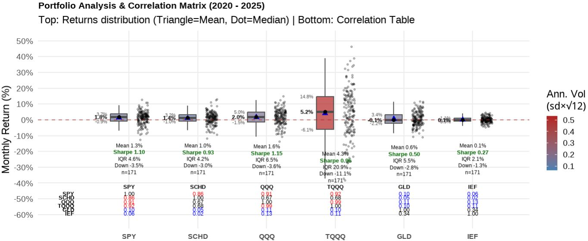

## Part II: 생각을 대신해 주는 투자 시스템 : R로 구축하는 개인 자산관리 시스템(PMS)

특징 : “이 Part는 세상에 거의 없는 책”

### Chapter 11. 왜 엑셀도 파이썬도 아닌 R이었는가

엑셀의 한계

파이썬의 현실적 문제

R이 개인 투자자에게 주는 자유도

### Chapter 12. PMS의 전체 구조 이해하기

데이터 → 분석 → 판단 → 보고

사람은 해석만 한다

PMS가 대신 해주는 것들

### Chapter 13. ETF 중심 포트폴리오 설계 원칙

개별 종목을 배제한 이유

ETF가 제공하는 자동 분산

개인투자자에게 최적화된 상품군

### Chapter 14. 왜 이 ETF 비율인가

PortfolioVisualizer로 미리 점검해보는 내 포트폴리오

PMS 비중 결정 로직

기대수익률과 변동성의 균형

주관이 아닌 수치로 결정하는 방식

“이 정도 낙폭을 감당할 수 있는가?”를 숫자로 확인하기

### Chapter 15. 기대수익률을 어떻게 계산하는가

과거 수익률의 한계

CAGR, 평균수익률, 복리 효과

“예측”이 아닌 “범위”로 접근하기

백테스트를 믿되, 맹신하지 않는 법

### Chapter 16. 리스크를 숫자로 보는 법

변동성(Volatility)

최대낙폭(MDD) : 최고 성과보다 중요한 최악의 구간

Sharpe / Calmar Ratio

왜 이 지표들만으로 충분한가

수익률보다 중요한 손실 관리

국민연금의 진짜 목표는 ‘망하지 않는 것’

### Chapter 17. 스트레스 테스트와 시나리오 분석

2008년, 2020년을 다시 겪어본다면

대형 기관은 어떻게 리스크를 관리하는가

내 포트폴리오는 살아남을 수 있는가

최악을 상정하는 투자

### Chapter 18. 월 1회 리밸런싱이라는 선택

잦은 조정이 오히려 해로운 이유

리밸런싱의 진짜 목적

자산배분의 힘을 증명한 사례 : 예일대학 기금은 어떻게 전설이 되었는가

퇴직연금 DC형에 시스템을 연결하다

규칙 예시와 실제 코드 구조

### Chapter 19. 현금 관리까지 시스템화하기

6개월 생활비 분리

투자금과 비상금의 분리

현금도 자산이다

### Chapter 20. PMS 자동화: 사람이 할 일을 없애라

스케줄링

시장 휴장일 자동 인식

사람이 개입하지 않아도 굴러가는 구조

### Chapter 21. 인공지능과 PMS의 결합

AI에게 맡길 것과 맡기지 말 것

일일 리포트 자동 해석

“조언”이 아니라 “해석”

### Chapter 22. 이메일·모바일로 받는 일일 리스크 리포트

하루 1페이지 리포트의 힘

해외여행 중에도 포트폴리오 점검하기

정보 과잉을 피하는 보고서 설계

### Chapter 23. PMS를 10년 동안 유지하기 위한 원칙

코드를 이해하지 않아도 되는 이유

시스템은 단순해야 오래 간다

추가하고 싶은 유혹과의 싸움

고도화보다 안정성

### Chapter 24. PMS 세부 설명

설치하는 방법

구글 이메일 앱 API 키와 제미나이 AI 키 받기

집에 남는 노트북 또는 PC에서 구동하기

필자 경험에 의한 각종 트러블슈팅

## 에필로그 : 주식으로 돈을 벌었다는 의미

---

### Chapter 11. 왜 엑셀도 파이썬도 아닌 R이었는가

왜 나는 파이썬이 아니라 R을 선택하게 되었는가

처음 개인 자산관리 시스템을 만들어 보겠다고 마음먹었을 때, 언어 선택에 대해 깊이 고민하지는 않았다.
사실 그럴 필요조차 없어 보였다. 요즘 인공지능 시대에 데이터와 자동화를 이야기하면서 파이썬(Python)을 떠올리지 않는 것이 오히려 이상해 보였기 때문이다. 그 전에도 파이썬으로 코딩을 하는 경우가 훨씬 많았다. 그래서 자연스럽게 파이썬으로 시작했다. 주가 데이터를 불러오고, 수익률을 계산하고, 시뮬레이션을 돌리고, 그 결과를 정리해 보고 싶었다. 실제로 파이썬으로 금융데이터를 분석하는 기능과 예제는 인터넷에 많이 있다. 그리고 그 출발점에는 많은 사람들이 그렇듯 yfinance라는 라이브러리가 있었다. 그래서 처음에는 주피터 노트북 환경에서 yfinance 패키지를 이용하여 금융데이터를 수집하려고 했다. 보통 주가 데이터는 OHLC라고 부르는 데이터를 수집하는데 각각 Open(시가, 장시작할 때 가격), H(고가, 같은 날짜에서 가장 높은 가격), L(저가, 같은 날짜에서 가장 낮은 가격), C(종가, 장마감 가격)을 가져오는데 실무에서는 수정 종가(Adjuste Close Price)를 많이 쓴다. 그 이유는 액면분할과 배당을 감안하여 산출한 종가로 주식 시뮬레이션을 편하게 하기 때문이다. 그러니까 수정 종가를 가지고 많이 과거 백테스트를 하고 리스크 관리 지표를 산출한다.

처음에는 잘 되는 것처럼 보였다. 몇 줄의 코드로 미국 주식과 한국 주식의 가격 데이터를 불러오고, 그래프를 그릴 수 있었다. “이 정도면 충분하겠는데?”라는 생각도 들었다. 문제는 그 다음부터였다. 어느 날은 데이터가 잘 내려오다가, 어느 날은 특정 종목만 비어 있었다. 아예 보안이나 인증문제로 동작을 잘 안하는 경우도 많았다. 어제까지 되던 코드가 아무 이유 없이 에러를 내기도 했다. 같은 코드를 다시 실행하면 이번에는 또 되는 경우도 있었다. 보통 야후에서 무료로 데이터를 가져오게 되는데 아무래도 무료 데이터를 이용하다보니 책임문제가 없어서인지 불안정한 경우가 많았다. 나중에 인터넷으로 찾아보니 R은 통계 분석을 목적으로 태어난 언어이므로, 금융 데이터 처리와 관련된 패키지들(TTR, PerformanceAnalytics 등)이 상호 간의 의존성이 매우 견고하게 유지되는 반면 Python은 범용 언어이기 때문에 yfinance가 의존하는 pandas나 requests 등의 버전 업데이트에 따라 예상치 못한 호환성 문제가 발생할 가능성이 상대적으로 높다는 것을 알게 되었다. 이런 내용을 알려주는 책이 없었으므로 순전히 시행착오와 인터넷 검색을 통해 알야야 했다.

잘 모르는 처음에는 내 코드 문제라고 생각했다. 먼저 인터넷을 찾아보고, 옵션을 바꿔 보고, 챗지피티에게도 물어보고 라이브러리 버전을 확인했다. 하지만 시간이 지날수록 문제의 본질이 조금씩 보이기 시작했다. 문제는 코드가 아니라 데이터 소스의 불안정성이었다. 투자 시스템에서 데이터는 단순한 입력값이 아니다. 데이터는 판단의 출발점이고, 모든 계산의 전제이며, 시스템 전체를 지탱하는 기반이다. 그런데 그 데이터가 어느 날은 있고, 어느 날은 없고, 어느 날은 조용히 틀린 값을 준다면, 그 위에 어떤 논리도 쌓을 수 없다.

나는 점점 이런 생각을 하게 되었다. “이건 내가 투자 판단을 설계하는 문제가 아니라, 데이터가 오늘은 말을 들을지 말지를 매번 확인해야 하는 문제가 되고 있다.” 이 순간부터 파이썬이라는 언어 자체보다 금융 데이터를 다루는 생태계에 대해 다시 생각하게 되었다.

그러다 R을 떠올렸다. 정확히 말하면, R이라는 언어라기보다 quantmod라는 패키지가 먼저였다. 나중에 찾아보니 금융 데이터 분석과 운용의 신뢰성 확보 측면에서는 파이썬 yfinance 패키지는 비공식적인 스크래핑 방식을 쓰는데 이보다는 앞서 말했듯 R의 quantmod 라이브러리가 제공하는 데이터 처리 방식이 더 높은 안정성을 보장한다는 것을 알게 되었다.

사실 R은 전혀 새로운 언어가 아니었다. 예전에 대학원에서 통계 분석을 하며 잠깐 써본 적도 있었고, 학술분야나 금융 쪽에서 많이 쓰인다는 이야기도 알고 있었다. 그때는 사실 학계에서는 쓰는 도구이고 사회에서 쓰는 사람이 있을까 하는 막연한 생각만 가지고 있었다. 왜냐면 주위에 R언어를 쓰는 사람을 보지 못했기 때문이다. 그래서 “지금 다시 쓸 이유”는 없었다. 또 세상이 인공지능 시대로 들어서서 텐서플로, 파이토치 등 많은 생태계를 가진 파이썬이 우선적으로 떠올리게 된 것도 당연했다. 그러나 실제 코딩을 해보니 데이터의 안정성면에서 R이 월등했고 만족하면서 개발을 하게 되었다. R이라는 언어가 매우 저평가된 프로그래밍 언어가 아닌가 한다. 어쨌든 quantmod로 금융데이터를 수집하는 동일한 작업을 해 보았다. 같은 종목, 같은 기간, 같은 목적이었다. 놀라웠던 것은 매우 안정적으로 작동하며 동작과 관련하여 에러는 물론 아무 일도 일어나지 않았다는 점이었다.

에러도 없었고, 금융데이터 누락도 없었으며, 어제와 오늘의 결과가 달랐다는 느낌도 없었다. 데이터는 조용히, 묵묵히, 내가 요청한 그대로 내려왔다. 며칠을 반복해서 실행해 보았고, 다른 종목을 추가해 보았으며, 기간을 늘려 보기도 했다. 자동화도 해보았는데 결과는 늘 같았다. 그 순간, 아주 단순한 결론에 도달했다. “아, 이 언어는 금융 데이터를 다루는 일을 오랫동안 해온 전문 언어이구나”

이 깨달음은 생각보다 컸다. 왜냐하면 내가 만들고 싶은 것은 화려한 프로그램이 아니라 오래 돌아가는 안정적이고 강건한 시스템이었기 때문이다. 투자 시스템은 하루 이틀 쓰는 코드가 아니다. 몇 년, 어쩌면 몇십 년 동안 같은 논리를 반복 실행해야 한다. 그 과정에서 가장 중요한 것은 속도도 아니고, 확장성도 아니고, 문법의 세련됨도 아니다. 가장 중요한 것은 내일도 오늘과 같은 데이터를 받을 수 있는가다. 파이썬이건 R이건 소기의 목적을 달성하는데 이용하는 도구인데 R쪽에 훨씬 마음이 기울었다. 입출력데이터로 주로 CSV파일을 쓰는데 크게 불편함이 없었다.

파이썬으로는 항상 한 가지가 마음에 걸렸다. “오늘도 데이터가 제대로 내려올까?”라는 질문이다. R과 quantmod 라이브러리를 쓰기 시작하면서 그 질문은 사라졌다. 대신 이런 질문이 남았다. “이 데이터를 가지고 나는 어떤 판단을 내릴 것인가?” 이 차이는 작아 보이지만, 실제로는 시스템의 성격을 완전히 바꾼다. 전자는 도구를 관리하는 사고이고, 후자는 판단을 설계하는 사고다. 내가 작성한 프로그램을 파이썬으로 해도 되겠지만 R이 내가 원하는 모든 기능을 라이브러리를 통해 제공하고 있다. 특히 통계 부문에서는 신뢰도가 높다는 것을 알게 되었다. 애초에 통계학자가 만든 언어라 그럴 것이다. 그리고 정교한 그래픽을 표현하는데도 매우 많은 기능을 제공하는 부가적인 장점도 있다.

그 이후의 선택은 사실 선택이라고 부르기도 어려웠다. 언어의 우열을 따진 것이 아니라, 신뢰할 수 있는 기반을 택한 것에 가까웠다. 그런데 R은 친절한 언어가 아니다. 문법도 낯설고, 처음에는 불편하다. 하지만 대신, 한 번 작동하기 시작하면 묵묵히 같은 일을 반복한다. 백테스트, 이메일 전송 등 많은 기능을 검증된 라이브러리를 통해 신뢰성 높은 결과를 제공한다. 그리고 그것이 개인 투자자가 시스템을 만들 때 가장 중요한 덕목이라는 생각이 들었다. 그래서 나는 엑셀도 아니고 파이썬도 아닌 R을 선택하게 되었다. 데이터가 작을 때는 엑셀이 최고다. 그렇지만 엑셀로 자동화하기에는 한계가 있다. 이 책에서 소개하는 제미나이 생성형 AI에게 API로 프롬프트 엔지니어링을 통해 물어보고 메일도 자동으로 발송해주는 기능을 엑셀에게 기대하기는 무리다. R언어는 기술적으로 더 뛰어나서가 아니라, 투자라는 문제에 더 성실한 도구였기 때문이다. 왜 이리 금융패키지가 R언어에 많은가 하고 찾아 보니 많은 금융 및 계량경제학 교수와 연구자들이 자신의 최신 연구 결과(예: 새로운 리스크 모델, 알고리즘)를 R 패키지 형태로 가장 먼저 공개하는 전통이 있다고 한다. 이 덕분에 상업용 소프트웨어보다 더 정교하고 최신 기법이 담긴 금융 패키지들이 꾸준히 축적되어 왔고 이 때문에 통계학자가 만들고 금융 전문가들이 다듬은 언어라는 말을 듣는다는 것도 알게 되었다.

R설치하는 홈페이지에 가 보면 90년대 구닥다리 텍스트만 거의 잔뜩있는 촌스러운 모습을 보게 된다. 이것이 바로 실용성을 강조하는 R의 모습이 아닌가 한다. 화려한 인터페이스보다 묵묵히 할 일을 하는 R을 보면서 참 잘만든 언어라는 생각이 들었다. 혼자만의 생각이지만 고딕체로 단조로운 안내 글자만 많은 코스트코 매장이 생각난다. 광고도 없이 품질좋은 물건을 고객에게 제공하는 것 하나만을 목표로 운영하는 매장같다는 생각이 든다. 어쨌든 R로 코드를 개발할 때 사실상 Rstudio라는 통합개발환경(IDE)를 사용하게 되는데 여기서도 매우 편리하게 개발할 수 있다. Rstudio안에서 도스창을 열 수도 있고 파일을 탐색할 수도 있으며 문법 하일라이트 기능과 심지어 git(버전관리해주는 도구)까지 그래픽으로 제공함으로써 개발자에게 많은 편의성을 제공하고 있다. 독자 여러분도 많이 편리함을 느끼길 바라겠다.

---
### Chapter 12. PMS의 전체 구조 이해하기

이 프로그램의 목적은 금융데이터는 수집하고 받아서, 시스템은 판단하며, 사람은 해석만 한다는 것이다. 앞으로 개인형 포트폴리오 모니터링 시스템 PMS라고 간단히 부르겠다. PMS를 처음 설명하면 많은 사람들이 이렇게 묻는다. “이게 결국 자동 매매 프로그램인가?” 혹은 “AI가 대신 투자해 주는 건가?” 이 질문에는 공통점이 있다. 사람들은 무언가를 자동화한다고 하면 곧바로 결정을 위임하는 시스템을 떠올린다. 비슷하긴 하지만 정확하지는 않다. 하지만 필자가 만들고 싶었던 PMS는 결정을 대신 내려주는 도구가 아니었다. 오히려 그 반대였다. 결정의 자리를 최대한 비워두고, 사람이 해석해야 할 자리만 남기는 시스템이다. 그것이 PMS의 출발점이었다. PMS로부터 매일 이메일을 받으면 90%이상의 확률로 할일이 아무것도 없다. 아무것도 하지말라는 것보다는 아무것도 하지 말아야겠다는 결론 내용의 이메일을 받는 것이다.

PMS의 구조는 의외로 단순하다. 기대하는 화려한 인공지능도 없고, 복잡한 예측 모델도 없다. 그냥 매일 받는 이메일을 보고 주식관련 유머 하나 읽고 끝이다. 그 대신 네 단계가 항상 같은 순서로 반복된다.

데이터 → 분석 → 판단 → 보고

먼저 데이터 수집 단계이다. 이 순서는 단순한 처리 흐름이 아니라 투자를 바라보는 하나의 태도다. 먼저 데이터가 들어온다. 사용자가 입력한 보유 주식의 종목명과 매수가격 정도이다. 주식 종목의 현재가는 사람이 작성한 데이터가 아니라, 미리 정의된 규칙에 따라 quantmod 라이브러리에 의해 자동으로 수집된 데이터다. 가격, 수익률, 변동성, 그리고 내가 중요하다고 판단한 몇 가지 지표들이 나오는데 아무런 해석도 하지 않는다. 좋다, 나쁘다, 비싸다, 싸다 같은 말은 아직 등장하지 않는다.

그 다음은 분석단계이다. 여기서도 사람은 개입하지 않는다. 과거 데이터로부터 수익률을 계산하고, 각종 리스크를 추정하고, 시나리오를 시뮬레이션한다. 이 단계에서 중요한 것은 분석의 정교함보다 일관성이다. 이번 달만 다르게 계산하지 않고, 시장 상황이 바뀌었다고 갑자기 기준을 바꾸지도 않는다. 분석은 늘 같은 방식으로 수행된다. 그리고 그 결과가 판단 단계로 넘어간다.

판단단계는 사람이 아니라 ‘규칙’이 한다. PMS에서 가장 오해받기 쉬운 부분이 바로 이 지점이다. 판단이라는 단어 때문에 사람들은 감정이나 직관을 떠올린다. 하지만 PMS에서 판단은 감정이 아니라 조건 비교에 가깝다. 예를 들어 이 변동성은 내가 정해둔 범위 안에 있는가 이 드리프트는 리밸런싱 기준을 넘었는가 인출 시나리오에서 파산 확률은 허용 범위 이내인가 등이다. 이 질문들은 사람에게 던져지지 않는다. 이미 코드 안에 들어 있다. 그래서 PMS의 판단은 늘 조용하다. 경고를 울리지도 않고, 지금 당장 무언가를 하라고 재촉하지도 않는다. 그저 이렇게 말할 뿐이다. “현재 상태는 네가 미리 정의한 규칙 안에 있다.” 또는 “이 지점은 규칙상 한 번 다시 바라봐야 한다.” 그 이상도, 그 이하도 아니다. 

마지막 보고단계는 결론이 아니라 ‘상태 설명’이다. 많은 투자 보고서는 결론을 먼저 보여준다. 이번 달 수익률, 잘한 점과 못한 점, 앞으로의 전망 등이다. 하지만 PMS의 보고서는 다르다. PMS는 전망을 말하지 않는다. 대신 상태를 설명한다. 현재 포트폴리오는 어떤 구조인가 변동성은 평소와 비교해 어느 수준인가 인출 시나리오에서 시스템은 얼마나 여유가 있는가 이 보고서를 읽는 사람은 바로 나 자신이다. 그래서 이 보고서는 설득을 위한 문서가 아니라 확인을 위한 문서에 가깝다.

중요한 것은 보고서가 나에게 행동을 지시하지 않는다는 점이다. “사라”, “팔아라”, “지금이 기회다” 이런 문장은 의도적으로 배제되어 있다. 사람은 해석만 한다. PMS를 쓰기 시작하면서 내 역할은 분명히 달라졌다. 과거에는 데이터를 직접 모으고, 계산하고, 그래프를 보며 감정을 섞어 판단했다. 지금은 다르다. 데이터는 시스템이 가져오고, 분석은 시스템이 수행하며, 판단은 미리 정해진 규칙이 대신한다.

사람인 나는 마지막에 남은 해석만 한다. “이 상태를 나는 감내할 수 있는가?”, “이 규칙은 여전히 나에게 맞는가?” 이 질문은 어떤 시스템도 대신해 줄 수 없다. 그래서 PMS는 이 질문을 사람에게 남겨 둔다. 이 구조가 중요한 이유는 단순하다. 투자에서 가장 위험한 순간은 사람이 계산과 판단을 동시에 하려고 할 때이기 때문이다. 계산하면서 감정이 개입되고, 감정이 개입되면서 기준이 흔들린다. PMS는 이 두 역할을 의도적으로 분리한다.

PMS가 대신 해주는 것들을 알아보자. PMS가 대신 해주는 일은 화려하지 않다. 하지만 그 소소한 대체가 장기적으로는 엄청난 차이를 만든다. 매일 같은 기준으로 데이터를 모아준다. 매일 자동으로 실행해주고 자동으로 자산현황을 기록관리해준다. 매번 같은 방식으로 리스크를 계산한다. 시장 상황과 상관없이 규칙을 먼저 적용한다. 보고서를 감정 없이 정리해 준다. 제미나이 생성형 AI를 활용해 시황분석까지 담은 이메일을 매일 오후에 보내준다.

그 결과, 나는 더 이상 매일 시장을 들여다볼 필요가 없다. 내 회사 업무에 집중하면 된다. 내가 휴가를 가더라도 내 컴퓨터는 매일 정해진 시간에 보고서를 만들어 나에게 메일로 전송해서 보고해준다. 이메일 내용과 첨부된 1페이지 현황 보고서만 보면된다. 첨부된 pdf 보고서도 글이 아니라 그래프로 직관적으로 이해하기 쉽게 나와 있다. 대신, 바쁘면 정해진 주기에 한 번 보고서를 열어본다. 그리고 묻는다. “아직도 이 구조가 맞는가?”

이 질문에 차분하게 답할 수 있다면, 그날의 투자 판단은 이미 끝난 것이나 다름없다. 시스템이 판단을 대신할수록, 사람은 자유로워진다. 아이러니하게도 판단을 시스템에 맡길수록 사람은 더 자유로워진다. 아무것도 하지 않아도 되는 날이 늘어나고, 시장을 보지 않는 시간이 늘어난다. PMS는 투자를 더 자주 하게 만들지 않는다. 오히려 덜 하게 만든다. 그리고 그 덜 하는 선택이 장기 투자에서는 대부분 더 나은 결과로 이어진다.

PMS 시스템의 메인 모듈인 pms_main.R 프로그램의 입출력 파일은 아래와 같다.

+ 입력 파일

    input_stock.csv    : 한국주식 목록(종목명, 종목번호, 증권사, 매수가격, 수량)

    input_stock_us.csv : 미국주식 목록(종목명, 종목번호, 증권사, 매수가격, 수량)

    output_sum.csv     : 전일 평가액총액, 수익금(입력이자 출력파일)
	
+ 출력 파일

    output_stock_{YYYY-MM-DD}.xlsx      : 한국주식 평가액

    output_stock_us_{YYYY-MM-DD}.xlsx   : 미국주식 평가액

    output_sum.csv                      : 평가액총액, 수익금
                                          (최소 100일이상 데이터 필요)

    reports/Daily_Risk_{YYYYMMDD}.pdf   : 1페이지 그래프 보고서

    reports/gemini_prompt.txt           : 제미나이 질의어(프롬프트)
		 
위의 출력파일중에서 Daily_Risk_{YYYYMMDD}.pdf를 메인모듈에서 작성하는데 제미나이 생성형 AI가 프롬프트 엔지니어링(Prompt Engineering)을 통해 이메일 내용을 작성해서 첨부로 매일 사용자에게 자동으로 보내준다. {YYYYMMDD}은 오늘기준 연월일(예를 들어 20260112)의 숫자이다. 이메일을 자동으로 보내준다고? 그게 가능한가? 가능하다. R에 보면 blastula 라이브러리가 있는데 그것을 이용하면 된다. 집에 남는 노트북에서 윈도우 "작업 스케줄러"에 등록하면 매일 장종료후 알아서 이메일을 보내준다. 너무 딱딱하지 않게 매일 주식관련 농담까지도 하나씩 추가해서 보내준다. 인공지능이 시황을 분석해 메일을 작성해준다고? 어떻게 그게 가능한가? 어떻게 이런 시스템이 가능한지 하나하나씩 천천히 따라오길 바란다.

---

### Chapter 13. ETF 중심 포트폴리오 설계 원칙

결론만 말하면 나는 개별 종목을 포기한 것이 아니라, 끝까지 유지할 수 있는 구조를 선택한 것이다. 포트폴리오를 설계한다는 말을 들으면 많은 사람들은 자연스럽게 무엇을 담을 것인가부터 떠올리지만, 실제로 시스템을 만들겠다고 마음먹은 순간부터 사고의 방향은 서서히 바뀌기 시작한다. 무엇을 담을 것인가보다 무엇을 의도적으로 배제해야 하는가가 먼저 고민거리로 떠오르고, 그 질문은 곧 투자에서 내가 통제할 수 있는 영역과 그렇지 않은 영역을 가르는 기준이 된다. 그렇게 생각을 이어가다 보면, 개별 종목이라는 선택지는 언제나 가장 먼저, 그리고 가장 오래 검토하게 되는 대상이 된다.

개별 종목 투자는 언제나 강한 유혹을 동반한다. 한 기업의 성장 서사에 올라타는 경험, 시장보다 더 똑똑한 판단을 했다는 확신, 그리고 실제로 큰 수익이 났을 때의 성취감은 다른 어떤 투자 방식에서도 쉽게 대체되지 않는다. 문제는 이 유혹이 단순히 수익의 가능성만을 보여줄 뿐, 그 이면에 깔린 구조적인 불안정성을 거의 드러내지 않는다는 점이다. 개별 종목 투자는 맞히는 능력의 문제가 아니라, 같은 수준의 집중과 판단을 얼마나 오랫동안 유지할 수 있는가의 문제이며, 대부분의 개인 투자자는 그 지속성을 과소평가한 채 시장에 들어온다.

기업 하나를 투자 대상으로 삼는 순간, 투자자는 숫자보다 이야기를 더 많이 다루게 된다. 분기 실적의 미세한 변화가 갖는 의미를 해석하고, 경영진의 발언에서 의도를 읽어내며, 산업 전망과 거시 환경을 연결해 스스로 납득할 만한 서사를 만들어낸다. 이러한 과정은 매우 인간적이고, 동시에 매우 피로한 작업이기도 하다. 더 중요한 문제는 이 판단들이 대부분 명확한 규칙으로 환원되지 않는다는 점인데, 그 결과 판단은 언제나 “이번에는 예외”라는 말로 수정될 여지를 남긴다. 시스템은 예외를 싫어하지만, 개별 종목 투자는 예외 위에서 작동한다.

PMS를 설계하며 내가 가장 경계했던 것은 바로 이 예외의 누적이었다. 나는 시장에서 틀릴 수 있다는 사실보다, 왜 그런 판단을 했는지를 나중에 설명할 수 없는 상황을 더 불안하게 느꼈다. 시스템이란 본래 결과를 예측하기 위해 존재하는 것이 아니라, 과정에 대해 책임을 질 수 있게 만들기 위해 존재하는데, 개별 종목 투자는 그 과정의 상당 부분을 직관과 감각에 의존하게 만든다. 이 지점에서 개별 종목은 투자 실력의 문제가 아니라 시스템 설계의 관점에서 탈락하게 된다.

이와 대비되는 위치에 ETF가 있다. ETF는 특정 기업의 미래를 맞히는 도구가 아니라, 이미 정의된 규칙에 따라 구성된 집합에 노출되는 수단이며, 하나의 사건이 아니라 다수의 사건이 평균화된 결과를 받아들이는 구조를 전제로 한다. ETF를 선택하는 순간, 투자자는 개별 기업 리스크를 의식적으로 내려놓는 대신 자산군이라는 더 큰 단위의 성격을 받아들이게 되고, 이는 투자 판단의 차원을 근본적으로 바꾼다. 무엇이 급등할지를 맞히는 게임에서, 어떤 종류의 위험과 변동성을 감내할 것인지를 선택하는 문제로 전환되는 것이다.

ETF가 제공하는 자동 분산이라는 특징은 흔히 장점으로 언급되지만, PMS의 관점에서 보면 그보다 더 중요한 것은 분산이 기본값으로 주어진다는 사실이다. 분산을 해야겠다고 매번 결심할 필요가 없고, 특정 자산이 과도하게 커졌는지를 감정적으로 판단할 필요도 없다. 이미 분산된 상태에서 출발하기 때문에, 시스템은 그 위에 비중과 규칙만 얹으면 된다. 이 단순함은 투자 전략을 단순하게 만드는 것이 아니라, 오히려 유지 가능하게 만든다. 복잡한 구조는 언제나 관리 비용을 요구하고, 관리 비용은 시간이 지나면 판단을 흐리게 만든다.

ETF 중심 포트폴리오로 전환하면서, 내가 투자에서 다루는 질문의 성격도 점점 달라졌다. 개별 기업의 실적이 예상치를 상회했는지를 따지는 대신, 자산군 간의 상관관계가 어떻게 변하고 있는지를 보게 되었고, 특정 산업의 성장성보다는 포트폴리오 전체의 변동성이 감내 가능한 범위 안에 있는지를 먼저 확인하게 되었다. 이러한 변화는 투자를 덜 자극적으로 만들었을지도 모르지만, 대신 훨씬 덜 소모적으로 만들었다. PMS가 지향하는 것은 흥분을 유지하는 능력이 아니라, 지루함을 견디는 능력이기 때문이다.

개인 투자자에게 ETF가 특히 적합한 이유는 여기에서 분명해진다. 개인 투자자는 정보 접근성에서도, 시간 투입에서도, 감정 관리 측면에서도 기관 투자자와 같은 위치에 서기 어렵다. 그렇다면 경쟁해야 할 대상은 시장이 아니라, 자기 자신의 판단 오류와 감정 기복이 된다. ETF는 이 싸움에서 개인 투자자에게 유리한 환경을 제공한다. 상품의 구조가 비교적 단순하고, 운용 방식이 투명하며, 장기 보유를 전제로 설계되어 있기 때문이다. 이는 PMS의 보고 단계에서도 중요한 차이를 만든다. 보고서는 결정을 정당화하기 위한 문서가 아니라, 현재 구조가 여전히 유효한지를 확인하는 도구이기 때문이다.

“왜 이 자산을 들고 있는가?”라는 질문에 ETF는 비교적 변하지 않는 답을 제공한다. 미국 주식 시장 전체에 대한 노출, 글로벌 채권을 통한 변동성 완화, 단기 금리에 연동된 현금성 자산이라는 설명은 시간이 지나도 크게 흔들리지 않는다. 이 설명 가능성은 PMS가 사람에게 요구하는 역할을 최소화한다. 시스템이 대부분의 판단을 수행하고, 사람은 그 판단이 여전히 자신의 삶과 맞는지를 해석하는 데 집중할 수 있게 된다.

ETF 중심 설계를 택했다는 말은 종종 소극적인 선택처럼 들리지만, 실제로는 상당히 단호한 결단에 가깝다. 이 선택에는 분명한 포기가 포함되어 있다. 시장을 이길 수 있다는 기대, 대박을 맞힐 수 있다는 환상, 남들보다 더 똑똑하게 행동할 수 있다는 자기 확신을 의도적으로 내려놓는 것이다. 대신 얻는 것은 시스템이 무너지지 않는다는 확신이며, 최악의 해를 겪고도 구조가 유지된다는 안정감이다. PMS가 궁극적으로 추구하는 것은 최고의 수익률이 아니라, 파산하지 않는 구조이며, 그 목표 앞에서 ETF 중심 포트폴리오는 가장 현실적인 해답에 가깝다.

결국 ETF 중심 포트폴리오란 수익률을 극대화하기 위한 전략이라기보다, 판단의 일관성을 극대화하기 위한 선택이다. 일상적인 판단은 구조에 맡기고, 정말 중요한 순간에만 사람이 개입할 수 있도록 여백을 남겨두는 것, 그것이 내가 PMS를 통해 이루고 싶었던 투자 방식이었다. 개별 종목을 배제한 것은 그래서 방어적인 선택이 아니라, 시스템이라는 틀을 끝까지 유지하기 위해 감행한 가장 적극적인 결정이었다. 또한 현실적으로 미국 SPY ETF를 구성하는 기업의 수명이 그리 길지 않아 매번 SPY에서 알아서 편입 편출을 해주는 편리함도 누릴 수 있다. 그러고 보면 기업의 흥망성쇠가 불과 수십년에 불과한데 그런 것을 일일이 신경쓰지 않고 장기투자를 할 수 있는 ETF라는 것이 투자자로서는 대단한 발명품으로 여겨지게 된다. 그외에도 미국ETF로 투자하게 되면 미국 달러로 투자하는 효과가 있어서 금융위기에는 보통환율이 상승하게 되는데 이 환율 상승효과로 하락분이 방어되는데도 좋은 역할을 하는 장점이 있다. 어떤 사람은 이를 환율 쿠션이라고 부르기도 한다. 거의 유일한 단점은 아무래도 ETF 운용사에 내는 약간의 수수료인데 가급적 수수료가 적은 ETF를 사도록 하자. 예를들어 SPY ETF보다는 SPYI ETF를 매수한다든지 QQQ도 QQQM으로 매수한다든지 하는 방법을 이용하면 소액 투자자인 경우에는 약간이나마 도움이 될 것이다.

---

### Chapter 14. 왜 이 ETF 비율인가

포트폴리오 비중은 취향이 아니라, 감당 가능한 세계의 크기다. 포트폴리오에서 가장 오해받는 요소는 종목이 아니라 비중이다. 사람들은 어떤 ETF를 담았는지에는 관심을 가지지만, 왜 그 비율인지에 대해서는 상대적으로 쉽게 넘어간다. 그러나 시스템의 관점에서 보면, 자산의 종류보다 훨씬 중요한 것은 비율이며, 포트폴리오의 성격은 개별 상품이 아니라 비중에서 결정된다. 같은 ETF 묶음이라도 비율이 달라지는 순간, 전혀 다른 포트폴리오가 된다.

PMS를 설계하면서 내가 가장 경계했던 것은 바로 이 지점이었다. 이 비율이 그럴듯해 보이기 때문에 선택한 것인지, 아니면 이 비율이 내가 실제로 감당할 수 있는 세계의 크기이기 때문에 선택한 것인지를 분리하지 않으면, 시스템은 결국 취향의 집합으로 전락하게 된다. 투자에서 취향은 존중받을 수 있지만, 시스템에서는 언제나 위험 요소가 된다.

그래서 나는 비중을 정하기 전에, 먼저 이 질문을 던졌다. “이 포트폴리오가 최악의 순간을 맞았을 때, 나는 이 구조를 유지할 수 있는가?” 

그래서 미리 겪어보는 미래로 PortfolioVisualizer라는 도구를 필자는 사용하였다. 이 질문에 감정으로 답하는 것은 의미가 없었다. 대부분의 사람은 하락장을 머릿속으로 상상할 때 실제보다 훨씬 완만한 그림을 그리기 때문이다. 그래서 나는 미래를 예측하기보다는, 과거를 가능한 한 많이 겪어보는 쪽을 택했다. 이때 사용한 도구가 바로 PortfolioVisualizer였다. 사이트명이 portfoliovisualizer.com이다. 한 번 들어가서 과거 백테스트를 직접 해보자. PortfolioVisualizer는 정답을 알려주는 도구가 아니다. 대신 이렇게 말하는 도구에 가깝다. “당신이 선택한 구조(포트폴리오 비중)는, 과거의 이 순간들에서는 이렇게 행동했다(백테스트 결과가 이렇다)”는 판단을 하는데 도움을 준다.

이용하는 방법은 portfoliovisualizer.com에 가서 Portfolio Optimization 메뉴로 들어간다. 여기서 Backtest Portfolio를 선택하고 원하는 주식의 티커를 넣고 비중을 넣으면 알아서 최근 백테스트를 통한 성과를 보여준다. 무료인데다 시각적인 그래프도 잘 나와서 과거 백테스트를 쉽게 하는데는 최고의 도구라고 생각한다.

여기서 중요한 것은 수익률 그래프의 끝점이 아니라, 그 중간에 등장하는 낙폭과 변동성이다. 어느 해에 얼마나 벌었는지는 시간이 지나면 잊히지만, 어느 순간에 얼마나 버텨야 했는지는 몸에 남는다. PortfolioVisualizer를 통해 내 포트폴리오를 과거 금융위기, 테이퍼 텐트럼, 팬데믹 구간에 겹쳐보았을 때, 나는 처음으로 비율이라는 것이 단순한 숫자가 아니라 심리적 내구성을 측정하는 도구라는 사실을 실감하게 되었다.

PMS의 비중 결정 로직은 질문에서 출발한다. PMS에서 비중을 결정하는 로직은, “얼마를 벌고 싶은가”가 아니라 “얼마를 잃을 수 있는가”에서 출발한다. 이 순서가 바뀌는 순간, 시스템은 희망 회로를 품게 된다. 기대수익률은 언제나 매력적으로 보이지만, 변동성과 낙폭은 그렇지 않다. 그러나 실제로 투자자를 시장에서 탈락시키는 것은 낮은 기대수익률이 아니라, 감당하지 못하는 변동성이다.

그래서 PMS에서는 비중을 정할 때, 먼저 각 자산군이 포트폴리오 전체 변동성에 어떤 기여를 하는지를 확인하고, 그다음 이 조합이 만들어낼 최대 낙폭이 어느 수준까지 확장되는지를 숫자로 확인한다. 이 과정에서 중요한 것은 정밀함이 아니라 일관성이다. 동일한 가정, 동일한 계산 방식, 동일한 기준으로 여러 비율을 비교해 보았을 때, 어떤 조합이 가장 오래 버틸 수 있는 구조인지를 보는 것이다.

기대수익률과 변동성은 언제나 함께 움직인다. 투자에서 가장 흔한 오해 중 하나는 기대수익률과 변동성을 서로 다른 항목으로 생각하는 것이다. 하지만 이 둘은 사실상 같은 문장의 앞뒤에 붙은 단어에 가깝다. 기대수익률을 조금 더 원하면, 그만큼 변동성도 함께 따라온다. 문제는 이 추가된 변동성이 실제로 내 삶의 리듬과 충돌하는지 여부다.

PMS 포트폴리오의 비중은 이 충돌 지점을 피하기 위해 조정되어 있다. 주식 비중을 무작정 낮추지도 않았고, 그렇다고 공격적으로 끌어올리지도 않았다. 대신 여러 시뮬레이션을 통해, 기대수익률이 일정 수준 이상 유지되면서도 변동성이 급격히 증가하지 않는 구간, 다시 말해 추가적인 수익 대비 추가적인 스트레스가 급격히 커지지 않는 지점을 찾고자 했다. 이 지점은 사람마다 다르지만, 적어도 나에게는 이 비율이 그 경계선에 가장 가까워 보였다.

주관이 아닌 수치로 결정한다는 것의 의미에 대해 생각해 보자. 비중을 숫자로 결정한다는 말은 흔히 들리지만, 실제로 그 과정을 끝까지 밀어붙이는 사람은 많지 않다. 왜냐하면 숫자는 종종 우리가 듣고 싶지 않은 이야기를 해주기 때문이다. “이 비율은 수익률은 높지만, 네가 견딜 수 없는 낙폭을 동반한다”거나, “이 구조는 이론적으로는 훌륭하지만, 실제 하락장에서는 네가 중간에 포기했을 가능성이 높다”는 메시지는 불편하다.

하지만 PMS에서는 이 불편함을 회피하지 않는다. 오히려 그 불편함을 시스템 설계의 중심에 둔다. 비중을 정하는 과정에서 느끼는 찜찜함은, 실제 하락장에서 느끼게 될 공포의 예고편에 가깝기 때문이다. 이 예고편을 감당할 수 없다면, 비율은 반드시 조정되어야 한다.

“이 정도 낙폭을 감당할 수 있는가?”를 숫자로 확인해보자. PMS에서 가장 중요한 검증 질문은 이것이다.
“이 포트폴리오가 -30%를 기록했을 때, 나는 이 구조를 유지할 수 있는가?” 이 질문은 결코 추상적이지 않다. PortfolioVisualizer와 PMS의 시뮬레이션은 이 질문을 구체적인 숫자로 바꿔준다. 어떤 해에, 어떤 속도로, 얼마나 깊게 빠졌는지를 미리 확인한 뒤에야 비로소 비중에 대한 논의가 가능해진다. 그리고 이 과정을 거친 뒤에 남은 비율은, 더 이상 ‘공격적이다’거나 ‘보수적이다’라는 말로 설명되지 않는다. 그저 “내가 감당할 수 있는 구조”라는 표현만이 남는다.

우리는 이 비율이 타당한가에 대한 답을 해 볼 수 있다. 그래서 “이 PMS 포트폴리오의 투자 비율이 타당한가?”라는 질문에 대한 나의 대답은, 특정 수익률 숫자가 아니라 이 과정 자체에 있다. 이 비율은 시장을 이기기 위해 설정된 것이 아니라, 시장이 나를 시험할 때 끝까지 유지될 수 있도록 설정된 비율이다. 기대수익률과 변동성, 낙폭과 회복 속도를 반복해서 점검한 끝에, 더 줄이면 아쉬웠고, 더 늘리면 불안해지는 지점에서 멈춰 있다.

투자 비율의 타당성은 미래 성과로만 증명되는 것이 아니다. 오히려 그 비율을 정하는 과정이 얼마나 정직했는지, 그리고 그 과정이 시간이 지나도 다시 설명 가능한지에 의해 평가된다. PMS의 비중 결정 로직은 바로 이 설명 가능성을 위해 존재한다. 결국 이 ETF 비율은 하나의 답이 아니라, 하나의 고백에 가깝다. “나는 이 정도의 변동성과 이 정도의 낙폭까지는, 숫자로 확인한 뒤에 받아들이기로 했다” 그리고 이 고백을 코드로 남겼다는 사실이, 이 포트폴리오를 단순한 투자 조합이 아니라 시스템으로 만들어 준다. 

ETF로 투자하기로 했으면 어떤 ETF로 할지 정하면 된다. 필자는 가급적 대중이 많이 투자하는 ETF로 정하기로 했다. 그래서 정한 것이 미국 대표 500개 기업에 투자하는 가장 유명한 SPY ETF, 배당금을 지속적으로 증가시켜주는 대표적인 배당주 모음 SCHD ETF, 나스닥 기술주 100개 종목에 투자하는 QQQ, 그리고 QQQ를 3배로 추종하는 가장 유명한 레버리지 ETF인 TQQQ, 채권으로는 미국 중기채인 IEF ETF, 그리고 금투자를 하는 GLD ETF, 그리고 사실상 현금역할을 하는 BIL ETF(또는 SGOV ETF도 비슷하다)를 선택하기로 했다. 여기에는 대중적인 ETF를 골랐는데 독자가 나중에 서로 다른 ETF를 조합하여 투자해도 상관없다. 하지만 대원칙은 마코위츠의 이론대로 서로 상관계수가 낮은 ETF를 섞어서 투자해야 한다는 것이다. 예를 들어 주식ETF만 왕창 투자하면 안되고 채권이나 금 ETF를 섞어서 사야 한다는 말이다. 그 섞어 사는 비율은 젊고 앞으로 투자할 기간이 아주 긴 경우, 그리고 하락폭을 많이 견딜 수 있다면 보통 위험자산이라고 부르는 주식형 ETF비율을 높이고 은퇴시점이 얼마 남지 않았거나 원금 손실을 매우 싫어하는 투자자는 안전자산이라고 부르는 ETF를 더 높은 비율로 투자하면 된다. 어떤 글을 보니까 이를 쉽게 공식처럼 만들어 놓았다. 100에서 자신의 나이를 빼고 그 비율만큼 위험자산에 투자하고 나머지는 안전자산에 투자하는 방법이다. 예를 들어 45세라면 100에서 45를 뺀 55%만큼 위험자산에 투자하고 나머지 45%는 안전자산에 투자하는 방법을 쓰면 된다. 아무래도 젊은 사람은 약간 투자손실이 있어도 꾸준한 수입으로 더 장기투자를 할 수 있기 때문일 것이다.

포트폴리오 비중에 대해서는 정답이 없으므로 독자여러분이 판단해서 정하면 된다. 만약 그래도 잘 모르겠으면 아래와 같이 질문하여 구글 제미나이 생성형AI의 도움을 받아보자. 

"은퇴를 10년 앞둔 일반 직장인이 SPY ETF 정도 수익률과 그보다는 좀 낮은 변동성을 위해 SPY, QQQ, IEF, GLD, BIL  ETF를 섞어 매월 꾸준히 매수한다고 가정했을 때 최적의 투자 비중은 어떤 것인지 추천해줘"

위과 같이 문의하면 SPY:QQQ:IEF:GLD:BIL = 30%:15%:30%:15%:10% 정도의 비율을 추천해주며 SPY의 연평균 수익률과 비슷하지만 약간 낙폭을 줄일 수 있는 비중으로 추천해준다. 실행 시점이나 생성형AI 종류에 따라 위의 비율이 다르게 나올 수 있다. 심지어 같은 생성형AI도 때에 따라 비중이 달라지기도 했다. 투자세계에서 최적의 마법의 비율이란 존재하지 않는 것이다. 그도 그럴 것이 아무리 인공지능이라고 해도 물어보는 사람의 성향이나 위험 감수 정도를 알 수 없기 때문이다. 다시 말하면 절대적인 마법의 포트폴리오 비율이란 없고 위의 추천비율도 과거 사례(백테스트)를 바탕으로 만들었을 터이므로 독자들이 최종판단해야 한다. 단 하나의 원칙이라면 앞서 말한대로 분산투자의 효과를 최대로 보기 위해 주식형과 채권형, 금 등을 적절히 섞어서 투자해야 한다는 것이다. 해리 마코위츠가 무려 70여년 전에 이미 수학으로 증명한 사실을 우리는 실천만 하면 된다. 친절하게도 생성형AI는 위의 비율로 사되 주기적으로 리밸런싱을 하고 은퇴를 앞두고는 안전자산 비율을 올리라는 공자님 말씀 같은 안내도 해준다. 포트폴리오에 대한 감이 없다면 레이달리오의 올웨더 포트폴리오대로 투자해도 괜찮다고 생각한다.

그런데 한국에도 KOSPI200 지수추종 ETF가 있는데 왜 미국 ETF위주로 구성했는지 질문한다면 일단 미국 주식이 주주 친화적이고 오랜 역사를 가지고 있기 때문이기도 하지만 혁신과 세계 시장에서 차지하는 비중 등을 고려하여 미국ETF를 선택했다. 전세계 주식시장에서 우리나라 주식시장이 차지하는 비중이 2% 정도밖에 되지 않는다. 그외에도 미국 ETF를 투자하는 이유는 훨씬 많이 나열할 수 있다. 무엇보다 인구가 줄어드는 우리나라보다 전세계의 두뇌들이 몰려드는 미국에 대한 장기 성장을 기대하기 때문이라고 하는 편이 좀 더 솔직한 이유가 될 것이다. 단점인지 모르겠지만 미국 위주의 ETF라 미국 시장의 등락 영향을 많이 받는 것은 당연하고 특히 환율의 등락폭에 많이 좌우되는 경향이 있다는 것을 미리 알아두면 좋을 것 같다. 그리고 환전해서 미국 오리지널 ETF를 직구로 살 것인가 우리나라에 상장된 미국 지수추종 ETF를 살 것인가 고민된다면 반반씩 투자하는 것도 좋은 방법이지만 필자는 환전을 해서 직구 투자하는 것을 권한다. 환전이라는 작업 자체가 번거롭기 때문에 가급적 큰 일이 아니라면 투자금을 빼고 싶은 생각이 안드는 심리적 효과가 있기 때문이다. 인터넷에 찾아보면 양도소득세와 배당소득세를 기준으로 일장일단이 있다는 많은 기사가 나와 있으므로 여기서는 논하지 않으려고 한다. 애초에 특정 방법이 훨씬 유리하다면 우리나라 금융당국이 그렇게 놔두지를 않았을 것이다. 그리고 만약 우리나라의 미래를 믿고 우리나라 지수추종 ETF를 투자하고 싶으면 KOSPI200을 추종하는 ETF를 일정 비율로 매수하는 것도 분산투자 관점에서 좋은 생각이라고 생각한다. 

어쨌든 여기서는 은퇴를 10년 정도 앞둔 가상의 인물인 대기업 다니는 김부장을 예시로 들도록 하겠다. 10년 후 은퇴를 앞두고 있고 맞벌이하는 부인과 함께 꾸준히 월 5백만원을 투자하는 경우를 들겠다. 여러 투자 포트폴리오 중에서 SPY ETF를 투자하는 것도 좋은 방법이지만 약간의 변동성을 희생해서 그 보다는 더 많은 기대 수익률을 얻으려고 하는 투자자로 가정해 보겠다.

이 경우 SPY:SCHD:QQQ:TQQQ:GLD:IEF:BIL = 36%:20%:15%:10%:10%:5%:4%로 정했다. 다시 한 번 말하자면 이 비율은 임의적인 것이므로 독자 여러분이 정해서 운용하면 된다. 이 비율이 SPY 단독 투자에 비해서 얼마나 기대수익과 변동성이 있는지 알아보자.

서울 자가에 대기업다니고 은퇴 10년 앞둔 김부장 포트폴리오(예시)
| SPY  | SCHD | QQQ  | TQQQ | GLD  | IEF  | BIL(현금) | (합계) |
|-----:|-----:|-----:|-----:|-----:|-----:|-----:    | -----:|
| 36%  | 20%  |  15% | 10%  | 10%  |  5%  |    4%    | 100%  |

portfoliovisualizer.com에서는 위의 김부장 포트폴리오와 100% SPY ETF의 수익률 및 변동성 등의 비교를 아래와 같이 답변해준다. 기준은 2026년 초를 기준으로 최근 약 170개월을 기준으로 백테스트를 하였다. 약 170여개월을 가정한 이유는 위의 ETF중에서 최근에 출시한 SCHD가 2011년 말에 출시했는데 2026년 초 기준으로 SCHD ETF 출시 이후 약 170여개월이 흘렀기 때문이다. 위에서 '현금'은 종목으로서의 현금을 의미하는데 그냥 두면 이자를 안주므로 금리 상승 또는 하락 발표에 거의 영향을 안받는 BIL 또는 SGOV ETF를 현금으로 가정하였다. 표본수를 늘린다고 그 전의 기간까지 산정하면 없는 역사를 가지고 만드는 인위적인 데이터를 사용하여야 해서 찜찜하고, 약 170개 표본수 정도면 어느 정도 충분한 기간으로 생각하고 가정했기 때문이기도 하다. 독자여러분이 시뮬레이션 실행한다면 ETF 가격이 변동하기 때문에 당연히 실행시점에 따라 약간 다르게 나올 수 있다.

| 구분 | "김부장" 포트폴리오 | SPY ETF |
|:-----|-------------------:|-------------------:|
| 연수익률 | 18.3% | 14.9% |
| 변동성 | 16.3% | 15.1% |
| MDD | -26.0% | -23.9% |
| Sharpe 비율 | 0.99 | 0.85 |

위에서 Sharpe비율은 연수익률을 변동성으로 나눈 것이다. 정확히는 연수익률에서 무위험이자율을 빼야 하지만 무위험이자율은 0으로 가정하였다. 변동성(위험) 대비 얼마나 수익을 얻는지에 대한 비율로 일종의 가성비 지표라고 볼 수 있다. 어쨌든 SPY ETF보다 약간의 변동성과 MDD를 희생하니 연수익률이 더 높았기 때문에 Sharpe 비율이 SPY ETF 단독 투자보다 더 높게 나왔다. 연수익률 나누기 변동성의 정확한 수치가 위 표에서는 정확히 Sharpe지수와 일치하지 않는데 아무래도 portfoliovisualizer 내부적인 로직이 따로 있는 것 같다. 어쨌든 김부장 포트폴리오가 SPY보다 Sharpe비율이 더 높다. 어느 방법을 선택하든 중요한 것은 Sharpe비율보다 얼마나 오랫동안 일관되게 투자를 할 수 있는지 실행력이 될 것이다.

위의 분산투자의 사례가 마코위츠의 효율적 프론티어에 비추어 어디에 해당하는지 한 번 알아보자.  https://github.com/shbang-cmd/PMS_Core/blob/master/pf_efficient_frontier_simul.R 소스를 실행시켜 보면 아래와 같은 그래프가 나온다.(현금을 종목으로 넣을 수 없어서 현금비중 4%를 SPY에 넣어서 SPY 40%로 가정했다) 위의 "김부장"포트폴리오는 효율적 프론티어의 접선에 있지는 않지만 거의 가까운 것을 볼 수 있다. 검은 네모가 현재 김부장 포트폴리오이고 Sharpe비율이 최대인 최적의 해는 빨간색 세모로 나타내어 진다. Sharpe비율이 최적의 해에 비해서 0.048정도의 아주 작은 차이만 보이는 것을 알 수 있다. 그래프에서 보면 알겠지만 Max. Sharpe 지점에 비해 변동성과 수익성이 약간씩 올라간 것을 알 수 있다. 즉 최적의 해에 비해 변동성을 약간 희생해서 약간의 수익률을 더 올리는 전략이라고 볼 수 있다.

그렇다면 최근 170개월동안 위의 종목에 투자했을때 가장 최적의 포트폴리오는 무엇이었을까 한 번 최적의 해를 찾아보자. https://github.com/shbang-cmd/PMS_Core/blob/master/Find_max_Sharpe_from_monthly_returns.R 소스를 실행해보면 알 수 있다. 이 책이 다른 책들과 다른 점은 어디어디서 결과만 가져와서 보여주는 수준이 아니라 그 결과를 가져오는 소스코드를 모두 공개하는데 있다. 관심이 많은 독자는 이리 저리 파라미터를 변경하면서 시뮬레이션 해 볼 수 있다. 어쨌든 최적의 Sharpe비율을 찾는 결과는 QQQ 49.90% GLD 23.16% SCHD 23.03% IEF 3.92% TQQQ/SPY ≈ 0(수치오차 수준) 으로 나오는데 QQQ에 거의 절반을 투자하고 나머지 반반은 금과 SCHD 그리고 소수의 미국중기채에 투자했어야 했다 라고 나왔다. Ann.Return(연환산수익률) 14.14%, Ann.Vol(연간변동성) 11.74%, Sharpe(Ann) 1.205으로 나오는데 Sharpe 비율이 1을 넘으면 매우 우수한 성과라고 본다. 필자가 이런 비율로 투자하지 않는 이유는 과거의 사례가 반드시 미래의 성과로 보장되지 않기 때문이다. 그러고 보면 최근(이글을 쓰는 2026년초 기준) 약 170개월동안 미국 기술주 중심으로 많은 상승을 해왔기 때문에 QQQ의 전성시대였기 때문일 것이다. 거기에 금과 변동성이 상대적으로 적은 SCHD를 섞어서 투자해서 전체적인 리스크를 낮추는데 도움이 되었을 것으로 추측한다. 현대포트폴리오 이론에 따르면 효율적 프론티어의 현실적 단점은 과거데이터에 과도하게 의존한다는 점, 극단적인 사건을 무시하는 점 등인데 이에 따라 참고는 하되 꼭 따라할 필요는 없다고 본다. 그래서 필자는 은퇴를 약 10년 앞둔 가상의 대기업 다니는 김부장 포트폴리오(SPY:SCHD:QQQ:TQQQ:GLD:IEF:BIL = 36%:20%:15%:10%:10%:5%:4%)대로 투자하기로 했다. 독자 생각에 더 좋은 포트폴리오가 있다면 그것이 정답이다. 왜 위험하게 레버리지 ETF인 TQQQ를 섞었느냐, 현금비중은 왜 5%가 아니고 4%인가, 채권은 왜 IEF ETF를 가정했는냐고 꼬치 꼬치 물으면 사실 질문과 답변이 끝이 없을 것이다. 독자 여러분의 마음에 안들면 바꾸면 된다. 참고로 자기계발분야의 명사 토니 로빈스의 저서 <머니>에서는 헤지펀드 매니저인 레이 달리오에게 최적의 포트폴리오를 물어본 내용을 소개한다. 그게 유명한 올웨더 포트폴리오인데 TLT:SPY:IEF:GLD:DBC = 40:30:15:7.5:7.5 비율로 소개해주고 있다. 딱 봐도 안전자산과 위험자산이 골고루 잘 분산되어 있는 것을 알 수 있다. 게다가 원자재에 투자하는 DBC ETF까지 있어서 오히려 김부장 포트폴리오보다 더 분산된 느낌이 든다. 필자가 위에서 김부장 예시를 든 비율은 portfoliovisualizer에서 여러 포트폴리오를 백테스트해보고 얻은 임의의 적절한 숫자일 뿐이다. 계속 강조하지만 한 번 만든 잘 분산된 포트폴리오는 꾸준히 실행해야 하고 그것이 포트폴리오 비중조절보다 열배 백배는 더 중요하다. 부동산을 살 때 위치가 제일 중요하다고 한다. 어떤 이는 "로케이션! 로케이션! 로케이션!" 세번을 외치고 부동산 투자해야 한다고 하는데 주식투자를 한다면 비슷하게 "분산투자! 분산투자! 분산투자!"이렇게 세번을 외치고 투자해보자. 최근 인기드라마 <서울자가에 대기업다니는 김부장이야기>에서도 퇴직금을 빚까지 얻어서 상가부동산에 몰빵투자해서 망한이야기가 나온다. 가상의 허구지만 참고해야 할 것이다. 옆길로 새는 이야기지만 분산투자가 중요하다면서 부동산, 가상화폐, 원자재, 농산물, 미술품, 저작권 등 투자분야는 무궁무진할텐데 왜 그런 곳에는 분산투자하라는 말을 하지 않느냐고 독자께서 반문하실 수 있다. 일단 필자는 그런 분야는 잘 모르기 때문에 거래 편의성면에서 주식시장에 상장된 ETF를 중심으로 이야기하는 것일 뿐 분산투자 자체에 대해서는 찬성하는 편임을 밝힌다. 현재 블록체인을 이용한 조각투자에 대한 준비를 각 금융사에서 준비하고 있으므로 나중에는 비금융 자산에 대한 소액 분산투자도 활발해질 것으로 기대한다. 어쨌든 비중을 잘 맞추어 일관성 있게 투자하게 될 때 현금비중이 적게 되면 현금을 더 쌓아 놓게 되고 주식시장이 안좋을 때는 현금보유 대신 주식투자를 하게 되어 자동으로 주가가 저평가일 때는 주식을 하게 되고 주식이 고평가일 때는 안전자산인 현금 또는 채권을 쌓게 된다. 참 단순하지만 참 대단한 도구이다.

---

### Chapter 15. 기대수익률을 어떻게 계산하는가

투자에 있어 기대수익률이라는 말만큼 자주 등장하면서도, 동시에 가장 오해받는 개념은 드물다. 많은 투자자들은 기대수익률을 마치 미래를 예측한 결과값처럼 받아들이고, 그 숫자를 기준으로 계획을 세우며, 때로는 그 숫자가 어긋났다는 이유로 자신의 투자 시스템 전체를 부정하기도 한다. 그러나 기대수익률은 본질적으로 미래를 맞히는 도구가 아니라, 과거를 해석하는 하나의 언어에 가깝고, 그 언어를 어떻게 읽느냐에 따라 전혀 다른 결론에 도달하게 된다.

대부분의 개인투자자는 기대수익률을 계산할 때 자연스럽게 과거 수익률을 출발점으로 삼는다. 지난 5년, 10년, 혹은 20년 동안 어떤 자산이 얼마를 벌어주었는지를 확인하고, 그 평균값을 앞으로의 기대치로 설정하는 방식이다. 이 접근은 직관적이며, 숫자로 명확하게 표현할 수 있다는 장점이 있다. 그러나 이 지점에서 이미 중요한 전제가 빠져 있다. 과거 수익률은 ‘선택된 시간 구간’의 결과일 뿐이며, 그 구간이 달라지는 순간 전혀 다른 이야기를 들려준다는 사실이다.

예를 들어 동일한 자산이라 하더라도 시작점을 금융위기 직후로 잡느냐, 버블의 정점으로 잡느냐에 따라 기대수익률은 극적으로 달라진다. 당장 2025년 상반기 트럼프의 관세전쟁으로 인한 폭락때 주식투자를 했더라면 큰 돈을 벌었을 것이다. 과거의 특정 시기는 구조적으로 반복되기 어려운 환경을 포함하고 있을 가능성이 크다. 저금리와 대규모 유동성이 동시에 존재했던 시기, 특정 국가나 산업이 세계 경제를 압도하던 시기, 혹은 기술 변화가 수익률을 일시적으로 끌어올리던 시기들은 하나의 역사적 사건이지, 언제든 재현 가능한 조건이 아니다. 그럼에도 불구하고 우리는 그 결과만을 떼어내어 미래에 투영하려는 유혹을 받는다. 대체로 주식투자 기법에서 대단한 비법을 발견한 것같은 사람들은 시장이 폭락한 시기부터 출발해서 버블때까지를 샘플 구간으로 잡는 구간이 많다. 조심해야 한다.

이런 오해는 평균수익률이라는 개념에서 더욱 강화된다. 단순 평균수익률은 매년의 수익률을 더해 나눈 값이기 때문에 계산은 쉽지만, 실제 투자 경험과는 상당한 괴리가 있다. 변동성이 존재하는 현실의 투자에서 단순 평균은 체감 성과를 과장하는 경향이 있으며, 손실과 회복의 경로를 전혀 반영하지 못한다. 그래서 장기 투자 성과를 이야기할 때는 CAGR(Compound Annual Growth Rate), 즉 연복리수익률이 더 자주 사용된다.

CAGR은 시작 시점과 종료 시점만을 기준으로, 그 사이를 하나의 일정한 성장률로 환산한 값이다. 이 지표는 “이 투자가 매년 같은 비율로 성장했다면 얼마였을까”라는 가정을 통해 장기 성과를 요약한다. 특히 서로 다른 기간의 투자 성과를 비교할 때 CAGR은 매우 유용하며, 복리 효과의 위력을 직관적으로 보여준다. 시간이 길어질수록 작은 수익률 차이가 얼마나 큰 결과 차이를 만들어내는지도 명확히 드러난다.

그러나 CAGR 역시 만능은 아니다. CAGR은 중간 과정에서 발생한 모든 변동성을 제거한 채 결과만을 남긴 숫자다. 그 수익률을 얻기까지 몇 번의 큰 하락을 겪었는지, 어느 시점에서 최대 낙폭이 발생했는지, 회복에는 얼마나 시간이 걸렸는지는 전혀 설명하지 않는다. CAGR의 중간 A가 Annual이니 1년간을 기간으로 잡은 것이다. 다시 말해 CAGR은 “끝까지 버텼다면”이라는 가정 위에서만 의미를 갖는다. 하지만 실제 투자에서 가장 어려운 일은 끝까지 버티는 것이며, 많은 투자자들은 CAGR이 가정하는 이상적인 경로를 현실에서 따라가지 못한다.

이 때문에 기대수익률을 계산할 때 가장 경계해야 할 태도는 ‘정확한 숫자를 하나 정하려는 욕망’이다. 연 7%인지, 8%인지, 혹은 10%인지에 집착하는 순간, 기대수익률은 분석 도구가 아니라 심리적 기준점이 되어버린다. 그리고 그 기준점은 시장이 조금만 어긋나도 실망과 불안을 증폭시키는 역할을 하게 된다. 기대수익률이 목표가 되는 순간, 투자는 이미 예측의 영역으로 넘어가 있다.

보다 성숙한 접근은 기대수익률을 하나의 점이 아니라 범위로 인식하는 것이다. 예를 들어 장기적으로 연평균 5~9% 사이의 결과가 충분히 가능한 영역이라는 식의 사고다. 이 범위에는 평균적인 경우뿐만 아니라, 운이 나쁜 경우와 운이 좋은 경우가 모두 포함된다. 중요한 것은 이 범위 안의 결과가 ‘실패’가 아니라 ‘정상적인 결과’로 받아들여지는 구조를 만드는 것이다.

이러한 관점은 투자자의 질문 자체를 바꾼다. “얼마를 벌 수 있는가”라는 질문 대신, “이 범위의 결과라면 나는 계속 투자할 수 있는가”, “최악의 경우에도 이 시스템을 포기하지 않을 수 있는가”라는 질문이 앞서게 된다. 기대수익률은 더 이상 희망사항이 아니라, 리스크를 전제로 한 결과의 스펙트럼이 된다.

이 과정에서 백테스트는 중요한 역할을 한다. 과거 데이터를 이용해 특정 자산배분과 규칙이 어떤 성과를 보였는지를 확인하는 작업은, 적어도 비현실적인 기대를 제거하는 데에는 매우 효과적이다. 특히 장기간의 백테스트를 통해 수익률 분포, 최대 낙폭, 회복 기간을 함께 살펴보면, 단일 수익률 숫자보다 훨씬 현실적인 그림이 그려진다. 이는 기대수익률을 계산하는 과정이 단순한 수학 문제가 아니라, 투자자의 감정과 행동을 점검하는 과정임을 보여준다.

하지만 백테스트 역시 절대적인 진실은 아니다. 백테스트는 언제나 과거의 데이터에 기반하며, 그 자체로 미래를 보장하지 않는다. 오히려 백테스트 결과가 지나치게 매끄럽고, 낙폭이 작으며, 수익률이 안정적으로 보일수록 의심해볼 필요가 있다. 지나치게 많은 조건이 들어간 규칙, 사후적으로 선택된 자산 구성, 특정 구간에만 잘 맞도록 조정된 전략은 실제 투자 환경에서 쉽게 무너진다.

그래서 백테스트를 믿되, 맹신하지 않는다는 말의 의미는 명확하다. 백테스트는 가능성의 하한선을 보여주는 도구이지, 확정된 미래를 보여주는 예언서가 아니다. 여러 시기를 통과했는지, 위기 국면에서도 시스템이 완전히 붕괴되지 않았는지, 그리고 무엇보다 그 결과를 본 투자자가 실제로 감정적으로 견딜 수 있을지를 함께 점검해야 한다. 숫자가 아무리 좋아 보여도, 그것을 현실에서 실행할 수 없다면 기대수익률은 존재하지 않는 것과 다름없다.

결국 기대수익률을 계산하는 목적은 미래를 정확히 맞히기 위함이 아니다. 그것은 투자자가 선택한 시스템이 만들어낼 수 있는 결과의 범위를 이해하고, 그 범위 안에서 흔들리지 않기 위한 준비 과정에 가깝다. 기대수익률은 약속이 아니라 가정이며, 목표가 아니라 조건이다. 이 장에서 기대수익률을 길게 이야기하는 이유도, 더 많이 벌기 위해서가 아니라, 더 오래 살아남기 위해서라는 점을 분명히 하기 위함이다. 숫자를 통해 미래를 통제하려는 욕망을 내려놓는 순간, 비로소 투자 시스템은 현실과 호흡하기 시작한다.

### Chapter 16. 리스크를 숫자로 보는 법

투자를 오래 해본 사람일수록 수익률보다 리스크라는 단어에 더 민감해진다. 처음에는 누구나 “얼마나 벌 수 있는가”에 관심을 갖지만, 몇 번의 큰 변동과 예상치 못한 하락을 경험하고 나면 질문은 자연스럽게 바뀐다. “이 투자에서 나는 얼마나 흔들릴 수 있는가”, “최악의 경우에도 이 시스템을 유지할 수 있는가”라는 질문이 그 자리를 대신한다. 이때 비로소 리스크를 숫자로 바라보는 법이 필요해진다.

많은 개인투자자들이 리스크를 막연한 감정으로만 인식한다. 계좌가 크게 흔들릴 때 느끼는 불안, 뉴스 헤드라인을 보고 잠을 설치는 밤, 혹은 손실이 커질까 봐 버튼을 누르지 못하는 순간들이 리스크의 전부처럼 느껴진다. 그러나 이런 감정은 측정할 수 없고, 반복적으로 비교할 수도 없다. 시스템적인 투자를 위해서는 리스크 역시 수익률처럼 숫자로 표현되어야 하며, 그 숫자는 투자자의 행동을 바꾸는 기준점으로 작동해야 한다.

가장 먼저 등장하는 지표는 변동성, 즉 Volatility다. 변동성은 자산의 수익률이 평균값을 기준으로 얼마나 크게 흔들리는지를 나타내는 지표로, 통계적으로는 표준편차로 표현된다. 변동성이 크다는 것은 그만큼 수익률의 분산이 크다는 뜻이며, 이는 곧 투자 결과가 예측 범위에서 자주 벗어난다는 의미다. 많은 투자자들이 변동성을 ‘위험’과 동일시하지만, 엄밀히 말하면 변동성은 위험 그 자체라기보다 불확실성의 크기에 가깝다.

문제는 인간이 이 불확실성을 매우 비대칭적으로 받아들인다는 점이다. 같은 크기의 변동이라도 상승은 쉽게 받아들이는 반면, 하락은 훨씬 큰 심리적 고통으로 인식된다. 따라서 변동성이 높다는 것은 단순히 수익률이 출렁인다는 뜻이 아니라, 투자자가 감정적으로 개입할 가능성이 커진다는 뜻이기도 하다. 이 지점에서 변동성은 단순한 통계 지표를 넘어, 투자자의 행동을 자극하는 위험 요소로 변한다.

그러나 변동성만으로 리스크를 설명하기에는 분명한 한계가 있다. 변동성은 상승과 하락을 구분하지 않으며, 큰 상승 변동성도 동일하게 ‘위험’으로 계산한다. 실제 투자자가 두려워하는 것은 자산 가격이 오르는 것이 아니라, 크게 떨어지는 순간이다. 그래서 리스크를 이야기할 때 변동성보다 훨씬 직관적으로 다가오는 지표가 바로 최대낙폭, 즉 MDD(Maximum Drawdown)다.

MDD는 일정 기간 동안 자산이 기록한 최고점 대비 최저점의 하락 폭을 의미한다. 이 지표가 중요한 이유는 단순하다. 투자자는 평균적인 상황보다 최악의 순간에 의해 행동을 결정하기 때문이다. 아무리 장기적으로 높은 수익률을 기록한 투자라 하더라도, 중간에 감당할 수 없는 낙폭이 존재했다면 대부분의 사람들은 그 구간을 통과하지 못한다. 결국 MDD는 “이 투자에서 내가 견뎌야 했던 최악의 고통은 무엇이었는가”를 한 줄의 숫자로 요약해준다.

흥미로운 점은, 최고 성과보다 최악의 구간이 투자 성과를 더 강하게 규정한다는 사실이다. 계좌가 두 배로 불어났던 순간보다, 반 토막이 났던 경험이 훨씬 오래 기억에 남는다. 그리고 그 기억은 다음 투자 결정에 깊게 영향을 미친다. MDD는 단순한 과거 기록이 아니라, 투자자의 심리적 한계를 수치로 드러내는 지표다.

너무 딱딱한 이야기만 하는 것같아 과거 재미있게 보았던 드라마 이야기를 한 번 하겠다. 아래는 2022년 제작발표한 “개미가 타고 있어요”라는 드라마의 줄거리 일부이다.

> 백화점 명품매장에서 일하는 한 여자주인공이 친구가 바이오 주식이 오를 것 같다고 귀띔을 받는다. 팔랑귀인 주인공은 결혼 자금으로 바이오주식을 사게 되고 갑자기 단기간에 바이오 주식이 급등하게 되어 행복감을 느낀다. 곧 결혼할 남자친구와 쇼핑도 하고 좋은 시간을 보내는데 갑자기 바이오 주식이 폭락하게 된다. 어쩔줄 몰라하며 이 사실을 남자친구에게 이야기하자 경제관념도 없다고 야단맞으며 결혼도 깨져버린다. 낙심한 주인공이 백화점에서 다시 풀이죽어 일하는데 바이오 주식을 추천해준 친구를 우연히 다시 만난다. 서로 안부를 서로 묻다가 주인공은 폭락한 바이오 주식을 팔았다고 친구에게 말하자 친구가 대뜸 존버해야지 왜 팔았냐고 핀찬을 준다. 주가창을 다시 열어보니 폭락했던 주식이 다시 떡상한 것이 아닌가. 팔지만 않았다면 큰 돈을 벌 수 있었을 것을 알게 되고 망연자실한다.

이런게 보통 사람의 삶이다. 이렇게 변동성과 MDD는 밤잠을 못자게 만들고 일반 사람들의 영혼까지 뒤흔든다. MDD가 깊어질 수록 보통의 일반인의 행동패턴에 대해 챗지피티가 알려준 내용을 한 번 아래에 기술해 본다.

+ MDD 구간별 일반적인 투자자 행동(챗지피티의 요약)

🔹 MDD 0 ~ -5% : 대부분 리스크 인식 거의 없음, “조정이다”, “시장 숨 고르기” 정도로 인식, 
뉴스·지표를 거의 보지 않음, 투자 행동 변화 없음 👉 정상 상태

🔹 MDD -5% ~ -10% : 체감 손실이 시작됨, 계좌를 하루 1~2번 확인하기 시작, “지금이 추가 매수 기회일까?” 고민, 아직 시스템 이탈은 거의 없음 👉 불안의 시작

🔹 MDD -10% ~ -15% : 심리적 분기점, 상당수 개인투자자가 전략을 의심, “이게 맞는 전략인가?”라는 생각이 반복됨, 일부는 비중 축소 또는 매수 중단 👉 첫 이탈 구간

🔹 MDD -15% ~ -20% : 대부분의 일반 투자자에게 한계 구간, 매일 계좌 확인, 뉴스 과몰입, 손실 회피 본능이 강하게 작동, “일단 줄이고 보자” → 현금화 시작 👉 행동 변화가 본격화됨

🔹 MDD -20% ~ -30% : 대규모 포기 구간, 시스템·장기투자 포기, “다시는 투자 안 한다”는 말이 등장, 최악의 타이밍에 손절 발생 빈번 👉 전략 붕괴

🔹 MDD -30% 이상 : 일반 개인투자자에게는 사실상 파국, 계좌를 안 보거나, 극단적 손절, 이후 수년간 시장 복귀 못 하는 경우 다수, “투자는 위험하다”는 인식이 고착 👉 시장 영구 이탈자 발생

나는 다르다고? 인간의 감정이 투자에 얼마나 편향으로 작용하는지 이 책 Part I을 한 번 다시 읽어보기 바란다.

이러한 변동성과 낙폭을 함께 고려하기 위해 등장한 지표들이 Sharpe Ratio와 Calmar Ratio다. Sharpe Ratio는 단위 리스크당 얼마나 많은 초과수익을 냈는지를 보여주는 지표로, 변동성을 분모로 사용한다. 즉, 같은 수익률이라면 변동성이 낮을수록 Sharpe Ratio는 높아진다. 이는 무작정 높은 수익률을 추구하는 전략보다, 안정적으로 수익을 쌓아가는 전략을 선호하도록 유도한다.

Calmar Ratio는 이와 유사하지만, 분모로 변동성 대신 최대낙폭을 사용한다. 연환산 수익률을 MDD로 나눈 이 지표는, “이 전략은 최악의 손실을 감수한 대가로 얼마나 벌어주었는가”라는 질문에 답한다. Calmar Ratio가 높다는 것은, 큰 낙폭 없이도 의미 있는 수익을 냈다는 뜻이며, 이는 장기 투자자에게 매우 중요한 특성이다.

이쯤에서 많은 투자자들은 의문을 품는다. 왜 이렇게 지표가 많은가, 그리고 정말 이 정도 지표만으로 충분한가. 사실 개인투자자의 관점에서 보면, 변동성, MDD, Sharpe, Calmar 정도면 이미 핵심은 모두 담겨 있다. 이 지표들은 서로 다른 각도에서 같은 질문을 반복한다. “이 투자는 얼마나 흔들렸는가”, “최악의 순간은 어땠는가”, “그 고통을 감수할 만한 보상이 있었는가”.

지표가 많아질수록 분석은 정교해질 수 있지만, 동시에 행동은 마비되기 쉽다. 수십 개의 리스크 지표를 나열하는 순간, 투자자는 오히려 판단을 미루게 된다. 반면 몇 개의 핵심 지표를 반복적으로 관찰하면, 리스크에 대한 감각은 점점 몸에 익는다. 결국 중요한 것은 지표의 개수가 아니라, 그 지표가 실제 행동을 바꾸는지 여부다.

이러한 관점에서 보면, 수익률보다 중요한 것은 언제나 손실 관리다. 수익은 시장이 주는 것이지만, 손실은 투자자가 통제할 수 있는 영역이기 때문이다. 손실을 제한하지 못하면, 아무리 높은 기대수익률을 설정해도 그것은 종이 위의 숫자에 불과하다. 반대로 손실이 관리되는 구조에서는 수익률이 다소 낮더라도 장기적으로 살아남을 가능성이 커진다.

이 점에서 대형 기관투자자의 사고방식은 개인투자자에게 많은 시사점을 준다. 예를 들어 국민연금과 같은 장기 투자 기관의 목표는 단기 성과를 극대화하는 것이 아니다. 그들의 진짜 목표는 단 하나, ‘망하지 않는 것’이다. 수십 년에 걸쳐 자산을 운용해야 하는 조직에게 있어 가장 큰 리스크는 일시적인 저성과가 아니라, 회복 불가능한 손실이다.

그래서 이들 기관은 언제나 최악의 시나리오를 먼저 계산한다. 평균적인 수익률보다도, 금융위기와 같은 극단적인 상황에서 자산이 얼마나 버틸 수 있는지를 우선적으로 점검한다. 이는 공격적인 수익률을 포기하겠다는 의미가 아니라, 장기적으로 지속 가능한 구조를 선택하겠다는 선언에 가깝다. 개인투자자 역시 이 관점을 자신의 투자 시스템에 적용할 수 있다.

1988년 우리나라에 국민연금이 생겼는데 연평균수익률이 2025년까지 약 6.8% 수준이다. 반면 동기간 S&P500지수의 연평균 수익률은 12.6%이다. 수익률만 본다면 국민연금은 해체하고 미국 지수에 투자하는게 더 낫지 않은가? 독자 여러분은 어떻게 생각하는가? 만약 1988년 수면제를 먹고 2025년에 깨어날 수 있다면 국민연금 대신 S&P500지수에 투자하는 것이 훨씬 낫다. 국민연금이 존재하는 이유는 변동성 때문이다. 아무리 돈을 많이 벌어도 단기간 손실을 많이 보면 국민들이 가만히 있지 않는다. 언론이 국민연금 손실에 대해 가만히 있지 않을 것이며 단기 실적을 이유로 이사장도 바뀔 것이기 때문이다. 국민연금의 진짜 존재이유는 국민에게 비난 받지 않을 정도의 MDD를 유지하면서 최대한 수익률을 올리는 것이다.(그리고 고용창출의 의미도 있지 않을까) 보통의 펀드매니저도 마찬가지이다. 20년 정도 장기투자하면 모두 돈버는 것은 다 아는 역사적 사실이지만 본인 임기내에 폭락이라도 몇 번 맞으면 잘릴 각오를 해야한다. 퇴직연금 DB형의 수익률이 저조한 것도 이 방식으로 설명이 된다. 수익률이 높으면 좋겠지만 원금손실이 나면 회사로서는 직원들에게 많은 비난을 받을 것이다. 회사에서는 원금보전만 된다면 퇴직연금DB형의 수익률을 올릴 큰 동기요인이 없는 것이다. 따라서 퇴직연금DB형은 수익률이 매우 낮다.

결국 리스크를 숫자로 본다는 것은, 두려움을 제거하기 위함이 아니라 두려움을 관리 가능한 대상으로 바꾸기 위함이다. 숫자로 표현된 리스크는 더 이상 막연한 공포가 아니라, 감내 가능한 범위인지 아닌지를 판단할 수 있는 기준이 된다. 이 장에서 다룬 지표들이 중요한 이유도, 그것들이 미래를 예측해주기 때문이 아니라, 투자자가 흔들리지 않기 위한 언어를 제공해주기 때문이다. 수익률은 결과지만, 리스크 관리는 선택이며, 그 선택이 장기 투자 성패를 결정한다.

앞서 소개한 김부장 포트폴리오의 변동상을 한 번 정량적으로 분석해보자. 아래 그리프는 최근 5년 정도 매월 수익률을 분석해 본것이다.

박스플롯(Boxplot)오른쪽에 점들이 각 1개월의 수익률을 ETF별로 그린 것이다. 매우 직관적으로 보여지도록 코드를 만들었다. 실제 코드는  https://github.com/shbang-cmd/PMS_Core/blob/master/Monthly%20Returns%20Boxplot.R 의 코드를 실행해 보면 된다. 그냥 보기에도 채권형 ETF인 IEF에 비해 TQQQ의 변동성이 어마어마한 것을 알 수 있다. 그냥 보기엔 SPY, SCHD, QQQ, GLD의 변동성은 크지 않아 보인다. 아마 표본기간이 그리 길지 않아서일 수도 있다. 표 아래 상관분석을 해놨는데 이게 중요하다. 0에 가까운 자산군을 섞어 사야 한다. 0에 가까운 숫자를 파란색으로 표시했는데 그런 면에서 세로줄 GLD라면 상관관계가 낮은 SPY, SCHD, QQQ, TQQQ와 섞어 사면된다. SPY, SCHD, QQQ, TQQQ는 상관계수가 높아서 서로 비슷한 자산군이라는 것을 볼 수 있다. 즉 SPY, SCHD, QQQ, TQQQ는 그냥 아무 ETF나 하나로 통일해서 사는 것과 비슷하다고 볼 수 있다. 하지만 상관계수가 1은 아니므로 현실적으로 섞어 사는 것으로 이해하면 될 것이다. 그래프에서는 채권형 ETF인 IEF가 가장 변동성이 낮은 것을 볼 수 있다. 이렇게만 분석해도 어떤 자산이 어떤 변동성을 가지고 있는지 쉽게 알 수 있다.

### Chapter 17. 스트레스 테스트와 시나리오 분석

2008년, 2020년을 다시 겪어본다면

대형 기관은 어떻게 리스크를 관리하는가

내 포트폴리오는 살아남을 수 있는가

최악을 상정하는 투자

### Chapter 18. 월 1회 리밸런싱이라는 선택

잦은 조정이 오히려 해로운 이유

리밸런싱의 진짜 목적

자산배분의 힘을 증명한 사례 : 예일대학 기금은 어떻게 전설이 되었는가

퇴직연금 DC형에 시스템을 연결하다

규칙 예시와 실제 코드 구조

### Chapter 19. 현금 관리까지 시스템화하기

6개월 생활비 분리

투자금과 비상금의 분리

현금도 자산이다

### Chapter 20. PMS 자동화: 사람이 할 일을 없애라

스케줄링

시장 휴장일 자동 인식

사람이 개입하지 않아도 굴러가는 구조

### Chapter 21. 인공지능과 PMS의 결합

AI에게 맡길 것과 맡기지 말 것

일일 리포트 자동 해석, 그래프 보는 법

“조언”이 아니라 “해석”

### Chapter 22. 이메일·모바일로 받는 일일 리스크 리포트

하루 1페이지 리포트의 힘

해외여행 중에도 포트폴리오 점검하기

정보 과잉을 피하는 보고서 설계

### Chapter 23. PMS를 10년 동안 유지하기 위한 원칙

코드를 이해하지 않아도 되는 이유

시스템은 단순해야 오래 간다

추가하고 싶은 유혹과의 싸움

고도화보다 안정성

### Chapter 24. PMS 세부 설명

설치하는 방법

구글 이메일 앱 API 키와 제미나이 AI 키 받기

집에 남는 노트북 또는 PC에서 구동하기

필자 경험에 의한 각종 트러블슈팅

### 에필로그

---

