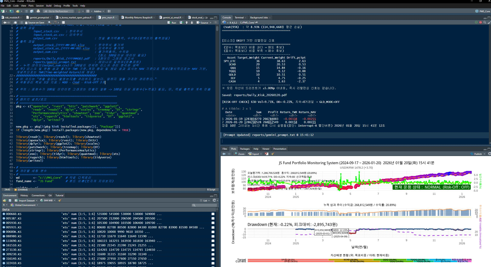
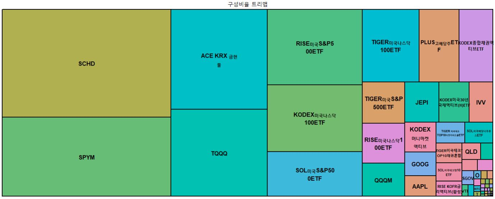
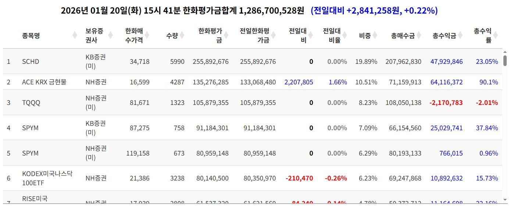

# Part III. 왕초보도 끝까지 돌리는 PMS 실전 매뉴얼 (유료판)

## Chapter 25. 이 파트의 목적: “실행 성공”이 전부다

왜 Part I·II를 읽고도 대부분은 멈추는가

독자가 여기서 얻어야 할 결과물 3가지(1회 실행/자동 실행/리포트 이해)

입력정보 CSV 부터 잘 만들어 보자.

## Chapter 26. 설치 전 체크리스트: 내 PC가 막히는 지점 미리 제거하기

윈도우/맥 환경별 주의점

관리자 권한, 폴더 권한, OneDrive 함정

“이 설정만 하면 80%가 해결된다”

## Chapter 27. R과 RStudio 설치: ‘되는 버전’으로 깔아야 한다

R 버전 선택 기준(최신이 항상 정답이 아닌 이유)

RStudio 설치와 프로젝트(.Rproj) 사용법

패키지 설치가 꼬이는 사람들의 공통 원인

## Chapter 28. PMS 폴더 구조: 경로가 꼬이면 시스템이 무너진다

추천 폴더 트리(그대로 복붙)

input / output / log / config 설계 이유

파일명이 곧 규칙이 되는 구조

## Chapter 29. 첫 실행 성공: “샘플 데이터로 1회 통과”부터 한다

독자가 바로 실행해보는 최소 코드

결과 파일이 생성되는지 확인하는 방법

실패할 때 어디부터 봐야 하는지(로그 우선순위)

## Chapter 30. 데이터 수집 파트: Yahoo/국내 데이터가 흔들릴 때의 대응

조회 실패가 필자는 날의 유형(휴장/장마감 전/네트워크)

close_only 같은 옵션의 의미

“데이터가 없을 때는 시스템이 멈추는 게 맞다”는 철학

## Chapter 31. 포트폴리오 입력 방법: 종목·비중을 바꾸는 가장 안전한 절차

tickers와 weights 수정 규칙

비중 합계 검증(100% 체크)

실수 방지용 안전장치 코드(왕초보 필수)

## Chapter 32. 성과 지표 해석 1: NAV vs TWR, 내 계좌는 왜 다르게 보이나

Return_NAV / Return_TWR의 본질

환율·입출금·평가방식 차이가 만드는 착시

“수익이 났는데 불안한 이유”를 숫자로 설명하기

## Chapter 33. 성과 지표 해석 2: MDD와 변동성, 리스크는 ‘느낌’이 아니다

MDD를 왜 최우선으로 봐야 하는가

Sharpe/Calmar의 올바른 사용법

PMS에서 보이는 각종 리스크 관리 지표 설명

“좋은 수익률”보다 “견딜 수 있는 낙폭”이 먼저다

## Chapter 34. 리스크오프(Risk-Off) 모듈: 시스템이 나를 말리게 만드는 장치

Risk-Off가 켜지는 조건 설계 철학

왜 인간은 폭락장에서 항상 늦게 도망치는가

‘판단’이 아니라 ‘규칙’으로 처리하는 방식

## Chapter 35. 현금 버퍼(6개월 생활비): 투자에서 가장 강력한 보험

현금성 자산을 분리하는 이유

KOFR/BIL/단기채를 PMS에서 다루는 방식

“강제 생존”을 시스템에 박아 넣는 법

## Chapter 36. 리밸런싱: ‘감정 없는 재조정’이 장기 수익을 만든다

리밸런싱이 필요한 이유(상승장·하락장 각각)

월 1회/분기 1회/임계치 방식 비교

리밸런싱을 해도 마음이 흔들리는 이유

## Chapter 37. 자동화 1: 윈도우 작업 스케줄러로 매일 16시에 돌리기

가장 단순한 배치(.bat) 구조

실행 순서(데이터→리포트→메일)

실패 시 재시도/로그 남기기

## Chapter 38. 자동화 2: “휴장일엔 실행하지 않는다”를 구현하는 법

휴장 판단 로직의 현실적인 접근

야후 조회 실패 vs 실제 휴장 구분

자동화는 ‘똑똑함’보다 ‘안전함’이 우선이다

## Chapter 39. 이메일/리포트 운영: 매일 한 장 보고서로 투자 인생이 바뀐다

PDF/HTML/텍스트 중 무엇이 가장 유지보수 쉬운가

메일이 잘리는 문제를 피하는 구성

“보고서가 쌓이면, 내 투자도 쌓인다”는 결론

### 에필로그 : 주식으로 돈을 벌었다는 의미

### FAQ

---

## Chapter 25. 이 파트의 목적: “실행 성공”이 전부다

이제는 이해가 아니라 실행이다. Part I과 Part II를 여기까지 읽어 내려온 독자라면, 아마도 마음속에는 어떤 종류의 결심이 아주 작게나마 남아 있을 것이다. 그 결심은 “필자는 이제 투자에서 감정이 얼마나 위험한지 알게 되었으니 앞으로는 감정에 휘둘리지 않겠다” 같은 거창한 선언일 수도 있고, 혹은 “그래, 분산투자라는 건 단순히 여러 종목을 사는 게 아니라, 리스크를 관리하기 위한 구조였구나” 같은 조용한 깨달음일 수도 있으며, 더 솔직히 말하면 “필자는 내 계좌가 왜 이렇게 흔들리는지 이제야 이해가 된다”라는, 조금은 씁쓸하지만 그래서 더 진짜 같은 인정일 수도 있다.

그런데 여기서부터가 이상하다. 사람은 분명히 이해했고, 이해한 순간에는 뭔가 인생이 달라질 것 같았고, 그날 밤에는 잠들기 전까지 ‘그래, 나도 이제는 시스템으로 투자해야지’라고 생각했는데, 며칠이 지나고 나면 다시 원래대로 돌아가 버린다. 뉴스에 흔들리고, 시세창에 흔들리고, 마음에 흔들리고, 그리고 결국은 또다시 “이번에는 다르다”라는 말을 속으로 되뇌며 손을 움직이게 된다.
그렇게 생각은 바뀌었는데 행동은 바뀌지 않는 이상한 상태, 머릿속에서는 ‘장기투자’와 ‘규칙 기반 투자’와 ‘리스크 관리’라는 단어들이 분명히 자리를 잡았는데, 손은 여전히 단기적인 자극을 따라 움직이는 상태, 바로 그 지점에서 수많은 독자들이 멈춘다. 

그래서 Part III는 Part I·II와 다르다. Part I은 생각을 바꾸는 파트였고, Part II는 생각을 대신해 줄 시스템의 구조를 보여주는 파트였다면, Part III는 그 모든 것을 현실의 바닥에 내려놓는 파트이고, 손으로 만지고, 클릭하고, 실행하고, 오류를 만나고, 다시 고치고, 결국은 “됐다”라는 말을 자기 입으로 하게 만드는 파트다. 쉽게 말해 엔지니어링의 파트이다. 그리고 이 파트의 목적은 단순하다. 너무 단순해서 오히려 무식하게 느껴질 정도로 단순하다.

이 파트의 목적은 오직 하나, “실행 성공”이다. 여기서 말하는 실행 성공이란, 당신이 코드를 완벽하게 이해하는 것을 뜻하지 않는다. 여기서 말하는 실행 성공이란, 당신이 R이라는 언어를 능숙하게 다루는 사람이 되는 것을 뜻하지도 않는다. 여기서 말하는 실행 성공이란, 당신이 누군가에게 “저는 퀀트 투자자입니다”라고 자신 있게 말할 수 있는 명함을 갖게 되는 것도 아니다.

이 파트에서 말하는 실행 성공은 훨씬 더 현실적이고, 훨씬 더 직접적이며, 그래서 훨씬 더 강력하다. 당신이 오늘, 단 한 번이라도 PMS를 끝까지 돌려 보고, 출력 파일이 생성되는 것을 눈으로 확인하고, 그 결과가 당신의 계좌를 설명해 주는 언어로 바뀌는 순간을 경험한다면, 그때 당신은 이미 다른 사람이 된다. 왜냐하면 그 순간부터 투자라는 것이 더 이상 ‘의지로 버티는 것’이 아니라 ‘시스템이 굴러가는 것’이 되기 때문이다.

그리고 바로 그 지점에서부터, 당신의 투자 인생은 놀랄 만큼 조용해진다. 시장은 여전히 시끄럽고, 뉴스는 여전히 자극적이며, 사람들은 여전히 흥분한 채로 종목을 이야기하겠지만, 당신의 계좌는 그 속에서도 조금 더 차분해지고, 조금 더 객관적이 되고, 조금 더 관리 가능한 형태로 바뀌기 시작한다. 그게 Part III의 힘이다. 그 힘은 지식이 아니라, 실행에서 나온다.

왜 Part I·II를 읽고도 대부분은 멈추는가

우리는 흔히 “대부분의 개인투자자는 공부가 부족해서, 정보가 부족해서 실패한다”라고 말하지만, 내가 보기에는 그 말이 반쯤만 맞다. 물론 공부가 부족하면 위험한 투자를 하게 되고, 레버리지를 함부로 쓰게 되고, 감당할 수 없는 변동성을 손에 쥐게 되며, 결국은 큰 손실로 끝날 가능성이 높아지는 것은 사실이다. 하지만 더 근본적인 문제는 따로 있다. 대부분의 개인투자자는 공부가 부족해서가 아니라, 지속할 구조가 없어서 실패한다.

투자에서 가장 어려운 것은, 사실 매수·매도의 기술이 아니다. 진짜 어려운 것은 “그 상태를 오래 유지하는 것”이다. 그리고 오래 유지한다는 것은 결국, 내가 매일 감정적으로 흔들리지 않아야 한다는 뜻이며, 내가 흔들리지 않으려면 내가 무엇을 하고 있는지 계속 확인할 수 있어야 한다는 뜻이고, 확인할 수 있으려면 기록이 있어야 한다는 뜻이며, 기록이 있으려면 자동화가 있어야 한다는 뜻이다.
그러니까 결국 모든 문제는 한 줄로 정리된다. 사람이 흔들리는 이유는, 시스템이 없기 때문이다.

그런데 Part I·II를 읽는 독자는, 머리로는 이미 시스템의 필요성을 이해했음에도 불구하고, 막상 Part III로 들어오려는 순간 이상한 벽을 만난다. 그 벽은 “내가 이걸 할 수 있을까?”라는 벽이다.
그리고 그 벽은 실력의 벽이 아니라, 심리의 벽이다. 왜냐하면 사람은 ‘완벽하게 해야 한다’는 생각이 들어오는 순간, 갑자기 손이 멈추기 때문이다. 

“설치하다가 오류가 나면 어떡하지?”
“CSV를 잘못 만들면 내 계좌가 망가지는 거 아닐까?”
“내가 코드를 건드렸다가 되돌릴 수 없으면 어떡하지?”
이런 생각들이 조용히 마음을 무겁게 만들고, 마음이 무거워지면 사람은 자연스럽게 미루게 되고, 미루는 순간부터 시스템은 점점 멀어지며, 결국은 ‘언젠가 할 일’이 되어 버린다.

그런데 여기서 필자는 단호하게 말하고 싶다. 오류는 실패가 아니다. 오류는 당신이 못한다는 증거가 아니다. 오류는 단지 “컴퓨터가 정확히 요구하는 조건이 있다”는 뜻이고, 우리가 그 조건을 맞추기만 하면 시스템은 언제든 다시 굴러간다. 사실 투자에서 가장 무서운 것은 오류가 아니다. 오류는 고칠 수 있다. 진짜 무서운 것은, 오류가 무서워서 시작조차 하지 않는 것이다. 시작하지 않으면, 아무것도 바뀌지 않는다. 그리고 아무것도 바뀌지 않는다는 것은, 당신이 앞으로도 계속 감정과 뉴스와 시장의 소음 속에서 흔들리게 된다는 뜻이다.

그래서 Part III는 독자를 “완벽한 이해”로 데려가려 하지 않는다. Part III는 독자를 “완벽한 실행”로 데려가려 하지도 않는다. Part III가 독자를 데려가려는 곳은 단 하나다. “실행 성공”이라는 현실이다. 

독자가 여기서 얻어야 할 결과물 3가지

이 파트를 끝까지 따라오면, 독자는 거창한 철학을 얻는 대신, 손에 잡히는 결과물을 얻는다. 그런데 투자에서는, 사실 철학보다 결과물이 더 중요하다. 왜냐하면 철학은 흔들릴 수 있지만, 결과물은 남기 때문이다. 그리고 남는 것은 결국 사람을 바꾼다.

그래서 이 파트에서 독자가 얻어야 할 결과물은 딱 세 가지다. 이 세 가지를 손에 넣으면, 그 순간 당신은 이미 “대부분의 개인투자자가 평생 못 하는 투자”를 시작한 것이다.

(1) 1회 실행: “돌아간다”는 경험

첫 번째 결과물은 단순히 “코드가 실행됐다”가 아니다. 첫 번째 결과물은 “내가 직접 실행해 봤다”는 경험이다. 사람은 경험을 하면 더 이상 예전으로 돌아갈 수 없다. PMS를 한 번이라도 끝까지 돌려 본 사람은, 그 전과 똑같은 투자자가 될 수 없다. 왜냐하면 그 사람은 이제 알게 되었기 때문이다.
투자는 감정이 아니라 기록으로 관리할 수 있다는 것, 시장은 예측할 수 없지만 계좌는 관찰할 수 있다는 것, 그리고 관찰이 쌓이면 결국 그 사람의 투자는 더 단단해진다는 것을. 그 경험은 아주 조용하지만, 투자자에게는 결정적인 전환점이 된다. 그날부터 당신은 “그때그때 판단하는 투자자”가 아니라, “데이터를 쌓는 투자자”가 된다.

정상실행시 Rstudio 화면 예시



(2) 자동 실행: “내가 없어도 계좌는 관리된다”

두 번째 결과물은 자동 실행이다. 그리고 필자는 감히 말할 수 있다. 자동 실행을 세팅한 순간부터, 당신의 투자 인생은 훨씬 편해진다. 왜냐하면 투자에서 가장 큰 적은 시장이 아니라, 사실 “내가 지치는 것”이기 때문이다. 사람은 매일 시장을 볼 수 없다. 사람은 매일 리스크를 계산할 수 없다.
사람은 매일 감정을 통제할 수 없다. 하지만 시스템은 가능하다. 시스템은 지치지 않는다. 시스템은  핑계를 대지 않는다. 시스템은 “오늘은 귀찮으니까 내일 하자”라고 말하지 않는다. 그래서 자동화는 단순히 편리함이 아니다. 자동화는 투자자의 인간성을 우회하는 기술이다. 당신이 흔들리는 날일수록, 오히려 시스템은 더 묵묵히 돌아가야 한다. 그날은 당신이 가장 보기 싫어하는 날이지만, 그날이야말로 기록이 가장 중요한 날이기 때문이다. 위의 모든 것이 무료로 구축가능하고 집에 남는 노트북 1대만 켜두면 된다.

(3) 리포트 이해: “내 계좌의 언어를 읽는다”

세 번째 결과물은 리포트를 이해하는 능력이다. PMS가 만들어내는 숫자와 표와 그래프는, 사실 단순한 출력물이 아니다. 그것은 당신의 계좌가 당신에게 보내는 ‘상태 보고서’다. 당신이 리포트를 이해한다는 것은, 결국 이런 질문에 답할 수 있다는 뜻이다. 오늘 내 계좌는 왜 이렇게 움직였는가.
이 변화는 운용 성과인가, 아니면 입출금의 영향인가. 지금 내 포트폴리오는 위험이 커졌는가, 줄었는가. 내가 불안해하는 것이 합리적인가, 아니면 정상적인 변동성인가. 이 질문에 답할 수 있는 사람은, 시장의 소음에 끌려다니지 않는다. 그 사람은 시장을 ‘느끼는’ 사람이 아니라, 시장 속에서 자신의 계좌를 ‘읽는’ 사람이 된다.

입력정보 CSV부터 잘 만들어 보자. 

이제부터는 진짜 실전이다. 그리고 실전은 늘 아주 사소한 것에서 시작한다. 사람들은 거대한 코드 파일을 열고, 복잡한 함수들을 보고, 패키지 설치부터 겁을 먹지만, 사실 PMS를 성공시키는 가장 확실한 첫걸음은 따로 있다. 바로 입력정보 CSV를 제대로 만드는 것이다. CSV는 Comma Separated Value 파일로 콤마로 각 정보를 구분한 텍스트 파일이다. 각 줄은 데이터 레코드를 나타내고, 쉼표로 분리된 값들은 필드(열)를 나타낸다. 여기에 본인이 소유한 주식의 종목명, 종목번호, 보유증권사(및 ISA/IRP/소수점 구분), 매수가격, 매수수량을 등록해 놓으면 그 이후에는 PMS에서 알아서 종목 현재가와 비교하여 총평가금과 총수익금을 계산해준다. 주의할 점은 반복하지만 같은 증권사라고 해도 IRP, ISA는 뒤에 꼭 구분자를 붙인다. 예를 들어 NH증권의 일반계좌가 있고 IRP계좌가 있다고 하면 일반계좌는 그냥 'NH증권'이라고 해도 되지만 IRP계좌는 'NH증권IRP'라고 붙인다. 소수점 계좌인 경우 'NH증권소수점'이라고 구분해 놓는다. 그렇게 하지 않으면 특정 보유 종목이 일반계좌인지, IRP계좌인지, 소수점 계좌인지 구분할 수 없어 계산시 에러가 날 수 있기 때문이다.

CSV는 단순한 텍스트 파일처럼 보인다. 엑셀에서 저장하면(물론 csv라는 다른 형식으로 저장해야 하지만) 툭 하고 만들어지는, 너무 흔해서 별 의미 없어 보이는 파일이다. 하지만 PMS에서는 그 CSV가 곧 “당신의 투자 세계를 정의하는 지도”가 된다.

어떤 종목을 넣는가. 어떤 이름으로 넣는가. 어떤 형식으로 넣는가. 그 작은 선택들이 쌓여서, 결국 시스템이 얼마나 안정적으로 돌아갈지를 결정한다. 초보자가 흔히 하는 실수는 “대충 만들고 돌리면 되겠지”라는 생각이다. 하지만 시스템은 대충을 이해하지 못한다. 사람은 눈치로 이해하지만, 컴퓨터는 눈치가 없다. 컴퓨터는 정확한 칸에 정확한 값이 들어오기를 요구한다.

그래서 우리는 Part III에서, 가장 먼저 CSV부터 단단하게 만든다.
왜냐하면 CSV가 단단하면, 실행 성공 확률이 급격히 올라가고, 실행이 성공하면 독자는 자신감을 얻으며, 자신감을 얻은 독자는 더 이상 멈추지 않기 때문이다.

CSV파일 내용 예시
* input_stock.csv의 내용중 일부
```
# 국내주식 입력파일
# 맨앞에 샵(#)을 붙이면 코멘트처리 됨
# 보유증권사에는 일반 온주와 소수점을 분리하여 기재하고 ISA, IRP인 경우 증권사에 뒤에 붙여서 쉽게 구분하기로 한다.
종목명,							종목번호,			보유증권사,		매수가격,		수량
TIGER미국나스닥100ETF,			  	133690.KS,		NH증권,		    100461,		222
삼성전자,								005930.KS,		NH증권소수점,		60828,		0.282746
SOL미국S&P500ETF,					433330.KS,		삼성증권,			11655,		824
현대차2우B,						005387.KS,		삼성증권소수점,		185468,		0.132055
맥쿼리인프라,						088980.KS,		한투증권,			11130,		25
미래에셋증권2우B,						00680K.KS,		대신증권,			4321,		1
KODEX미국나스닥100ETF,					379810.KS,		KB증권,			22397,		7
RISE미국S&P500ETF,					379780.KS,		NH증권ISA,		18537,		1686
SOL미국배당다우존스ETF,				446720.KS,		NH증권IRP,		9536,		663
```

* input_stock_us.csv의 내용중 일부
```
# 미국주식 입력파일
# 맨앞에 샵(#)을 붙이면 코멘트처리 됨
# 미국주식은 보유증권사 뒤에 (미)라고 붙이고 소수점이면 증권사 뒤에 소수점이라고 붙여서 쉽게 구분하도록 한다.
종목명,			종목번호,		보유증권사,			매수가격,		수량
QCOM,			QCOM,		NH증권(미),			87.86,		4
WBD,			WBD,		NH증권(미),			24.07,		3
TQQQ,			TQQQ,		NH증권(미),			55.25,		1323
SPYM,			SPYM,		NH증권(미),			80.61,		673
QQQM,			QQQM,		NH증권(미),			256.32,		39
AAPL,			AAPL,		NH증권(미)소수점,		144.48,		0.779893
SGOV,			SGOV,		KB증권(미),			100.5062,	16
MSTR,			MSTR, 		KB증권(미)소수점,		442.8229,	0.471701
SOXX,			SOXX, 		KB증권(미)소수점,		305.1424,	0.291110
TQQQ,			TQQQ,		삼성증권(미),			40.5770,	144
NVDA,			NVDA,		삼성증권(미)소수점,		186.9387,	0.049214
O,				O,			대신증권(미),			56.3002,	5
O,				O,			대신증권(미)소수점,		56.9187,	3.656074
```

위의 파일은 한국주식 파일이고 미국주식은 input_stock_us.csv파일을 열어보면 직관적으로 어떻게 입력하면 되는지 알 수 있다. PMS를 위해 위의 두개 csv파일을 미리 만들어 놓는다. 위와 같이 관리하면 편한게 여러개의 증권사와 같은 증권사에서도 IRP, ISA, 또는 소수점 투자를 한다고 해도 나중에는 합산해서 평가액을 쉽게 알 수 있다.

PMS는 “주식의 자동 평가액 기록관리 가계부”다

필자는 이 시스템을 설명할 때, 일부러 화려한 단어를 쓰지 않으려고 한다. 사람들은 시스템이라고 하면 대단한 무언가를 기대하지만, 사실 이 시스템의 본질은 훨씬 더 현실적이고, 그래서 더 강력하다.

가계부라는 단어는 촌스러울 수 있다. 하지만 돈을 다루는 세계에서, 가계부만큼 강한 무기는 없다.
가계부가 강한 이유는 단순하다. 기록은 거짓말을 하지 않기 때문이다. 사람은 기억을 믿으면 망한다.
오른 날은 과장되고, 떨어진 날은 지워지고, 운이 좋았던 날은 실력으로 포장되며, 실수했던 날은 시장 탓으로 바뀐다. 하지만 기록은 다르다. 그날의 평가액은 그대로 남고, 그날의 손익은 그대로 남고,
그날의 비중은 그대로 남고, 그날의 리스크는 그대로 남는다.

그리고 그 기록들이 쌓이면, 어느 순간부터 당신의 계좌는 “느낌”이 아니라 “데이터”가 된다. 데이터가 되는 순간부터, 투자는 감정이 아니라 구조로 바뀐다. 그게 PMS가 가계부로서 대단한 이유다.


구성비율 트리맵이 강력한 이유

사람은 숫자보다 그림을 더 빨리 이해한다. 특히 시장이 흔들릴 때는 더 그렇다. 불안한 날에는 숫자가 눈에 들어오지 않는다. 하지만 그림은 들어온다. 트리맵은 당신의 포트폴리오를 면적으로 보여준다.
큰 비중은 큰 면적으로, 작은 비중은 작은 면적으로, 그리고 그 차이는 말없이 당신에게 말해준다.

“지금 너는 어디에 집중하고 있는가”, “지금 너는 얼마나 분산되어 있는가”, “지금 너의 계좌는 어떤 구조로 서 있는가”

이 질문은 사실 투자에서 가장 중요한 질문이다. 왜냐하면 포트폴리오는 ‘종목의 집합’이 아니라 ‘구조’이기 때문이다. 구조를 보는 순간, 사람은 감정적으로 덜 흔들린다. 그래서 트리맵은 단순한 시각화가 아니라, 감정을 구조로 바꾸는 도구다.

트리맵 예시화면



데이터테이블 라이브러리의 강력함

그리고 이 시스템이 “가계부”로서 진짜 강력해지는 순간은, 그 기록이 단순히 쌓이는 것이 아니라, 검색 가능해지는 순간이다. 엑셀은 기록을 쌓기에는 좋지만, 기록이 많아지면 무거워진다. 행이 늘어나고, 파일이 커지고, 어느 순간부터는 열리는데 시간이 걸리며, 그 시간이 쌓이면 사람은 기록 자체를 귀찮아하게 되고, 귀찮아지는 순간 기록은 끊기고, 기록이 끊기는 순간 투자자는 다시 감으로 돌아간다. 하지만 데이터테이블은 다르다. 정렬하고, 필터하고, 특정 종목만 보고, 특정 기간만 보고,
손익이 큰 순서대로 뽑아 보고, 비중이 갑자기 커진 자산을 찾아보고, 그 모든 것이 빠르고, 가볍고, 직관적으로 된다. 그 순간부터 당신은 “계좌를 바라보는 사람”이 아니라 “계좌를 분석하는 사람”이 된다. 그리고 분석하는 사람은, 시장의 소음에 덜 휘둘린다. 왜냐하면 그 사람은 느낌이 아니라 근거로 움직이기 때문이다.

데이터테이블 예시화면



이 파트의 약속: 당신을 끝까지 데려간다

그래서 Part III는 독자를 시험하지 않는다. 오히려 Part III는 독자를 붙잡고 끝까지 데려간다.
당신이 완벽하지 않아도 된다. 당신이 실수해도 된다. 당신이 오류를 만나도 된다. 중요한 것은 단 하나다. 끝까지 가는 것. 우리는 앞으로 계속 같은 질문만 할 것이다. “이해했습니까?”가 아니라, “돌아갔습니까?” 돌아가면 된다. 돌아가면, 당신은 이미 이겼다. 시장을 이긴 것이 아니라, 당신의 감정과 당신의 게으름과 당신의 회피 본능을 이긴 것이다. 그리고 그 승리는, 시간이 지날수록 더 크게 불어난다. 왜냐하면 투자에서 가장 큰 복리는 수익률이 아니라, 지속성이기 때문이다.

이제부터 우리는 그 지속성을 시스템으로 만들어낼 것이다. 그리고 당신은 어느 날, 아주 자연스럽게 이런 말을 하게 될 것이다. “필자는 이제 투자에서 더 이상 흔들리지 않는다.” 왜냐하면 흔들리지 않게 만든 것은 의지가 아니라, 당신이 끝까지 돌려낸 이 PMS라는 구조이기 때문이다.

---

## Chapter 26. 설치 전 체크리스트: 내 PC가 막히는 지점 미리 제거하기

Part III의 문턱에서 우리가 가장 먼저 해야 할 일은, 코드를 더 멋지게 짜는 것도 아니고, 어떤 패키지가 더 최신인지 비교하는 것도 아니며, 심지어 “필자는 R을 어느 정도 아는가” 같은 자존심 섞인 질문을 던지는 것도 아니다. 여기서 우리가 해야 할 일은 훨씬 더 현실적이고, 그래서 훨씬 더 결정적이다. 내 PC가 어디에서 막힐지 미리 알아내고, 그 막힘을 ‘시작하기 전에’ 제거하는 것이다. 바쁜 직장인이 R코드 이해하는 것도 힘든데 PC 세팅까지 하려면 어려움이 앞설 수 밖에 없다.

왜냐하면 초보자가 시스템 구축에서 좌절하는 순간은, 대부분 ‘이해 부족’이 아니라 ‘환경의 함정’에서 온다. 코드는 사실 생각보다 정직하다. R이건 파이썬이건 코드는 시키는 대로만 한다. 문제는 컴퓨터가 늘 우리가 생각하는 방식으로 움직이지 않는다는 데 있고, 더 큰 문제는, 우리가 컴퓨터가 왜 그렇게 움직이는지 모른 채로 “왜 안 되지?”라는 감정만 쌓아 간다는 데 있다. 그 감정이 쌓이는 순간, 사람은 실행을 미루고, 미루는 순간, 이 Part III는 당신에게 ‘언젠가 할 일’이 되어 버리며, 그 순간부터 시스템은 다시 먼 미래로 밀려난다.

그래서 Chapter 26은 일종의 안전장치다. 우리는 여기서 “설치 방법”을 설명하기 전에, 설치가 실패하도록 만드는 흔한 지점을 먼저 제거하고자 한다. 마치 장거리 운전을 하기 전에 타이어 공기압을 보고, 엔진오일을 확인하고, 연료를 채워 두는 것처럼, 투자 시스템을 굴리기 전에 컴퓨터라는 도로가 매끈한지, 그리고 중간에 바퀴가 빠질 구덩이는 없는지부터 확인하는 것이다.
이 체크리스트는 화려하지 않다. 하지만 이 체크리스트를 하고 안 하고의 차이는, 실제로는 “성공”과 “포기”의 차이가 된다.

그리고 필자는 이 장의 마지막에서, 아주 단순한 문장을 하나 남기고 싶다. “이 설정만 하면 80%가 해결된다.” 그 말이 과장이 아니라는 것을, 당신은 설치를 시작하기도 전에 체감하게 될 것이다.

1. 윈도우 / 맥 환경별 주의점: “내가 뭘 쓰는지가 반이다”

우선 우리는 인정해야 한다. PMS는 특정 운영체제를 사랑하지도 미워하지도 않는다. 하지만 운영체제는 우리에게 아주 뚜렷한 성격 차이를 보여준다. 그리고 그 성격 차이가, 설치 단계에서 초보자를 괴롭히는 방식도 달라지게 만든다.

윈도우에서 자주 막히는 지점

윈도우는 친절한 듯 보이지만, 사실 ‘권한’과 ‘경로’에서 갑자기 차갑게 변하는 운영체제다.
처음엔 모든 것이 클릭 몇 번으로 되는 것 같다가도, 어느 순간 “액세스가 거부되었습니다”라는 문장을 던져 놓고, 그 문장을 어떻게 해석해야 하는지조차 모르는 사람을 멈춰 세운다. 또 윈도우는 폴더 경로에 공백이 들어가거나, 한글 경로가 섞이거나, OneDrive가 개입하는 순간부터 예기치 않은 변수를 만든다. 초보자에게 가장 위험한 것은, 이 변수가 “내가 뭘 잘못했는지”를 설명해 주지 않는다는 점이다. 그냥 안 된다. 그리고 사람은 ‘그냥 안 되는 것’을 제일 싫어한다. 

맥에서 자주 막히는 지점

맥은 반대로, 겉보기에는 훨씬 매끈하고, 실제로도 많은 부분에서 안정적이지만, 초보자가 한 번 벽을 만나면 그 벽이 “조용한 벽”이라는 점이 문제다. 보안 정책 때문에 파일 접근이 제한되거나, 다운로드 폴더와 문서 폴더의 권한이 묘하게 꼬이거나, 터미널 권한이 얽히는 순간, 맥은 친절하게 소리치지 않는다. 그저 조용히 실패한다. 그리고 조용한 실패는 초보자를 더 불안하게 만든다. “이게 왜 안 되는 거지?”라는 질문에 답이 없으니, 사람은 결국 “내가 못해서 그렇겠지”라는 결론으로 도망가 버리기 쉽다. 맥이 일반적으로 주기적 작업실행에는 안정적이지만 여기에서는 일반인이 많이 쓰는 윈도우 위주로 설명할 것이다.

그래서 운영체제를 비교해서 누가 더 낫다고 말하는 것은 의미가 없다.
중요한 것은 단 하나다. 내가 지금 어느 환경에 있는지 정확히 알고, 그 환경이 좋아하는 방식으로 길을 깔아 주는 것. 그것이 설치 성공의 반이다.

2. 관리자 권한: “처음부터 고개 숙이고 들어가라”

설치를 하다 보면 반드시 한 번은 이런 상황을 만난다. 패키지는 설치가 된 것 같은데 실행이 안 된다. 파일은 저장이 된 것 같은데 생성이 안 된다. 로그는 찍히는 것 같은데 결과물은 없다.
그리고 그때 많은 초보자는 코드만 의심한다. “내가 뭘 잘못 썼나?”, “이 함수가 문제인가?” 하지만 실제로는, 코드가 아니라 컴퓨터가 일을 막고 있는 경우가 너무 많다.

윈도우에서는 특히 그렇다. 관리자 권한이 없으면, 어떤 폴더에는 파일이 써지지 않고, 어떤 경로에서는 실행 파일이 호출되지 않으며, 어떤 라이브러리는 설치되는 척 하다가 마지막에 조용히 실패한다. 여기서 함정은, 초보자에게는 설치가 ‘된 것처럼’ 보인다는 것이다. 그리고 된 것처럼 보이는 실패만큼 사람을 괴롭히는 것은 없다. 

그래서 이 파트에서는, 불필요한 자존심을 내려놓고 들어가야 한다. 처음부터 관리자 권한으로 실행할 수 있는 것은 관리자 권한으로 실행하고, 파일이 생성되어야 하는 경로는 권한이 확실한 경로로 잡아야 한다. (필자가 해보니 관리자 권한으로 하지 않아도 잘 동작하는 경우가 많다. 일단 그냥 해보고 안되면 관리자 권한으로 하는 것도 방법이다.) 이게 “겁이 많아서”가 아니다. 이건 시스템 구축에서 가장 현실적인 전략이다. 우리는 투자에서 늘 “리스크를 통제할 수 있는 것부터 통제하자”라고 말해 왔는데, 설치도 똑같다. 통제할 수 있는 리스크부터 제거하는 것이다.

3. 폴더 권한: “내가 가진 땅에 집을 지어라”

많은 사람들이 PMS 폴더를 어디에 둘지 별 생각 없이 정한다. 바탕화면에 두기도 하고, 다운로드 폴더에 두기도 하고, 문서 폴더에 두기도 하고, 심지어는 임시 폴더에 놓기도 한다. 처음에는 큰 문제가 없어 보인다. 하지만 시스템은 한 번만 돌아가는 것이 아니라, 매일 돌아가야 한다. 매일 돌아가려면, 매일 파일을 만들고, 매일 기록을 쌓고, 매일 로그를 남기고, 매일 결과물을 저장해야 한다. 그 과정에서 폴더 권한이 애매하면, 언젠가 반드시 발목을 잡는다. 그래서 여기서 우리는 아주 단순한 원칙을 세운다. PMS는 “내가 100% 권한을 가진 폴더”에 둔다.

윈도우라면 C드라이브의 Program Files 같은 곳은 피하고, 문서/바탕화면이라도 OneDrive가 개입하지 않는 경로를 우선으로 잡고, 가능하면 짧고 단순한 경로를 택한다. 왜냐하면 경로는 길어질수록, 공백이 섞일수록, 한글이 섞일수록, 그리고 동기화 시스템이 섞일수록 문제를 만들 확률이 올라가기 때문이다. 그래서 윈도우 기준 C드라이브의 루트폴더에 PMS_Core라고 만들고 거기서 프로그램을 돌리는 것을 가정하도록 하겠다. 이건 초보자를 겁주려는 말이 아니다. 오히려 반대다. 초보자가 “굳이 그런 디테일까지 해야 하나요?”라고 생각할 때, 필자는 이렇게 답하고 싶다.
그 디테일을 처음에 한 번만 하면, 앞으로는 평생 편해진다. 이 책에서 사용하는 내용도 위의 폴더 기준이다. 시스템은 처음에만 고생하고, 그 뒤에는 고생을 하지 않게 만드는 구조다.(대다수 독자들은 그렇게 될 것이다)

4. OneDrive 함정: “자동 저장이 자동 파괴가 되는 순간”

윈도우 사용자에게 가장 자주 등장하는 적은, 의외로 바이러스도 아니고 해커도 아니고, 바로 OneDrive다. OneDrive는 원래 좋은 의도로 만들어진 서비스다. 문서가 날아가지 않게 해주고, 파일을 클라우드에 저장해 주고, PC가 바뀌어도 쉽게 복구하게 해준다. 하지만 PMS 같은 자동화 시스템과 만나면, OneDrive는 종종 조용한 장애물이 된다. 왜냐하면 PMS는 파일을 만들고, 덮어쓰고, 갱신하고, 로그를 누적시키며, 심지어는 실행 도중에도 여러 파일을 순차적으로 건드리기 때문이다. 그런데 OneDrive는 “동기화”라는 이름으로 파일을 잠그기도 하고, 업로드 중이라는 이유로 접근을 늦추기도 하며, 어떤 순간에는 파일이 존재하는 것 같지만 실제로는 온라인 상태인 ‘가상 파일’로 남아 있기도 하다. 그 결과 어떤 일이 벌어지냐면, 시스템이 파일을 쓰려는데 파일이 잠겨 있어서 실패한다. 그리고 초보자는 또 코드를 의심한다. 하지만 문제는 코드가 아니라 동기화다. 그래서 체크리스트는 단순하다. PMS 폴더는 OneDrive 동기화 폴더 밖에 둔다.
가능하면, OneDrive가 관여하지 않는 로컬 폴더에 둔다. 그리고 이것만으로도, 초보자가 겪는 이상한 오류의 상당수가 사라진다. 필자는 이걸 정말 과장 없이 말할 수 있다. 이 한 줄이, 성공률을 확 올려준다.

5. “이 설정만 하면 80%가 해결된다”

이제 이 장의 핵심을, 아주 간단한 체크리스트로 압축해 보자. 지금 당장 완벽히 이해하지 않아도 된다. 이 파트의 목표는 이해가 아니라 실행이기 때문이다. 그러니 당신은 그냥, 아래 항목을 체크하고 넘어가면 된다. 이것을 해 두면, 설치 과정에서 당신을 괴롭히는 문제의 대부분이 사라진다. 

* PMS 폴더는 짧고 단순한 경로에 둔다. (앞서 말한 PMS_Core폴더를 만들고, 그렇지 않다면 공백·한글·긴 경로 최소화)

* OneDrive 동기화 폴더 밖에 둔다. (동기화로 파일 잠김 방지)

* 쓰기 권한이 확실한 폴더를 쓴다. (내 계정이 100% 권한)

* 윈도우는 필요한 경우 관리자 권한으로 실행한다. (패키지 설치/파일 생성)

* 로그와 출력 폴더는 ‘항상 같은 위치’로 고정한다. (작업 스케줄러/자동화 대비)

이 다섯 줄이 끝이다. 이 다섯 줄을 지키면, 당신은 설치 단계에서 겪는 대부분의 좌절을 건너뛴다. 그리고 그 좌절을 건너뛴다는 것은, 단지 기분이 좋은 정도의 문제가 아니라, 시스템을 끝까지 완성할 확률이 크게 올라간다는 뜻이다. 그 외에도 Gmail APP Key 받는 일과 Gemini API Key를 받는 일, 환경 변수 등록, 작업 스케줄러 등록 등이 남아 있는데 일단 PMS가 돌아가고 난 뒤에 해도 늦지 않다. 그리고 심지어 자동이메일이 필요 없는 경우, 그냥 PMS만 PC에서 실행해도 상관없다고 필자는 생각한다.

투자에서 성공하는 사람은, 늘 “큰 수익을 내는 비밀”을 가진 사람이 아니다. 성공하는 사람은 오히려 그 반대다. 실패할 가능성이 높은 지점을 미리 알고, 그 위험을 작게 만들고, 그 결과로 오래 살아남는 사람이다. 설치도 똑같다. 우리는 지금 “설치의 리스크”를 줄이고 있다. 그리고 리스크가 줄어든 설치는, 결국 실행 성공으로 이어진다. 그 실행 성공이 바로 Part III의 목적이고, 이 책이 독자에게 주고 싶은 진짜 선물이다.

---

## Chapter 27. R과 RStudio 설치: ‘되는 버전’으로 깔아야 한다

Part III에서 우리가 계속 반복해서 붙잡고 있는 문장이 있다면, 아마 이것일 것이다. “이해보다 실행이 먼저다.” 그리고 이 문장은 멋있게 들리기 위해 존재하는 문장이 아니라, 실제로 초보자를 끝까지 데려가기 위해 존재하는 문장이다. 왜냐하면 초보자가 멈추는 지점은 대개 “내가 이걸 이해 못해서”가 아니라, “내가 이걸 실행 못해서”이고, 실행을 못하는 이유는 대부분 코드의 난이도가 아니라 설치와 환경의 꼬임, 그리고 그 꼬임이 만들어내는 무력감 때문이기 때문이다.

그래서 Chapter 27은, 어쩌면 Part III 전체에서 가장 중요한 장일지도 모른다. R과 RStudio 설치는 너무 기본이라서 대충 넘어가도 될 것 같지만, 실제로는 여기서 모든 것이 결정된다. 여기서 한 번만 잘못 깔리면, 그 뒤에 나오는 모든 과정이 불필요하게 어려워지고, “필자는 안 되는 사람인가 보다”라는 감정이 조용히 마음속에 쌓이며, 결국은 시스템 구축 자체를 포기하게 된다. 반대로 말하면, 여기서 한 번만 제대로 깔리면, 그 뒤의 과정은 생각보다 놀랄 만큼 부드럽게 흘러간다.

그리고 필자는 이 장에서 독자에게 아주 솔직하게 말하고 싶다. R 설치에서 중요한 것은 “최신”이 아니다. R 설치에서 중요한 것은 “멋있음”이 아니다. R 설치에서 중요한 것은 “내가 뭔가 고급 사용자처럼 보이는 선택”이 아니다. R 설치에서 중요한 것은 오직 하나, ‘되는 버전’이다.

1. R 버전 선택 기준: 최신이 항상 정답이 아닌 이유

사람은 본능적으로 최신을 믿는다. 최신 스마트폰이 더 빠를 것 같고, 최신 운영체제가 더 안전할 것 같고, 최신 앱이 더 편할 것 같다. 그래서 R을 설치하려고 공식 홈페이지에 들어가면, 많은 초보자들은 거의 자동으로 가장 최신 버전을 설치한다. 그 선택은 자연스럽다. 그리고 그 선택은 절반은 맞다. 하지만 PMS 같은 “실전 자동화 시스템”에서는, 최신이 항상 정답이 아니다.
이건 최신 기술을 부정하는 이야기가 아니다. 오히려 시스템 구축이라는 현실에서는, 최신이 종종 위험해진다는 이야기다.

왜냐하면 최신 버전의 R이 출시되면, 그 R 버전에 맞춰서 패키지들이 업데이트되어야 하고, 그 업데이트가 완전히 안정화되기까지는 시간이 필요하기 때문이다. 특히 금융 데이터 분석에서 자주 쓰는 패키지들은 의존성이 복잡하다. A 패키지가 B 패키지를 부르고, B 패키지가 C 패키지를 부르고, C 패키지가 시스템 라이브러리를 요구하는 순간, 작은 버전 차이가 연쇄적으로 꼬임을 만들 수 있다. 초보자 입장에서는 정말 억울한 상황이 된다. 필자는 분명히 최신을 깔았는데, 왜 설치가 안 되지? 필자는 분명히 안내대로 했는데, 왜 패키지가 깨지지? 필자는 분명히 아무것도 잘못하지 않았는데, 왜 오류가 뜨지?

그런데 사실 초보자는 아무것도 잘못하지 않았다. 그냥 “너무 최신”을 선택했을 뿐이다. 그래서 여기서 우리는 하나의 현실적인 기준을 세운다. R은 최신을 깔기보다, 패키지 호환성이 검증된 안정 버전을 선택하는 것이 훨씬 유리하다. 특히 당신이 지금 하고 싶은 것은 R을 연구하는 것이 아니라, PMS를 실행하는 것이기 때문에, “실행 성공 확률이 높은 선택”을 해야 한다.

이것은 마치 투자에서 “가장 수익률이 높은 자산”을 찾는 게 아니라, “내가 끝까지 들고 갈 수 있는 자산”을 찾는 것과 닮아 있다. 최신 버전은 수익률이 아니라 변동성이다. 안정 버전은 수익률이 아니라 생존이다. 그리고 시스템 구축에서 가장 중요한 것은 언제나 생존이다.

참고로 PMS 개발에 사용한 R 버전은 64비트 4.5.2 버전이다. R설치에 대해서는 인터넷과 유튜브에 많이 나와 있으므로 별도로 설명은 생략한다.

2. RStudio 설치: 코드를 쓰는 게 아니라 ‘환경’을 갖추는 일

R을 설치하는 것은, 말하자면 엔진을 설치하는 일이다. 하지만 엔진만 있다고 차가 굴러가는 것은 아니다. 운전석이 있어야 하고, 계기판이 있어야 하고, 핸들이 있어야 하고, 무엇보다 사람이 조작할 수 있는 공간이 있어야 한다. 그 역할을 하는 것이 바로 RStudio다. RStudio는 단순히 “R을 실행하는 프로그램”이 아니다. 초보자에게 RStudio는 곧 작업실이고, 실험실이고, 그리고 무엇보다 당신이 길을 잃지 않게 해주는 지도다. 왜냐하면 RStudio는 프로젝트 단위로 작업을 정리할 수 있게 해주고, 파일 경로 문제를 줄여주며, 실행과 결과를 한 화면에서 확인할 수 있게 해주기 때문이다. 초보자가 가장 많이 하는 실수는, R을 설치한 뒤에 파일을 아무 데나 두고, 스크립트를 아무 데서나 열고, 작업 디렉토리가 어디인지 모른 채로 실행하는 것이다. 그러면 어떤 일이 벌어지냐면, 코드가 파일을 찾지 못하고 멈춘다. 

CSV를 읽지 못한다. 출력 파일이 어디로 저장됐는지 모른다. 로그가 생성됐는지조차 확인이 안 된다. 그 순간부터 초보자는 다시 코드 탓을 하기 시작한다. 하지만 문제는 코드가 아니라 “환경이 정리되지 않았다”는 데 있다.

그래서 우리는 여기서 RStudio를 단순한 도구로 보지 않는다. RStudio는 PMS라는 시스템을 굴리기 위한 “작업 환경”이고, 그 환경이 단단하면 실행 성공 확률이 올라간다. 이건 정말로 체감되는 차이다. R설치와 마찬가지로 Rstudio의 설치는 인터넷과 유튜브에 많이 나와 있으므로 설명을 생략한다. 다만 처음 깔면 Rstudio는 코딩 영역 등에 흰바탕화면으로 나오는데 필자는 바탕화면을 남색계열로 하는 것이 좋아서 Rstudio 상단메뉴의 Tools > Global Options > Appearance > Editor Theme: 에서 Cobalt로 배경화면을 남색계열로 바꾸었다. 그리고 코드 결과가 나오는 콘솔창의 위치를 좀 편하게 바꾸었다. 방법은 RStudio 상단 메뉴에서 Tools
Global Options… > Pane Layout > 오른쪽에 4개의 영역(좌상/우상/좌하/우하)이 보이는데, 여기서 Console을 Top Right(우상단) 으로 변경하면 된다. 이렇게 하면 Console이 우상단으로 이동한다. 이렇게 한 이유는 콘솔 출력이 많아지면 확인하기 편하기 때문이다. 하지만 개인 성향에 따라 해도 되고 안해도 된다. 그리고 R과는 달리 Rstudio는 최신판을 써도 버전충돌과 관련이 없다. 보통 1년에 한두번은 업그레이드를 하는 것 같다. Rstudio는 통합개발환경이지 R프로그램을 해석해서 실행해주는 기능과 관련없기 때문이다.

3. 프로젝트(.Rproj) 사용법: 길을 잃지 않는 가장 쉬운 방법

이제 이 장에서 가장 중요한 키워드를 하나 꺼내 보자. 바로 프로젝트(.Rproj) 다. 초보자에게 프로젝트라는 말은 괜히 어렵게 느껴질 수 있다. 특히 R을 써보기는 했는데 초보시절 단순 분석용으로만 사용한 사람은 프로젝트라는 개념도 어색하다. 하지만 사실 프로젝트는 거창한 게 아니다. 프로젝트는 단지 “이 폴더를 내 작업의 기준점으로 삼겠다”는 선언이다. 그리고 그 선언 하나가, R을 다루는 삶을 완전히 바꿔 놓는다. 

R에서 가장 흔한 오류 중 하필자는, 파일 경로 때문이다. 분명히 input_stock.csv를 만들었는데 못 읽는다. 분명히 output_sum.csv가 있는데 못 찾는다. 분명히 폴더에 파일이 있는데 코드가 없다고 한다. 이건 대부분 “작업 디렉토리”가 엉뚱한 곳으로 잡혀 있기 때문이다. 그런데 프로젝트를 쓰면, 이 문제가 거의 사라진다. 왜냐하면 프로젝트는 RStudio에게 이렇게 말해 주기 때문이다. “이 폴더가 기준이다. 여기서부터 모든 상대경로를 해석해라.”

이건 시스템 구축에서 엄청난 차이를 만든다. 특히 PMS처럼 파일 입출력이 많은 구조에서는 더 그렇다. PMS는 입력 CSV를 읽고, 중간 산출물을 만들고, 결과 파일을 저장하고, 로그를 남기고, PDF나 HTML을 만들기도 한다. 이 과정에서 경로가 한 번만 꼬여도 전체가 멈춘다. 그러니 프로젝트는 사실 선택이 아니라 필수에 가깝다. 프로젝트를 쓰는 순간, 당신은 더 이상 “파일을 찾는 사람”이 아니라 “시스템을 돌리는 사람”이 된다. 그리고 그 차이가 초보자에게는 너무 크다.
사람은 파일을 찾다가 지친다. 하지만 시스템을 돌리면 힘이 난다.

프로젝트를 생성하는 가장 쉬은 방법은 C드라이브에 PMS_Core라고 폴더를 만든다. 여기에 깃허브에서 핵심 프로그램인 pms_main.R, risk_module.R, stock_eval.R, stock_eval_us.R을 복사해 넣는다. 그리고 입력파일로 input_stock.csv, input_stock_us.csv, output_sum.csv를 복사해 넣는다. 여기서 csv파일은 더미데이터(가짜데이터)이다. 여기에 보유중인 한국주식(input_stock.csv)과 미국주식(input_stock_us.csv)를 입력해 넣는다. 실행하면 output_sum.csv파일은 자동으로 생기는데 이 파일은 입력파일로도 사용된다. output_sum.csv파일에 쌓인 날짜 데이터가 100개가 안되면 리스크 지표 산정은 하지 않으므로 만약 리스크 지표가 나오는 것을 확인하고 싶으면 다운 받은 output_sum.csv파일을 그냥 PMS_Core에 두고 PMS 실행 100일이 지나면 원래 있던 가짜 더미데이터는 삭제하면 된다. 그리고 Rstudio를 실행시키고 우상단의 New Project 버튼을 누른다. 거기서 Open Project를 열고 Create Project 창이 뜨면 'Existing Directory'에서 C드라이브의 C:\PMS_Core를 선택하면 된다. 정말 간단하다. 이제 PMS_Core라는 이름의 프로젝트를 만들었고 여기서 모든 프로그램을 실행하면 된다.

4. 패키지 설치가 꼬이는 사람들의 공통 원인

이제 초보자들이 가장 자주 좌절하는 지점, 그리고 Part III를 포기하게 만드는 가장 강력한 함정, 바로 패키지 설치 문제를 이야기해 보자. 패키지는 R의 힘이다. 하지만 패키지는 동시에 R의 함정이다. 왜냐하면 패키지는 “내 컴퓨터의 상태”를 그대로 반영하기 때문이다. 패키지 설치가 꼬이는 사람들은, 대부분 비슷한 패턴을 가지고 있다. 그 패턴은 놀랄 만큼 반복된다.
그리고 우리는 그 공통 원인을 미리 알고 있으면, 굳이 고생을 크게 하지 않아도 된다.

(1) 권한 문제: 설치는 되는데 로딩이 안 된다

설치가 된 것 같지만 library()에서 에러가 난다. 혹은 설치 도중 “permission denied” 같은 문장이 나온다. 이건 거의 항상 권한 문제다. 특히 윈도우에서는 관리자 권한 여부가 영향을 준다. 그래서 Chapter 26에서 권한 이야기를 먼저 했던 것이다.

(2) 경로 문제: OneDrive/긴 경로/한글 경로

패키지 자체는 설치되는데, 캐시나 임시파일이 꼬인다. 혹은 설치가 중간에 멈춘다. 이런 경우는 OneDrive 동기화 폴더, 혹은 지나치게 긴 경로, 혹은 한글 경로가 섞여 있는 경우가 많다. 이 문제는 초보자에게 너무 억울하다. 필자는 아무것도 안 했는데, 내 컴퓨터가 알아서 꼬여 버리는 느낌이기 때문이다.

(3) 패키지 의존성 문제: A를 깔려면 B가 필요하다

패키지는 혼자 존재하지 않는다. 패키지는 서로를 부른다. 그래서 하나만 설치하려고 했는데, 갑자기 열 개가 따라온다. 그리고 그 열 개 중 하나가 실패하면, 결국 전체가 실패한다. 이게 초보자에게는 “내가 뭘 잘못했지?”라는 공포로 바뀐다. 하지만 대부분은 당신의 실수가 아니다.
그냥 의존성의 세계가 원래 그렇다. 

(4) 너무 최신 버전의 R: 아직 패키지가 못 따라온다

앞에서 말했듯, 최신 R은 멋있지만, 실전에서는 위험할 수 있다. 특히 금융/시각화/리포트 자동화 패키지들은 업데이트 타이밍이 엇갈릴 수 있다. 그래서 “되는 버전”이라는 말이 여기서 다시 중요해진다. 특히 필자의 경우 R버전과 패키지 버전이 안맞아서 고생을 했다. 보통 어떤 특정 패키지는 특정 R버전에서 만들어졌다는 내용의 경고가 뜨게 되는 경우이다. 너무 최신 버전이 꼭 좋은 것은 아니다.

5. 결론: 설치는 공부가 아니라 ‘리스크 제거’다

이 장을 여기까지 읽었다면, 당신은 아마도 이런 생각을 하고 있을 것이다. “설치가 이렇게 중요했나?” 맞다. 설치는 정말 중요하다. 그리고 더 정확히 말하면, 설치는 단지 준비 단계가 아니라, 시스템 구축의 절반이다. 투자에서 리스크 관리는 사후 대응이 아니라 사전 설계다. PMS도 마찬가지다. 설치와 환경 세팅은 사후 디버깅이 아니라, 사전 리스크 제거다. 우리는 지금 그 리스크를 제거하고 있다. 그리고 여기서 다시 Part III의 핵심 문장을 꺼내야 한다. 이 파트의 목적은 이해가 아니다. 이 파트의 목적은 실행이다. 그리고 실행을 위해서는, ‘되는 버전’으로 깔아야 한다. 

이제 당신이 해야 할 일은 단순하다. R을 깔고, RStudio를 깔고, 프로젝트를 만들고,
그 안에서 PMS 폴더를 단단히 고정시키는 것이다. 그 순간부터, 당신은 더 이상 “언젠가 시스템을 만들 사람”이 아니다. 당신은 이미 시스템을 굴리기 시작한 사람이다. 그리고 그 차이가, 투자 인생을 바꾼다.


---

## Chapter 28. PMS 폴더 구조: 경로가 꼬이면 시스템이 무너진다

Part III에서 우리가 계속해서 강조하고 있는 문장이 있다면, 그것은 “이해가 아니라 실행”이라는 말일 것이고, 또 하나를 더 꼽자면 아마 “실행 성공은 환경에서 결정된다”라는 말일 것이다. 그런데 여기서 말하는 환경이란 단지 R 버전이나 패키지 설치 같은 기술적인 문제만을 뜻하지 않는다. 실제로 초보자가 가장 자주 넘어지고, 가장 억울하게 좌절하며, 가장 허무하게 포기하게 되는 지점은 놀랍게도 코드가 아니라 경로(path), 그리고 그 경로가 만들어내는 폴더 구조의 혼란에서 시작되는 경우가 훨씬 많다.

왜냐하면 시스템이라는 것은 결국 “반복”을 전제로 움직이는 구조이고, 반복은 반드시 “같은 자리에서 같은 방식으로” 일어나야 하며, 그 조건이 무너지면 시스템은 더 이상 시스템이 아니라 그때그때 손으로 겨우 돌리는 임시 작업이 되어버리기 때문이다. PMS는 매일 입력 파일을 읽고, 매일 중간 결과물을 만들고, 매일 로그를 남기고, 매일 최종 리포트를 저장하는 루프를 전제로 설계되어 있는데, 그 루프의 출발점과 도착점이 매번 바뀐다면, 그건 더 이상 자동화가 아니라 “자동화처럼 보이는 수동 노동”이 되고, 결국 당신은 다시 예전처럼 엑셀을 열고, 파일을 찾고, 복사하고, 붙여넣고, 그리고 어느 순간에는 기록 자체를 끊어버리게 된다.

그래서 이 장은 단순히 “폴더를 이렇게 만들어라”라는 안내가 아니다. 이 장은 PMS라는 시스템을, 당신의 컴퓨터 안에서 절대로 흔들리지 않는 구조물로 세우는 작업이고, 더 정확히 말하면 “경로가 꼬이는 순간 시스템이 무너진다”는 사실을 미리 받아들이고, 그 무너짐을 원천 차단하는 작업이다.
그리고 이 작업은 한 번만 제대로 해두면 된다. 한 번만 제대로 해두면, 당신은 앞으로 수개월, 수년 동안, 같은 버튼을 누르는 것만으로 같은 결과를 얻는 사람이 되고, 그 순간부터 투자에서 가장 귀한 자원인 “정신적 에너지”를 소모하지 않게 된다.

1. 폴더 트리

우선, 필자는 여기서 독자에게 선택지를 많이 주고 싶지 않다. 선택지는 자유를 주는 것처럼 보이지만, 초보자에게 선택지는 오히려 불안을 준다. “필자는 어떤 구조가 맞지?”, “이건 이렇게 해도 되나?”
“저건 왜 저렇게 하지?”, 그 질문이 늘어필자는 순간, 실행은 느려지고, 느려지는 순간, 시스템 구축은 멈춘다. 그래서 이 장에서는 아주 단순하게, 그대로 복붙해서 쓰면 되는 표준 폴더 트리를 먼저 제시하겠다. 당신은 이 구조를 그대로 따라 하면 된다. 그리고 이 구조를 그대로 따라 하기만 해도, PMS의 실행 성공률은 눈에 띄게 올라간다.

아래는 필자가 추천하는 PMS 표준 폴더 구조다. 당신이 윈도우를 쓰든, 맥을 쓰든, 이 구조는 그대로 유지하는 것이 좋다. 각 트리 구조 오른쪽에 어떤 파일인지 설명을 자세히 달아 놓았다. 엑셀파일은 출력파일이므로 처음에는 아래 위치에 복사할 필요는 없다.

```
C:\PMS_Core
├─ pms_main.R         	: PMS 메인모듈
├─ risk_module.R		: PMS 메인모듈에서 호출하는 리스크 관리 계산 함수 모음
├─ stock_eval.R			: input_stock.csv를 읽어 한국주식 현재가를 가져오고 엑셀(output_stock_{YYYY-MM-DD}.xlsx)로 저장하는 모듈
├─ stock_eval_us.R		: input_stock_us.csv를 읽어 미국주식 현재가를 가져오고 엑셀(output_stock_us_{YYYY-MM-DD}.xlsx)로 저장하는 모듈
├─ gemini_ai_email.R	: 제미나이에게 질의하고 이메일을 보내는 모듈
├─ is_korea_market_open_yahoo.R	: gemini_ai_email.R에서 호출하는 오늘이 주식시장이 열렸는지 판단하는 함수 모듈
├─ run_pms.bat			: 윈도우 작업 스케줄러가 호출하는 파일로 pms_main.R을 실행시키는 배치파일
├─ run_ai_email.bat		: 윈도우 작업 스케줄러가 호출하는 파일로 gemini_ai_email.R을 실행시키는 배치파일
├─ output_sum.csv		: 입력파일이자 출력파일로 총평가금과 총수익금이 날짜별로 기록된 csv파일
├─ output_stock_{YYYY-MM-DD}.xlsx  		: 한국주식 오늘 평가액, 수익금 정리파일
├─ output_stock_us_{YYYY-MM-DD}.xlsx	: 미국주식 오늘 평가액, 수익금 정리파일(특히 맨 아래줄에 환율을 반영하여 한화로 평가금을 표시)
│
└─ reports\
  ├─ gemini_prompt.txt	: 제미나이 생성형 AI에게 질의하기 위한 프롬프트 파일
  └─ Daily_Risk_{YYYYMMDD}.pdf	: 그래프로 표현한 1장 일일 보고서(매일 장열리는 날짜의 특정시간에 사용자에게 메일보낼때 첨부하는 파일)
```

위에 나오지 않은 나머지 파일들은 임시파일이거나 각종 시뮬레이션을 위한 R파일, 로그폴더의 로그파일 등이다. 처음 실행할 때는 가상의 파일이자 더미텍스트 파일인 csv파일도 실행이 잘 되는지를 확인하기 위해 그냥 위 폴더에 복사해 놓는 것이 좋다. 

이 폴더 트리는 언뜻 보면 “너무 깔끔하게 정리하려고 애쓴 구조”처럼 보일 수 있지만, 사실은 그 반대다. 이 구조는 미학을 위한 구조가 아니라, 실패를 방지하기 위한 구조다. PMS가 실패하는 이유는 대개 “계산이 틀려서”가 아니라 “파일을 못 찾아서”이고, 파일을 못 찾는 이유는 대개 “경로가 꼬여서”이며, 경로가 꼬이는 이유는 대개 “폴더 구조가 일관되지 않아서”다. 그러니 우리는 실패를 막기 위해 구조를 단순하게 만든다. 단순한 구조는 강하다. 강한 구조는 반복을 가능하게 한다. 반복은 자동화를 가능하게 한다. 그리고 자동화는 당신의 투자에서 감정을 줄여준다.

2. input / output / reports / log  설계 이유

이제 우리는 왜 굳이 이렇게 나누는지, 그 이유를 아주 현실적인 언어로 설명해야 한다. 초보자에게 “폴더를 나누세요”라는 말은 그저 귀찮은 규칙처럼 들릴 수 있지만, 사실 폴더를 나누는 것은 귀찮음이 아니라 생존 전략이다. 왜냐하면 시스템은 시간이 지나면서 반드시 커지고, 커지는 순간부터는 정리되지 않은 구조가 곧 장애물이 되기 때문이다. 

input csv파일들: 시스템이 먹는 음식은 항상 같은 접시에 담아야 한다

PMS에서 input은 말 그대로 “시스템이 읽어들이는 재료”다. 그리고 시스템은 사람이 아니다. 사람은 대충 보고도 이해하지만, 시스템은 정확히 정해진 위치에서 정확히 정해진 형식의 파일을 읽어야만 한다.
그래서 input 폴더는, 당신이 앞으로 PMS를 돌릴 때마다 “어디에 입력 파일을 넣어야 하지?”라는 고민을 하지 않게 해준다. 그 고민을 없애는 순간, 당신은 실행 버튼을 누르는 데 망설임이 줄어든다.
망설임이 줄어들면, 실행은 늘어난다. 실행이 늘어나면, 기록은 쌓인다. 기록이 쌓이면, 당신은 투자에서 가장 강력한 무기인 데이터 기반 판단을 얻게 된다.

output csv파일 및 xlsx파일: 결과물은 모아야 ‘성과’가 된다

output 폴더는 단순히 파일을 저장하는 공간이 아니다. output 폴더는 당신의 투자 기록이 “성과”로 바뀌는 공간이다. 오늘의 결과물이 쌓이고, 내일의 결과물이 쌓이고, 한 달 뒤의 결과물이 쌓이면, 그 순간부터 당신은 더 이상 “오늘의 시장”만 보는 사람이 아니라 “시간의 흐름”을 보는 사람이 된다.
그리고 투자에서 시간의 흐름을 볼 수 있는 사람은, 단기적인 자극에 덜 흔들린다. 그게 output 폴더를 따로 두는 이유다. 결과물을 흩어 놓으면, 당신의 계좌도 흩어진다. 결과물을 모아 두면, 당신의 투자도 모인다.

log: 로그는 시스템의 양심이고, 보험이고, 블랙박스다

log 폴더는 초보자에게 가장 낯선 개념일 수 있다. “왜 굳이 로그를 남겨야 하지?” 그런데 로그는 시스템이 커질수록 더 중요해진다. 시스템이 매일 자동으로 돌아가기 시작하면, 어느 날은 네트워크가 흔들리고, 어느 날은 야후가 데이터를 못 주고, 어느 날은 장이 휴장이고, 어느 날은 파일이 잠겨 있을 수 있다. 그때 시스템이 멈추면, 당신은 그 이유를 알아야 한다. 이유를 모르면 사람은 불안해지고, 불안해지면 시스템을 신뢰하지 못하고, 신뢰하지 못하면 결국 자동화를 끊어버린다. 그래서 로그는 보험이다. 로그가 있으면, “무슨 일이 있었는지”를 나중에라도 확인할 수 있고, 확인할 수 있다는 것은 곧 안정감으로 바뀐다. 투자에서 안정감은 수익률보다 더 중요할 때가 많다. 왜냐하면 안정감이 있어야 오래 버티기 때문이다.


3. 파일명이 곧 규칙이 되는 구조

이제 마지막으로, 이 장에서 가장 중요한 문장을 하나 꺼내야 한다. 파일명이 곧 규칙이 된다. 초보자는 파일명을 대충 짓는다. final.csv, 진짜최종.csv, 최종최종.csv, newnew.csv 같은 이름이 생겨나기 시작하면, 그 순간부터 시스템은 이미 무너지고 있다. 왜냐하면 시스템은 “최종”이라는 감정을 이해하지 못하기 때문이다. 시스템은 “진짜”라는 다짐을 이해하지 못한다. 시스템이 이해하는 것은 오직 규칙이다. 그리고 그 규칙은 파일명과 폴더명으로 구현된다.

그래서 우리는 파일명을 “사람의 기분”이 아니라 “시스템의 규칙”으로 짓는다. input_stock.csv는 언제나 입력/출력이고, output_sum.csv는 언제나 요약 결과이며, pms_main.log는 언제나 실행 로그다. 이렇게 정해 놓으면, 당신은 시간이 지나도 헷갈리지 않는다. 헷갈리지 않는다는 것은 곧 실행을 멈추지 않는다는 뜻이다. 실행을 멈추지 않는다는 것은 곧 기록이 쌓인다는 뜻이다. 기록이 쌓인다는 것은 곧 당신이 투자에서 더 강해진다는 뜻이다. 파일명이 규칙이 되는 순간, 당신의 컴퓨터는 단순한 저장소가 아니라 시스템의 일부가 된다. 그리고 시스템의 일부가 된 컴퓨터는, 당신이 감정적으로 흔들릴 때도 묵묵히 일을 해낸다. 그게 PMS가 지향하는 세계다.

이 장의 결론: 구조가 무너지면 자동화도 무너진다

PMS는 결국 루프다. 매일 돌아가야 하고, 돌아가면 기록이 쌓이고, 기록이 쌓이면 계좌가 설명되고, 계좌가 설명되면 당신은 흔들리지 않게 된다. 그 루프를 유지하는 힘은, 거창한 알고리즘이 아니라 아주 단순한 구조에서 나온다. 폴더 구조가 단단하면, 시스템은 단단하다. 폴더 구조가 흔들리면, 시스템도 흔들린다. 그러니 우리는 지금, 코드보다 먼저 폴더를 세운다. 우리는 지금, 계산보다 먼저 경로를 고정한다. 우리는 지금, 수익률보다 먼저 지속성을 확보한다. 그리고 이것이 바로 Part III의 철학이다. 실행 성공이 전부다. 그 실행 성공은, 결국 구조에서 시작된다.

---

## Chapter 29. 첫 실행 성공: “샘플 데이터로 1회 통과”부터 한다

Part III에 들어오면서 우리는 계속 같은 말을 반복하고 있다. 이 파트의 목적은 이해가 아니라 실행이고, 실행이라는 것은 결국 “한 번이라도 돌아가게 만드는 것”이며, 한 번이라도 돌아가게 만드는 순간부터 사람은 더 이상 예전으로 돌아갈 수 없다는 사실이다. 그런데 여기서 많은 독자들이 스스로를 함정에 빠뜨린다. “필자는 내 계좌 데이터를 넣고 바로 돌려야 진짜지”, “내 실제 종목을 넣고, 내 실제 평가액이 나오고, 내 실제 리포트가 생성되어야 의미가 있지” 이 생각은 열정처럼 보이지만, 사실은 초보자를 멈추게 만드는 가장 위험한 욕심이다.

왜냐하면 첫 실행은 ‘정답을 얻는 과정’이 아니라 ‘환경을 검증하는 과정’이고, 환경 검증에서 가장 중요한 것은 현실의 복잡함이 아니라 단순함이기 때문이다. 첫 실행에서 당신이 해야 할 일은, 내 계좌를 완벽하게 재현하는 것이 아니라, 이 시스템이 내 PC에서 살아 움직일 수 있는지를 확인하는 것이다. 그것은 마치 비행기를 처음 띄우는 사람이 첫 비행에서 태평양 횡단을 시도하지 않는 것과 같다. 처음에는 활주로에서 이륙만 하면 된다. 이륙만 하면, 그 다음은 생각보다 빠르게 따라온다.

그래서 이 장의 목표는 단 하나다. 샘플 데이터로 1회 통과. 내 계좌가 아니어도 된다. 내 종목이 아니어도 된다. 내 평가액이 아니어도 된다. 중요한 것은, “PMS가 한 번 끝까지 돌아갔다”라는 경험을 당신의 손에 쥐여 주는 것이다. 그 경험은 작은 것 같지만, 사실 시스템 구축에서 가장 큰 관문을 넘어서는 순간이고, 그 순간부터 당신은 더 이상 “언젠가 자동화를 할 사람”이 아니라 “이미 자동화를 돌려 본 사람”이 된다.

1. 독자가 바로 실행해보는 최소 코드

여기서부터는 우리는 욕심을 버리자. 천리길도 한 걸음 부터이다. 코드를 예쁘게 만들 욕심도 버리고, 기능을 한꺼번에 다 넣을 욕심도 버리고, 그래프까지 한 번에 뽑고 싶은 욕심도 버린다. 첫 실행은 최소한으로, 정말 최소한으로, 시스템의 심장만 뛰게 만들면 된다. 심장만 뛰면, 팔다리는 나중에 붙이면 된다. 그래서 여기서는 “최소 코드”를 제시한다. 이 코드는 당신이 PMS 전체를 완벽히 이해하지 못해도, 그냥 실행만 할 수 있게 만들어진 코드다. 그리고 이 코드가 성공하면, 당신은 이제 “되는 환경”을 확보한 것이다.

아래 코드는 pms_smoke_test.R 같은 이름으로 저장해도 좋고, 당신의 PMS 폴더(C:\PMS_Core) 안에 넣어도 좋다. 중요한 것은, 이 파일이 “첫 실행 성공”만을 목표로 한다는 점이다.

```
# ==========================================
# PMS Smoke Test: 샘플 데이터로 1회 통과
# 목적: "내 PC에서 끝까지 돌아간다" 확인
# ==========================================

cat("PMS Smoke Test 시작...\n")

# 1) 필수 패키지 로드
pkgs <- c("data.table")
for (p in pkgs) {
  if (!requireNamespace(p, quietly = TRUE)) {
    install.packages(p, dependencies = TRUE)
  }
}
library(data.table)

# 2) 폴더 경로 확인
root <- getwd()
cat("현재 작업 경로:", root, "\n")

# 3) 샘플 입력 데이터 생성 (가짜 종목 3개)
sample_input <- data.table(
  ticker = c("AAA", "BBB", "CCC"),
  qty    = c(10, 20, 30),
  price  = c(1000, 500, 200)
)

# 4) 결과 계산 (평가액)
sample_input[, value := qty * price]
total_value <- sample_input[, sum(value)]

# 5) output 폴더 생성
out_dir <- file.path(root, "test")
if (!dir.exists(out_dir)) dir.create(out_dir, recursive = TRUE)

# 6) 결과 파일 저장
out_file <- file.path(out_dir, "test_output_sum.csv")
fwrite(sample_input, out_file)

cat("샘플 test_output_sum.csv 생성 완료:", out_file, "\n")
cat("총 평가액:", total_value, "\n")
cat("PMS Smoke Test 종료.\n")
```

실행하는 방법은 단축키로 Ctrl + Alt + R 키의 조합을 누르면 된다.

이 코드는 PMS의 모든 기능을 보여주지 않는다. 그럴 필요가 없다. 이 코드는 단지 한 가지를 증명한다. 당신의 PC가 파일을 만들 수 있고, 폴더를 만들 수 있고, R이 정상적으로 실행되며, 결과물을 저장할 수 있다는 것. 이 한 가지가 증명되는 순간, 당신은 더 이상 설치 단계의 불안에 머물지 않는다. 왜냐하면 당신은 이미 “돌아가는 경험”을 가졌기 때문이다. 그리고 돌아가는 경험을 가진 사람은, 그 다음부터는 오류가 나도 덜 무섭다. 오류는 “불가능”이 아니라 “조정해야 할 변수”로 바뀌기 때문이다.

2. 결과 파일이 생성되는지 확인하는 방법

첫 실행에서 가장 중요한 것은 숫자가 맞는지가 아니다. 첫 실행에서 가장 중요한 것은 그래프가 예쁜지가 아니다. 첫 실행에서 가장 중요한 것은 리포트가 멋있게 나오는지가 아니다. 첫 실행에서 가장 중요한 것은, 정말 단 하나다. 파일이 생성되는가. 왜냐하면 파일이 생성된다는 것은, 시스템이 끝까지 흘러갔다는 뜻이고, 시스템이 끝까지 흘러갔다는 것은 자동화의 길이 열렸다는 뜻이기 때문이다. 그래서 우리는 아주 단순한 확인법을 사용한다.

test\ 폴더로 들어간다. test_output_sum.csv가 생성되어 있는지 본다. 파일 크기가 0이 아닌지 확인한다. 엑셀로 열어도 좋고, 메모장으로 열어도 좋다. 내용이 들어 있으면 성공이다.

여기서 중요한 것은 “어떤 방식으로 확인하느냐”가 아니다. 중요한 것은 “확인하는 습관”이다. 시스템은 자동으로 돌아가더라도, 인간은 확인하지 않으면 불안해진다. 확인하지 않으면 불안해지고, 불안해지면 자동화를 끊고 싶어지며, 끊고 싶어지는 순간부터 사람은 다시 감정의 투자로 돌아간다. 그러니 우리는 자동화를 만들면서 동시에 “확인 가능한 구조”를 만든다. 그 확인 가능한 구조의 첫걸음이 바로 output 폴더다.

3. 실패할 때 어디부터 봐야 하는지: 로그 우선순위

이제 현실적인 이야기를 해야 한다. 첫 실행은, 성공할 수도 있지만, 실패할 수도 있다. 그리고 실패는 부끄러운 일이 아니다. 실패는 정상이다. 오히려 실패는 “지금 당신이 진짜로 실행하고 있다”는 증거다.
문제는 실패 자체가 아니라, 실패했을 때 초보자가 어디부터 봐야 하는지 모른다는 데 있다. 초보자는 실패하면 당황한다. 당황하면 이것저것 눌러 본다. 이것저것 눌러 보면 더 꼬인다. 더 꼬이면 더 불안해진다. 그리고 결국 “필자는 안 되나 보다”라는 결론으로 도망가 버린다.

그래서 우리는 실패했을 때의 우선순위를 미리 정해 둔다. 투자에서 위기 상황이 오면 미리 정해 둔 리스크 관리 규칙대로 움직이듯이, 실행 실패가 오면 미리 정해 둔 디버깅 우선순위대로 움직이면 된다.
그게 시스템적인 태도다.

(1) 가장 먼저 보는 것: 콘솔 에러 메시지 마지막 5줄

실패했을 때 가장 먼저 해야 할 일은, 콘솔을 위로 스크롤해서 처음부터 읽는 것이 아니다. 그건 초보자에게 너무 고통스럽고, 대부분은 의미가 없다. 대신 가장 아래쪽, 마지막 5줄을 본다. 에러는 대부분 마지막에 요약된다. “파일이 없다”, “권한이 없다”, “패키지가 없다”, “함수가 없다” 이런 식으로 핵심이 나온다.

(2) 그 다음: log 폴더의 최신 로그 파일

로그는 길게 쌓여 있어도, 사실 핵심은 맨 아래에 있다. 특히 error_trace.log 같은 파일이 있다면, 그것은 거의 항상 답을 들고 있다.

(3) 그 다음 test 폴더에 “부분 생성된 파일”이 있는지 확인

실패했는데도 output 폴더에 뭔가 파일이 생성되어 있다면, 그건 좋은 신호다. 그 말은 시스템이 중간까지는 왔다는 뜻이다. 즉, 완전히 막힌 게 아니라 “어느 단계에서 멈췄는지”가 좁혀진 것이다.
초보자가 가장 무서워하는 실패는 “아무것도 안 남는 실패”인데, 파일이 하나라도 남으면 그 실패는 반쯤 해결된 실패다. 하지만 대부분의 경우에는 test 폴더 안에 test_output_sum.csv파일이 있을 테고 그 파일을 메모장으로 열어보면 가상의 종목들이 들어가 있는 것을 확인할 수 있을 것이다. 여기까지 왔다면 대성공이다.

(4) 마지막: input 파일과 경로를 의심한다

초보자는 보통 코드부터 의심하지만, 실제로는 input 파일과 경로가 원인인 경우가 더 많다. 파일명이 틀렸다. 폴더가 다르다. OneDrive가 잠갔다. 작업 디렉토리가 바뀌었다. 이런 것들이 시스템을 멈춘다. 그래서 우리는 늘 마지막에 “경로”를 본다. 경로는 PMS의 뼈대다. 뼈대가 틀어지면 아무리 근육이 좋아도 서 있을 수 없다. 

이 장의 결론: “1회 통과”는 작은 성공이 아니라 큰 전환이다

샘플 데이터로 1회 통과하는 것은, 얼핏 보면 하찮아 보일 수 있다. “이게 내 계좌도 아닌데 무슨 의미가 있지?” 하지만 의미는 엄청나게 크다. 왜냐하면 그 1회 통과는, 당신이 이제 “실행 가능한 환경”을 갖췄다는 증거이기 때문이다. 그리고 실행 가능한 환경을 갖춘 사람은, 그 다음부터는 속도가 달라진다. 그 사람은 더 이상 설치와 오류를 두려워하지 않는다. 오류는 ‘불가능’이 아니라 ‘조정할 변수’로 바뀌고, 조정할 변수가 된 순간부터 시스템은 결국 완성된다.

이제 PMS를 실행해보자. 앞서 설명한 트리구조에서 각종 파일을 C:\PMS_Core에 복사해 놓고(엑셀파일과 reports폴더의 내용은 다운받을 필요 없음) Rstudio에서 pms_main.R을 열어 보자. 거기서 단축키 Ctrl + Alt + R키를 누르면 무언가가 콘솔창에 쭉쭉 올라가는 것을 확인하면 일단 성공이다. 처음 실행하면 일단 패키지부터 설치 시도를 할 것이기 때문이다. (pms_main.R은 패키지 설치를 모두 자동화한 소스코드이다)

우리는 투자에서 늘 말한다. 복리는 작은 차이가 시간이 지나며 큰 차이가 되는 힘이라고.
그런데 시스템 구축에서도 복리가 있다. 첫 실행 성공이라는 작은 승리는, 그 뒤의 모든 실행을 쉽게 만들고, 그 쉬움은 당신이 계속 시스템을 돌리게 만들며, 그 반복은 결국 당신의 투자 인생을 바꿔 버린다. 그러니 이 장의 목표는 딱 하나다. 오늘, 단 한 번. 샘플 데이터로라도, PMS를 끝까지 통과시켜라. 그 순간부터, 당신은 이미 성공한 사람이다.

---

## Chapter 30. 데이터 수집 파트: Yahoo/국내 데이터가 흔들릴 때의 대응

PMS를 처음 돌려 본 독자라면, 아마도 이제 이런 생각을 하게 된다. “좋다, 돌아가긴 돌아간다, 폴더도 만들었고 output도 생겼고 로그도 남는다, 이제부터는 그냥 매일 자동으로 돌리기만 하면 되는 거 아닌가” 그런데 바로 그 순간, 시스템 구축에서 가장 현실적인 벽이 하나 등장한다. 그 벽은 코드의 난이도도 아니고, 설치의 복잡함도 아니며, 당신의 실력 부족도 아니다. 그 벽은 아주 단순하고, 아주 억울하고, 그래서 더 자주 사람을 멈추게 만드는 문제인데, 바로 데이터가 흔들리는 문제다.

우리는 보통 시스템을 “내가 통제할 수 있는 것”이라고 생각한다. 그래서 시스템을 만들면 모든 것이 안정적으로 굴러갈 것 같고, 매일 같은 결과가 쌓일 것 같고, 어느 날은 시장이 흔들려도 시스템만큼은 흔들리지 않을 것 같지만, 현실에서 PMS가 매일 의존하는 것은 내 컴퓨터만이 아니라 외부 데이터 소스이고, 외부 데이터 소스는 우리가 생각하는 것만큼 늘 성실하지 않다. Yahoo Finance는 무료 데이터 소스의 왕처럼 보이지만, 무료인 만큼 완벽하지 않고, 국내 데이터 또한 우리가 기대하는 만큼 매일 일정하게 내려오지 않으며, 때로는 장이 쉬는 날도 있고, 때로는 장이 아직 끝나지 않았는데 우리가 먼저 조회해 버리는 날도 있고, 때로는 네트워크가 흔들려서 데이터가 중간에 끊기는 날도 있다. 보통 주가는 20분 지연된 시세로 내려오게 된다. 한국주식의 현재가를 가져오는데는 처음에는 quantmod에서 야후를 통해 받아왔는데 필자는 좀 더 빠른 데이터를 가져 올 수 있도록 네이버 크롤링으로 받아오도록 개선을 했다.

그리고 이 흔들림은 초보자에게 굉장히 치명적이다. 왜냐하면 초보자는 이 흔들림을 “내가 뭘 잘못했나?”로 해석하기 때문이다. 필자는 분명히 어제까지 잘 됐는데, 왜 오늘은 안 되지? 필자는 분명히 코드를 바꾼 적도 없는데, 왜 갑자기 오류가 뜨지? 이런 질문이 머릿속에 쌓이는 순간, 사람은 시스템을 신뢰하지 못하게 되고, 시스템을 신뢰하지 못하는 순간부터 자동화는 끊기며, 끊긴 자동화는 다시 감정적 투자로 돌아가는 통로가 된다.

그래서 Chapter 30은, 단순히 “조회 실패를 해결하는 방법”을 알려주는 장이 아니다. 이 장은 더 근본적으로, PMS가 외부 데이터에 의존하는 순간부터 필연적으로 생길 수밖에 없는 불확실성을 어떻게 받아들이고, 그 불확실성 속에서도 시스템을 무너지지 않게 유지하는지, 그리고 무엇보다 “데이터가 흔들릴 때 사람도 흔들리지 않게 만드는 태도”를 세우는 장이다.

1. 조회 실패가 필자는 날의 유형: 휴장 / 장마감 전 / 네트워크

데이터 조회 실패는 처음 만나면 공포다. 하지만 두 번, 세 번 만나면 패턴이 보인다. 그리고 패턴이 보이는 순간부터 조회 실패는 더 이상 공포가 아니라 “예상 가능한 사건”이 된다. 예상 가능한 사건이 되면, 시스템은 그 사건을 처리하는 규칙을 만들 수 있다. 규칙을 만들면, 당신은 더 이상 실패에 놀라지 않는다. 이게 시스템적 사고다.

조회 실패가 필자는 날은 대체로 세 가지로 나뉜다. 그리고 이 세 가지는 사실 우리가 “실력이 부족해서” 생기는 것이 아니라, 시장과 데이터의 현실 때문에 생기는 것이다.

(1) 휴장일: 시스템이 실패한 게 아니라 시장이 멈춘 날

가장 흔하고, 가장 정상적인 실패는 휴장일이다. 한국장은 공휴일에 쉰다. 미국장도 쉰다. 그리고 우리는 종종 그 사실을 머리로는 알고 있지만, 시스템이 돌아가는 순간에는 그 사실을 잊는다. 왜냐하면 사람은 달력을 보지만, 시스템은 달력을 보지 않기 때문이다. 시스템은 그저 “오늘이 실행 시간이다”라는 신호를 받으면 움직인다. 그런데 휴장일에 데이터를 요청하면, 데이터는 없고, 데이터가 없으면 시스템은 실패한다. 이건 실패가 아니라 정상이다. 오히려 휴장일에 데이터가 나온다면, 그게 더 의심스러운 일이다.

그래서 휴장일 조회 실패는 “고쳐야 할 버그”가 아니라 “예상해야 할 이벤트”다. 우리는 여기서 한 가지 결론을 얻는다. 휴장일에는 실행을 안 하는 게 가장 깔끔하다. 혹은 실행을 하더라도 “휴장일이라 데이터 조회를 생략한다”라는 메시지를 남기고 조용히 종료하는 게 맞다. 이게 시스템의 품격이다.

(2) 장마감 전: 데이터가 아직 ‘완성되지 않은’ 시간

두 번째 유형은 더 교묘하다. 바로 장마감 전 조회다. 당신이 PMS를 16시에 돌리기로 했다고 하자.
그런데 미국장은 그 시간에 아직 열려 있을 수도 있고, 혹은 야후 데이터가 종가를 확정해서 반영하기까지 시간이 걸릴 수도 있으며, 국내 데이터 또한 장 마감 직후에 데이터가 즉시 안정적으로 내려오는 것이 아니라 약간의 지연이 발생할 수도 있다. 이때 시스템은 “데이터가 없다”라고 말한다.
하지만 사실 데이터가 없는 게 아니라, 데이터가 아직 완성되지 않은 상태인 것이다. 그리고 이 상황에서 초보자가 흔히 하는 실수는, 무리하게 데이터를 끌어오려고 애쓰는 것이다. 실시간 가격으로 대체할까?
전일 가격으로 대신할까? 혹은 임시로 뭔가를 채워 넣을까? 하지만 이런 임시방편은 시스템을 더 불안정하게 만든다. 왜냐하면 그 순간부터 시스템은 “정확한 종가 기반 평가”가 아니라 “어느 날은 실시간, 어느 날은 종가” 같은 혼합된 기준으로 계산되기 때문이다.

그래서 장마감 전 조회 실패는, 사실 시스템이 나쁜 게 아니라 시스템이 정직한 것이다. 시스템은 “종가가 확정되기 전에는 계산하지 않겠다”라고 말하는 것이다. 그리고 그 태도는 오히려 칭찬받아야 한다.

(3) 네트워크/서버 문제: 외부 세계는 언제든 흔들린다

세 번째 유형은 가장 억울한 유형이다. 휴장도 아니고, 장마감 전도 아닌데, 갑자기 데이터가 안 내려온다. 이건 네트워크 문제일 수도 있고, Yahoo 서버의 일시적 장애일 수도 있고, API 호출 제한이나 타임아웃일 수도 있다. 이 문제는 사용자가 통제할 수 없다. 그리고 통제할 수 없는 문제를 통제하려고 하면, 사람은 지친다. 투자에서 지치는 순간이 위험하듯, 시스템 구축에서도 지치는 순간이 위험하다. 그래서 이 유형을 만났을 때 가장 중요한 것은, “내가 잘못한 게 아니다”라고 스스로에게 말해 주는 것이다. 그리고 시스템은 이런 상황을 대비해서, 실패했을 때 조용히 종료하고, 로그에 기록을 남기고, 다음 날 다시 정상적으로 돌아갈 수 있게 해야 한다. 이게 자동화 시스템이 살아남는 방식이다.

2. close_only 같은 옵션의 의미

이제 실전적인 옵션 이야기를 해야 한다. PMS를 돌리다 보면 당신은 어느 날 이런 인자를 만나게 된다.
close_only = TRUE 혹은 비슷한 형태의 옵션. 초보자에게 이 옵션은 낯설다. “close_only가 뭐지?”, “이걸 TRUE로 해야 하나?”, “FALSE로 해야 하나?” 그런데 사실 이 옵션의 의미는 굉장히 단순하다. close_only란 ‘종가(close)만 가져오겠다’는 선언이다. 이 선언은 단지 데이터의 형태를 바꾸는 것이 아니다. 이 선언은 시스템의 철학을 바꾸는 것이다. 종가만 가져오겠다는 것은, 결국 PMS가 실시간 가격에 흔들리지 않고, 하루에 한 번 확정된 숫자로만 평가하겠다는 뜻이며, 이는 곧 “일중 변동에 감정적으로 반응하지 않겠다”는 투자자의 태도와 맞닿아 있다.

종가 기반 시스템은 느리다. 하지만 그 느림은 약점이 아니라 강점이다. 왜냐하면 장기투자에서 중요한 것은 속도가 아니라 일관성이기 때문이다. 실시간 가격을 넣으면 더 정교해 보일 수 있지만, 실시간 가격은 사실 “정교함”이 아니라 “소음”을 더 많이 포함한다. 소음이 늘어나면, 리포트는 더 자주 출렁이고, 출렁이는 리포트는 투자자의 감정을 자극하며, 감정이 자극되는 순간 시스템은 흔들린다.

그래서 close_only는 단순한 옵션이 아니다. 그것은 “필자는 확정된 데이터만 믿겠다”는 선언이고,
“필자는 하루 한 번만 계좌를 평가하겠다”는 선언이며, “필자는 시장의 소음이 아니라 시장의 결과만 기록하겠다”는 선언이다. 그리고 이런 선언이 쌓이면, PMS는 점점 더 ‘감정을 우회하는 시스템’이 된다. 그게 우리가 원하는 것이다.

3. “데이터가 없을 때는 시스템이 멈추는 게 맞다”는 철학

이제 이 장의 핵심 철학을 말해야 한다. 많은 초보자들은 시스템이 멈추면 불안해한다. “왜 멈췄지?”
“내 시스템이 고장난 건가?”, “이러면 자동화가 무슨 의미가 있지?” 하지만 필자는 여기서, 아주 단호하게 말하고 싶다. 데이터가 없을 때는 시스템이 멈추는 게 맞다. 이 말은 “대충 넘어가자”는 말이 아니다. 오히려 그 반대다. 이 말은 “정확하지 않으면 하지 말자”는 말이다. 정확하지 않은 데이터로 평가를 하면, 그 평가액은 당신의 계좌를 왜곡하고, 왜곡된 평가액은 당신의 감정을 흔들며, 흔들린 감정은 결국 당신을 행동하게 만든다. 그리고 우리는 Part I에서 이미 수없이 확인했다. 감정이 만든 행동은 대개 좋은 결과를 만들지 못한다.

그래서 시스템은, 데이터가 없으면 멈춰야 한다. 멈춘다는 것은 실패가 아니라, 시스템이 자신의 기준을 지켰다는 뜻이다. 그 기준을 지키는 시스템은, 결국 장기적으로 더 신뢰할 수 있다. 투자에서 가장 중요한 것은 “항상 돌아가는 시스템”이 아니라 “항상 정직한 시스템”이다. 정직한 시스템은 때로 멈춘다. 하지만 그 멈춤은 오히려 당신을 보호한다.

그리고 이 철학은 투자에서도 그대로 적용된다. 시장에 기회가 없을 때는, 아무것도 하지 않는 게 맞다.
확신이 없을 때는, 행동하지 않는 게 맞다. 데이터가 불완전할 때는, 평가를 유예하는 게 맞다. 시스템은 그 태도를 자동으로 구현한다. 그게 PMS가 단순한 계산기가 아니라 “투자자의 감정을 보호하는 장치”가 되는 이유다.

이 장의 결론: 흔들리는 데이터 위에 서 있는 시스템을 만드는 법

PMS는 완벽한 세계에서 돌아가는 프로그램이 아니다. PMS는 흔들리는 데이터 위에서, 흔들리는 인간을 대신해 돌아가는 시스템이다. 그러니 데이터가 흔들리는 것은 이상한 일이 아니다. 오히려 데이터가 흔들리는 것을 전제로 설계하는 것이 시스템 구축의 본질이다.

휴장일에는 멈추고, 장마감 전에는 기다리고, 네트워크가 흔들리면 기록하고, 데이터가 없으면 멈추고,
다음 날 다시 조용히 돌아가는 것. 이것이 PMS가 살아남는 방식이고, 이것이 당신이 흔들리지 않는 투자자가 되는 방식이다. 그리고 그때부터 당신은 알게 될 것이다. 자동화 시스템이란, “항상 실행되는 기계”가 아니라 “항상 기준을 지키는 구조”라는 것을.

---

## Chapter 31. 포트폴리오 입력 방법: 종목·비중을 바꾸는 가장 안전한 절차

여기까지 따라와서 PMS를 어느 정도 한 번이라도 돌려 본 독자라면, 이제부터는 아주 자연스럽게 다음 질문으로 넘어가게 된다. “좋다, 돌아가는 건 확인했고, 데이터도 어느 정도 들어오고, output도 쌓이고, 로그도 남는다, 그러면 이제 진짜 내 포트폴리오를 넣고 내가 원하는 비중으로 굴려보면 되겠네” 그리고 이 질문은 너무 자연스럽고, 너무 당연해서, 많은 사람들은 여기서부터는 오히려 마음이 가벼워진다. 하지만 바로 그 순간이, 시스템 구축에서 가장 위험한 순간이기도 하다.

왜냐하면 이 지점부터는 더 이상 “샘플 데이터로 1회 통과” 같은 가벼운 실험이 아니라, 실제로 당신의 계좌를 반영하는 입력값을 다루게 되고, 그 입력값은 곧 당신의 투자 구조를 결정하며, 투자 구조가 바뀌는 순간부터는 시스템이 보여주는 리포트와 리스크 지표와 성과 요약까지 전부 달라지기 때문이다. 즉, 여기서의 실수는 단순한 에러가 아니라 “잘못된 운용 기록”으로 이어질 수 있고, 잘못된 운용 기록은 당신의 판단을 흐리게 만들며, 판단이 흐려지는 순간, PMS는 당신을 보호하는 시스템이 아니라 당신을 혼란스럽게 만드는 장치로 변해버릴 수 있다.

그래서 이 장은 단순히 “tickers를 어디서 바꾸세요” 같은 안내로 끝나지 않는다. 이 장은 “종목과 비중을 바꾸는 가장 안전한 절차”를 독자의 손에 쥐여 주는 장이고, 더 정확히 말하면 “왕초보가 실수하지 않도록 시스템이 스스로 안전장치를 갖추는 방법”을 만드는 장이다. 우리는 투자에서 늘 말한다. 리스크 관리는 사후 대응이 아니라 사전 설계라고. 포트폴리오 입력도 똑같다. 실수는 언제든 일어날 수 있고, 실수를 없애는 방법은 인간의 주의력이 아니라 시스템의 안전장치다.

1. tickers와 weights 수정 규칙: “바꾸는 것은 자유지만, 규칙은 고정한다”

포트폴리오를 바꾼다는 것은, 결국 두 가지를 바꾸는 것이다. 무엇을 담을 것인가, 그리고 얼마나 담을 것인가. pms_main.R의 R 코드에서는 보통 그것이 tickers와 weights로 표현된다.

예를 들어 이런 형태다.

```
tickers <- c("SPY","SCHD","QQQ","TQQQ","GLD","IEF")
weights <- c(0.40, 0.20, 0.15, 0.10, 0.10, 0.05)
```

혹은 이름을 붙여서 이렇게 쓰기도 한다.

```
w_port <- c(SPY=0.40, SCHD=0.20, QQQ=0.15, TQQQ=0.10, GLD=0.10, IEF=0.05)
```

이 두 방식은 결과적으로 같은 일을 하지만, 초보자에게는 두 번째 방식이 훨씬 안전하다. 왜냐하면 이름이 붙은 벡터는 “순서 실수”를 줄여주기 때문이다. 초보자가 가장 자주 하는 실수는, 종목은 바꿨는데 비중의 순서를 틀리는 것이다. SPY 비중을 바꿨다고 생각했는데 사실은 SCHD 비중을 바꿔버리고, QQQ를 빼고 넣는 과정에서 weights의 길이가 꼬이고, 그 결과 시스템은 조용히 이상한 포트폴리오를 계산한다. 이건 에러가 나지 않을 수도 있어서 더 위험하다. 에러가 나면 멈추지만, 에러가 안 나면 잘못된 결과가 “정상처럼” 쌓이기 때문이다.

그래서 우리는 여기서 규칙을 세운다. tickers와 weights는 항상 1:1로 대응되어야 하고, 가능하면 이름 기반으로 묶어라. 즉, 종목을 추가하거나 삭제할 때는, 단순히 리스트에 끼워 넣는 것이 아니라, “종목과 비중을 한 쌍으로” 추가하고 삭제해야 한다. 그리고 또 하나, 초보자가 꼭 기억해야 할 규칙이 있다. 포트폴리오를 바꾸는 작업은 “조금씩 고치는 작업”이 아니라 “한 번에 바꾸고 검증하는 작업”이어야 한다. 조금씩 고치다 보면, 중간 상태가 남는다. 중간 상태가 남으면, 시스템은 중간 상태를 실행해 버릴 수 있다. 그리고 그 순간부터 당신은 “내가 뭘 바꿨는지”를 기억하지 못한다. 투자에서 가장 위험한 것은 손실이 아니라, 내가 뭘 했는지 모르는 상태다. 그러니 포트폴리오 입력은 늘 깔끔하게 한 번에 바꾸고, 한 번에 검증해야 한다.

2. 비중 합계 검증: “100% 체크는 선택이 아니라 의무다”

이제 이 장의 핵심 중 핵심을 말해야 한다. 포트폴리오 비중을 입력할 때 가장 중요한 것은 무엇인가.
대부분의 초보자는 “비중을 어떻게 정할까”를 고민한다. 하지만 시스템을 굴리는 사람이라면, 그보다 먼저 확인해야 할 것이 있다. 비중 합계가 100%인지 확인하는 것. 

이건 너무 당연해서 우습게 느껴질 수 있다. 하지만 투자에서 가장 큰 사고는, 늘 이런 당연한 것에서 시작된다. 비중이 1.00이 아니라 0.95였다면, 남는 5%는 어디로 간 것인가. 비중이 1.00이 아니라 1.05였다면, 그 5%는 어디에서 끌어온 것인가. 시스템은 그 공백을 알아서 메워주지 않는다. 시스템은 정직하다. 혹은 더 위험하게, 시스템이 “어떻게든 맞춰서 계산”해버릴 수도 있다. 그 순간부터 당신의 포트폴리오는 당신이 의도한 포트폴리오가 아니다. 그리고 이 문제는 단지 수익률의 문제가 아니다. 리스크의 문제다. 비중이 틀어지면 리스크가 틀어지고, 리스크가 틀어지면 당신이 보는 리포트의 해석이 틀어지며, 해석이 틀어지는 순간 당신은 엉뚱한 결론을 내릴 수 있다. 그래서 100% 체크는 선택이 아니라 의무다. 이건 “꼼꼼함”의 문제가 아니라 “시스템의 정직함”의 문제다.

우리는 여기서 아주 간단한 검증을 할 수 있으므로 필요시 사용하면 된다.

```
sum_w <- sum(w_port)
if (abs(sum_w - 1) > 1e-8) {
  stop(paste0("비중 합계가 1이 아닙니다. 현재 합계 = ", sum_w))
}
```

이 코드는 짧다. 하지만 이 짧은 코드 한 줄이, 왕초보의 실수를 막아주는 가장 강력한 안전벨트가 된다. 그리고 안전벨트는 사고가 난 뒤에 찾는 것이 아니라, 출발하기 전에 매는 것이다.

3. 실수 방지용 안전장치 코드 소개 : “왕초보 필수”

이제 우리는 여기서 한 걸음 더 나아가야 한다. 비중 합계만 맞는다고 안전한 것은 아니다. 초보자가 저지르는 실수는 훨씬 더 다양하다. 그래서 우리는 “실수를 하면 멈추게 만드는 코드”를 시스템에 심어야 한다. 이건 귀찮은 장식이 아니다. 이건 시스템의 생존 장치다.

(1) 종목과 비중 개수 검증: 길이가 다르면 즉시 중단

```
tickers <- names(w_port)
weights <- as.numeric(w_port)

if (length(tickers) != length(weights)) {
  stop("tickers와 weights의 길이가 다릅니다. 종목-비중 매칭이 깨졌습니다.")
}
```

이 검증은 너무 기본적이지만, 초보자에게는 치명적인 실수를 막아준다. 종목은 6개인데 비중은 5개면, 시스템은 이미 무너진 상태다. 그 상태에서 실행을 하면 결과는 나올 수도 있지만, 그 결과는 믿을 수 없다. 그러니 그 상태에서는 멈추는 게 맞다.

(2) 음수 비중 금지: “마이너스는 레버리지/공매도다”

```
if (any(weights < 0)) {
  stop("음수 비중이 포함되어 있습니다. PMS 기본 모드에서는 허용하지 않습니다.")
}
```

초보자가 실수로 -0.05 같은 값을 넣는 경우가 있다. 혹은 퍼센트를 소수로 바꾸는 과정에서 잘못 입력하는 경우도 있다. 하지만 음수 비중은 단순한 실수가 아니라, 시스템의 의미를 바꿔버린다. 음수는 곧 공매도이고, 공매도는 리스크 구조를 완전히 다르게 만든다. PMS가 초보자에게 필요한 이유는 “안전한 자동화”인데, 음수 비중이 들어가는 순간부터 그 안전은 깨진다. 그래서 음수는 즉시 차단한다.

(3) NA/빈 값 차단: “모르는 값은 위험이다”

```
if (any(is.na(weights))) {
  stop("비중에 NA가 포함되어 있습니다. 빈 칸/잘못된 입력을 확인하세요.")
}
```

NA(결측치)는 초보자에게 가장 무섭다. 왜냐하면 NA는 눈에 보이지 않는 실수이기 때문이다. 숫자가 아니라 ‘빈 값’인데, 그 빈 값이 시스템 전체를 전염시킨다. 그래서 NA는 초기에 차단해야 한다.

(4) 종목 중복 차단: “중복은 의도한 것이 아니라 사고다”

```
if (any(duplicated(tickers))) {
  stop("tickers에 중복 종목이 있습니다. 동일 종목이 두 번 들어갔습니다.")
}
```

종목을 추가하다 보면, 같은 종목을 두 번 넣는 경우가 있다. 이것도 에러가 안 날 수 있어서 더 위험하다. 중복이 있으면 시스템은 그 종목을 두 번 담은 것으로 계산한다. 그 결과 비중 구조가 왜곡된다. 그러니 중복은 미리 차단한다.

(5) 비중이 너무 작은 종목 경고: “너무 잘게 쪼개면 관리가 무너진다”

여기서부터는 필수라기보다 권장이다. 하지만 초보자에게는 유용하다.

```
if (any(weights > 0 & weights < 0.01)) {
  warning("1% 미만 비중 종목이 있습니다. 관리 복잡도가 올라갈 수 있습니다.")
}
```

시스템은 단순할수록 강하다. 너무 많은 종목을 너무 작은 비중으로 넣으면, 관리가 복잡해지고, 리포트가 지저분해지고, 결국은 시스템을 보기 싫어진다. 보기 싫어지는 순간, 자동화는 의미를 잃는다.
그러니 이 경고는 당신이 시스템을 단순하게 유지하도록 돕는다.

4. “바꾸는 절차” 자체가 안전장치가 된다

여기까지 읽었다면, 독자는 이제 깨닫게 된다. 포트폴리오 입력에서 중요한 것은 단지 tickers와 weights를 고치는 것이 아니라, 그걸 고치는 절차 자체를 안전하게 만드는 것이라는 사실을. 
그래서 필자는 여기서 “왕초보용 절차”를 하나 제시하고 싶다. 이 절차는 단순하지만, 그 단순함이 당신을 살린다. 기존 포트폴리오를 그대로 복사해서 백업한다. tickers/weights를 수정한다. 비중 합계(100%) 검증 코드를 실행한다. 종목 중복/NA/음수 검증을 실행한다. 샘플 실행(1회 통과)을 다시 한 번 돌려 본다. output 파일이 정상 생성되는지 확인한다. 그 다음에 자동 실행으로 넘긴다.

이 절차를 지키면, 당신은 “실수할 자유”를 시스템에게 넘길 수 있다. 실수는 할 수 있다. 하지만 실수가 실행되도록 두지는 않는다. 그게 안전장치다. 그리고 안전장치가 있는 시스템은, 결국 오래 간다.

이 장의 결론: 포트폴리오는 숫자가 아니라 ‘규칙’이다

포트폴리오를 입력하는 것은 단순히 숫자를 넣는 행위가 아니다. 그것은 당신의 투자 철학을 시스템 언어로 번역하는 행위다. 어떤 자산을 담을지 결정하는 순간, 당신은 미래의 불확실성을 받아들이는 방식을 선택하고, 얼마나 담을지 결정하는 순간, 당신은 그 불확실성을 감당할 수 있는 범위를 선택한다.

그래서 tickers와 weights는 단순한 변수명이 아니다. 그것은 당신의 투자 규칙이다. 그리고 규칙은 반드시 검증되어야 한다. 검증되지 않은 규칙은 규칙이 아니라 사고다. 그러니 우리는 여기서 단순한 원칙을 다시 확인한다. 바꾸는 것은 자유지만, 검증은 의무다. 실수는 가능하지만, 실수가 실행되게 두면 안 된다. 특히 혼자서 운용할 때는 여러번 보는 것이 좋다. 남이 봐주지 않기 때문이다.

이제 당신은 포트폴리오를 바꾸는 순간에도 흔들리지 않을 것이다. 왜냐하면 당신의 손이 아니라, 시스템이 당신을 보호하게 만들었기 때문이다.

그리고 실무선에서 어떻게 어떤 종목이 QQQ 혹은 미국나스닥100 ETF인지 파악하고 어떤 종목이 TQQQ인지 알 수 있을까? 필자는 str_detect()함수를 이용하여 종목의 문자열에 어떤 문자가 있는지 판단하였다. 예를 들면 미국배당다우존스ETF와 SCHD는 str_detect(종목명, "미국배당다우|SCHD")이라고 하면 종목명 이름에 '미국배당다우'라는 문자열 또는 'SCHD'라는 문자열이 있다면 그 종목은 SCHD 종목군으로 편입한다는 코드를 넣었다. 나중에 독자가 혹시 다른 새로운 ETF를 추가한다면 참고하면 될 것이다. 아래는 그 부분에 대한 코드이다. TQQQ인 경우 QQQ로 오인할 수 있기 때문에 QQQ 종목군에서는 TQQQ는 제외한다는 내용도 넣어 놓았다.(아래 asset_QQQ 변수 지정 내용을 보면 된다)

```
        # 종목명 기반 버킷 집계 (필요시 키워드 보완)
        asset_SCHD <- rt %>% filter(str_detect(종목명, "미국배당다우|SCHD")) %>%
          summarise(합계 = sum(한화평가금, na.rm = TRUE)) %>% pull(합계)
        
        asset_QQQ  <- rt %>% filter(str_detect(종목명, "나스닥100|QQQ"), !str_detect(종목명, "TQQQ")) %>%
          summarise(합계 = sum(한화평가금, na.rm = TRUE)) %>% pull(합계)
        
        asset_TQQQ <- rt %>% filter(str_detect(종목명, "TQQQ")) %>%
          summarise(합계 = sum(한화평가금, na.rm = TRUE)) %>% pull(합계)
        
        asset_GLD  <- rt %>% filter(str_detect(종목명, "금현물")) %>%
          summarise(합계 = sum(한화평가금, na.rm = TRUE)) %>% pull(합계)
        
        asset_IEF  <- rt %>% filter(str_detect(종목명, "채권|국채")) %>%
          summarise(합계 = sum(한화평가금, na.rm = TRUE)) %>% pull(합계)
```


---


## Chapter 32. 성과 지표 해석 1: NAV vs TWR, 내 계좌는 왜 다르게 보이나

PMS를 처음부터 끝까지 한 번이라도 돌려 본 독자라면, 그리고 그 결과물을 매일 쌓아 보기 시작한 독자라면, 어느 날은 반드시 이런 순간을 만나게 된다. 리포트에는 분명히 “수익이 났다”고 적혀 있는데, 내 계좌를 보고 있으면 이상하게 마음이 편하지 않고, 오히려 찜찜하고, 더 정확히 말하면 “뭔가 이상한데?”라는 느낌이 올라오는 순간, 숫자는 괜찮아 보이는데 감정은 불안한 방향으로 움직이고, 그래서 다시 시세창을 열어보고, 다시 거래 내역을 뒤져보고, 다시 뉴스까지 확인해 보면서 스스로를 납득시키려 하는 순간 말이다.

이 장은 바로 그 순간을 다룬다. 그리고 이 장이 중요한 이유는, NAV와 TWR이라는 단어가 어렵기 때문이 아니라, 이 두 지표의 차이를 이해하지 못하면 당신은 PMS를 돌리면서도 계속 불안해질 수밖에 없기 때문이다. 왜냐하면 PMS가 제공하는 성과 지표는 “당신이 무엇을 했는지”를 보여주는 것이 아니라 “당신의 계좌가 어떤 방식으로 움직였는지”를 보여주는데, 그 움직임을 읽는 언어가 NAV와 TWR이기 때문이다. 언어를 모르면 사람은 해석을 못 한다. 해석을 못 하면 사람은 불안해진다. 불안해지면 사람은 행동하고 싶어진다. 그리고 우리는 Part I에서 이미 수없이 확인했다. 투자에서 가장 위험한 행동은, 사실 “필요해서 하는 행동”이 아니라 “불안해서 하는 행동”이다.

그러니 Chapter 32는 단순히 지표 설명을 하는 장이 아니다. 이 장은 당신이 PMS를 돌리면서도 흔들리지 않도록, 불안이라는 감정을 숫자로 번역해 주는 장이고, 더 정확히 말하면 “수익이 났는데 불안한 이유”를 당신이 납득할 수 있는 구조로 보여주는 장이다. 

1. Return_NAV / Return_TWR의 본질: 둘은 같은 수익률이 아니다

우리는 흔히 수익률이라는 말을 하나의 숫자로 생각한다. “오늘 수익률이 몇 퍼센트다”, “이번 달 수익률이 몇 퍼센트다” 등등. 그런데 PMS를 돌리다 보면, 수익률이 하나가 아니라는 사실을 알게 된다. 같은 날인데도 수익률이 두 개로 보이고, 그 두 개가 가끔은 거의 같지만, 어떤 날은 꽤 다르게 보이며, 심지어는 한쪽은 플러스인데 다른 한쪽은 마이너스로 보이는 날도 생긴다. 그때 초보자는 당황한다. “내 계좌는 하나인데, 수익률은 왜 두 개지?” 하지만 이 질문은 사실 굉장히 좋은 질문이다. 왜냐하면 이 질문을 하는 순간부터 당신은 “감으로 투자하는 사람”이 아니라 “성과를 분해해서 보는 사람”이 되기 때문이다.

Return_NAV는 말 그대로 계좌의 변화율이다. 당신이 가진 전체 평가액, 즉 계좌의 총액이 전날 대비 얼마나 변했는지를 보여준다. 이 숫자는 당신의 현실과 가장 가까운 숫자다. 당신이 HTS 또는 MTS를 열었을 때 보는 그 총평가액의 변화, 당신이 통장처럼 느끼는 그 돈의 움직임, 바로 그것이 NAV 기반 변화다.

반면 Return_TWR는 운용 성과를 보여준다. 여기서 운용 성과란, 당신이 “시장에 노출되어 있었던 시간” 동안 포트폴리오가 얼마나 벌었는지를 말하고, 더 정확히 말하면 당신이 중간에 돈을 넣거나 빼더라도 그 영향을 제거하고, 순수하게 투자 운용의 성과만을 측정하려는 시도다. 즉 TWR은 “돈의 출입”이라는 현실을 잠시 걷어내고, 운용 그 자체의 실력을 보려는 지표다. 실제로 계좌에서 운용해보면 NAV가 올라갔다 내려가는 주 요인이 환율때문인 경우가 많다. 환율이 아니라면 TWR의 지표가 더 객관적일 것이다.

좀 더 요약해보겠다.

1) NAV(Net Asset Value)
* 약자 : Net Asset Value
* 의미 : 순자산가치(펀드 기준), 계좌 총자산(평가액)
* 설명: NAV는 내 계좌(또는 펀드)의 전체 평가액이 얼마인지를 나타내는 값입니다. 즉, “오늘 내 계좌 총액이 어제보다 얼마나 늘었나/줄었나”를 볼 때 쓰는 기준이 NAV 기반 수익률(Return_NAV) 입니다. 입출금(추가 납입/인출) 이 있으면 NAV는 크게 변할 수 있습니다. 그래서 NAV 변화는 운용 성과 + 입출금 + 환율 영향이 섞여 보일 수 있습니다.

2) TWR(Time-Weighted Return)
* 약자 : Time-Weighted Return
* 의미 : 시간가중수익률
* 설명 : TWR은 중간에 돈을 넣거나 빼는 영향(입출금)을 제거하고, 투자 운용 자체의 성과만 보려고 만든 수익률입니다. 즉, “내가 언제 돈을 넣었는지/뺐는지와 무관하게, 포트폴리오 운용이 얼마나 잘 됐는가”를 평가하는 지표가 TWR 기반 수익률(Return_TWR) 입니다. 기관/펀드 성과평가에서 표준적으로 많이 쓰는 방식입니다.

그래서 이 둘은 같은 수익률이 아니다. NAV는 계좌의 체감이고, TWR은 운용의 성적표다. NAV는 당신의 삶에 가까운 숫자이고, TWR은 당신의 전략에 가까운 숫자다. 그리고 이 둘이 다르게 보인다는 것은, 당신의 계좌가 이상한 것이 아니라, 당신의 계좌에 “현실의 변수”가 개입했다는 뜻이다.

2. 환율·입출금·평가방식 차이가 만드는 착시

이제 우리는 왜 둘이 달라지는지, 그 원인을 현실적으로 분해해야 한다. 초보자는 종종 “수익률은 그냥 수익률 아닌가?”라고 생각하지만, 실제 계좌는 우리가 생각하는 것보다 훨씬 더 많은 변수를 품고 있다. 그리고 그 변수들은 때로는 당신의 운용 성과를 왜곡해 보이게 만들고, 때로는 당신의 계좌 변화를 과장해 보이게 만들며, 때로는 당신의 불안을 불필요하게 키우기도 한다. 그러니 우리는 그 변수를 하나씩 꺼내어, 착시를 해체해야 한다.

(1) 입출금: “내가 돈을 넣었는데 수익이 난 것처럼 보이는” 순간

가장 대표적인 착시는 입출금이다. 예를 들어 당신이 오늘 계좌에 1,000만 원을 추가로 넣었다고 하자.
그러면 NAV는 커진다. 당연히 커진다. 그런데 이 NAV의 변화는 수익이 아니다. 그건 단지 당신이 돈을 더 넣었기 때문에 커진 것이다. 반대로 돈을 빼면 NAV는 줄어든다. 그런데 NAV가 줄어든다고 해서 운용이 나빴던 것은 아니다. 그건 단지 당신이 돈을 인출했기 때문에 줄어든 것이다.

이 착시를 모르면, 사람은 스스로를 오해한다. 돈을 넣었는데 “내가 잘해서 수익이 났나?”라고 착각하고, 돈을 뺐는데 “내가 못해서 손실이 났나?”라고 불안해한다. 하지만 투자에서 자기 오해는 곧 자기 파괴로 이어진다. 그래서 TWR은 이 착시를 제거하려 한다. 돈의 출입을 제거하고, 운용 성과만 보려 한다. 이게 TWR의 존재 이유다.

(2) 환율: “내가 미국 주식으로 번 게 아니라 달러가 움직인 것”

두 번째 착시는 환율이다. 특히 해외 자산이 있는 사람에게 환율은, 때로는 수익률을 만들어내기도 하고, 때로는 수익률을 지워버리기도 한다. 미국 주식이 올랐는데 원달러 환율이 떨어지면, 원화 기준 계좌는 생각보다 덜 오를 수 있다. 반대로 미국 주식이 횡보했는데 환율이 급등하면, 원화 기준 계좌는 갑자기 크게 오른 것처럼 보이기도 한다.

여기서 중요한 것은, 이 현상이 나쁘다는 뜻이 아니라는 점이다. 이건 “해외 자산을 들고 있다는 사실” 자체가 만들어내는 구조적 특징이다. 그리고 그 구조를 이해하지 못하면, 사람은 또 불안해진다.
“왜 내 계좌는 시장이랑 다르지?”, “왜 내 수익률은 뉴스에서 말하는 것과 다르지?” 하지만 사실 계좌는 시장이 아니다. 계좌는 당신이 선택한 통화와 자산의 조합이다. 그 조합은 때로 시장보다 더 크게 움직이고, 때로 시장보다 덜 움직인다. 그게 해외 투자자의 현실이다.

그래서 NAV와 TWR의 차이가 커지는 날은, 환율이 큰 역할을 했을 가능성이 높다. PMS가 그런 가능성을 “확정적으로 말하지 말고 가능성으로 언급하라”고 설정한 이유도 바로 여기에 있다. 우리는 환율이 원인이라고 단정할 수는 없지만, 환율이라는 변수가 존재한다는 사실만으로도 착시는 충분히 설명될 수 있기 때문이다.

(3) 평가방식: “같은 자산인데도 계산 방식이 다르면 숫자가 달라진다”

세 번째 착시는 평가방식이다. 어떤 시스템은 종가 기준으로 평가하고, 어떤 시스템은 실시간 기준으로 평가한다. 어떤 데이터는 배당을 즉시 반영하고, 어떤 데이터는 늦게 반영한다. 어떤 곳은 수수료를 포함하고, 어떤 곳은 제외한다. 이 차이는 작아 보이지만, 시간이 쌓이면 생각보다 큰 차이가 된다.

특히 PMS는 “일관된 규칙”을 지키기 위해 종가 중심의 평가를 택하는 경우가 많다. 그런데 사용자는 HTS에서 실시간 평가액을 본다. 그 순간 둘은 이미 같은 세계를 보고 있지 않다. 그러니 숫자가 조금 다르게 보이는 것은 이상한 일이 아니라 정상이다. 이 차이를 모르면, 사람은 시스템을 의심한다. 하지만 사실 의심해야 할 것은 시스템이 아니라 “내가 보고 있는 숫자의 기준이 서로 다르다”는 사실이다.

3. “수익이 났는데 불안한 이유”를 숫자로 설명하기

이제 우리는 이 장의 핵심으로 들어가야 한다. 왜 수익이 났는데 불안한가. 이 질문은 사실 굉장히 인간적인 질문이다. 사람은 손실을 보면 불안한 게 당연하지만, 수익을 봐도 불안해지는 순간이 있다.
그 순간은 대개 이런 상황에서 온다. NAV는 플러스인데, TWR은 마이너스다. TWR은 플러스인데, NAV는 마이너스다. 둘 다 플러스인데, 체감은 불안하다. 둘 다 마이너스인데, 생각보다 덜 불안하거나 오히려 무감각하다. 이 불안은 사실 시장 때문이 아니다. 이 불안은 내가 보는 숫자들이 서로 다른 이야기를 하고 있기 때문이다. 숫자들이 서로 다른 이야기를 하면, 사람은 해석을 못 하고, 해석을 못 하면 불안해진다. 그러니 우리는 그 이야기를 분리해서 들어야 한다.

Return_NAV가 말하는 것은 “내 계좌 총액이 어떻게 변했는가”이고, Return_TWR가 말하는 것은 “내 운용이 오늘 어떤 성적을 냈는가”다.

만약 NAV는 올랐는데 TWR이 떨어졌다면, 그건 당신의 운용이 나빴는데도 계좌 총액이 늘어난 이유가 있다는 뜻이다. 그 이유는 대개 입금이거나 환율일 가능성이 높다. 즉, “운용이 잘해서 번 돈”이 아니라 “현실의 변수로 늘어난 돈”일 수 있다. 그 순간 사람은 본능적으로 찜찜함을 느낀다. 왜냐하면 인간은 자기가 통제한 결과가 아니라, 통제하지 못한 결과 앞에서 불안해지기 때문이다.

반대로 TWR은 올랐는데 NAV가 떨어졌다면, 그건 운용 성과는 좋았지만 계좌 총액이 줄어든 이유가 있다는 뜻이다. 그 이유는 대개 출금이거나, 평가 기준의 차이거나, 혹은 환율의 반대 방향 움직임일 수 있다. 이때도 사람은 불안해진다. “내가 잘했는데 왜 돈이 줄지?” 하지만 그 불안은 운용이 아니라 구조의 문제다. 구조를 이해하면 불안은 사라진다.

그리고 이것이 바로 PMS가 제공하는 가장 큰 가치 중 하나다. PMS는 단지 수익률을 보여주는 것이 아니라, 당신이 불안해지는 이유를 “수치로 분해해서” 보여준다. 불안이 분해되면, 사람은 행동하지 않는다. 행동하지 않으면, 장기투자의 가장 큰 적을 피하게 된다. 그 적은 시장이 아니라, 당신 자신이다.

이 장의 결론: 내 계좌는 하나지만, 성과의 얼굴은 둘이다

NAV와 TWR의 차이를 이해하는 순간, 당신은 투자에서 한 단계 올라간다. 왜냐하면 당신은 이제 “돈이 늘었다/줄었다”라는 감각만으로 판단하지 않고, “운용이 잘했는가/현실 변수가 개입했는가”를 분리해서 보게 되기 때문이다. 계좌는 하나지만, 성과의 얼굴은 둘이다. NAV는 계좌의 얼굴이고, TWR은 운용의 얼굴이다. 그리고 그 둘이 다르게 보이는 날이야말로, 사실 PMS가 가장 빛필자는 날이다. 왜냐하면 그날 당신은 숫자를 통해, “내가 무엇 때문에 흔들리고 있는지”를 이해할 수 있기 때문이다.

이해하는 순간, 불안은 줄어든다. 불안이 줄어드는 순간, 행동도 줄어든다. 행동이 줄어드는 순간, 투자 성과는 오히려 좋아진다. 그게 시스템이 인간을 이기는 방식이고, PMS가 당신의 투자 인생을 조용히 바꿔 버리는 방식이다.

---


## Chapter 33. 성과 지표 해석 2: MDD와 변동성, 리스크는 ‘느낌’이 아니다

일단 PMS를 실행하면 콘솔에 나오는 내용을 한 번 보자.

아래와 같이 콘솔에 각종 정보가 표시된다.(물론 투자금액은 가상의 내용이다)
```
[1회차] 2026년 01월 20일 07시 40분 56초 : 실행 시작***********************************************
42 개 국내 종목의 네이버 실시간 시세수신 및 수익금 계산 완료. 결과: output_stock_2026-01-20.xlsx                                                                                
[1] "39개 미국종목의 수익금 계산이 완료되었습니다. 결과는output_stock_us_2026-01-20.xlsx에 저장되었습니다."                                                                         
오늘 평가액: 1,283,204,873원 | 총수익: 266,685,207원                                                                                                            

=========== PerformanceAnalytics 성과 요약 ===========
                          JS Fund
Annualized Return          0.5533
Annualized Std Dev         0.1562
Annualized Sharpe (Rf=0%)  3.5428

Max Drawdown:
[1] 0.1215213
Sharpe(연환산, Rf=0):
                                 JS Fund
Annualized Sharpe Ratio (Rf=0%) 3.542825
Calmar(연환산, 일간 NAV 기반):
              JS Fund
Calmar Ratio 4.552758
======================================================


[리스크] 오늘 기준 몬테카/미래MDD/인출 시뮬레이션...
========================================
 몬테카를로 기반 10  년 후 평가액 분포
  (5000회 시뮬레이션, 월 적립5,000,000원)
----------------------------------------
 10% 분위수 (나쁜 장세) : 3,570,221,479 원
 50% 분위수 (중앙값)   : 5,758,948,114 원
 90% 분위수 (좋은 장세) : 9,267,738,288 원
 평균값(Mean)          : 6,174,614,064 원
 연 기대수익률(추정)   : 13.38 %,  연 변동성(추정) : 12.92 %
========================================

========================================
 미래 10  년 동안 최대낙폭(MDD) 분포 (적립 포함)
  (2000경로 시뮬레이션)
----------------------------------------
 10% 분위수(하위 10%: 비교적 크게 빠지는 경우)   : -22.81 %
 50% 분위수(중앙값: 보통 한 번쯤 겪을 만한 MDD)  : -15.39 %
 90% 분위수(상위 10%: 상대적으로 덜 빠지는 경우) : -10.53 %
----------------------------------------
 * 음수 값이므로 -30% 라는 뜻은 피크 대비 30% 하락을 의미
========================================

========================================
 은퇴 후 인출 시나리오 Monte Carlo
  기간 :30년,  연 인출액:78,000,000원
  시작자산 : 1,283,204,873 원
  가정: 연 기대수익률 13.38 %, 연 변동성 12.92 %
----------------------------------------
 파산 확률 (자산이 0 이하로 떨어질 확률) : 0.62 %
----------------------------------------
 기간 종료 시 잔고 10% 분위수 : 7,576,486,742 원
 기간 종료 시 잔고 50% 분위수 : 28,341,998,237 원
 기간 종료 시 잔고 90% 분위수 : 83,263,003,630 원
 평균 잔고(Mean)              : 39,610,792,477 원
========================================

[리스크] 팩터 회귀 실행...
========================================                                                                                                            
 팩터 회귀모형 결과
 포트 수익률 ~ MKT + VALUE + GROWTH + MOM
 (표본: 172 개월)
========================================

Call:
lm(formula = port ~ MKT + VALUE + GROWTH + MOM, data = dat)

Residuals:
       Min         1Q     Median         3Q        Max 
-0.0048025 -0.0009847 -0.0001060  0.0009613  0.0044057 

Coefficients:
               Estimate  Std. Error t value            Pr(>|t|)    
(Intercept) -0.00008942  0.00015568  -0.574               0.566    
MKT          0.93923305  0.01744953  53.826 <0.0000000000000002 ***
VALUE        0.40838738  0.00840636  48.581 <0.0000000000000002 ***
GROWTH       0.55805181  0.01777089  31.403 <0.0000000000000002 ***
MOM          0.18224521  0.00801956  22.725 <0.0000000000000002 ***
---
Signif. codes:  0 ‘***’ 0.001 ‘**’ 0.01 ‘*’ 0.05 ‘.’ 0.1 ‘ ’ 1

Residual standard error: 0.001744 on 167 degrees of freedom
Multiple R-squared:  0.9991,	Adjusted R-squared:  0.9991 
F-statistic: 4.585e+04 on 4 and 167 DF,  p-value: < 0.00000000000000022

[리스크] PCA 실행...

========================================
 PCA 기반 리스크 자동 해석
========================================

[1] PC1 요인이 전체 포트폴리오 변동성의 94.7%를 설명합니다.
    → PC1을 구성하는 주요 자산:  TQQQ, QQQ, SPY, SCHD 
    → 해석: 미국 주식(대형주/성장/배당/나스닥) 공통 요인이 리스크의 핵심 원천입니다.

[2] PC2 요인은 전체 변동성의 0.9%를 설명합니다.
    → PC2 구성 주요 자산:  GLD, IEF, SCHD 
    → 해석: 금(GLD)과 국채(IEF)의 방어적 요인입니다.
      시장 급락 시 손실을 완충하는 역할을 하는 요인입니다.

[3] PC3 요인은 전체 변동성의 4.2%를 설명합니다.
    → PC3 구성 주요 자산:  SCHD, SPY, TQQQ 

----------------------------------------
 기술적 출력 (PC별 설명력 / 로딩 매트릭스)
----------------------------------------

Importance of components:
                          PC1    PC2    PC3     PC4     PC5     PC6
Standard deviation     1.8848 1.1452 0.8203 0.65067 0.18482 0.07592
Proportion of Variance 0.5921 0.2186 0.1122 0.07056 0.00569 0.00096
Cumulative Proportion  0.5921 0.8106 0.9228 0.99335 0.99904 1.00000
   PC PortVar_Contribution
1 PC1        0.94661642888
2 PC2        0.00908896245
3 PC3        0.04212807705
4 PC4        0.00027529042
5 PC5        0.00183812322
6 PC6        0.00005311799

[로딩 행렬]
             PC1          PC2         PC3         PC4         PC5           PC6
SPY  -0.52049128  0.076054965  0.04160185  0.10442949 -0.84241158  0.0317957691
SCHD -0.44547429  0.118629840  0.08716182  0.79314076  0.38780578 -0.0204167548
QQQ  -0.50882091  0.009268028 -0.07291526 -0.41177422  0.23357346 -0.7152511341
TQQQ -0.50913278  0.026455048 -0.05950521 -0.40715472  0.28988150  0.6976652626
GLD  -0.08250242 -0.694511820  0.71380785 -0.03054703  0.01977321  0.0009670614
IEF  -0.07563018 -0.704989482 -0.68723573  0.15413022 -0.03115419  0.0158191792
[CHECK] ratios sum =  100                                                                         
[리스크] GARCH 기반 변동성 위험 경보(Alert) 실행...
================================================================================ 
■ GARCH(1,1) 기반 변동성 요약
   - 역사적(장기) 일간 변동성(σ_hist): 0.0081 (약 0.81%)
   - 내일 예측 변동성(σ_forecast):     0.0055 (약 0.55%)
   - 예측/역사적 변동성 비율:         0.67배
   - 경보 레벨:                        NORMAL

🟢 상태: NORMAL
   - 예측 변동성이 평소 수준 대비 크게 높지 않습니다.
   - 기존 전략(적립, 리밸런싱, TQQQ 비중) 그대로 유지해도 무방한 상태입니다.
 
================================================================================ 

[리스크] VaR / CVaR 계산 (월간 기준 수익률)
========================================
 사용 자산: SPY, SCHD, QQQ, TQQQ, GLD, IEF 
 신뢰수준(α) : 95 %
 표본 개수   : 172 개월
----------------------------------------
 VaR  (95%)  : 약 6.82% (87,567,090원 손실 가능)
 CVaR(95%)  : 약 8.93% (114,636,351원 평균 손실)
========================================

[리스크] DRIFT 기반 리밸런싱 신호
========================================
 (양수: 목표보다 비중 과다 → 매도 후보)
 (음수: 목표보다 비중 부족 → 매수 후보)
----------------------------------------
   Asset Target_Weight Current_Weight Drift_pctpt
 SPY_ETC            36          38.65        2.65
    SCHD            20          20.53        0.53
     QQQ            15          14.90       -0.10
    TQQQ            10           9.13       -0.87
    GOLD            10          10.37        0.37
     IEF             5           4.78       -0.22
    CASH             4           1.63       -2.37
----------------------------------------
※ 모든 자산의 드리프트가 ±5.00%p 이내로, 즉시 리밸런싱 신호는 없습니다.

Saved: reports/Daily_Risk_20260120.pdf 

[RISK-OFF CHECK] 63D Vol=9.72%, DD=-0.50%, 지속=0거래일 → GLD_MODE=OFF

# A tibble: 2 × 5
  Date              Sum    Profit Return_TWR Return_NAV
  <date>          <dbl>     <dbl>      <dbl>      <dbl>
1 2026-01-19 1283859270 266784883 -0.00338    -0.00255 
2 2026-01-20 1283204873 266685207 -0.0000777  -0.000510
장중 10분 그이외는 1시간 후에 다시 실행됨(중단: Interrupt-R 빨간버튼) 2026년 01월 20일 07시 42분 12초

[Prompt Updated] reports/gemini_prompt.txt @ 07:42:12
```

그리고 마찬가지로 \reports\gemini_prompt.txt에 나오는 내용의 예시는 아래와 같다. 아래파일은 제미나이 생성형 AI의 입력으로 쓰이는 내용이다. 자연어로 써서 질의하면 제미나이가 멋있게 자산운용사에서 보내는 것처럼 메일 본문을 써준다. 질의어 자체가 일종의 출력이라고 볼 수 있다.

```
당신은 연기금·헤지펀드 등 기관 자산운용사에서 다년간 근무한
      수석 포트폴리오 매니저(CIO급)입니다.
      
      아래 입력 데이터는 한 개인 포트폴리오의
      ‘금일 운용 결과 및 리스크 상태’를 요약한 내부 보고용 자료입니다.
      
      다음의 **엄격한 규칙**을 반드시 준수하여,
      기관 운용사의 일일 운용 코멘트 형식으로 작성하십시오.
      
      [필수 규칙]
      
      1. 예측 금지
      - 향후 시장 전망, 상승·하락 예측, 목표 수익률 제시 금지
      
      2. 투자 권유·행동 지시 금지
      - 매수·매도·비중 조정·리밸런싱 등 행동을 유도하는 표현 금지
      - “~하는 것이 바람직하다 / 필요하다”와 같은 문장 금지
      
      3. 해석 중심 서술
      - 이미 발생한 결과와 현재 상태에 대한 해석만 허용
      
      4. 성과 지표 해석 필수
      - Return_NAV(계좌 기준 수익률)과 Return_TWR(운용 성과)의 차이를
      반드시 설명할 것
      - 환율 변동, 현금 흐름, 평가 시점 차이 등은
      ‘가능성’ 수준으로만 언급할 것(단정 금지)
      
      5. 문체
      - 존댓말
      - 기관 자산운용사 내부 일일 리포트 톤
      - 감정적 표현, 과장된 표현 금지
      
      ---
        
        [출력 형식 — 반드시 이 순서를 따를 것]
      
      1) 오늘의 한 줄 요약  
      - 운용 상태를 가장 압축적으로 요약한 문장 1개
      - 최신 평가액과 전일대비 금액은 메일 맨위의 첫줄에 요약해서 먼저 보고
      
      2) 운용 상태 설명  
      - 금일 거래 여부, Flow 유무, Risk-Off 상태를 중심으로
      현재 포트폴리오의 ‘운용 안정성’을 설명
      
      3) 핵심 요약(KPI)  
      - 평가금 변화, 일간 수익률, 상대적 성과 상태를
      수치 중심으로 간결히 요약
      
      4) 성과 요약 (Return_NAV vs Return_TWR)  
      - 두 지표가 왜 차이가 발생했는지
      구조적·기술적 요인 관점에서 설명
      
      5) 드로다운 및 위험지표 해석  
      - DD_now, MDD, CVaR 수치를
      ‘위험의 크기’가 아닌 ‘위험의 위치와 상태’ 관점에서 해석
      
      6) 특이사항  
      - 금일 데이터에서 눈에 띄는 점이 있을 경우만 서술
      - 없으면 “특이사항 없음”으로 명시
      - 아래의 Drift에도 간략히 요약
      
      7) 금일 시장 환경 한 줄 요약
      - 입력 데이터에 시장 지표가 없는 경우,
        정량 수치 없이 거시적 분위기를 정성적으로 요약할 수 있습니다.
      - 특정 지수 수치, 방향성 예측, 투자 판단은 금지합니다.
      
      8) 오늘의 원달러환율과 전일대비를 숫자로 표시하고 오늘 환화평가금과의 관계 및 아래의 S&P500지수 일간등락의 관계를 함께 분석해줘

      9)  마지막 끝낼 때 [오늘의 유머]라고 말머리를 달고 아주 랜덤하게 주식 유머 하나만 짧게 해줘
      
      주의)
      정량 수치가 없는 경우, 시장 환경은
      일반적인 금융시장 분위기를 정성적으로 요약할 수 있습니다.
      단, 특정 수치·지수·방향성 예측은 금지합니다.
      ---
[Fund Name] : JS Fund
[Report Time] : 2026-01-20 13:25:08 (KST)

=== [0] Flow/거래 ===
금일 Flow(입출금): 0원 / 매수·매도: 없음(거래 0건)

=== [1] 배지 ===
현재 운용 상태 :  NORMAL  (Risk-Off : OFF)

=== [2] KPI ===
- 금일 평가금(Sum): 1,286,687,656원
- 전일 대비: 2,828,386원 (0.22%)
- 금일 Return_NAV: 0.22%
- 금일 Return_TWR: 0.17%
- 벤치마크(SPY) 금일 수익률: (미제공 → 평가 유보)
- SPY 대비 상대성과: (평가 유보)

=== [3] 드로다운/위험지표 ===
- 현재 드로다운(DD_now): -0.23%
- 최대낙폭(MDD(%)): 12.15
- CVaR(95%, 원): 114,947,518

=== [4] 최근 2일 원자료(dd tail) ===
# A tibble: 2 × 11
  Date              Sum    Profit   Invested Invested_lag    Sum_lag Flow_raw    Flow Gross_base Return_TWR Return_NAV
  <date>          <dbl>     <dbl>      <dbl>        <dbl>      <dbl>    <dbl>   <dbl>      <dbl>      <dbl>      <dbl>
1 2026-01-19 1283859270 266784883 1017074387   1016001926 1287135320  1072461 1072461 1288207781   -0.00338   -0.00255
2 2026-01-20 1286687656 268947602 1017740054   1017074387 1283859270   665667  665667 1284524937    0.00168    0.00220

=== [5] Warnings ===
(없음)

=== [6] Errors ===
(없음)

=== [7] 원달러환율(전일대비) ===
1477.8(+3.30)

=== [9] S&P500 지수 :6940.01(전일대비:-4.46, 일간변동률:-0.06%)

===[10] Drift 의견 :[DRIFT 리밸런싱 코멘트]
- 기준: |Drift| >= 5.00%p
- 요약: 모든 자산의 드리프트가 ±5.00%p 이내로, 즉시 리밸런싱 신호는 없습니다.
```

위의 각종 지표의 의미를 살펴보자. PMS를 어느 정도 돌려 본 독자라면, 그리고 NAV와 TWR의 차이를 이해하기 시작한 독자라면, 이제부터는 자연스럽게 다음 단계로 넘어가게 된다. “좋다, 성과를 보는 눈은 조금 생겼다, 그런데 필자는 이 성과를 ‘어떤 위험을 감수하고’ 얻고 있는 거지?” 이 질문은 투자에서 가장 중요한 질문인데도, 이상하게도 많은 사람들은 이 질문을 늦게 한다. 왜냐하면 수익률은 눈에 바로 보이지만, 위험은 눈에 바로 보이지 않기 때문이다. 수익률은 플러스와 마이너스로 단순하게 표시되고, 그 숫자는 사람의 감정을 즉각 자극하며, 그래서 사람은 자연스럽게 수익률을 중심으로 투자 이야기를 시작하지만, 위험은 그렇게 단순하지 않고, 더 조용하며, 더 느리게 다가오고, 그리고 어느 순간에는 너무 늦게 알아차리게 되는 형태로 나타난다.

그래서 우리는 Part I에서 이미 확인했다. 투자에서 가장 무서운 것은 “수익이 낮은 것”이 아니라 “한 번에 무너지는 것”이고, 가장 큰 적은 시장이 아니라 “내가 감당할 수 없는 낙폭을 맞았을 때의 나 자신”이라는 사실을. 이 장은 바로 그 이야기를 숫자로 옮겨오는 장이다. 리스크는 기분이 아니다.
리스크는 공포도 아니고, 뉴스도 아니며, 누군가의 전망도 아니다. 리스크는 측정할 수 있는 것이고, 측정할 수 있다는 것은 곧 관리할 수 있다는 뜻이며, 관리할 수 있다는 것은 곧 장기투자를 가능하게 만든다는 뜻이다.

그리고 이 장의 핵심 메시지는 단 하나다. “좋은 수익률”보다 “견딜 수 있는 낙폭”이 먼저다.
수익률은 욕심이지만, 낙폭은 생존이다. 생존이 없으면 수익률은 의미가 없다. 이것이 바로 PMS가 리스크 지표를 앞에 두는 이유다.

1. MDD를 왜 최우선으로 봐야 하는가

MDD, 즉 Max Drawdown이라는 단어를 처음 들으면 초보자는 이렇게 생각한다. “최대 낙폭이요? 그냥 많이 떨어진 정도를 말하는 거 아닌가요?” 맞다. 정말 단순하게 말하면, MDD는 “가장 많이 떨어진 정도”다. 하지만 투자에서 단순한 것들이 가장 강력하다. 왜냐하면 투자에서 진짜 위험은 늘 복잡한 곳이 아니라 단순한 곳에서 터지기 때문이다.

MDD는 “내 포트폴리오가 최고점에서 최저점까지 얼마나 떨어졌는가”를 보여준다. 이건 그냥 숫자가 아니다. 이 숫자는 당신이 실제로 경험할 수 있는 고통의 크기다. 사람은 -5%는 견딜 수 있다. -10%도 견딜 수 있다. 하지만 -30%는 갑자기 세상이 달라진다. -50%는 단순한 손실이 아니라, 믿음의 붕괴가 된다. 그리고 믿음이 붕괴되는 순간, 사람은 시스템을 끊는다. 시스템을 끊는 순간, 장기투자는 끝난다. 그러니 MDD는 “과거의 통계”가 아니라, “미래에 내가 감당할 수 있는가”를 묻는 질문이다.

여기서 많은 초보자들이 착각하는 것이 있다. “필자는 장기투자자니까, 낙폭은 언젠가 회복될 거니까 괜찮다” 그 말은 이론적으로는 맞다. 하지만 현실은 다르다. 회복이 되기 전에, 당신이 먼저 무너질 수 있다. 투자에서 진짜 문제는 손실 자체가 아니라, 손실이 지속될 때 인간이 감정적으로 무너진다는 점이다. 그래서 MDD는 “최대 낙폭”이 아니라, 사실상 “최대 감정 붕괴 가능성”에 가깝다.

그래서 PMS에서 MDD는 최우선이다. 변동성보다도 먼저다. 샤프보다도 먼저다. 왜냐하면 MDD는 단지 위험의 크기가 아니라, 당신이 투자 시스템을 끝까지 유지할 수 있는지를 결정하는 지표이기 때문이다.

2. 변동성: 흔들림은 위험이지만, 흔들림 자체가 죄는 아니다

그 다음으로 많은 사람들이 보는 지표가 변동성이다. 변동성은 흔히 “위험”이라고 불린다. 하지만 여기서 우리는 조금 더 정확하게 말해야 한다. 변동성은 위험이라기보다 흔들림의 크기다. 흔들림이 크면, 사람은 불안해진다. 불안해지면, 사람은 행동하고 싶어진다. 그 행동이 문제를 만든다. 그러니 변동성은 결국 “행동을 유발하는 힘”이라는 점에서 위험이다.

하지만 변동성이 크다고 해서 무조건 나쁜 것은 아니다. 어떤 자산은 변동성이 큰 대신 장기 기대수익이 높다. 예를 들어 성장주나 레버리지 상품은 변동성이 크지만, 그 변동성을 견딜 수 있는 구조가 있다면 장기적으로 큰 성과를 만들 수도 있다. 문제는 변동성이 아니라, 변동성을 견딜 수 있는 구조 없이 변동성 큰 자산을 들고 있는 것이다. 그래서 PMS는 변동성을 보여주는 동시에, 당신이 그 변동성을 견딜 수 있는지 판단할 수 있는 다른 지표들과 함께 제공한다. 리스크는 하나의 숫자로 끝나지 않기 때문이다.

3. Sharpe/Calmar의 올바른 사용법

이제 많은 사람들이 좋아하는 지표, 샤프와 칼마를 이야기해야 한다. 이 지표들은 투자자에게 일종의 “점수”처럼 느껴진다. 수익률은 높고, 위험은 낮으면 점수가 높아진다. 그래서 사람들은 샤프가 높으면 좋은 투자라고 믿고, 칼마가 높으면 더 좋은 투자라고 믿는다. 하지만 이 지표들은 잘 쓰면 강력하고, 잘못 쓰면 위험하다. 왜냐하면 점수는 사람을 안심시키고, 안심은 경계를 무너뜨리기 때문이다.

Sharpe Ratio: “흔들림 대비 보상”을 보는 지표

샤프는 쉽게 말하면 이런 질문이다. “이 흔들림을 감수하고, 필자는 얼마나 보상을 받았는가?” 샤프가 높다는 것은, 같은 변동성 대비 수익이 좋았다는 뜻이다. 그런데 여기서 중요한 조건이 있다. 샤프는 변동성을 위험으로 가정한다. 즉, 흔들림이 곧 위험이라는 가정 위에서 성립한다. 하지만 투자자에게 진짜 위험은 흔들림 자체가 아니라, 흔들림이 커져서 견디지 못하고 포기하는 순간이다. 그래서 샤프는 “좋은 참고 지표”이지, “최종 판단 지표”가 아니다. 또 하나 중요한 점은, 샤프는 기간에 민감하다는 것이다. 짧은 기간에서는 우연이 개입한다. 시장이 특정 스타일에 유리한 구간이면 샤프는 높게 나오고, 불리한 구간이면 낮게 나온다. 그러니 샤프는 절대적인 진리가 아니라, “현재까지의 성적표” 정도로만 받아들여야 한다.

Calmar Ratio: “낙폭 대비 보상”을 보는 지표

칼마는 샤프보다 PMS 철학에 더 가깝다. 왜냐하면 칼마는 변동성이 아니라 MDD를 기준으로 보기 때문이다. 즉, 이런 질문이다. “이 최대 낙폭을 감수하고, 필자는 얼마나 벌었는가?” 이 질문은 투자자의 현실과 더 가깝다. 사람은 흔들림은 참아도, 큰 낙폭은 못 참기 때문이다.

그래서 칼마는 장기투자에서 더 직관적이다. 하지만 칼마도 만능은 아니다. MDD는 과거의 최대 낙폭이고, 미래의 최대 낙폭은 더 클 수 있다. 그러니 칼마가 높다고 해서 “앞으로도 안전하다”라고 믿으면 안 된다. 칼마는 “과거의 생존 기록”이지 “미래의 면허증”이 아니다. 

4. PMS에서 보이는 각종 리스크 관리 지표 설명

PMS는 단순히 수익률만 보여주는 시스템이 아니다. PMS는 “내가 감당할 수 있는 범위 안에서 투자하고 있는가”를 매일 확인하는 시스템이다. 그래서 리스크 지표들은, 당신이 불안할 때마다 “괜찮다/위험하다”를 감으로 판단하지 않도록, 숫자로 판단하게 만든다. 여기서 PMS에 자주 등장하는 리스크 지표들을, 초보자 관점에서 의미 중심으로 정리해보자.

* MDD(Max Drawdown) : 최고점 대비 최저점의 낙폭, 즉 “최악의 순간에 얼마나 무너졌는가”를 보여주는 지표로, 생존의 기준이 된다.

* Volatility(변동성) : 흔들림의 크기이며, “내가 매일 어느 정도의 흔들림을 감수하고 있는가”를 보여준다.

* Sharpe Ratio : 흔들림 대비 성과의 효율이며, “이 정도 흔들렸는데 그만큼 벌었나?”를 묻는다.

* Calmar Ratio : 낙폭 대비 성과의 효율이며, “이 정도 무너졌는데 그만큼 벌었나?”를 묻는다.

* 리스크오프(Risk-Off) 상태 : 시스템이 사전에 정한 위험 조건이 충족되었는지 여부를 보여주는 경고등이며, “지금은 평소와 다른 국면일 수 있다”는 메시지를 준다.

* 몬테카를로 스트레스 테스트 : 과거 성과를 기반으로 미래의 가능한 분포를 시뮬레이션하며, “최악의 시나리오에서 필자는 얼마나 버틸 수 있는가”를 감각이 아니라 숫자로 보여준다.

이 지표들이 중요한 이유는, 지표 자체가 멋있어서가 아니다. 이 지표들은 결국 한 가지 질문을 다른 언어로 반복하고 있을 뿐이다. “필자는 이 전략을 끝까지 들고 갈 수 있는가?”

5. “좋은 수익률”보다 “견딜 수 있는 낙폭”이 먼저다

이제 이 장의 결론을 말해야 한다. 투자자들은 수익률을 먼저 본다. 그건 인간의 본능이다. 하지만 시스템 투자자는 낙폭을 먼저 본다. 그건 생존의 기술이다. 좋은 수익률은 기분을 좋게 만든다. 하지만 큰 낙폭은 인생을 바꾼다. 좋은 수익률은 사람을 흥분시키지만, 큰 낙폭은 사람을 무너뜨린다. 그리고 무너지는 순간, 사람은 결국 가장 나쁜 결정을 한다. 바닥에서 팔고, 고점에서 사고, 다시 감정으로 돌아간다. 그래서 PMS는 수익률을 보여주면서도, 그 옆에 MDD를 놓는다. 샤프를 보여주면서도, 그 옆에 칼마를 놓는다. 그것은 단순한 친절이 아니다. 그것은 “당신이 살아남기를 바란다”는 시스템의 철학이다.

이 장을 끝까지 읽은 독자는, 이제부터 수익률을 봐도 예전처럼 흥분하지 않을 것이다. 수익률이 좋을 때는 “이게 얼마나 흔들렸는데 얻은 결과인가”를 생각하게 될 것이고, 수익률이 나쁠 때는 “이 낙폭이 내가 감당할 수 있는 범위인가”를 먼저 확인하게 될 것이다. 그리고 그 태도는, 시간이 지나면서 당신을 시장에서 오래 살아남게 만든다.

투자에서 복리는 수익률이 아니라, 생존에서 나온다. 생존은 결국 리스크 관리에서 나오고, 리스크 관리는 결국 감이 아니라 숫자에서 나온다. 그러니 이제 당신은 이렇게 말할 수 있어야 한다. “필자는 수익률을 보지 않는다” 정확히는, “필자는 수익률만 보지 않는다” 필자는 낙폭을 보고, 흔들림을 보고, 그 흔들림을 감당할 수 있는지 보고, 그 다음에야 비로소 수익률을 본다. 그게 PMS가 당신에게 주는 가장 큰 변화이고, 그 변화가 당신을 끝까지 살아남게 만든다.

위에서 설명하지 않은 지표를 포함하여 아주 자세히 콘솔에서 나오는 지표의 의미를 위의 예시를 통해 살펴보겠다.

```
1) 평가액/수익금 파트 (가장 먼저 보는 ‘계좌 현실’)
● 오늘 평가액: 1,283,204,873원

뜻: 오늘 시점에서 포트폴리오 전체 자산을 원화로 평가한 총액입니다.

왜 중요?: 투자자는 결국 “내 계좌가 얼마냐”가 현실이기 때문에, 이 숫자가 리포트의 출발점입니다.

읽는 법: 어제 대비 얼마나 변했는지를 Return_NAV로 같이 봅니다.

● 총수익: 266,685,207원

뜻: 투자 시작 이후 누적 기준으로, 현재까지 발생한 평가손익(또는 누적 손익)을 합산한 값입니다.

왜 중요?: 장기투자는 “하루 수익”보다 “누적 구조”가 중요하므로, 계좌가 어디까지 왔는지 보여주는 지표입니다.

주의: 이 숫자만 보면 “이미 많이 벌었네” 같은 감정이 생기기 쉬운데, **리스크(MDD)**를 같이 보지 않으면 착시가 생깁니다.

2) PerformanceAnalytics 성과 요약 (성과를 ‘연 단위 언어’로 번역)
● Annualized Return = 0.5533 (연환산 수익률 약 55.33%)

뜻: 과거 관측된 수익률을 연 단위로 환산한 “평균적인 성장 속도”입니다.

왜 중요?: 자산배분 시스템은 “한 달”보다 “여러 해”가 본 게임이라, 연환산으로 비교해야 의미가 생깁니다.

주의: 연환산은 과거를 평균낸 것이므로 미래를 보장하지 않습니다.

● Annualized Std Dev = 0.1562 (연환산 변동성 약 15.62%)

뜻: 포트폴리오 수익률의 흔들림(표준편차)을 연 단위로 환산한 값입니다.

왜 중요?: 같은 수익률이라도 변동성이 다르면 체감 난이도가 완전히 달라집니다.

읽는 법: “수익률이 높다”는 말은 여기서 끝나면 안 되고, **변동성 대비 효율(Sharpe)**로 넘어가야 합니다.

● Annualized Sharpe (Rf=0%) = 3.5428

뜻: “변동성 1단위당 얼마나 효율적으로 수익을 냈는가”를 나타내는 성과 효율 지표입니다.

왜 중요?: 단순히 많이 버는 것보다 **‘흔들림 대비 성과’**가 좋은 전략이 장기적으로 유지하기 쉽습니다.

읽는 법:

높을수록 좋습니다(같은 조건에서).

다만 기간이 짧거나 특정 장세에 유리한 전략이면 과대평가될 수 있습니다.

● Max Drawdown (MDD) = 0.1215213 (약 -12.15%)

뜻: 과거 기간 중 “고점 대비 최저점”으로 가장 크게 빠졌던 최대 낙폭입니다.

왜 중요?: 투자자의 실패는 보통 “수익률이 낮아서”가 아니라 낙폭을 못 견뎌서 중도 포기해서 발생합니다.

읽는 법:

MDD는 “최악의 고통”을 숫자로 보여줍니다.

장기투자자는 수익률보다 먼저 MDD가 내 성격/현실에서 감당 가능한지를 봐야 합니다.

● Calmar Ratio = 4.552758

뜻: 연환산 수익률 ÷ 최대낙폭(MDD)로 계산되는 지표로, “낙폭 대비 성과 효율”을 보여줍니다.

왜 중요?: Sharpe가 흔들림(변동성)을 기준으로 한다면, Calmar는 진짜 공포인 낙폭을 기준으로 성과를 평가합니다.

읽는 법:

높을수록 좋습니다.

특히 낙폭을 견디는 전략을 선호하는 투자자에게 직관적입니다.

3) 몬테카를로 10년 평가액 분포 (미래를 ‘단정’이 아니라 ‘범위’로 보기)
● 10% 분위수: 3.57억 / 50%: 5.76억 / 90%: 9.27억

뜻: “같은 전략을 10년간 유지했을 때 가능한 결과의 분포”를 시뮬레이션으로 보여줍니다.

왜 중요?: 장기투자는 “하나의 예측”이 아니라 **분포(확률적 결과)**로 봐야 합니다.

읽는 법:

10% 분위수는 “나쁜 장세에서의 현실적인 하단”

50%는 “중앙값(가장 그럴듯한 시나리오)”

90%는 “좋은 장세에서의 상단”

● 연 기대수익률(추정) 13.38% / 연 변동성(추정) 12.92%

뜻: 과거 데이터를 기반으로 추정된 장기 평균 수익률과 변동성입니다.

왜 중요?: 은퇴 인출 시뮬레이션 등 “미래 계산”의 핵심 입력값이 됩니다.

주의: “추정”일 뿐이며, 장세 변화에 따라 달라질 수 있습니다.

4) 미래 10년 MDD 분포 (낙폭을 ‘예측’이 아니라 ‘가능성’으로 본다)
● 미래 10년 최대낙폭(MDD) 분위수

10%: -22.81%

50%: -15.39%

90%: -10.53%

뜻: 앞으로 10년 동안 “한 번쯤 겪을 수 있는 최대 낙폭”의 분포입니다.

왜 중요?: 수익률은 꿈이지만, 낙폭은 현실입니다.

읽는 법:

중앙값(-15.39%)은 “보통은 이 정도 낙폭을 한 번은 겪는다”는 경고입니다.

하위 10%(-22.81%)는 “나쁜 구간에서는 이 정도도 각오해야 한다”는 뜻입니다.

5) 은퇴 후 인출 시나리오 Monte Carlo (파산 확률 = 생존성)
● 기간 30년 / 연 인출액 7,800만원 / 시작자산 12.83억

뜻: “은퇴 후 매년 일정 금액을 꺼내 쓰면서도 계좌가 버티는지”를 보는 실전 시뮬레이션입니다.

왜 중요?: 장기투자의 최종 목적은 ‘수익률’이 아니라 지속 가능한 현금흐름이기 때문입니다.

● 파산 확률: 0.62%

뜻: 30년 내 자산이 0 이하로 떨어질 확률입니다.

왜 중요?: 은퇴 설계에서 가장 중요한 질문은 “얼마나 벌까?”가 아니라 **“망하지 않을까?”**입니다.

읽는 법:

0%가 이상적인 목표지만, 현실에서는 “낮을수록 좋다”가 원칙입니다.

● 종료 시 잔고 분위수(10/50/90%) 및 평균

뜻: 은퇴 30년 후 남아 있는 자산의 분포입니다.

왜 중요?: 같은 인출 전략이라도 결과는 한 줄이 아니라 범위로 펼쳐집니다.

6) 팩터 회귀 (내 포트폴리오가 ‘무슨 성격인지’ 밝혀내는 검사)
● 포트 수익률 ~ MKT + VALUE + GROWTH + MOM

뜻: 포트폴리오 수익률을 4개 요인(시장, 가치, 성장, 모멘텀)으로 설명하는 회귀분석입니다.

왜 중요?:
“필자는 분산투자를 한다”라고 말하는 것과
“내 수익이 어떤 요인에 의해 움직이는지 안다”는 것은 수준이 다릅니다.

● 계수(Estimate)

MKT = 0.939
→ 시장이 움직일 때 포트가 거의 같이 움직이는 성격(시장 민감도)이 큽니다.

VALUE = 0.408 / GROWTH = 0.558 / MOM = 0.182
→ 가치·성장·모멘텀 요인 노출이 모두 존재합니다.

● R-squared = 0.9991

뜻: “이 4개 요인이 포트 수익률을 거의 다 설명한다”는 뜻처럼 보입니다.

주의(책에 꼭 넣어야 함):
R²가 이렇게 과도하게 높게 나오면,
팩터 수익률 생성 방식/데이터 구성/동일 데이터 재가공 등으로 인해
“설명력이 과대평가”될 수 있으므로 해석은 신중해야 합니다.
(즉, 숫자는 좋지만 너무 완벽한 숫자는 오히려 의심해야 합니다.)

7) PCA 기반 리스크 자동 해석 (리스크의 ‘진짜 원인’을 압축해서 보여줌)
● PC1이 변동성의 94.7% 설명

뜻: 포트의 흔들림 대부분이 “하나의 공통 요인”에서 나온다는 뜻입니다.

해석: TQQQ/QQQ/SPY/SCHD가 핵심이면, 결국 리스크의 본질은 미국 주식 공통 요인입니다.

왜 중요?: 분산을 했다고 생각해도, 실제로는 “한 방향으로 같이 흔들리는 구조”일 수 있습니다.

● PC2: 금/국채 방어 요인

뜻: GLD, IEF가 만들어내는 방어 축입니다.

왜 중요?: 주식이 흔들릴 때 완충재 역할을 하는지 확인할 수 있습니다.

8) GARCH 변동성 경보 (내일의 ‘위험 온도계’)
● σ_hist = 0.81% / σ_forecast = 0.55% / 비율 0.67배 / NORMAL

뜻: 과거 평균 변동성과 내일 예상 변동성을 비교해, 위험이 평소보다 높은지 판단합니다.

왜 중요?: 투자자는 “느낌으로 불안해지는 날”이 있는데, 그 불안이 진짜 위험인지 아닌지를 숫자로 확인합니다.

읽는 법:

예측 변동성이 역사적 변동성보다 낮으면 대체로 안정 구간

급등하면 경보 레벨이 올라갑니다

※ 출력에 “기존 전략 그대로 유지해도 무방” 같은 문장이 있는데, 책에서는
**‘행동 지시’가 아니라 ‘상태 설명’**으로 톤을 조정해도 좋습니다.

9) VaR / CVaR (월간 손실의 “하단 리스크”)
● VaR(95%) = 약 -6.82% (약 8,756만원 손실 가능)

뜻: “한 달 기준으로, 95% 확률로 이 손실보다 더 나쁘지 않다”는 경계값입니다.

왜 중요?: 최악의 달이 왔을 때 손실이 어느 정도인지 감각이 아니라 숫자로 확인합니다.

● CVaR(95%) = 약 -8.93% (약 1억 1,463만원 평균 손실)

뜻: VaR보다 더 무섭습니다.
“최악의 5% 구간에 들어갔을 때 평균적으로 이 정도 손실”이라는 뜻입니다.

왜 중요?: VaR은 경계값이고, CVaR은 진짜 꼬리 위험의 평균입니다.

10) DRIFT 기반 리밸런싱 신호 (규칙 기반 점검표)
● Target_Weight vs Current_Weight vs Drift_pctpt

뜻: 목표 비중과 현재 비중의 차이를 %p(퍼센트포인트)로 보여줍니다.

왜 중요?: 리밸런싱을 감으로 하지 않고, 규칙 기반으로 판단하게 만듭니다.

읽는 법:

Drift가 +면 목표보다 과다(비중이 커짐)

Drift가 -면 목표보다 과소(비중이 줄어듦)

±5%p 이내면 “즉시 조정 필요 없음” 같은 기준을 둘 수 있습니다.

11) Risk-Off Check (위험 국면 감지 스위치)
● 63D Vol=9.72%, DD=-0.50%, 지속=0거래일 → GLD_MODE=OFF

뜻: 최근 63거래일 기준 변동성과 낙폭을 보고 “방어 모드로 전환할 조건인지” 점검한 결과입니다.

왜 중요?: 투자에서 가장 어려운 건 “위험해 보일 때 겁먹지 않는 것”이 아니라
진짜 위험할 때만 방어로 전환하는 것입니다.

읽는 법: OFF는 “정상 상태”, ON은 “경계 상태”로 이해하면 됩니다.

12) 마지막 2줄 요약 테이블 (매일 누적되는 ‘핵심만’)
Date / Sum / Profit / Return_TWR / Return_NAV


뜻: 하루의 계좌 총액과 누적 손익, 그리고 NAV/TWR 수익률을 한 줄로 정리한 데이터입니다.

왜 중요?: 이게 쌓이면, PMS는 “자동 평가액 가계부”가 됩니다.

읽는 법:

Return_NAV: 내 계좌 총액의 변화(입출금/환율 포함 가능)

Return_TWR: 운용 성과(입출금 영향 제거 목적)

```

한 문단 요약

PMS의 리스크 리포트는 단순히 ‘오늘 얼마나 벌었는가’를 보여주는 문서가 아니라, ‘내가 어떤 위험을 감수하고 있으며 그 위험이 지금 평소보다 커졌는가’를 매일 확인하는 점검표이며, 특히 MDD·VaR·GARCH·팩터·PCA 같은 도구들은 투자자의 감정이 과열되거나 위축되는 순간에도 판단을 숫자로 붙잡아 두기 위해 존재한다는 점에서, 이 시스템은 수익률을 높이기 위한 장치라기보다 “끝까지 투자하게 만드는 생존 장치”에 더 가깝다.


---

## Chapter 34. 리스크오프(Risk-Off) 모듈: 시스템이 나를 말리게 만드는 장치

PMS를 꾸준히 돌리기 시작한 독자라면, 어느 순간부터 리포트의 숫자들이 단순한 정보가 아니라 “나 자신을 비추는 거울”처럼 느껴지는 경험을 하게 된다. 수익이 필자는 날에는 마음이 가벼워지고, 숫자들이 아름답게 보이며, 그 아름다움 속에서 사람은 아주 자연스럽게 규칙을 느슨하게 만들고 싶어지고, 반대로 손실이 필자는 날에는 마음이 무거워지면서 숫자들이 불편하게 느껴지고, 그 불편함 속에서 사람은 아주 자연스럽게 “지금이라도 뭔가 해야 하지 않을까”라는 충동을 느끼게 된다. 이때 우리가 알고 싶어 하는 것은 사실 시장의 미래가 아니다. 우리가 알고 싶은 것은 “지금 내 감정이 나를 속이고 있는가”라는 질문이다. 왜냐하면 장기투자에서 가장 위험한 순간은 시장이 폭락하는 순간이 아니라, 폭락 속에서 내 감정이 나를 설득하기 시작하는 순간이기 때문이다.

그리고 Chapter 34는 바로 그 순간을 다룬다. 리스크오프(Risk-Off) 모듈은 PMS에서 가장 오해받기 쉬운 기능이다. 사람들은 리스크오프를 “수익을 더 내기 위한 트레이딩 장치”로 착각하거나, 혹은 반대로 “시장을 타이밍하려는 위험한 욕심”으로 오해하기도 한다. 하지만 리스크오프의 본질은 그 둘이 아니다. 리스크오프는 사실 아주 단순한 역할을 한다. 시스템이 나를 말리게 만드는 장치. 내가 불안해서 움직이려고 할 때, 혹은 내가 흥분해서 규칙을 깨려고 할 때, 시스템이 내 앞에 서서 아주 조용히 이렇게 말해주는 장치다. “지금은 판단하지 마십시오. 규칙대로 하십시오.”

이 장에서 우리는 리스크오프가 어떤 철학으로 설계되어야 하는지, 왜 인간은 폭락장에서 늘 늦게 도망치는지, 그리고 그 늦음을 어떻게 “규칙”으로 처리하여 최소화할 수 있는지, 그 구조를 긴 호흡으로 정리해 보려 한다.

1. Risk-Off가 켜지는 조건 설계 철학: “정답을 맞추려 하지 말고, 사고를 피하라”

리스크오프 조건을 설계할 때 초보자가 가장 먼저 빠지는 함정은 “정교함에 대한 욕심”이다.
“이 지표도 넣고, 저 지표도 넣고, 경제지표도 넣고, 뉴스 감성 분석도 넣고, VIX도 넣고, 금리도 넣고, 환율도 넣고…” 이렇게 조건을 늘리면 뭔가 더 똑똑한 시스템처럼 보이고, 언젠가 폭락을 정확히 피할 것 같은 기분이 들지만, 실제로는 반대가 될 가능성이 높다. 조건이 많아질수록 시스템은 이해하기 어려워지고, 이해하기 어려워질수록 사용자는 신뢰하지 못하며, 신뢰하지 못하는 순간 시스템은 “필요할 때”가 아니라 “불편할 때” 꺼지기 때문이다. 리스크오프 조건은 화려할 필요가 없다.
오히려 단순해야 한다. 왜냐하면 리스크오프는 수익을 최대화하려는 엔진이 아니라, 생존을 보장하려는 안전장치이기 때문이다. 안전장치는 복잡하면 오작동한다. 복잡하면 유지보수도 어렵고, “왜 켜졌는지”를 설명할 수 없게 되며, 설명할 수 없다는 것은 곧 실행하지 못한다는 뜻이다. 그러니 리스크오프는 세련됨이 아니라 검증 가능성을 목표로 설계해야 한다. 필자의 리스크오프 조건은 구체적으로 드로다운이 15%이하이고 최근 63일 변동성이 25%이상인 날이 연속적으로 63일 이상이 될 때 켜지는 신호로 정의해 놨다.

여기서 중요한 핵심은 하나다. 리스크오프는 시장을 맞추려는 것이 아니라, 시스템의 낙폭이 감당 불가능한 영역으로 진입하는 것을 막는 것이다. 즉, 우리는 “폭락의 꼭대기”를 맞추려는 것이 아니라, “폭락이 어느 정도 이상으로 진행되었고, 그것이 단순한 흔들림이 아니라 구조적으로 위험한 국면일 가능성이 높아졌다”는 신호를 감지하려는 것이다. 그래서 좋은 리스크오프 조건은 대개 이런 성격을 가진다. 너무 빨리 켜지지 않는다(잡음에 반응하지 않는다). 그러나 너무 늦게 켜지지도 않는다(사고가 나기 전에 경고한다). 시장의 방향을 예측하지 않고, “상태”를 진단한다. 진단 근거를 설명할 수 있다(왜 켜졌는지 말할 수 있다). 켜졌을 때 무엇을 의미하는지 단순하다(사용자가 해석할 수 있다).

여기서 한 가지를 분명히 해두자. 리스크오프가 켜졌다는 것은 “이제 무조건 팔아라”라는 명령이 아니다. 리스크오프는 운용자의 행동을 강요하는 것이 아니라, 운용자의 감정이 폭주하지 않도록 행동의 여지를 좁히는 장치다. 즉, 리스크오프는 “판단을 유예하는 장치”에 더 가깝다. 폭락장에서는 판단이 대개 틀리기 때문이다.

2. 왜 인간은 폭락장에서 항상 늦게 도망치는가

이제 인간 이야기를 해야 한다. 왜 우리는 늘 늦게 도망치는가. 왜 폭락은 늘 “처음에는 별거 아닌 것”처럼 보이고, 어느 순간에는 “돌이킬 수 없는 것”처럼 느껴지는가. 왜 많은 투자자들은 시장이 무너질 때마다 비슷한 시간표를 반복하는가. 그 이유는 복잡한 경제학에 있지 않다. 그 이유는 인간의 심리 구조에 있다. 폭락은 대체로 이렇게 시작된다. 처음에는 -1%, -2%다. 그 정도는 누구나 견딘다. 그리고 우리는 마음속으로 이렇게 말한다. “이건 흔한 조정이야” 그다음은 -5%다. 여기서도 우리는 이렇게 말한다. “이 정도는 자주 있어” 그다음은 -10%다. 이때부터 마음이 불편해지지만, 우리는 또 이렇게 말한다. “여기서 팔면 바보야. 조금만 기다리면 반등할 거야.” 여기까지는 아직 인간이 “합리적으로” 보일 수도 있다. 하지만 문제는 그 다음이다. -15%, -20%가 되면, 사람은 더 이상 숫자를 숫자로 보지 못한다. 숫자는 감정이 된다. 계좌는 통계가 아니라 공포가 된다. 그리고 공포는 늘 같은 방향으로 우리를 밀어붙인다. “이제라도 도망쳐야 하지 않을까?”

그런데 여기서 인간은 또 늦는다. 왜냐하면 폭락장에서는 정보가 항상 늦게 확정되기 때문이다. 뉴스는 뒤늦게 심각해지고, 사람들의 말도 뒤늦게 거칠어지며, 주변의 분위기도 뒤늦게 공포로 변한다. 그리고 결정적으로, 인간의 뇌는 손실을 “확정”하는 것을 극도로 싫어한다. 손실을 확정하는 순간, 그것은 단순한 숫자가 아니라 “내가 틀렸다”는 선언이 되기 때문이다.

그래서 폭락장에서는 이상한 일이 반복된다. 사람들은 가장 위험한 구간에서 가장 큰 확신을 갖고 버틴다. “여기서 팔면 손해 확정이잖아”, “언젠가 돌아올 거야” 그런데 시장은 돌아올 수도 있지만, 그 과정에서 사람은 지친다. 지치고, 불안해지고, 잠을 못 자고, 하루에도 몇 번씩 계좌를 들여다보고, 결국은 어느 날, 가장 감정이 약해진 순간, 가장 나쁜 가격에서 손실을 확정해 버린다. 그리고 그 다음에 반등이 온다. 이게 폭락장의 악몽이다.

여기서 중요한 결론이 나온다. 폭락장에서 인간은 “언제 도망칠지”를 스스로 결정하면 거의 항상 늦는다. 늦는 이유는 실력이 부족해서가 아니라, 인간이 그렇게 설계되어 있기 때문이다. 그렇다면 답은 하나다. 인간의 결정이 아니라, 규칙의 결정이 필요하다.

3. ‘판단’이 아니라 ‘규칙’으로 처리하는 방식

리스크오프는 바로 이 지점에서 등장한다. 리스크오프는 인간의 판단을 대체하려는 것이 아니라, 인간의 판단이 가장 취약해지는 구간에서 판단을 유예하고, 대신 규칙을 실행하도록 돕는 장치다. 여기서 우리는 리스크오프의 운영 방식을 “단순한 단계”로 설명할 수 있다. 책에 넣기 좋게, 그리고 독자가 실제로 이해하기 좋게, 다음과 같은 구조로 말할 수 있다.

* 평상시(OFF) : 시스템은 정상 상태이며, 시장의 흔들림은 흔들림으로 처리한다. 일중 소음에 반응하지 않고, 리밸런싱 규칙과 적립 규칙을 기본으로 유지한다. 

* 경계 상태 감지(ON 조건 충족) : 매우 드문 경우일 것이다. 일정 기간(예: 63거래일)의 변동성이 특정 임계치를 넘거나, 낙폭이 특정 임계치를 넘거나, 혹은 “하락이 연속적으로 지속되는 기간”이 길어지는 등의 조건을 넣을 수 있다. 평소와 다른 위험 국면이 감지되면 시스템은 “ON”을 선언한다.

* 방어 모드 실행(정의된 행동만 허용) : 이때 핵심은 ‘무엇을 할지’보다 ‘무엇을 못 하게 할지’다.시스템은 사용자의 충동적 행동 범위를 제한하고, 방어 자산(예: GLD/IEF/현금) 비중을 상대적으로 강화하는 쪽으로 설계될 수 있다.혹은 더 보수적으로는 “리밸런싱/레버리지 확대를 금지한다” 같은 제한 규칙만 둘 수도 있다.

* 해제 조건 충족(OFF 복귀) : 위험이 해소되면 다시 OFF로 돌아간다. 중요한 것은, 해제도 감정이 아니라 규칙으로 한다는 점이다. 

폭락장은 종종 “반등처럼 보이는 하락”을 여러 번 주기 때문에, 해제 조건은 켜는 조건보다 더 보수적으로 설계하는 것이 일반적이다. 여기서 독자가 오해하지 않도록 아주 분명히 써야 할 문장이 있다. 리스크오프는 “시장 타이밍”이 아니다. 리스크오프는 “생존 타이밍”이다. 시장을 맞추려는 욕심이 아니라, 시장이 내 심리를 무너뜨리기 전에 시스템이 나를 붙잡아 주는 장치다.

그리고 이 장치가 진짜로 강력해지는 순간은, 리스크오프가 켜졌을 때가 아니라, 리스크오프가 켜졌음에도 불구하고 내가 감정적으로 움직이지 않고 “규칙대로” 하루를 넘기는 순간이다. 그 순간, 당신은 투자에서 한 단계 올라선다. 왜냐하면 당신은 이제 시장을 이기려는 사람이 아니라, 자기 자신을 이기기 시작한 사람이기 때문이다.

4. Risk-Off 설계에서 절대로 잊으면 안 되는 두 가지

마지막으로, 책에 반드시 넣어야 할 두 가지 원칙을 정리하고 싶다. 이 두 가지는 초보자가 리스크오프를 자신만의 조건으로 커스터마이징하여 도입할 때 가장 자주 넘어지는 지점이기도 하다. 

첫째, 리스크오프는 너무 자주 켜지면 의미가 없다. 너무 자주 켜지면 사용자는 피로해지고, 피로해지면 “또 켜졌네” 하며 무시하게 된다. 경고등이 자주 켜지는 자동차는 결국 경고등을 꺼버리게 만든다. 시스템도 똑같다. 그러니 리스크오프는 ‘드문 이벤트’에서만 켜지도록 설계하는 것이 보통 더 낫다.

둘째, 리스크오프는 켜졌을 때 손실을 없애주지 않는다. 이건 아주 중요하다. 리스크오프는 폭락을 완벽히 피하는 마법이 아니다. 리스크오프는 손실을 0으로 만드는 장치가 아니라, 손실이 감당 불가능한 수준으로 커지는 것을 막고, 무엇보다 투자자가 공포 속에서 최악의 결정을 내리지 않도록 돕는 장치다. 즉, 리스크오프의 목적은 “완벽한 회피”가 아니라 “사고 방지”다. 사고를 방지하면, 장기적으로 수익률은 따라온다. 하지만 사고를 방지하지 못하면, 높은 수익률도 한 번의 붕괴로 끝난다.

이 장의 결론: 리스크오프는 ‘나를 말리는 시스템’이다

우리는 투자에서 자주 착각한다. 리스크 관리는 숫자의 문제가 아니라 용기의 문제라고. 하지만 실제로는 반대다. 리스크 관리는 용기의 문제가 아니라, 규칙의 문제다. 규칙이 있으면 용기가 필요 없고, 규칙이 없으면 용기가 있어도 무너진다. 리스크오프 모듈은 그 규칙을 가장 극단적인 상황에서 실행하기 위해 존재한다. 폭락장에서는 인간이 늘 늦는다. 늦는 것은 실력 부족이 아니라 인간의 구조다. 그러니 우리는 그 구조를 인정하고, 인정한 뒤에 시스템으로 보완해야 한다.

리스크오프는 시장을 이기는 장치가 아니다. 리스크오프는 내가 나를 망치지 않게 하는 장치다. 그리고 장기투자에서 가장 중요한 승리는, 시장을 이기는 승리가 아니라, 폭락의 한가운데서도 내 규칙을 지키는 승리다. 그 승리를 가능하게 만드는 것이, 바로 이 장치다.


---

## Chapter 35. 현금 버퍼(6개월 생활비): 투자에서 가장 강력한 보험

PMS를 어느 정도 완성해 가는 독자라면, 그리고 리스크오프 모듈까지 이해하기 시작한 독자라면, 이제는 자연스럽게 다음 단계의 질문으로 넘어가게 된다. “좋다, 시스템이 위험 국면을 감지하고 나를 말리는 장치도 만들었다, 그런데 정말로 시장이 무너지는 순간에도 내가 끝까지 살아남을 수 있게 해주는 마지막 안전장치는 무엇일까?” 이 질문은 굉장히 현실적이고, 굉장히 성숙한 질문이다. 왜냐하면 이 질문은 더 이상 ‘수익률’이 아니라 ‘생존’을 묻고 있기 때문이다.

투자에서 가장 강력한 사람은, 가장 똑똑한 사람이 아니다. 투자에서 가장 강력한 사람은, 가장 빠른 사람이 아니다. 투자에서 가장 강력한 사람은, 가장 많은 정보를 가진 사람도 아니다. 투자에서 가장 강력한 사람은, 결국 끝까지 살아남는 사람이다. 그리고 살아남는다는 것은 단지 계좌가 0이 되지 않는다는 뜻이 아니라, 더 정확히 말하면 “폭락이 와도 내가 투자 시스템을 끊지 않고 유지할 수 있다”는 뜻이다. 이 장은 바로 그 유지의 핵심을 다룬다.

비상시를 위한 "현금 버퍼".

특히 “6개월 생활비”라는 형태로 분리된 현금 버퍼는, 투자에서 가장 강력한 보험이다. 보험은 수익을 내지 않는다. 보험은 멋지지 않다. 보험은 자랑할 수도 없다. 하지만 보험은 당신이 무너질 때 당신을 살린다. 그리고 투자에서 정말 중요한 순간은, 수익이 필자는 날이 아니라 무너질 뻔한 날이다. 그래서 Chapter 35는 현금이 왜 중요한지, 왜 현금성 자산을 분리해야 하는지, KOFR/BIL/SGOV 등 현금성 종목 자산을 PMS에서 어떤 방식으로 다루면 가장 안정적인지, 그리고 무엇보다 “강제 생존”이라는 개념을 어떻게 시스템에 박아 넣는지, 그 철학과 실전 구조를 함께 설명하는 장이다.

1. 현금성 자산을 분리하는 이유: “돈이 아니라 심리를 분리하는 것이다”

초보자들은 현금을 ‘투자하지 않는 돈’으로 생각한다. 그래서 현금 비중이 있으면 마음이 불편하다. “이 돈도 주식에 넣었으면 더 벌었을 텐데”, “현금은 수익률이 없잖아”, “필자는 공격적으로 투자하고 싶은데” 이런 생각이 들 수 있다. 하지만 이 장을 끝까지 읽으면, 당신은 현금을 전혀 다른 눈으로 보게 될 것이다.

현금은 수익률을 낮추는 짐이 아니다. 현금은 투자자의 심리를 안정시키는 구조다. 그리고 심리가 안정되면, 당신은 장기투자를 할 수 있다. 장기투자를 할 수 있으면, 수익률은 오히려 높아진다. 이게 역설이다. 현금 버퍼를 분리한다는 것은, 단지 계좌에서 돈을 빼서 따로 두는 것이 아니다. 그것은 “생활과 투자”를 분리하는 것이다. 생활비가 투자 계좌 안에 섞여 있으면, 시장이 흔들릴 때 당신의 공포는 두 배가 된다. 왜냐하면 손실이 단지 숫자의 손실이 아니라, “내 생활이 무너질지도 모른다”는 공포로 번지기 때문이다. 그 순간 투자자는 투자자가 아니라 생존자가 된다. 생존자는 수익률을 생각하지 않는다. 생존자는 도망칠 생각만 한다.

반대로 6개월 생활비가 따로 분리되어 있으면, 시장이 흔들려도 당신은 마음속으로 이렇게 말할 수 있다. “괜찮다. 필자는 당장 살아남는다” 이 한 문장이 얼마나 강력한지, 투자해 본 사람은 안다. 이 한 문장이 있으면, 폭락장에서 ‘바닥 매도’를 하지 않을 확률이 크게 올라간다. 그리고 폭락장에서 바닥 매도를 하지 않는 것이, 사실 장기투자의 거의 전부다. 그래서 현금 버퍼는 수익률을 높이는 장치가 아니라, 수익률을 지키는 장치다. 현금 버퍼는 수익을 만드는 엔진이 아니라, 시스템을 끊지 않게 만드는 안전벨트다. 그리고 이 안전벨트가 없다면, 아무리 좋은 전략도 한 번의 폭락에서 끝날 수 있다.

2. KOFR/BIL/SGOV를 PMS에서 다루는 방식: “현금도 시스템 안에서 정의해야 한다”

이제 실전 이야기를 하자. 현금 버퍼를 분리한다고 했을 때, 초보자가 가장 많이 하는 질문은 이것이다. “그럼 현금은 그냥 통장에 두면 되나요?” 물론 가능하다. 가장 단순한 방식은 그냥 예금으로 두는 것이다. 하지만 PMS를 쓰는 사람은 대개 이렇게 생각한다. “그래도 현금도 최소한의 이자는 받고 싶다”, “그리고 현금도 시스템 안에서 같이 모니터링하고 싶다” 이때 등장하는 것이 KOFR, BIL, SGOV ETF 같은 현금성 자산이다.

(1) KOFR: 한국 원화 기반 현금성 자산의 대표

KOFR는 한국에서 “현금성 자산을 시스템으로 굴리는 방식”의 대표적인 선택지다. 예금처럼 원금이 흔들리지는 않으면서도, 단기 금리를 반영해 비교적 안정적으로 움직인다. 그리고 무엇보다 PMS의 관점에서 KOFR는 중요한 의미가 있다. “현금도 자산이다”, “현금도 포트폴리오의 일부다”, “현금도 규칙의 대상이다” 이 철학을 현실로 만들어주는 자산이기 때문이다.

(2) BIL/SGOV: 미국 달러 기반 현금성 자산의 대표

미국 투자자라면 BIL 같은 초단기 국채 ETF는 현금의 대체재로 자주 사용된다. BIL은 달러 기반이기 때문에 환율의 영향을 받을 수 있지만, 그만큼 미국 자산과 연결된 포트폴리오에서는 “현금의 자리”를 안정적으로 채울 수 있다. 즉, 미국 주식 중심 포트폴리오에서 현금성 자산을 달러로 유지하고 싶다면 BIL은 매우 직관적인 선택이다.

(3) 단기채 ETF: 현금과 채권 사이의 완충재

단기채는 현금보다 약간 더 흔들릴 수 있지만, 장기채보다 훨씬 안정적이고, 때로는 현금보다 조금 더 나은 수익률을 제공할 수 있다. 다만 여기서 중요한 것은, 현금 버퍼의 목적이 “수익률”이 아니라 “보험”이라는 점이다. 보험은 공격적이면 안 된다. 보험이 흔들리면, 보험의 의미가 사라진다.
그러니 현금 버퍼를 구성할 때는 단기채라도 너무 길게 가지 않는 것이 좋다. 짧고, 단순하고, 예측 가능한 쪽이 안전하다. 그러나 듀에이션이 길면 금리에 민감하게 반응하기 때문에 현금으로서 투자한다면 듀레이션 또는 만기가 매우 짧은 초단기채를 현금성으로 투자해야 한다. KOFR이나 BIL과 비교하자면 KOFR/BIL은 “현금에 가장 가까운 형태(초단기 금리 추종)”이고, 단기채 ETF는 “현금처럼 보이지만 실제로는 채권(가격 변동이 존재)”이다

3. PMS에서 현금을 어떻게 ‘기술적으로’ 처리하는가

이제 PMS의 관점에서, 현금은 단지 “돈”이 아니라 하나의 자산 클래스다. 그렇다면 현금은 시스템에서 어떻게 다뤄져야 하는가. 여기서 초보자가 가장 많이 헷갈리는 부분이 바로 이것이다. “현금은 가격이 안 움직이는데, 수익률 계산은 어떻게 하지?” 여기서 PMS는 아주 단순한 원칙을 쓴다. 현금은 0% 수익률로 가정할 수도 있고, KOFR/BIL 같은 현금성 ETF는 일반 자산처럼 가격을 조회해서 반영할 수도 있다. 그리고 이 둘의 차이는 사실 “정답”이 아니라 “목적”에 따라 선택하는 문제다.

만약 당신이 현금 버퍼를 “정말 안전한 생활비”로 보고 싶다면, PMS에서 현금은 0% 수익률로 처리해도 된다. 그게 가장 보수적이고, 가장 단순하며, 가장 안전하다. 반대로 당신이 현금 버퍼를 “현금성 ETF로 운용하면서도 시스템에 포함시키고 싶다면” KOFR/BIL을 하나의 자산으로 넣고, 그 가격 변화를 그대로 반영하면 된다. 중요한 것은, 어떤 방식을 쓰든 “일관성”이 있어야 한다는 점이다.
PMS는 일관성을 먹고 사는 시스템이다. 오늘은 현금을 0%로 처리하고, 내일은 KOFR로 처리하면, 당신의 성과 지표는 의미를 잃는다. 그러니 현금 처리 방식은 처음에 정하고, 그 다음부터는 흔들지 않는 것이 좋다.

4. “강제 생존”을 시스템에 박아 넣는 법

이제 이 장의 핵심으로 들어가야 한다. 현금 버퍼를 만들었다고 해서 자동으로 생존이 보장되는 것은 아니다. 진짜 중요한 것은, 그 현금 버퍼가 “있기만 한 상태”가 아니라, 절대로 건드릴 수 없는 구조로 설계되어야 한다는 점이다. 왜냐하면 인간은 위기 상황에서 늘 같은 행동을 하기 때문이다.
시장이 폭락하면 사람은 이렇게 생각한다. “지금이 기회야”, “싸게 더 사야 해”, “현금이 있으니 더 넣자” 그런데 바로 그 순간이 위험하다. 현금 버퍼는 그럴 때 쓰라고 있는 돈이 아니다. 현금 버퍼는 그럴 때 쓰지 말라고 있는 돈이다.

그래서 강제 생존을 시스템에 박아 넣는 방법은 의외로 단순하다. 현금 버퍼를 “포트폴리오의 일부”로 보지 않고, “포트폴리오 바깥의 생존 장치”로 정의하는 것이다. 즉, 현금 버퍼는 리밸런싱 대상이 아니다. 현금 버퍼는 매수 기회 자금이 아니다. 현금 버퍼는 오직 한 가지 목적만 가진다. 내가 투자 시스템을 끊지 않도록 하는 것.

이 철학을 PMS에 반영하는 방법은 크게 세 가지가 있다.

(1) 현금 버퍼(약 6개월의 비상용 생활비)를 별도 계좌로 분리한다

가장 강력한 방법이다. 물리적으로 분리하면, 심리적으로도 분리된다. 사람은 “눈앞에 있는 돈”을 쓰기 쉽다. 그러니 현금 버퍼는 아예 다른 계좌에 두는 것이 좋다.

(2) PMS 내에서 CASH(종목으로서의 현금)를 ‘고정 비중’으로 둔다

PMS 포트폴리오에 CASH 항목을 넣되, 이 비중은 “조정 대상”이 아니라 “최소 유지 조건”으로 둔다.
즉, CASH가 일정 수준 아래로 내려가면 시스템이 경고를 띄우거나, 혹은 리밸런싱을 제한하는 방식이다. 이런 면에서 투자자산의 비중을 일목요연하게 그래프로 보여주는 PMS 투자방식이 좋다고 생각한다.

(3) 리스크오프와 현금 버퍼를 연결한다

리스크오프가 켜졌을 때, 현금 버퍼를 건드리지 않는 규칙을 강제한다. 혹은 리스크오프 상태에서는 신규 매수를 금지하고, 현금은 오직 방어 기능으로만 남겨두는 식으로 설계할 수 있다. 이렇게 하면 시스템은 폭락장에서 오히려 더 단단해진다. 

이 장의 결론: 현금은 수익률이 아니라 ‘생존 확률’이다

현금은 심심하다. 현금은 재미가 없다. 현금은 자랑할 수도 없다. 하지만 현금은 당신을 살린다. 그리고 투자에서 정말 중요한 것은, 수익률이 아니라 생존 확률이다. 수익률은 높았다가 낮아질 수 있다. 하지만 생존 확률이 무너지면, 그 순간 게임은 끝난다.

6개월 생활비 현금 버퍼는, 당신이 폭락장에서 패닉셀을 하지 않게 만드는 가장 강력한 장치이며, 당신이 투자 시스템을 끊지 않게 만드는 가장 현실적인 보험이고, 당신이 장기투자자로 남아 있게 만드는 가장 조용한 안전망이다. PMS는 수익률을 높이기 위한 도구가 아니다. PMS는 당신이 끝까지 투자하게 만드는 도구다. 그리고 그 끝까지를 가능하게 만드는 가장 단단한 바닥이, 바로 현금 버퍼다.


---

## Chapter 36. 리밸런싱: ‘감정 없는 재조정’이 장기 수익을 만든다

PMS를 끝까지 돌려 본 사람이라면, 그리고 리스크오프와 현금 버퍼까지 이해한 사람이라면, 이제는 자연스럽게 다음 질문을 하게 된다. “좋다, 필자는 폭락이 와도 살아남을 준비를 했다, 그런데 이 시스템은 어떻게 해서 ‘오래 굴리면 굴릴수록’ 더 단단해지는가?” 이 질문은 사실 투자에서 가장 중요한 질문 중 하나다. 왜냐하면 장기투자는 단순히 시간을 오래 버티는 게임이 아니라, 시간이 지나면서 내 포트폴리오가 ‘나도 모르게’ 한쪽으로 기울어지고, 그 기울어짐이 쌓여서 어느 순간 내 리스크를 내가 감당하지 못하는 형태로 폭발할 수 있기 때문이다.

투자에서 가장 위험한 순간은 시장이 하락할 때만이 아니다. 오히려 많은 투자자들이 망가지는 순간은 상승장이다. 상승장은 사람을 망가뜨린다. 상승장은 사람을 용감하게 만들고, 용감함은 곧 과신으로 이어지고, 과신은 곧 규칙을 무너뜨린다. 그리고 규칙이 무너지는 순간, 시스템은 시스템이 아니라 “그날의 기분”이 된다. 그래서 장기투자를 하는 사람에게 리밸런싱은 단순한 기술이 아니라, 인간의 본능을 억제하는 장치다. 리밸런싱은 수익률을 높이는 기술이 아니라, 장기투자를 가능하게 만드는 기술이다.

이 장의 핵심 메시지는 단 하나다. 리밸런싱은 “비중 조절”이 아니라, 감정 없는 재조정이며, 이 감정 없는 재조정이야말로 장기 수익을 만든다. 왜냐하면 장기 수익은 결국 ‘큰 실수’를 하지 않는 데서 나오고, 큰 실수는 대개 감정에서 나오며, 감정은 대개 포트폴리오의 기울어짐에서 시작되기 때문이다.

1. 리밸런싱이 필요한 이유: 포트폴리오는 가만히 두면 반드시 망가진다

초보자들은 종종 이렇게 생각한다. “분산투자를 했으면 됐지, 왜 굳이 다시 조정해야 하지?” 하지만 분산투자는 시작일 뿐이다. 분산투자를 한 순간부터, 포트폴리오는 매일매일 변한다. 그리고 그 변화는 내가 통제하지 않는 방향으로 진행된다. 왜냐하면 자산들은 같은 속도로 움직이지 않기 때문이다.
어떤 자산은 빠르게 오르고, 어떤 자산은 느리게 오르며, 어떤 자산은 오르지 않고, 어떤 자산은 떨어진다. 그러면 시간이 지나면서 내 포트폴리오는 자연스럽게 “잘 나가는 자산” 쪽으로 쏠린다. 그리고 이 쏠림은 투자자가 원해서 생긴 것이 아니라, 시장이 만들어낸 결과다.

리밸런싱은 바로 이 쏠림을 다시 원래의 설계로 되돌리는 작업이다. 그런데 여기서 중요한 것은, 리밸런싱은 단지 비중을 맞추는 작업이 아니라는 점이다. 리밸런싱은 결국 내가 감당할 수 있는 리스크의 범위를 다시 회복하는 작업이다. 내가 처음 포트폴리오를 설계할 때는 “이 정도 낙폭은 감당할 수 있다”고 생각했지만, 시간이 지나서 포트폴리오가 한쪽으로 기울어지면 그 낙폭은 더 커질 수 있다. 그러면 필자는 모르는 사이에 더 위험한 포트폴리오를 들고 있게 된다. 그리고 그 위험은 늘 “나쁜 타이밍”에 폭발한다. 시장이 좋을 때는 괜찮아 보인다. 하지만 시장이 꺾이는 순간, 그동안 쌓인 쏠림이 한 번에 나를 덮친다. 그래서 리밸런싱은 상승장에서도 필요하고, 하락장에서도 필요하다.
상승장에서 리밸런싱이 필요한 이유는 “과열을 식히기 위해서”이고, 하락장에서 리밸런싱이 필요한 이유는 “구조를 지키기 위해서”다.

2. 상승장에서의 리밸런싱: ‘잘 나가는 자산’을 줄이는 용기

상승장은 달콤하다. 상승장은 사람을 행복하게 만든다. 계좌가 늘어나고, 뉴스가 밝아지고, 주변 사람들이 투자 이야기를 하기 시작한다. 이때 투자자는 아주 자연스럽게 이런 생각을 한다. “이 자산이 정답이구나”, “필자는 이 자산을 더 늘려야겠다”, “다른 자산은 필요 없지 않나?” 그런데 바로 그 순간이 가장 위험하다. 상승장에서 포트폴리오는 “승자 독식” 구조로 바뀌기 때문이다. 즉, 가장 많이 오른 자산의 비중이 커지고, 그 자산이 포트폴리오 전체를 지배하게 된다. 이때 리밸런싱은 불편한 행동을 요구한다. 바로 “잘 나가는 자산을 줄이는 행동”이다. 사람은 본능적으로 잘 나가는 것을 더 사고 싶어 한다. 그런데 리밸런싱은 정반대로 말한다. “너무 커졌다. 줄여라” 이게 불편한 이유는 단순하다. 사람은 상승장에서 줄이는 순간, “더 오를 수익을 놓치는 것” 같은 기분을 느끼기 때문이다. 즉, 리밸런싱은 상승장에서 기회비용을 받아들이는 훈련이다. 하지만 이 기회비용을 받아들이지 못하면, 언젠가 더 큰 비용을 치르게 된다. 비중이 커진 자산이 꺾일 때, 포트폴리오는 생각보다 훨씬 크게 무너진다. 그때 투자자는 깨닫는다. “내가 분산투자를 하고 있다고 생각했는데, 사실은 몰빵이 되어 있었구나” 리밸런싱은 그 몰빵을 미리 막는 장치다.

3. 하락장에서의 리밸런싱: ‘무너진 자산’을 다시 담는 냉정함

하락장은 차갑다. 하락장은 사람을 불안하게 만든다. 하락장은 계좌를 줄이고, 뉴스는 무겁고, 주변 사람들은 조용해진다. 이때 투자자는 아주 자연스럽게 이런 생각을 한다. “이 자산은 끝났나?”, “더 떨어지면 어떡하지?”, “필자는 지금이라도 줄여야 하는 거 아닌가?” 그런데 하락장에서 리밸런싱은 또 불편한 행동을 요구한다. 바로 “떨어진 자산을 다시 담는 행동”이다. 사람은 떨어진 것을 사고 싶지 않다. 사람은 떨어진 것을 보면 더 떨어질 것 같고, 더 떨어질 것 같으면 손이 움직이지 않는다. 하지만 리밸런싱은 말한다. “비중이 줄었다. 다시 맞춰라” 이게 불편한 이유는 단순하다. 하락장에서 매수는 늘 두렵기 때문이다. 하지만 장기투자의 관점에서 보면, 하락장에서의 리밸런싱은 포트폴리오를 “원래의 설계”로 되돌리는 작업이다. 즉, 하락장에서 리밸런싱은 단지 싸게 사는 행위가 아니라, 구조를 지키는 행위다. 구조를 지키면, 시장이 회복될 때 포트폴리오는 다시 정상적인 형태로 돌아올 가능성이 높아진다. 반대로 구조를 지키지 못하면, 하락장에서 공포로 팔고, 상승장에서 흥분으로 사고, 결국 장기투자의 본질을 잃게 된다.

4. 월 1회 / 분기 1회 / 임계치 방식 비교: 정답은 없고, ‘지속 가능한 방식’이 있을 뿐이다

리밸런싱에는 여러 방식이 있다. 그리고 여기서 초보자가 또 빠지는 함정이 있다. “어떤 방식이 가장 수익률이 좋습니까?” 하지만 리밸런싱의 목적은 수익률이 아니라 지속성이다. 당신이 끝까지 할 수 있는 방식이 가장 좋은 방식이다.

(1) 월 1회 리밸런싱: 규칙은 단순하지만 잦다

월 1회는 가장 직관적이다. 달력이 바뀌면 한 번 점검한다. 단순하고, 습관화하기 쉽다. 하지만 잦기 때문에 거래가 늘 수 있고, “굳이 지금?”이라는 생각이 들 수도 있다.

(2) 분기 1회 리밸런싱: 덜 귀찮고 더 느긋하다

분기 1회는 조금 더 여유롭다. 시장 노이즈에 덜 흔들리고, 거래도 줄어든다. 하지만 그만큼 포트폴리오가 한쪽으로 기울어지는 시간이 길어질 수 있다. 즉, 리스크가 커진 상태로 더 오래 버티게 될 수도 있다.

(3) 임계치(Threshold) 방식: “기울어졌을 때만” 조정한다

임계치 방식은 가장 ‘시스템적’이다. 예를 들어 목표 비중에서 ±5%p 이상 벗어나면 리밸런싱을 한다.
이 방식은 불필요한 거래를 줄이면서도, 정말 필요할 때만 조정할 수 있다는 장점이 있다. 하지만 초보자에게는 조건 설정이 조금 어렵고, “언제 조정해야 하는지”가 직관적이지 않을 수 있다.

그래서 PMS에서는 임계치 방식이 특히 잘 어울린다. 왜냐하면 PMS는 매일 비중을 계산하고, Drift를 출력해주기 때문이다. 즉, 인간이 계산하지 않아도 시스템이 계산해준다. 그리고 그 계산 결과를 보고 “규칙대로만” 움직이면 된다.

5. 리밸런싱을 해도 마음이 흔들리는 이유: 인간은 숫자가 아니라 이야기에 반응한다

여기까지 읽으면 독자는 이렇게 생각할 수 있다. “좋다, 이해했다. 리밸런싱은 필요하고, 규칙도 알겠다. 그런데 왜 필자는 리밸런싱을 하려고만 하면 마음이 흔들리지?” 이 질문은 아주 정상이다.
왜냐하면 인간은 숫자에 반응하는 존재가 아니라, 이야기(서사, 스토리)에 반응하는 존재이기 때문이다.
상승장에서 비중이 커진 자산을 줄이려 하면, 마음속에서는 이런 이야기가 들린다. “이 자산은 앞으로도 계속 오를 거야”, “지금 줄이면 바보가 되는 거야”, “필자는 기회를 놓치고 있어” 하락장에서 비중이 줄어든 자산을 늘리려 하면, 마음속에서는 이런 이야기가 들린다. “이 자산은 끝났어”, “더 떨어질 거야”, “지금 사면 또 손해 볼 거야”

즉, 리밸런싱은 숫자로 보면 쉬운데, 이야기로 보면 어렵다. 인간은 이야기의 동물이다. 그래서 리밸런싱은 기술이 아니라 훈련이다. 그리고 PMS의 역할은 그 훈련을 쉽게 만들어주는 것이다. PMS는 당신에게 “이야기”를 주지 않는다. PMS는 당신에게 “규칙”을 준다. 규칙은 감정을 줄이고, 감정이 줄어들면 실수가 줄어든다. 실수가 줄어들면, 장기투자는 가능해진다.

이 장의 결론: 리밸런싱은 ‘수익을 만드는 행위’가 아니라 ‘실수를 줄이는 행위’다

많은 사람들은 리밸런싱을 “수익률을 높이는 기술”로만 이해하려 한다. 하지만 리밸런싱의 진짜 가치는 그보다 깊다. 리밸런싱은 당신의 감정을 억제하고, 당신의 포트폴리오를 원래 설계로 되돌리고, 당신이 폭락장에서 무너지는 것을 막는 장치다. 즉, 리밸런싱은 수익을 만드는 행위라기보다, 큰 실수를 줄이는 행위다. 그리고 투자에서 큰 실수를 줄이는 사람이, 결국 가장 큰 복리를 얻는다.

장기투자는 예측 게임이 아니다. 장기투자는 반복 게임이다. 반복 게임에서 이기는 방법은 대박을 치는 것이 아니라, 망하지 않는 것이다. 망하지 않는 방법은 감정을 줄이는 것이고, 감정을 줄이는 방법은 규칙을 박아 넣는 것이며, 그 규칙의 핵심이 바로 리밸런싱이다. 그러니 이제 당신은 리밸런싱을 이렇게 정의할 수 있어야 한다. 리밸런싱은 “내가 시장을 맞추는 행위”가 아니다. 리밸런싱은 “내가 나를 통제하는 행위”다. 그리고 그 통제가 쌓이면, 당신의 투자 시스템은 시간이 지날수록 더 단단해지고,
그 단단함이 결국 장기 수익을 만든다.

---

## Chapter 37. 자동화 1: 윈도우 작업 스케줄러로 매일 16시에 돌리기

본 챕터의 기술적인 내용만 두괄식으로 짧게 요약해 본다.

1) 목표 : 매일 16:00에 PMS 자동 실행
실행 흐름: 데이터 수집 → 리포트 생성 → 메일 발송
실패 시 재시도 + 로그 저장

2) 가장 단순한 구조(권장) : 작업 스케줄러는 한번에 .bat 파일 1개만 실행
.bat 파일이 Rscript로 PMS 메인 스크립트 실행
구조: Task Scheduler → run_pms.bat → Rscript pms_main.R

3) .bat 파일 핵심 구성 요소
작업 디렉토리 고정 (cd /d C:\PMS_Core)
로그 폴더 존재 확인(logs\ 등)
실행 결과를 로그 파일로 남김

4) 작업 스케줄러 설정 핵심
Trigger: 매일 16:00
Action: run_pms.bat 실행
옵션: 관리자 권한 필요 시 “가장 높은 권한으로 실행”(테스트 해보니 이렇게 안해도 동작은 함)
경로/권한 꼬임 방지 위해 Start in(작업 폴더) 설정 권장

5) 실패 대응(운영 안정성)
Yahoo/네트워크/휴장 등으로 실패 가능 → 정상 상황으로 간주
반드시 실행 로그를 남겨 원인 추적 가능하게 구성

이상의 내용이 전부이다. PMS를 여기까지 따라온 독자라면, 이제는 스스로를 칭찬해도 된다. 왜냐하면 대부분의 사람들은 “좋은 투자 시스템을 만들고 싶다”는 말을 하다가도, 실제로는 어느 순간부터 파일이 꼬이고, 경로가 꼬이고, 패키지가 꼬이고, 실행이 꼬이고, 결국은 그 모든 꼬임이 하나의 문장으로 정리되는 순간을 맞이하기 때문이다. “아, 그냥 귀찮다.” 그리고 그 귀찮음이야말로, 우리가 Part III에서 끝까지 싸워야 하는 진짜 적이다.

하지만 당신은 여기까지 왔다. 샘플 데이터로 1회 통과를 해봤고, 폴더 구조를 정리했고, 입력 CSV를 이해했고, 리포트를 읽는 법도 조금씩 감을 잡았고, 리스크오프와 현금 버퍼의 철학까지 받아들였다.
그렇다면 이제 남은 것은 하나다. “내가 매일 할 일을 컴퓨터에게 넘기는 것” 투자에서 자동화는 사치가 아니다. 자동화는 편의 기능이 아니다. 자동화는 장기투자의 필수 조건이다. 왜냐하면 인간은 매일 같은 일을 같은 품질로 반복할 수 없는 존재이기 때문이다. 우리는 피곤하고, 바쁘고, 여행을 가고, 회식을 하고, 컨디션이 떨어지고, 감정이 흔들리고, 그러다 보면 결국은 “오늘은 그냥 건너뛰자”라는 말이 나오고, 그 말이 쌓이면 시스템은 시스템이 아니라 “가끔 하는 취미”가 되어버린다.

그래서 Chapter 37은 아주 단순하지만, 사실은 Part III 전체에서 가장 중요한 장이 될 수 있다.
이 장의 목표는 “멋진 자동화”가 아니다. 이 장의 목표는 **‘매일 16시에 그냥 돌아가게 만드는 것’**이다. 그리고 그게 성공하면, 당신은 이제 투자자가 아니라 운영자가 된다. 운영자는 매일 판단하지 않는다. 운영자는 매일 확인만 한다. 그 차이가 장기투자의 승패를 만든다.

1. 자동화의 핵심 철학: “내가 안 해도 돌아가야 한다”

자동화를 처음 도입하는 사람들은 자주 이렇게 생각한다. “내가 시간이 있을 때 실행하면 되지 않나?”
그런데 이 생각은 장기투자에서 굉장히 위험하다. 왜냐하면 “시간이 있을 때”라는 말은 결국 “기분이 내킬 때”라는 말로 변하기 때문이다. 그리고 기분이 내킬 때는 대개 시장이 좋을 때다. 시장이 좋으면 사람은 계좌를 보고 싶고, 시장이 나쁘면 사람은 계좌를 보기 싫다. 그런데 바로 그 지점에서 시스템이 무너진다. 좋을 때만 확인하고, 나쁠 때는 눈을 감는 순간, 우리는 다시 감정투자로 돌아간다.

그래서 자동화는 단순히 편한 기능이 아니라, “시장 상황과 내 감정을 분리하는 장치”다. 즉, 시장이 폭락하든 상승하든 상관없이, 매일 같은 시간에 같은 작업을 수행하고, 같은 규칙으로 리포트를 만들고,
같은 방식으로 로그를 남기며, 필요하면 같은 방식으로 메일을 보내는 것. 그 반복이 쌓이면, 투자자는 시장을 ‘경험’하는 것이 아니라 시장을 ‘운영’하게 된다.

2. 가장 단순한 배치(.bat) 구조: “윈도우는 결국 한 줄이면 된다”

윈도우 작업 스케줄러를 어렵게 느끼는 이유는, 사람들이 자동화를 거창하게 시작하려 하기 때문이다.
하지만 윈도우에서 자동화는 사실 놀라울 정도로 단순해질 수 있다. 핵심은 하나다. 작업 스케줄러는 .bat 파일 하나만 실행하게 만든다. 그리고 그 .bat 파일이 R 스크립트를 호출하게 만든다.
이게 가장 안정적이다. 왜냐하면 작업 스케줄러에서 직접 Rscript 경로를 넣고, 옵션을 넣고, 작업 디렉토리를 바꾸고, 환경 변수를 맞추고, 이런 작업을 한 번에 하려 하면 반드시 꼬이기 때문이다.
그러니 가장 단순한 구조를 추천한다. “작업 스케줄러 → 배치 파일 → Rscript 실행”
이 3단계는 단순하지만, 실전에서는 가장 강력하다. 예를 들어 PMS의 루트 폴더가 C:\PMS_Core 라고 하자. 그러면 그 안에 run_pms.bat 같은 파일을 만들 수 있다. 그리고 그 파일은 아주 단순한 역할만 한다. ‘PMS 메인 스크립트를 실행한다.’ 배치 파일의 구조는 크게 이렇게 구성된다. 

실행 위치를 PMS 폴더로 고정한다 -> 로그 파일을 남길 폴더를 준비한다 -> Rscript로 메인 파일을 실행한다 -> 성공/실패 여부를 로그로 남긴다

여기서 중요한 것은 “멋있게 만들기”가 아니라 “확실히 실행되게 만들기”다. 배치 파일은 길면 길수록 유지보수가 어려워진다. 그러니 초보자는 배치 파일을 최소한의 기능만 가진 얇은 껍데기로 만드는 것이 가장 좋다.

3. 실행 순서(데이터→리포트→메일): ‘하나의 흐름’으로 굳혀야 한다

자동화를 설계할 때, 사람들이 가장 많이 실수하는 부분이 실행 순서다. PMS는 여러 모듈로 이루어져 있다. 데이터를 수집하고, 평가액을 계산하고, 성과 지표를 만들고, 리스크 리포트를 생성하고, AI 코멘트를 붙이고, 메일을 보내고, 그리고 로그를 남긴다. 이걸 마음대로 섞으면, 결과가 꼬인다. 왜냐하면 시스템이라는 것은 언제나 “입력 → 처리 → 출력”의 흐름이 있어야 하고, 그 흐름이 깨지는 순간부터는 결과가 신뢰를 잃기 때문이다. 그래서 가장 좋은 방식은 “한 번 실행하면 끝까지 가는 단일 파이프라인”이다. 즉, 데이터 → 리포트 → 메일링 이 순서를 고정하는 것이다.

여기서 16시라는 시간도 의미가 있다. 한국 시장은 15시 30분에 마감하고, 미국 시장은 밤에 열리기 때문에, 16시는 “국내 종가가 확정된 뒤”라는 장점이 있다. 너무 이르면 장중 데이터가 섞이고,
너무 늦으면 리포트를 확인하는 습관이 깨진다. 그래서 매일 16시에 PMS가 돌아가고, 16시 30분쯤 메일이 도착하는 구조는 아주 현실적인 루틴이 된다. 그리고 이 루틴이 생기면, 당신의 투자 생활은 달라진다. 예전에는 시장이 궁금해서 계좌를 열었다면, 이제는 메일이 오기 때문에 계좌를 열 필요가 없다. 그 차이가 감정을 줄인다. 감정이 줄면 실수가 줄고, 실수가 줄면 장기 수익이 만들어진다.

4. 실패 시 재시도/로그 남기기: 자동화의 진짜 목적은 “완벽한 실행”이 아니다

초보자들은 자동화를 “실패 없이 돌아가는 것”이라고 생각한다. 하지만 실전에서는 다르다. 자동화의 목적은 실패를 없애는 것이 아니라, 실패해도 다시 살아필자는 구조를 만드는 것이다.

데이터는 흔들린다. Yahoo는 흔들린다. 네트워크는 흔들린다. 가끔은 휴장일이 있다. 가끔은 장 마감 전에 실행될 수도 있다. 가끔은 PC가 업데이트로 재부팅될 수도 있다. PC의 전원이 나가있을 수도 있다. 이런 변수는 완전히 제거할 수 없다. 그러니 자동화에서 중요한 것은, 실패를 “예외”로 보지 않는 것이다. 실패는 시스템의 일부다. 실패가 나면, 로그가 남아야 한다. 로그가 남으면, 원인을 찾을 수 있다. 원인을 찾을 수 있으면, 시스템은 다음 날 다시 정상으로 돌아온다. 그게 자동화의 진짜 가치다. 그래서 배치 파일에는 반드시 로그가 있어야 한다. PMS의 실행 로그는 단순히 “잘 됐다/안 됐다”를 기록하는 것이 아니라, “언제 무엇이 실패했는지”를 기록하는 생존 기록이다. 그리고 이 기록이 쌓이면, 당신은 점점 더 시스템 운영자가 된다. 운영자는 실패를 두려워하지 않는다. 운영자는 실패를 기록하고, 실패를 복구하고, 실패를 반복하지 않게 만든다.

5. 작업 스케줄러 설정의 핵심: “딱 3가지만 제대로 하면 된다”

윈도우 작업 스케줄러는 옵션이 많아서 초보자를 압도한다. 하지만 실제로는 딱 3가지만 제대로 하면 된다. 

첫째, **트리거(Trigger)**는 “매일 16시”로 고정한다.
둘째, **동작(Action)**은 “배치 파일 실행” 하나로 단순화한다.
셋째, 실행 권한은 관리자 권한과 작업 디렉토리를 안정적으로 잡는다.

그리고 여기에 추가로 중요한 한 가지가 있다. “사용자가 로그온되어 있지 않아도 실행” 같은 옵션은 편리해 보이지만, 환경 변수나 권한 문제로 꼬이는 경우가 많다. 초보자라면 처음에는 “로그온 상태에서 실행”으로 시작하는 것이 안전하다. 자동화는 한 번에 완벽할 필요가 없다. 자동화는 ‘성공하는 구조’를 먼저 만들고, 그 다음에 단단하게 다듬으면 된다.

이 장의 결론: 자동화는 투자 기술이 아니라 ‘생활 습관의 외주화’다

투자에서 가장 어려운 것은 전략을 만드는 것이 아니다. 전략은 누구나 배울 수 있다. 투자에서 가장 어려운 것은 전략을 유지하는 것이다. 유지의 적은 시장이 아니라 생활이다. 야근, 여행, 피로, 귀찮음, 감정, 그리고 잊어버림. 이것들이 쌓이면, 좋은 전략도 실행되지 않는다. 그래서 자동화는 투자 기술이 아니라 생활 습관의 외주화다. 내가 해야 할 일을 컴퓨터에게 맡기는 순간, 투자는 ‘내 의지’가 아니라 ‘시스템의 반복’이 된다. 그리고 반복이 쌓이면, 그 반복이 복리가 된다. 매일 16시에 돌아가는 PMS는 단순한 프로그램이 아니다. 그것은 당신이 장기투자를 할 수 있도록 만들어주는 구조다. 시장이 좋든 나쁘든, 내가 바쁘든 한가하든, 내 감정이 흔들리든 안정적이든, 그 모든 것과 상관없이 그냥 돌아가는 시스템. 그 시스템이 만들어지는 순간, 당신은 투자자가 아니라 운영자가 되고,
운영자가 되는 순간, 장기투자는 비로소 현실이 된다.

초보자라면 gmail app key받는 법, gemini ai key 받는 법, 윈도우 '환경 변수'에 키(key)를 등록하는 법, 윈도우 작업 스케줄러에 등록하는 법의 설명이 필요할 것이다. 이 과정은 R코드의 이해와는 별개의 지식과 실천영역이며 운영관점의 작업이다. 아래 순서대로 차근차근 따라오기를 바란다.

PMS를 여기까지 따라온 독자라면 이제는 감이 온다.
이 시스템의 진짜 가치는 “수익률을 더 높이는 비밀 공식”이 아니라, 오히려 그 반대로, 내가 매일 투자에 대해 생각하지 않아도 되게 만드는 구조, 즉 내가 피곤하든 바쁘든 기분이 좋든 나쁘든 상관없이 컴퓨터가 알아서 돌아가고 알아서 기록하고 알아서 보고서를 남기고 알아서 메일로 보내주는 그 반복의 힘에서 나온다는 사실을 말이다. 그리고 그 반복은 생각보다 강력해서, 처음엔 단지 편리함으로 시작했지만 어느 순간부터는 내 투자 인생의 리듬을 바꿔버리고, 계좌를 하루에도 여러 번 들여다보던 습관을 끊어버리고, 결국에는 감정으로 투자하는 시간을 줄여주며, 그 줄어든 감정의 틈 사이로 장기투자의 복리가 조용히 자라나게 만든다.

그런데 문제는, 이 자동화가 ‘기술적으로는’ 단순해 보이지만, 초보자가 실제로 부딪히는 장애물은 늘 같은 곳에서 터진다는 점이다. 바로 **키(Key)**다. 메일을 보내려면 Gmail 인증이 필요하고, AI 코멘트를 자동으로 생성하려면 Gemini API 키가 필요하며, 그리고 그 키를 코드 안에 그대로 박아 넣는 순간부터 시스템은 보안적으로 위험해지고 유지보수도 어려워지며, 무엇보다 “작업 스케줄러에서 실행할 때는 왜 안 되지?” 같은 미스터리한 오류가 발생하기 시작한다. 그래서 이 장에서는 단순히 “작업 스케줄러를 등록한다”에서 끝필자는 것이 아니라, 왕초보가 끝까지 성공하기 위해 반드시 넘어야 하는 네 개의 관문, 즉 Gmail 앱 비밀번호 발급 → Gemini API 키 발급 → 환경 변수 등록 → 작업 스케줄러 등록을 한 번에 연결해서 설명한다.

이 장의 목표는 멋진 자동화가 아니다. 이 장의 목표는 단 하나다. 매일 16시에 PMS가 실행되고, 16시 30분쯤 내 메일함에 리포트가 도착하는 것. 그게 성공하면, 당신은 더 이상 “투자를 하는 사람”이 아니라 “투자를 운영하는 사람”이 된다.

1. Gmail App Password(앱 비밀번호) 받는 법: “비밀번호를 새로 만드는 것”이다

초보자들이 가장 자주 오해하는 지점부터 정리해야 한다. Gmail로 자동 메일을 보내려면, 당신의 구글 계정 비밀번호를 코드에 넣으면 될 것 같지만, 요즘 구글은 보안 정책 때문에 그런 방식의 로그인을 거의 막아버렸고, 그래서 우리는 ‘내 비밀번호’가 아니라 ‘앱 전용 비밀번호’를 만들어서 쓰는 방식으로 돌아가야 한다. 이 앱 비밀번호는 말 그대로 “이 프로그램만 사용할 수 있는 16자리 키”이며, 내가 나중에 원하면 언제든 폐기할 수 있고, 내 계정 본 비밀번호를 외부에 노출하지 않아도 된다는 점에서 자동화 시스템에 가장 현실적인 방식이다.

Gmail 앱 비밀번호 발급 절차는 다음 흐름으로 진행된다. 구글 계정 보안 설정으로 들어간다.

**2단계 인증(2-Step Verification)**을 먼저 활성화한다.

2단계 인증이 활성화되면, 그 아래쪽에서 앱 비밀번호(App Passwords) 메뉴가 나타난다. 
앱 비밀번호를 새로 생성하고, “메일” 혹은 “기타(사용자 지정)”로 이름을 붙인다. 
생성된 16자리 문자열을 복사해 둔다.

여기서 가장 중요한 점은 하나다.
앱 비밀번호는 다시 확인할 수 없고, 한 번 보여줄 때 복사하지 않으면 다시 만들어야 한다는 것이다.
그러니 이 키는 메모장에 잠깐 붙여두되, 나중에는 반드시 환경 변수로 옮겨서 코드 밖으로 빼내야 한다. 자동화에서 가장 위험한 습관은, 키를 코드에 박아 넣고 깃허브에 올려버리는 것이기 때문이다.

2. Gemini AI API Key 받는 법: “AI는 연결되면 자동으로 말을 한다”

이제 두 번째 관문이다. AI 코멘트는 사실 PMS의 본질이 아니라고 생각할 수도 있다. 하지만 실제로는 반대다. 왜냐하면 리포트가 쌓여도 사람이 읽지 않으면 아무 의미가 없고, 사람이 읽지 않는 이유는 리포트가 어렵기 때문이며, AI 코멘트는 그 어려움을 “한 줄 요약”과 “상태 해석”으로 바꿔주는 장치이기 때문이다. 즉, AI는 수익률을 올리는 도구가 아니라, 읽히게 만드는 도구다.
읽히면 쌓이고, 쌓이면 투자도 쌓인다. Gemini API 키 발급은 생각보다 간단하다.

Google AI Studio(제미나이 개발자 콘솔)에 접속한다.

API 키 생성 메뉴에서 새 키를 만든다.

생성된 키 문자열을 복사해 둔다.

그리고 여기서도 마찬가지로 중요한 점이 있다. 이 키를 코드에 박아 넣으면 편해 보이지만, 그 순간부터 보안이 무너지고, 나중에 키를 바꿀 때마다 코드를 고쳐야 하며, 무엇보다 깃허브에 올라가면 키가 노출될 수 있다. 그러니 Gemini 키도 반드시 환경 변수로 등록해야 한다.

3. 환경 변수에 키를 등록하는 법: “코드 밖에 숨겨야 자동화가 산다”

이제 세 번째 관문이다. 자동화를 하는 사람에게 환경 변수는 선택이 아니라 필수다. 왜냐하면 작업 스케줄러는 RStudio처럼 친절하게 실행 환경을 잡아주지 않기 때문에, 환경 변수가 없으면 “RStudio에서는 되는데 스케줄러에서는 안 된다” 같은 가장 악명 높은 문제가 터지기 때문이다.
그리고 이 문제는 초보자에게는 거의 재앙처럼 느껴진다. 분명히 어제까지 잘 됐는데, 오늘은 안 되고, 이유도 모르겠고, 로그는 길고, 결국은 포기하게 된다. 그러니 키는 반드시 환경 변수로 관리해야 한다.

윈도우에서 환경 변수 등록은 다음 흐름으로 한다.

**시작 메뉴 → “환경 변수” 검색 → “시스템 환경 변수 편집”**으로 들어간다.

아래쪽의 환경 변수(N)… 버튼을 누른다.

사용자 변수 영역에 새 변수를 추가한다.

권장 변수명은 이런 식이다.

GMAIL_USER : 내 Gmail 주소

GMAIL_APP_PASSWORD : Gmail 앱 비밀번호(16자리)

GEMINI_API_KEY : Gemini API 키

등록이 끝나면, 반드시 R에서 확인한다.
확인은 단 한 줄이면 된다.

```
Sys.getenv("GMAIL_USER")
Sys.getenv("GMAIL_APP_PASSWORD")
Sys.getenv("GEMINI_API_KEY")
```

여기서 빈 문자열이 나오면, 등록이 안 된 것이다. 그리고 한 가지 더 중요한 함정이 있다. 환경 변수를 등록했는데도 RStudio에서 빈 값이 나오는 경우가 있는데, 그건 RStudio가 이미 켜져 있었기 때문이다. 환경 변수는 프로그램을 다시 실행해야 반영된다. 그러니 환경 변수를 등록한 뒤에는 RStudio를 완전히 종료했다가 다시 켜야 한다. 이 단순한 사실 하나 때문에 많은 초보자가 하루를 날린다.

4. 가장 단순한 배치(.bat) 구조: “작업 스케줄러는 bat만 실행한다”

이제 자동 실행의 뼈대를 만든다. 여기서부터는 단순해야 한다. 윈도우 작업 스케줄러에서 직접 Rscript를 길게 적고 옵션을 붙이는 순간, 경로가 꼬이고 따옴표가 꼬이고 권한이 꼬이며, 초보자는 이유도 모른 채 무너진다. 그래서 가장 안전한 구조는 늘 하나다.

작업 스케줄러 → run_pms.bat → Rscript 실행

배치 파일은 C:\PMS_Core\run_pms.bat 같은 위치에 둔다고 가정하자. 그 안에는 다음 요소가 반드시 들어가야 한다.

실행 위치를 PMS 폴더로 고정

로그 파일로 남기기

Rscript 경로를 명확히 지정

이 구조는 단순하지만 강력하다. 왜냐하면 자동화는 “한 번 잘 되는 것”이 아니라 “매일 잘 되는 것”이기 때문이다. 필자가 .bat파일을 이미 만들어 놨으니 그것을 윈도우에서 활용하면 된다.

5. 실행 순서(데이터→리포트→메일): 파이프라인은 절대 섞지 않는다

자동화에서 가장 중요한 것은 순서다. PMS는 데이터가 있어야 평가가 되고, 평가가 되어야 리스크 계산이 되고, 리스크 계산이 되어야 PDF가 생성되고, PDF가 있어야 메일을 보낼 수 있다. 그러니 순서는 무조건 고정이다.

데이터 수집

성과/리스크 계산

리포트(PDF) 생성

메일 발송

그리고 초보자에게 가장 좋은 방식은 “한 번 실행하면 끝까지 가는 단일 스크립트”다. 즉, pms_main.R 하나를 실행하면 전부 돌아가게 만들고, 배치 파일은 그 pms_main.R만 실행하는 것이다. 이게 가장 유지보수 쉽고, 가장 실패가 적다.

6. 윈도우 작업 스케줄러에 등록하는 법: “매일 16시에 bat 실행”

이제 마지막 관문이다. 작업 스케줄러는 처음 보면 옵션이 너무 많아서 겁이 나지만, 실제로는 딱 네 가지만 맞추면 된다. 

트리거(Trigger): 매일 16:00

동작(Action): 프로그램 시작 → run_pms.bat 선택

시작 위치(Start in): C:\PMS_Core 지정

권한: 필요 시 “가장 높은 권한으로 실행” 체크

그리고 여기서 초보자가 가장 자주 실패하는 지점이 바로 “시작 위치(Start in)”다. 이게 비어 있으면, 스케줄러는 엉뚱한 폴더에서 실행되고, 그러면 input 파일을 못 찾고, output을 못 만들고, 로그는 남는데 결과물이 안 생기는 이상한 상태가 된다. 그러니 Start in은 반드시 PMS 폴더로 박아 넣어야 한다.

위의 작업스케줄러 등록이 어려울 수 있어서 아래에 다시 자세히 설명해보겠다.

0) 준비물(먼저 확인)

PMS 폴더 예: C:\PMS_Core

배치 파일 예: C:\PMS_Core\run_pms.bat

배치 파일이 “혼자 실행해도” 정상 동작해야 합니다
(CMD에서 직접 run_pms.bat 실행 → 결과 파일/로그 생성 확인)

1) 작업 스케줄러 열기

시작 메뉴에서 작업 스케줄러 검색 → 실행

오른쪽 패널에서 작업 만들기…(Create Task…) 클릭

※ “기본 작업 만들기”도 가능하지만 옵션이 부족해서 Create Task를 권합니다.

2) [일반(General)] 탭 설정 (가장 중요)

이름(Name): PMS Daily 16:00

설명(Description): 선택

보안 옵션(Security options)

사용자가 로그온되어 있을 때만 실행(초보자에게 가장 안정적) 권장

나중에 안정화되면 “로그온 안 해도 실행”로 바꿀 수 있습니다.

가장 높은 권한으로 실행(Run with highest privileges)

파일 권한/폴더 생성 문제를 겪는 PC면 체크 권장

(회사 PC, 보안 정책 강한 PC일수록 체크하는 편이 안전)

구성 대상(Configure for): Windows 10/11 선택

3) [트리거(Triggers)] 탭: 매일 16시 실행

새로 만들기(New…) 클릭

작업 시작(Begin the task): 일정에 따라(On a schedule)

설정(Settings): 매일(Daily)

시작(Start): 날짜는 오늘, 시간은 16:00:00

매일 반복(Recurrence): 1일마다(1 days)

(선택) 고급 설정(Advanced settings)

예약된 시작 시간을 놓친 경우 가능한 한 빨리 작업 실행 체크 권장
(PC가 꺼져 있다가 켜져도 실행)

확인(OK)

재시도(10분 후 1회)를 스케줄러로 구현하려면 트리거를 하나 더 만드는 방법이 있습니다. 아래 8)에서 설명드리겠습니다.

4) [동작(Actions)] 탭: run_pms.bat 실행

새로 만들기(New…) 클릭

동작(Action): 프로그램 시작(Start a program)

프로그램/스크립트(Program/script):

C:\PMS_Core\run_pms.bat

시작 위치(Start in): 반드시 입력

C:\PMS_Core

✅ 이게 비어 있으면 “input/output 못 찾는” 문제가 가장 자주 납니다.

확인(OK)

5) [조건(Conditions)] 탭: 초보자 권장값

노트북이면 아래 옵션이 방해가 될 수 있습니다.

컴퓨터가 AC 전원에 연결된 경우에만 시작 → 필요 시 해제

유휴 상태에서만 시작 같은 옵션은 보통 해제 권장
(PMS는 유휴 여부와 무관하게 정해진 시각에 도는 게 목적)

6) [설정(Settings)] 탭: 실패 대비 핵심

✅ 요청 시 작업 실행 허용 체크

✅ 예약된 시작을 놓친 경우 가능한 한 빨리 실행 체크(있다면)

✅ 작업이 실패하면 다시 시작 체크 후:

다시 시작 간격: 10분

시도 횟수: 1회 또는 2회

✅ 작업이 다음 시간보다 오래 실행되면 중지:

예: 2시간 (무한 실행 방지)

✅ 실행 중인 작업이 종료 요청에 응답하지 않으면 강제 종료 체크 권장

7) 저장 후 “실행 테스트” (반드시)

작업 스케줄러 라이브러리에서 방금 만든 작업 선택

오른쪽 실행(Run) 클릭

PMS 폴더에서 확인:

logs\... 로그가 남는지

output\... 또는 reports\Daily_Risk_YYYYMMDD.pdf 생성되는지

**마지막 실행 결과(Last Run Result)**가 0x0이면 성공이다.

16:10에 이메일 전송하는 작업 스케줄러 등록법다 아래와 같이 요약해 본다.

16:10 이메일 발송 작업 스케줄러 등록 요약
1) 전체 구조(권장)

작업 1 (16:00): 데이터 수집/리포트 생성까지 완료
→ run_pms.bat 실행

작업 2 (16:10): AI 코멘트 생성 + 이메일 발송만 수행
→ send_email.bat 실행

즉,

16:00 run_pms.bat  (데이터→리포트)
16:10 send_email.bat (AI→메일)

2) 작업 2 만들기(이메일 발송용)
(1) 작업 스케줄러 → “작업 만들기(Create Task…)”

이름: PMS Email 16:10

(2) 트리거(Triggers)

매일(Daily)

시간: 16:10

(3) 동작(Actions)

프로그램/스크립트: C:\PMS_Core\gemini_ai_email.bat

시작 위치(Start in): C:\PMS_Core (반드시 입력)

(4) 설정(Settings) 핵심

실패 시 다시 시작: 10분 후 1회(선택)

1시간 이상 실행되면 중지(선택)

3) gemini_ai_email.bat의 역할(핵심)

작업 폴더 고정: cd /d C:\PMS_Core

Rscript R 파일을 실행

로그 저장(메일 발송 성공/실패 기록)

위의 일련의 작업이 사실 코딩을 잘하는 사람이라도 번거롭고 생소할 수 있다. 팁이라면 위의 작업이 만약 좀 힘든다고 생각한다면 제미나이 AI의 도움을 받으면 조금 쉬워질 수 있다.


그리고 맥북에서도 launchd를 통해 일정시간에 PMS 구동하고 이메일을 보낼 수 있다. 아래는 과정의 요약이다.


윈도우의 작업 스케줄러와 비슷하지만, 맥은 더 조용하고 더 단단하게 움직인다. 사용자가 화면을 열어두지 않아도 되고, 내가 “오늘은 깜빡했다”라고 말할 틈도 주지 않는다.
그 이름이 바로 launchd다.

launchd는 말 그대로 맥북 안에서 살아 있는 작은 집사 같은 존재다.
누군가가 시키지 않아도 매일 같은 시간에 일어나고, 정해진 일을 묵묵히 처리하고, 끝나면 아무 일도 없었다는 듯 다시 사라진다.
그리고 이 launchd에게 우리가 부탁할 일은 단순하다.
```
매일 16:00에 pms_main.R을 실행한다.

매일 16:10에 gemini_ai_email.R을 실행한다.
```
이 두 개가 연결되는 순간, PMS는 단순한 코드 묶음이 아니라 **“자동 운용 리포트 시스템”**이 된다.
필자는 더 이상 차트를 보며 감정에 휘둘리지 않아도 되고, 바쁜 날에도 시스템은 알아서 돌아가며, 내가 해야 할 일은 그저 메일함을 열어 하루의 운용 상태를 확인하는 것뿐이다.
이게 바로 개인투자자가 ‘기관처럼’ 움직이는 가장 현실적인 방법이다.

1) 준비물: 경로를 먼저 고정해두기

자동화에서 가장 흔한 실패는 “코드가 틀려서”가 아니라 “경로가 애매해서” 생긴다.
launchd는 사람이 아니라 기계다. 기계는 눈치가 없고, 상대적으로 더 정확하다.
그러니 우리는 먼저 파일 경로를 확실히 박아두어야 한다.

예를 들어 내 폴더 구조가 아래와 같다고 해보자.
```
~/pms/pms_main.R

~/pms/gemini_ai_email.R
```
그리고 Rscript 실행 경로는 보통 아래 중 하나다.
```
/usr/local/bin/Rscript (인텔 맥에서 자주 보임)

/opt/homebrew/bin/Rscript (애플 실리콘(M1/M2/M3)에서 자주 보임)
```
여기서 가장 중요한 건, “대충 이쯤 있겠지”가 아니라 내 맥북에서 실제 Rscript가 어디에 있는지 확인하는 것이다.
터미널을 열고 아래 한 줄만 입력하면 된다.
```
which Rscript
```

이 한 줄이 오늘의 자동화를 결정한다.
launchd는 Rscript라는 단어를 알아듣는 게 아니라, 정확한 위치를 알아듣기 때문이다.

2) launchd가 읽는 “약속 문서”, plist 만들기

launchd는 사람처럼 달력 앱을 보지 않는다.
대신 plist(Property List) 라는 작은 설정 파일을 읽는다.
이 plist 파일은 한마디로 말하면, launchd에게 주는 “업무 지시서”다.

필자는 이 지시서를 두 장 만든다.
```
16:00에 PMS를 돌리는 지시서

16:10에 메일을 보내는 지시서
```
이렇게 나누는 이유는 간단하다.
하나의 거대한 자동화는 멋있어 보이지만, 유지보수는 어렵고 실패 원인도 추적이 힘들다.
반면 두 개로 쪼개면, 어디서 문제가 생겼는지 바로 확인할 수 있다.
시스템이 오래 살아남는 방식은 언제나 “심플함”이다.

3) 16:00에 pms_main.R 실행시키기 (plist 예시)

아래 파일을 만들자.

📌 파일명 예시
```
~/Library/LaunchAgents/com.pms.run_main.plist
```
그리고 내용은 다음과 같이 적는다.
```
<?xml version="1.0" encoding="UTF-8"?>
<!DOCTYPE plist PUBLIC "-//Apple//DTD PLIST 1.0//EN" "http://www.apple.com/DTDs/PropertyList-1.0.dtd">
<plist version="1.0">
<dict>

  <key>Label</key>
  <string>com.pms.run_main</string>

  <key>ProgramArguments</key>
  <array>
    <string>/opt/homebrew/bin/Rscript</string>
    <string>/Users/사용자이름/pms/pms_main.R</string>
  </array>

  <key>StartCalendarInterval</key>
  <dict>
    <key>Hour</key>
    <integer>16</integer>
    <key>Minute</key>
    <integer>0</integer>
  </dict>

  <key>StandardOutPath</key>
  <string>/Users/사용자이름/pms/logs/pms_main.out</string>

  <key>StandardErrorPath</key>
  <string>/Users/사용자이름/pms/logs/pms_main.err</string>

  <key>RunAtLoad</key>
  <true/>

</dict>
</plist>
```

여기서 독자들이 가장 많이 실수하는 지점은 딱 두 군데다.

첫째, /opt/homebrew/bin/Rscript 부분이 내 맥과 다를 수 있다.
그래서 아까 which Rscript를 확인하라고 했던 것이다.

둘째, /Users/사용자이름/ 부분을 진짜 사용자 이름으로 바꿔야 한다.
맥은 ~ 같은 축약을 launchd에서 애매하게 처리하는 경우가 있으니, 책에서는 풀 경로를 쓰는 것이 안전하다.

그리고 마지막으로, 로그 파일 경로가 존재해야 한다.
즉 아래 폴더가 있어야 한다.
```
~/pms/logs/
```
없으면 만들어주면 된다.
```
mkdir -p ~/pms/logs
```

이 로그 파일은 단순한 기록이 아니다.
자동화가 성공했는지 실패했는지, 그리고 실패했다면 어디서 넘어졌는지 알려주는 유일한 증거다.
자동화는 결국 “로그를 다루는 기술”이라고 해도 과언이 아니다.

4) 16:10에 gemini_ai_email.R 실행시키기 (plist 예시)

이번에는 두 번째 지시서를 만든다.

📌 파일명 예시
```
~/Library/LaunchAgents/com.pms.send_email.plist
```
내용은 아래처럼 작성한다.
```
<?xml version="1.0" encoding="UTF-8"?>
<!DOCTYPE plist PUBLIC "-//Apple//DTD PLIST 1.0//EN" "http://www.apple.com/DTDs/PropertyList-1.0.dtd">
<plist version="1.0">
<dict>

  <key>Label</key>
  <string>com.pms.send_email</string>

  <key>ProgramArguments</key>
  <array>
    <string>/opt/homebrew/bin/Rscript</string>
    <string>/Users/사용자이름/pms/gemini_ai_email.R</string>
  </array>

  <key>StartCalendarInterval</key>
  <dict>
    <key>Hour</key>
    <integer>16</integer>
    <key>Minute</key>
    <integer>10</integer>
  </dict>

  <key>StandardOutPath</key>
  <string>/Users/사용자이름/pms/logs/gemini_ai_email.out</string>

  <key>StandardErrorPath</key>
  <string>/Users/사용자이름/pms/logs/gemini_ai_email.err</string>

  <key>RunAtLoad</key>
  <true/>

</dict>
</plist>
```

여기서 16:10이라는 시간은 단순한 취향이 아니다.
필자는 이 10분을 시스템이 숨 쉬는 시간으로 둔다.

PMS는 데이터를 읽고, 계산하고, 파일을 쓰고, 때로는 리포트를 만든다.
그리고 그 결과물을 기반으로 Gemini가 코멘트를 생성하고, 메일이 발송된다.
그러니 16:00과 16:10 사이에는 반드시 “완충 시간”이 있어야 한다.
이 여유가 없으면, PMS가 파일을 쓰는 도중에 이메일 스크립트가 파일을 읽으려 하면서 예상치 못한 충돌이 발생한다.
기관의 시스템이든 개인의 시스템이든, 자동화에서 가장 중요한 덕목은 속도가 아니라 안정성이다.

5) launchd에 등록하기: 이제부터는 맥북이 알아서 한다

plist를 만들었다면 이제 launchd에게 알려줘야 한다.
터미널에서 아래 명령을 실행한다.
```
launchctl load ~/Library/LaunchAgents/com.pms.run_main.plist
launchctl load ~/Library/LaunchAgents/com.pms.send_email.plist
```

그리고 잘 등록되었는지 확인하려면 다음을 입력한다.
```
launchctl list | grep pms
```

여기서 이름이 보이면, 이제 자동화는 시작된 것이다.
이 순간부터는 내가 버튼을 누르지 않아도, 매일 오후 4시가 되면 시스템이 깨어난다.
그리고 10분 뒤에는 메일이 도착한다.
필자는 그저 확인만 하면 된다.

6) 자동화의 본질: “매일 실행되는 투자”는 인간을 바꾼다

이 과정을 끝내고 나면, 투자 생활이 바뀐다. 이제 투자란 더 이상 “생각날 때 하는 것”이 아니라 “매일 정해진 시간에 점검되는 것”이 된다. 필자는 시장을 예측하지 않지만, 시장의 상태를 매일 받아본다. 필자는 감정으로 매수·매도를 결정하지 않지만, 시스템이 만들어준 리포트를 통해 내 포트폴리오의 균형을 확인한다.

결국 이 자동화는 단순히 편리함을 주는 것이 아니다. 투자에서 가장 어려운 ‘일관성’을 내 삶 속에 심어주는 장치다. 사람은 시장이 아니라, 자기 자신에게 진다. 하지만 시스템은 지치지 않는다. 시스템은 흔들리지 않는다. 그리고 launchd는 그 시스템을 매일 같은 시간에 깨우는, 가장 조용한 알람이다.

마지막으로 윈도우이건 맥북이건 24시간 실행될 수 있도록 절전모드를 꺼 놓는 것도 빠뜨리면 안된다. 절전모드에서 세팅을 하길 바란다. 노트북을 24시간 켜 놓아도 월 전기료는 커피 한 잔 값 정도이므로 큰 걱정거리는 아니다.

---


## Chapter 38. 자동화 2: “휴장일엔 실행하지 않는다”를 구현하는 법

먼저 휴장일 실행여부 판단 모듈 요약해 본다.

> 휴장일 자동 스킵 모듈 (is_korea_market_open_yahoo.R 모듈)
이 모듈은 **“휴장일에는 PMS를 실행하지 않는다”**를 구현하는 안전장치다.
거래소 캘린더를 직접 쓰지 않고, Yahoo 데이터 조회 성공/실패로 개장 여부를 현실적으로 판단한다. 먼저 대표 티커 1개를 조회하여 데이터가 정상 수신되면 개장일로 간주하고 다음 단계로 진행한다. 반대로 데이터가 없거나 조회가 실패하면 휴장/장마감 전/네트워크 장애 가능성으로 보고 즉시 중단한다. 또한 close_only(종가 기준 실행) 조건을 함께 점검하여 장중 실행으로 인한 오류를 방지한다. 휴장 판단은 “정확함”보다 “안전함”을 우선하며, 애매하면 멈추는 정책을 사용한다. 중단 시에는 “휴장 또는 조회 실패로 실행 생략” 메시지를 남기고 불필요한 로그/메일 발송을 차단한다. 

PMS를 매일 16시에 자동으로 돌리는 데 성공한 독자라면, 이제부터는 시스템이 “돌아가는 것” 자체가 당연해지기 시작한다. 처음에는 실행 성공이 기적처럼 느껴지고, 배치 파일이 한 번이라도 제대로 돌아가면 괜히 뿌듯하고, 로그가 남는 것만으로도 “이제 나도 뭔가를 만들었다”는 감정이 생기지만, 자동화가 며칠만 안정적으로 굴러가면 그 감정은 빠르게 사라지고, 대신 아주 현실적인 질문이 고개를 든다. “근데… 휴장일에도 이게 돌아가야 하나?”, “장 안 열렸는데 데이터 조회하다가 에러 나고, 괜히 로그만 더러워지는 거 아닌가?”, “휴장일이면 그냥 조용히 아무 일도 안 하고 넘어가는 게 더 ‘프로’ 같은 거 아닌가?” 맞다. 자동화의 완성은 “매일 실행”이 아니라, 실행하지 말아야 할 날에는 실행하지 않는 것까지 포함한다. 사람들은 자동화를 이야기할 때 늘 “돌리는 방법”만 말하지만, 진짜 운영자는 “멈추는 방법”을 먼저 생각한다. 왜냐하면 시스템이 망가지는 이유는 대부분 과도한 실행 때문이고, 불필요한 실행이 쌓이면 결국은 예외 처리가 늘어나고, 예외 처리가 늘어나면 시스템이 복잡해지고, 복잡해지면 유지보수가 무너지고, 무너진 시스템은 언젠가 꺼지기 때문이다.

그래서 Chapter 38은 이렇게 정의할 수 있다. “휴장일에는 아무것도 하지 않는 것이 가장 고급 자동화다” 그리고 이 장은 단순히 휴장일을 판별하는 기술을 설명하는 장이 아니라, 휴장일을 판별할 때 반드시 따라야 하는 철학, 즉 “똑똑함보다 안전함”을 시스템에 어떻게 박아 넣는지를 다루는 장이다.

1. 휴장 판단 로직의 현실적인 접근: “완벽한 달력보다 실패하지 않는 규칙”

휴장일을 판단하는 가장 정석적인 방법은 거래소 공식 캘린더를 받아오는 것이다. 하지만 초보자에게 그 방식은 너무 무겁다. API를 붙여야 하고, 인증이 필요할 수도 있고, 소스가 바뀌면 깨질 수도 있고, 무엇보다 “그걸 붙이는 순간” 시스템은 갑자기 어려워진다. Part III의 목적은 실행 성공이다. 그리고 실행 성공을 위해서는, 휴장 판단도 “현실적으로 가능한 수준”에서 시작해야 한다. 여기서 현실적인 접근은 대체로 두 갈래로 나뉜다.

첫 번째는 달력 기반 접근이다.
즉, 한국 거래소 휴장일 리스트를 미리 만들어 두고, 그 날짜면 실행하지 않는 방식이다. 이 방식은 정확하고, 깔끔하고, “휴장일”이라는 개념을 정면으로 다룬다는 장점이 있지만, 반대로 휴장일이 바뀌면 업데이트해야 하고, 시장이 여러 개면 관리가 어려워진다는 단점이 있다.

두 번째는 시장 데이터 기반 접근이다.
즉, “데이터가 정상적으로 조회되면 개장일로 간주하고, 데이터가 조회되지 않으면 휴장 가능성을 의심한다”는 방식이다. 이 방식은 구현이 단순하고, 외부 캘린더 관리 부담이 적지만, 반대로 “데이터 조회 실패”라는 잡음이 섞이기 때문에 휴장과 오류를 구분하는 설계가 필요하다.

그리고 PMS 같은 시스템에서 가장 현실적인 선택은, 사실 두 번째 방식이다. 왜냐하면 우리는 이미 Yahoo나 네이버 같은 데이터 소스를 쓰고 있고, 시스템이 매일 실행되며, “데이터가 없으면 멈추는 철학”을 가지고 있기 때문이다. 즉, 우리는 휴장일을 완벽하게 맞추려는 것이 아니라, 휴장일에는 안전하게 아무것도 하지 않게 만들고, 개장일에는 정상적으로 실행되게 만들면 된다. 이게 운영 관점에서 가장 합리적이다.

2. “휴장”과 “야후 조회 실패”는 다르다: 이 둘을 구분하지 못하면 자동화는 망가진다

휴장일엔 데이터가 없다. 하지만 데이터가 없다고 해서 항상 휴장일인 것은 아니다. 이게 자동화에서 가장 까다로운 지점이다. 야후 조회 실패는 생각보다 흔하다. 네트워크가 순간적으로 끊겼을 수도 있고,
야후 서버가 일시적으로 응답을 못 했을 수도 있고, API 호출 제한에 걸렸을 수도 있고, 장 마감 전이라 종가가 확정되지 않았을 수도 있고, 티커가 바뀌었거나, 심지어는 단순한 DNS 문제일 수도 있다. 이런 실패를 휴장으로 착각하면 어떤 일이 생길까. 개장일인데도 “휴장입니다”라고 판단하고 시스템이 멈춘다. 즉, 시스템이 해야 할 일을 하지 않는다. 그 순간부터 자동화는 자동화가 아니다.
그건 그냥 “운 좋으면 돌아가는 스크립트”가 된다. 반대로 휴장일을 조회 실패로 착각하면 어떤 일이 생길까. 휴장일인데도 계속 실행한다. 계속 조회 실패를 찍고, 로그가 쌓이고, 사용자는 불안해지고, 결국은 시스템을 꺼버린다. 이게 더 흔한 실패다. 초보자 시스템이 망가지는 이유는 대부분 “쓸데없는 날에도 열심히 실행하는 것” 때문이다. 그러니 휴장 판단은 ‘정확함’보다 ‘안전함’이 우선이다. 그리고 여기서 안전함이란, 한마디로 이런 뜻이다. “애매하면 멈춘다” 자동화는 똑똑함이 아니라 생존이기 때문이다.

3. 가장 안전한 휴장 판단의 기본 구조: “2단계 확인 + 조용한 종료”

PMS에서 휴장 판단을 가장 안전하게 구현하는 방법은, 아주 단순한 2단계 구조로 만들 수 있다.

1단계: “대표 티커”로 개장 여부를 먼저 확인한다 

모든 종목을 조회하기 전에, 대표 티커 하나를 먼저 확인한다. 예를 들어 미국이면 SPY, 한국이면 KOSPI 지수에 가까운 대표 종목이나 ETF, 혹은 삼성전자 같은 매우 안정적인 종목을 기준으로 삼을 수 있다. 이 대표 티커의 오늘 데이터가 정상적으로 들어오면, 그날은 개장일일 가능성이 높다. 반대로 대표 티커조차 데이터가 없다면, 그날은 휴장일이거나 데이터 소스가 흔들린 것이다. 여기서 중요한 것은, “대표 티커 하나”로 먼저 검사한다는 점이다. 이렇게 하면 휴장일에 40개, 100개 종목을 다 조회하면서 에러를 찍는 불필요한 소모를 줄일 수 있다. 즉, 시스템이 훨씬 조용해진다. 조용한 시스템은 오래 산다.

2단계: “시간 조건”으로 장 마감 전 실행을 방지한다

휴장 판단이 꼬이는 가장 흔한 원인은 사실 휴장이 아니라 “시간”이다. 장 마감 전에는 종가가 확정되지 않기 때문에, 종가 기준 로직이 실패할 수 있다. 그러니 PMS는 실행 시간을 16시로 잡더라도, 내부에서 한 번 더 확인하는 것이 좋다. 예를 들어 “16시 이전이면 오늘은 close_only 로직을 강제로 스킵한다” 같은 방식이다. 이런 방어 코드는 멋있지 않다. 하지만 시스템을 살린다.

3단계: “휴장 또는 조회 실패로 판단되면 조용히 종료한다”

여기서 중요한 건 ‘종료 방식’이다. 휴장일이라고 판단되면, 시스템은 경고를 띄우며 난리를 치는 것이 아니라, 딱 한 줄만 남기고 조용히 끝나야 한다. 예를 들면 이런 문장이다. “휴장일(또는 장 마감 전/야후 조회 실패)로 판단되어 메일 송신을 생략합니다.” 이 문장이 중요한 이유는, 이 문장이 “완벽한 진단”을 하지 않기 때문이다.휴장인지 오류인지 확정하지 않고, 다만 “오늘은 안전하게 멈춘다”는 결론만 내린다. 그리고 자동화에서는 이 태도가 정답이다. PMS에서는 매일 pms_main.R이 실행되지만 휴장일로 판단되면 메일을 보내는 gemini_ai_mail.R에서 메일링은 하지 않는 것으로 로직을 구현하였다.

4. 자동화는 ‘똑똑함’보다 ‘안전함’이 우선이다

휴장 판단 로직을 만들다 보면, 사람은 욕심이 난다. “휴장일을 100% 맞추고 싶다”, “오류와 휴장을 완벽히 구분하고 싶다”, “국내/미국/환율/선물까지 다 반영하고 싶다” 하지만 그 욕심은 시스템을 무너뜨릴 수 있다. 왜냐하면 자동화에서 가장 중요한 것은 정확도가 아니라, 지속성이기 때문이다. 정확도가 100%여도 지속되지 않으면 의미가 없다. 반대로 정확도가 95%여도 1년 동안 계속 돌면, 그 시스템은 이미 성공이다. 그래서 Part III에서는 이렇게 말해야 한다. 자동화는 똑똑함이 아니라 안전함이다. 애매하면 멈추고, 멈췄다면 로그를 남기고, 다음 날 다시 정상적으로 돌아오게 만들면 된다. 그게 운영이다. 휴장일에 실행하지 않는다는 것은, 사실 “오늘 하루를 포기하는 것”이 아니다.
휴장일에 실행하지 않는다는 것은, 시스템이 불필요하게 흔들리지 않게 하는 것이다. 그리고 흔들리지 않는 시스템만이 오래 살아남는다.

이 장의 결론: “오늘은 쉬는 날이다”를 시스템이 먼저 말하게 하라

사람이 쉬는 날을 판단하면 늦는다. 사람은 괜히 눌러보고, 괜히 확인하고, 괜히 실행하고, 괜히 로그를 망친다. 하지만 시스템이 쉬는 날을 판단하면 빠르다. 그리고 조용하다. 휴장일에는 아무것도 하지 않는 것. 그 단순한 규칙 하나가 자동화를 완성시킨다. 왜냐하면 자동화는 돌아가는 능력이 아니라, 돌지 않아야 할 때 멈출 줄 아는 능력이기 때문이다. 그러니 이제 당신의 PMS는 이렇게 말할 수 있어야 한다. “오늘은 시장이 쉬는 날입니다”, “그러니 나도 조용히 쉬겠습니다.”

그 조용함이 쌓이면, 당신은 더 이상 매일 시스템을 걱정하지 않게 되고, 투자는 다시 삶 속으로 자연스럽게 녹아들며, 장기투자는 비로소 현실이 된다.

---

## Chapter 39. 이메일/리포트 운영: 매일 한 장 보고서로 투자 인생이 바뀐다

리포트 읽는 법을 짧게 먼저 요약해 본다.

Part II에서 보였던 PMS 결과파일 스냅샷을 다시 보자.


위의 그래프를 해석하는 법은 아래와 같다. (위의 그래프를 클릭하면 크게 볼 수 있다)

> [리포트 읽는 법 | 1분 점검 루틴] 날짜/생성시간이 오늘인지 먼저 확인합니다. 평가액·총수익으로 계좌의 “현실 변화”를 봅니다. Return_NAV vs Return_TWR 차이는 입출금/환율 영향일 수 있으니 정상이다. **MDD(최대낙폭)**가 커졌는지 확인해 “감당 가능한 위험”인지 점검한다. Sharpe/Calmar는 절대평가가 아니라 “효율 참고점수”로만 본다. **Risk-Off / 변동성 경보(NORMAL 등)**로 현재 시장 국면을 확인한다. **Drift(비중 이탈)**이 기준(예: ±5%p) 초과 시에만 리밸런싱을 검토한다. 맨아래 막대그래프의 Target(목표비중)과 Current(현재비중)을 비교해보고 월급날 현재비중이 목표비중에 비해 제일 차이가 큰 자산을 매수한다.(월 1회 리밸런싱)
퍼센티지가 아니라 절대금액으로 보고싶으면 좌상단 텍스트의 맨 마지막 두 줄을 보면 현재 각 자산군별로 목표 금액과 현재 금액이 나오므로 직관적으로 체크가 가능하다.


PMS를 여기까지 완성한 독자라면, 이제는 거의 확신하게 된다. 투자에서 가장 어려운 것은 종목을 고르는 일이 아니었고, 가장 어려운 것은 시장을 예측하는 일이 아니었으며, 가장 어려운 것은 복잡한 리스크 지표를 계산하는 일조차 아니었다는 사실을. 가장 어려운 것은 결국 **“매일 확인하고, 매일 기록하고, 매일 같은 기준으로 내 상태를 점검하는 것”**이었다. 그리고 그 일을 인간이 매일 꾸준히 해낸다는 것은 생각보다 훨씬 어렵다. 왜냐하면 인간은 습관을 만들기 전에 먼저 지치고, 지치기 전에 먼저 귀찮아지고, 귀찮아지기 전에 먼저 “오늘은 그냥 넘어가자”라는 말을 꺼내기 때문이다.

그래서 Part III의 자동화는 단순히 “프로그램을 돌리는 기술”이 아니라, 투자 생활을 바꾸는 기술이다. 그리고 그 투자 생활을 바꾸는 마지막 조각이 바로 이 장, 이메일/리포트 운영이다. 이메일은 단순한 전달 수단이 아니다. 이메일은 투자자의 행동을 바꾸는 장치다. 메일이 오면 사람은 읽는다. 읽으면 기록이 남는다. 기록이 남으면 비교가 가능해진다. 비교가 가능해지면 감정이 줄어든다.
감정이 줄어들면 실수가 줄어든다. 실수가 줄어들면 장기 수익이 만들어진다. 이 흐름은 단순하지만, 투자에서 가장 강력한 흐름이다. 이 장의 목표는 “멋진 보고서”가 아니다. 이 장의 목표는 매일 한 장 보고서가 끊기지 않게 만드는 것이다. 당신이 여행을 가도, 바빠도, 피곤해도, 시장이 폭락해도,
메일함에는 조용히 한 통의 리포트가 쌓이게 만드는 것. 그게 성공하면, 당신은 더 이상 매일 시장을 확인하는 사람이 아니라, 시스템이 보내주는 결과를 읽는 사람이 된다. 그리고 그 차이가 투자 인생을 바꾼다.

1. PDF / HTML / 텍스트: 무엇이 가장 유지보수 쉬운가

보고서 형식을 고민하는 순간, 초보자는 자주 ‘완성도’에 집착한다. “보기 좋은 리포트를 만들고 싶다”, “표도 넣고 싶고, 그래프도 넣고 싶고, 색도 예쁘게 하고 싶다” 그 욕심은 자연스럽다. 하지만 운영자는 다른 질문을 한다. “이걸 1년 동안 유지할 수 있나?” 자동화의 핵심은 한 번의 멋진 성공이 아니라, 수백 번의 조용한 성공이기 때문이다. 그래서 보고서 형식을 선택할 때는 단 하나의 기준만 있으면 된다. 유지보수 난이도. 예쁘게 만드는 것보다, 끊기지 않게 만드는 것이 더 중요하다.

(1) 텍스트(Plain Text): 가장 단단하고 가장 오래 산다

텍스트는 단순하다. 단순하다는 것은 강력하다는 뜻이다. 텍스트는 메일 클라이언트가 바뀌어도 깨지지 않고, 폰에서 봐도 잘리고 덜하고, 형식 오류가 거의 없고, 무엇보다 “내가 고칠 부분이 적다” PMS의 철학과 가장 잘 맞는 방식은 사실 텍스트다. 왜냐하면 PMS는 보여주기 위한 시스템이 아니라, 운영하기 위한 시스템이기 때문이다. 텍스트 리포트는 특히 이런 상황에서 강하다.  

* 메일이 자주 잘리는 문제를 피하고 싶을 때

* HTML 렌더링이 깨지는 게 싫을 때

* 보고서가 가볍고 빠르게 전달되길 원할 때

* 초보자가 “무조건 성공”을 먼저 확보하고 싶을 때

* 텍스트는 심플하지만, 심플함이 곧 안정성이다.

(2) HTML: 보기 좋지만, 생각보다 잘 깨진다

HTML은 멋지다. 표도 넣을 수 있고, 강조도 할 수 있고, 버튼도 만들 수 있고, 마치 작은 웹페이지처럼 보고서를 만들 수 있다. 하지만 HTML은 운영 관점에서 조심해야 한다. 메일 클라이언트마다 HTML을 해석하는 방식이 다르고, 일부는 CSS를 제한하고, 일부는 버튼을 막고,
일부는 스크립트를 제거한다. 즉, 내가 의도한 디자인이 그대로 보인다는 보장이 없다. 그리고 HTML은 “메일이 잘리는 문제”와도 맞닿아 있다. HTML이 길어지면 본문이 커지고, 본문이 커지면 일부 환경에서 잘리거나, 스팸 판정 확률이 올라가거나, 로드가 느려질 수 있다. HTML은 잘 만들면 좋지만, 운영 난이도는 텍스트보다 높다.

그래서 HTML은 이런 경우에 적합하다.

* 표/요약 박스를 예쁘게 만들고 싶을 때

* 보고서를 보는 즐거움을 높이고 싶을 때

* 리포트를 외부 고객에게 보여줄 계획이 있을 때

하지만 Part III의 목표가 “왕초보도 끝까지 돌리는 것”이라면, HTML은 처음부터 욕심내기보다, 텍스트로 안정성을 확보한 뒤에 확장하는 편이 훨씬 낫다.

(3) PDF: 가장 ‘보고서답지만’ 유지보수 비용이 있다

PDF는 보고서의 왕이다. 한 장으로 딱 떨어지고, 레이아웃이 깨지지 않고, 폰에서도 보기 좋고, 첨부파일로 쌓이면 기록이 된다. 그래서 “매일 한 장 보고서”라는 개념에 가장 잘 어울리는 형식이 PDF다.

하지만 PDF는 유지보수 비용이 있다.

* 폰트 문제(특히 한글)

* 그래프 생성 오류

* 파일 저장 경로 문제

* 용량 문제

* 생성 시간이 길어질 수 있음

즉, PDF는 완성도가 높지만, 운영자가 감당해야 할 요소도 많다. 그래서 PDF는 “자동화가 안정화된 뒤에 붙이는 장식”으로 보는 것이 좋다. PMS가 매일 잘 돌아가고, 로그가 안정적으로 남고, 데이터 조회가 안정적일 때, 그때 PDF는 가장 강력한 무기가 된다.

결론은 단순하다. 유지보수 난이도 기준으로는 텍스트가 1등, 그 다음이 HTML, 마지막이 PDF다.
하지만 “보고서의 만족감” 기준으로는 PDF가 1등이다. 그러니 우리는 이렇게 선택해야 한다. 처음엔 텍스트로 살아남고, 그 다음에 PDF로 완성한다.

2. 메일이 잘리는 문제를 피하는 구성: “본문은 짧게, 핵심은 한 줄로, 자세한 건 첨부로”

메일이 잘리는 문제는 생각보다 자주 발생한다. 특히 자동 생성된 메일은 본문이 길어지기 쉽고, 리포트를 친절하게 쓰려다 보면 설명이 늘어나고, 설명이 늘어나면 본문이 길어지고, 본문이 길어지면 어느 순간부터 일부 환경에서 잘리거나 깨지거나, 혹은 수신자가 읽지 않게 된다. 그래서 운영 관점에서 가장 좋은 구성은 딱 하나다. 본문은 요약만, 자세한 내용은 첨부(PDF).

즉, 메일 본문에는 이런 것만 남긴다.

* 날짜와 보고서 생성 시간

* 오늘의 한 줄 요약

* 평가액/손익/Return_NAV/Return_TWR

* Risk-Off 여부

* “첨부 PDF 확인” 안내

이 정도면 충분하다. 왜냐하면 보고서는 ‘읽는 사람’을 배려해야 하기 때문이다. 사람은 길면 읽지 않는다. 사람은 복잡하면 미룬다. 사람은 미루면 결국 안 읽는다. 그러니 본문은 짧아야 한다. 짧아야 매일 읽힌다. 매일 읽혀야 쌓인다. 그리고 여기서 가장 중요한 문장이 하나 있다. “메일이 잘리지 않는 구조가, 보고서를 유지시키는 구조다.” 자동화는 멋있음이 아니라, 살아남음이다.

3. “보고서가 쌓이면, 내 투자도 쌓인다”는 결론

이제 이 장의 결론을 말해야 한다. 사람들은 투자에서 성과가 쌓인다고 말할 때, 늘 수익률만 떠올린다. 하지만 진짜로 쌓이는 것은 수익률이 아니다. 진짜로 쌓이는 것은 기록이다. 기록이 쌓이면, 당신은 더 이상 “느낌”으로 투자하지 않는다. 기록이 쌓이면, 당신은 더 이상 “뉴스”로 투자하지 않는다. 기록이 쌓이면, 당신은 더 이상 “오늘의 감정”으로 투자하지 않는다.

기록이 쌓이면, 투자자는 바뀐다. 투자자는 예측자가 아니라 운영자가 된다. 운영자는 매일 시장을 맞추려 하지 않는다. 운영자는 매일 시스템을 점검한다. 점검은 감정을 줄이고, 감정이 줄면 실수가 줄며, 실수가 줄면 장기투자는 가능해진다. 그래서 이메일/리포트 운영은 단순한 편의 기능이 아니다.
이것은 장기투자의 구조다. 매일 한 장 보고서가 쌓이면, 그 보고서가 당신의 투자 인생을 바꾼다. 왜냐하면 보고서는 당신에게 이렇게 말하기 때문이다. “오늘도 시스템은 돌아갔다”, “오늘도 필자는 감정 대신 규칙을 선택했다”, “오늘도 필자는 투자자가 아니라 운영자로 살았다” 그리고 그 ‘오늘’이 쌓이면, 그게 결국 당신의 장기 수익이 된다.

---

### 에필로그 : 주식으로 돈을 벌었다는 의미


이제 책의 마지막 여정까지 왔다. 주식하는 사람들은 종종 물을 수 있다. 주식으로 돈을 벌었다는 게 무슨 뜻이냐고. 그 질문은 단순해 보이지만, 사실은 아주 깊은 곳을 찌른다. 왜냐하면 ‘돈을 벌었다’는 말은 대개 결과를 의미하지만, 주식에서의 결과는 언제나 잠정적이기 때문이다. 오늘 벌었다고 해서 내일도 버는 것이 아니고, 올해 벌었다고 해서 내년에도 벌 것이라는 보장도 없다. 더 나아가, 수익이 났다고 해서 그 수익이 내 실력이라는 보장도 없다. 주식시장은 너무 많은 우연을 품고 있고, 그 우연은 때로 우리를 천재처럼 보이게 만들기도 하고, 때로는 바보처럼 만들기도 한다. 그래서 필자는 이 책을 쓰면서, 그리고 PMS를 만들면서, 스스로에게 끊임없이 질문했다. “필자는 정말 돈을 번 것인가?” 그리고 그 질문은 결국 이렇게 바뀌었다. “필자는 망하지 않았는가?”

주식으로 돈을 번다는 것은 단지 계좌의 숫자가 늘어필자는 것이 아니다. 계좌가 늘어필자는 것은 누구나 할 수 있다. 어떤 시기에는 아무렇게나 사도 오르고, 어떤 시기에는 아무리 조심해도 내려간다. 그래서 계좌의 증감은 주식에서 가장 쉽게 보이지만 가장 믿기 어려운 신호다. 반면 주식으로 돈을 번다는 것의 진짜 의미는, 그 과정에서 내가 무너지지 않았다는 뜻이다. 손실을 보더라도 시스템을 포기하지 않았고, 폭락이 와도 공포에 쓸려가지 않았고, 급등이 와도 흥분에 취해 과도한 베팅을 하지 않았고, 남들이 떠들어도 내 원칙을 지켰고, 무엇보다도 ‘그만두지 않았다’는 뜻이다. 주식은 결국 시간의 게임이고, 시간은 버티는 사람에게만 편을 들어준다. 그러니 주식으로 돈을 번다는 것은, 한 번의 승리가 아니라, 끝까지 살아남았다는 기록이다.

필자는 오래전부터 “투자에서 가장 중요한 것은 예측이 아니라 생존”이라는 말을 좋아했다. 하지만 그 말을 진짜로 이해하게 된 것은, 내가 예측을 포기하고 시스템을 만들기 시작하면서부터였다. 예측은 언제나 나를 피곤하게 만들었다. 내일 시장이 오를지 내릴지, 금리가 어떻게 될지, 환율이 어디로 갈지, 그런 질문들은 끝이 없고 답도 없었다. 그런데도 사람은 그 답을 얻고 싶어 한다. 왜냐하면 답을 얻으면 불안이 사라질 것 같기 때문이다. 하지만 현실은 정반대다. 답을 얻으려 할수록 불안은 더 커진다. 왜냐하면 시장은 언제나 내 답을 비웃듯이 다른 방향으로 움직일 수 있기 때문이다. 그래서 필자는 예측을 내려놓고, 대신 범위를 선택했다. 내가 감당할 수 있는 손실의 범위, 내가 유지할 수 있는 행동의 범위, 내가 반복할 수 있는 루틴의 범위. 그리고 그 범위 안에서 살아남는 방법을 설계했다. 그것이 PMS였다.

PMS는 사실 대단한 비밀을 담고 있는 프로그램이 아니다. 오히려 반대로, 너무 단순해서 사람들을 실망시킬지도 모른다. 내가 만든 것은 수익을 만들어주는 알고리즘이 아니라, 수익을 망가뜨리는 행동을 제거하는 구조다. 사람들은 주식으로 돈을 벌려면 뭔가 특별한 정보가 있어야 한다고 믿지만, 실제로는 특별한 정보보다 특별한 행동이 필요하다. 그리고 그 특별한 행동은 대개 ‘하지 않는 것’이다. 덜 사고, 덜 팔고, 덜 흔들리고, 덜 확인하고, 덜 불안해하는 것. 이 “덜”의 연속이 결국 “더”를 만든다. 복리란 결국 더 많은 행동이 아니라, 더 적은 실수에서 나온다.

내가 주식으로 돈을 벌었다고 말할 수 있는 순간은, 수익률이 높았던 어느 날이 아니었다. 오히려 가장 힘들었던 구간, 계좌가 크게 흔들리고 드로다운이 깊어졌던 구간에서, 내가 시스템을 버리지 않았던 날들이었다. 사람은 고통 속에서 본심이 드러난다. 수익이 날 때는 누구나 장기투자자이고, 누구나 규칙을 믿는 사람처럼 보인다. 하지만 손실이 날 때, 그때 사람은 원칙을 버리고 싶어진다. 그리고 바로 그 순간이 진짜 투자자의 시험대다. 그때 내가 시스템을 유지했다면, 그 자체가 이미 ‘돈을 번 것’이다. 왜냐하면 시장에서 돈을 버는 사람은, 결국 시장에 오래 남아 있는 사람이기 때문이다.

이 책의 앞부분에서 필자는 여러 번 “망하지 않는 것”을 강조했다. 어떤 독자께는 그것이 너무 보수적으로 들릴지도 모른다. 하지만 필자는 그 보수성이야말로 장기투자자의 공격성이라고 생각한다. 살아남는 사람은 결국 공격할 기회를 갖는다. 반면 무너진 사람은 다시 일어설 기회를 잃는다. 시장은 늘 기회를 주지만, 기회를 잡을 수 있는 사람은 살아남은 사람뿐이다. 그래서 리스크 관리는 수익을 줄이는 행위가 아니라, 수익을 가능하게 하는 행위다. 그리고 그 리스크 관리를 ‘감정’이 아니라 ‘시스템’으로 옮겨놓는 순간, 투자자는 비로소 시장과 싸우지 않게 된다. 대신 자기 자신과의 싸움을 줄이게 된다. 이것이 PMS가 지향하는 방향이다.

주식으로 돈을 벌었다는 것은, 결국 삶의 한 부분이 안정되었다는 뜻이기도 하다. 투자라는 것은 돈의 문제가 아니라 시간의 문제다. 돈이 많아지면 시간이 생길 것 같지만, 사실은 시간이 생겨야 돈이 지켜진다. 바쁜 직장인에게 가장 큰 리스크는 시장이 아니라, 자신의 일상이다. 바쁜 날에는 확인을 못 하고, 피곤한 날에는 충동이 생기고, 스트레스가 쌓이면 판단이 흐려진다. 그래서 투자 시스템은 내 일상을 방해하면 안 된다. 오히려 내 일상을 지켜줘야 한다. 하루 1페이지 리포트로 충분한 이유도 여기에 있다. 정보 과잉은 투자자를 망치고, 단순한 신호는 투자자를 살린다. 이메일로 받는 이유도, 모바일로 확인하는 이유도, 결국은 투자자가 삶을 살아가면서도 투자에서 무너지지 않게 하기 위함이다.

필자는 이제 “주식으로 돈을 벌었다”는 말을 이렇게 정의한다. 그것은 시장을 이겼다는 뜻이 아니라, 나 자신을 이겼다는 뜻이다. 불안을 이기고, 조급함을 이기고, 욕심을 이기고, 남의 성과에 흔들리지 않는 마음을 만들었다는 뜻이다. 그리고 그 마음은 정신력으로 만들어지지 않는다. 정신력은 언젠가 고갈된다. 그 마음은 구조로 만들어진다. 자동화된 실행, 최소화된 지표, 반복 가능한 리포트, 그리고 AI가 해석해주는 일일 코멘트. 이 모든 것이 합쳐져서, 결국 나를 ‘지키는 장치’가 된다. 그 장치를 갖춘 투자자는 시장이 흔들려도 덜 흔들린다. 덜 흔들리는 투자자는 실수를 덜 한다. 실수를 덜 하는 투자자는 오래 살아남는다. 오래 살아남는 투자자는 결국 복리를 얻는다. 그리고 복리를 얻는 순간, 우리는 비로소 말할 수 있다. “필자는 주식으로 돈을 벌었다.”

하지만 이 말에는 또 하나의 의미가 있다. 주식으로 돈을 벌었다는 것은, 그 돈이 내 삶의 목적이 되지 않았다는 뜻이기도 하다. 돈이 목적이 되는 순간, 투자는 도박이 된다. 도박은 단기적 쾌락을 주지만, 장기적 안정은 주지 않는다. 반면 투자가 목적이 아니라 수단이 되는 순간, 돈은 삶을 지키는 도구가 된다. 그리고 내가 원했던 것은 바로 그 도구였다. 불안하지 않은 노후, 흔들리지 않는 가정, 갑작스러운 위기에도 무너지지 않는 구조. PMS는 그 구조를 만들기 위한 작은 장치였고, 이 책은 그 장치를 독자와 공유하기 위한 기록이다.

이 책을 읽고, 독자께서 PMS를 그대로 쓰지 않더라도 괜찮다. 코드를 한 줄도 실행하지 않아도 괜찮다. 중요한 것은 코드가 아니라 원칙이기 때문이다. 리스크를 먼저 관리하고, 행동을 줄이고, 시스템을 단순하게 유지하고, 자동화로 일상을 지키는 것. 이 원칙을 마음에 담는 순간, 독자께서는 이미 장기투자자의 길 위에 서 있다. 그리고 그 길의 끝에서 우리가 얻게 되는 것은 단지 돈이 아니다. 불안이 줄어든 삶, 흔들리지 않는 마음, 그리고 내가 원하는 삶을 선택할 수 있는 여유다. 주식으로 돈을 벌었다는 것은 결국 그 여유를 얻었다는 뜻이다.

마지막으로, 이 책의 제목을 다시 떠올린다. “슬로우 퀀트 전략” 느리게, 하지만 확실하게. 빠른 판단이 아니라, 느린 생존. 그 생존을 가능하게 하는 것은 천재적인 예측이 아니라, 단순한 시스템이다. 그리고 그 시스템은 오늘도 조용히 돌아간다. 내가 잠든 밤에도, 내가 여행을 떠난 날에도, 내가 바쁜 업무에 치여 있는 날에도. 시장은 여전히 흔들리겠지만, 필자는 조금 덜 흔들릴 것이다. 그리고 그 덜 흔들림이 쌓여서, 결국 내 인생의 방향을 바꿀 것이다. 이것이 내가 말하는 “주식으로 돈을 벌었다는 의미”다.

---

## FAQ 


A. 설치·환경 세팅(초보가 가장 많이 막힘)

1) R이랑 RStudio 둘 다 설치해야 하나요? (차이점이 뭐죠?)

결론부터 말하면, PMS를 ‘편하게’ 쓰려면 둘 다 설치하는 게 정답입니다. 다만 이 둘은 같은 것이 아닙니다. 역할이 다릅니다. R은 엔진입니다. 자동차로 치면 실제 움직이는 엔진이고, 계산과 실행을 담당합니다. RStudio는 운전석입니다. 자동차로 치면 핸들·계기판·내비게이션이 있는 운전석입니다.

그래서 “RStudio만 설치하면 되나요?”라고 물으신다면, 대답은 “아니요”입니다. RStudio는 R이 없으면 돌아가지 않는 껍데기이기 때문입니다. 반대로 “R만 설치하면 되나요?”라고 물으신다면, “가능은 합니다”가 맞습니다. 터미널(또는 CMD)에서 Rscript pms_main.R처럼 실행하면 되니까요.

하지만 책을 읽고 따라하는 초보 독자에게는, R만 설치된 상태에서 터미널로 모든 걸 해결하라고 하는 건 너무 가혹합니다. RStudio는 다음 이유로 거의 필수에 가깝습니다. 

에러가 났을 때 어디서 멈췄는지 눈으로 확인 가능 

코드 실행 버튼으로 한 줄씩 테스트 가능

파일 탭에서 입출력 파일을 바로 확인 가능

콘솔 출력이 누적되어 디버깅이 쉬움

즉, PMS를 “작품”이 아니라 “실제 내 투자 루틴”으로 쓰려면,
R은 반드시 설치하고, RStudio는 사실상 함께 설치하는 것이 가장 안전한 길입니다.

2) 윈도우/맥 중에 뭐가 더 안정적으로 돌아가나요?

현실적인 답은 이렇습니다. 초보에게는 윈도우가 더 편합니다. 자동화까지 완성하려면 맥도 충분히 강력합니다. 다만 “엑셀을 자주 쓴다면” 윈도우가 유리합니다. PMS는 결국 파일 기반 시스템입니다. CSV를 읽고, 결과 CSV를 쓰고, 로그를 남기고, PDF나 리포트를 만들고, 이메일을 보내는 구조죠.
이 과정에서 문제가 터지는 지점은 대부분 “운영체제의 성능”이 아니라, 경로 처리(한글 폴더명, 공백, 드라이브 문자), 권한 문제(폴더 쓰기 권한), 자동 실행 스케줄러 설정, 엑셀/한글 인코딩 이런 실무적인 디테일입니다. 윈도우는 작업 스케줄러가 직관적이고, 엑셀과 궁합이 좋습니다. 특히 많은 독자들이 투자 내역을 엑셀로 정리하기 때문에 윈도우는 장점이 큽니다.

반면 맥은 launchd가 매우 단단합니다. 한 번만 제대로 세팅해두면 “조용히 매일 돌아가는 시스템”을 만들기에 최적입니다. 다만 초보 입장에서는 맥이 더 어려운 이유가 있습니다. 터미널을 써야 하는 순간이 종종 생기고, 경로가 /Users/...로 길어지며, 권한 개념도 익숙하지 않기 때문입니다.

결론적으로, “PMS를 투자 루틴으로 굴리는 안정성”만 놓고 보면 둘 다 충분히 안정적이고, 독자의 편의성은 “엑셀 중심이면 윈도우”, “자동화 중심이면 맥”이 더 낫다고 정리할 수 있습니다.

3) 패키지 설치에서 에러가 나요. install.packages()가 안 됩니다.

이 질문은 초보 독자에게 거의 1위입니다. 그리고 대부분은 “코드가 잘못된 게 아니라 환경이 준비되지 않은 것”입니다. install.packages()가 실패하는 이유는 크게 5가지입니다. 

인터넷/보안 : 프로그램이 막는 경우 회사 PC, 공공기관 PC에서 흔합니다. CRAN 접속이 차단될 수 있습니다. 
R 버전이 너무 낮거나 너무 최신인 경우 특히 구버전 R은 패키지가 지원을 끊는 경우가 생깁니다. 
컴파일 도구가 없는 경우(특히 맥) 일부 패키지는 설치 중에 “소스 컴파일”이 필요합니다. 맥에서는 Xcode Command Line Tools가 없으면 실패할 수 있습니다. 

권한 문제(쓰기 권한) : 설치 디렉토리에 쓰기 권한이 없으면 패키지 설치가 안 됩니다.

미러(CRAN) 설정 문제 : 국내 미러가 느리거나 끊기는 경우가 있습니다.

가장 안전한 해결 순서는 아래입니다.

R 버전을 최신으로 업데이트, RStudio에서 패키지 설치 재시도

그래도 안 되면, 콘솔 에러 메시지의 핵심 줄을 복사해서 확인
(보통 “non-zero exit status” “permission denied” “cannot open URL” 같은 문구가 힌트입니다)  제가 책에서 권하고 싶은 운영 철학은 단순합니다. PMS는 ‘코딩 실력’으로 굴리는 게 아니라 ‘설치 성공’으로 굴리는 시스템이다. 패키지 설치 에러는 개인의 능력 문제가 아니라, 환경의 변덕입니다. 그러니 여기서 좌절하지 않도록, 책에서는 “대표 에러별 처방전”을 FAQ로 따로 제공하는 것이 독자 만족도를 크게 올립니다.

4) renv / .Renviron / 환경변수 설정은 꼭 해야 하나요?

이 질문은 “초보에게는 어려워 보이지만, 사실은 안정성을 위해 필요한 것”입니다.
정리하면 이렇게 됩니다. 필수는 아니지만, 해두면 확실히 덜 고생합니다. 특히 이메일 발송, API 키 사용, 자동 실행을 할 거면 거의 필수입니다. 각각의 역할은 다음과 같습니다.

renv는 “패키지 버전 고정 장치”

PMS가 어느 날 갑자기 깨지는 이유 중 하나는, 패키지 버전이 업데이트되면서 함수 동작이 바뀌는 경우입니다. renv는 “내 프로젝트에서 쓰는 패키지 버전”을 고정해줍니다. 즉, 오늘 잘 되던 코드가 내일 안 되는 일을 줄여줍니다.

.Renviron은 “비밀번호를 코드에서 분리하는 장치”

Gmail 앱 비밀번호, Gemini API 키 같은 민감 정보는 코드에 직접 쓰는 순간, 언젠가 유출될 위험이 생깁니다.

.Renviron은 그 정보를 환경변수로 숨겨두고
코드에서는 Sys.getenv("GEMINI_API_KEY")처럼 불러오게 합니다.

즉, 이것은 단순한 기술이 아니라 보안과 유지보수의 원칙입니다.

결론은 이겁니다. PMS를 “한 번 돌려보는 프로젝트”로 쓰면 없어도 되지만, PMS를 “매일 자동으로 돌아가는 투자 루틴”으로 만들려면 반드시 필요해진다.

5) 파일 경로 때문에 실행이 안 돼요. 상대경로/절대경로가 뭔가요?

PMS 초보들이 가장 많이 죽는 곳이 바로 여기입니다. 경로 문제는 “코드가 틀린 것처럼 보이지만 사실은 길을 못 찾아서” 생깁니다.

절대경로: 파일의 전체 주소
```
예) C:/pms/input_stock.csv
예) /Users/kim/pms/input_stock.csv
```
상대경로: “현재 작업 폴더 기준”의 주소
```
예) ./input_stock.csv
예) data/input_stock.csv
```
초보가 상대경로를 쓰면 흔히 이런 일이 생깁니다.

“RStudio에서는 잘 되는데, 자동 실행에서는 안 된다.”

왜냐하면 자동 실행은 “현재 폴더”가 달라질 수 있기 때문입니다. RStudio는 프로젝트 폴더를 기준으로 실행하지만, 작업 스케줄러나 launchd는 엉뚱한 위치에서 실행될 수 있습니다. 그래서 책에서는 이렇게 말하는 게 가장 안전합니다. 자동화까지 갈 거면, 입력/출력 파일 경로는 절대경로로 고정하라. 그리고 한 번만 경로를 고정해두면, PMS는 갑자기 조용해집니다. 실패가 줄고, 시스템이 “프로그램”이 아니라 “루틴”이 됩니다.

B. 실행·자동화(“돌리긴 돌리는데” 여기서 멈춤)

6) PMS는 어떤 순서로 실행되나요? (메인 스크립트 구조가 궁금해요)

PMS를 처음 보면 코드가 길고 복잡해 보일 수 있습니다. 하지만 큰 구조는 단순합니다. PMS는 “기관 운용 프로세스”를 개인 버전으로 축소한 것이기 때문입니다. 일반적인 실행 흐름은 아래와 같습니다.
```
입력 파일 읽기

내가 보유한 종목과 수량, 계좌 평가액 등

시장 데이터 수집

주가, ETF 가격, 환율 등

수익률 계산 및 포트폴리오 평가

NAV 변화, TWR 계산, 손익 집계

리스크 지표 계산

변동성, MDD, 샤프, 칼마

몬테카를로(선택)

리포트/결과 파일 저장

CSV, 로그, PDF 등
```
이 구조를 이해하면 PMS는 더 이상 “무서운 코드”가 아닙니다. 오히려 PMS는 내 투자 생활을 정리해주는 회계장부에 가깝습니다. 독자가 진짜로 이해해야 할 핵심은 단 하나입니다. PMS는 예측을 하는 프로그램이 아니라 현재 상태를 기록하고, 리스크를 숫자로 보여주는 시스템이다. 이 관점이 잡히면, 코드는 갑자기 친절해집니다.

7) 매일 16시에 자동 실행되게 하려면 어떻게 하나요? (윈도우 작업 스케줄러/맥 launchd)

자동화는 “멋있어 보이는 기능”이 아니라, PMS의 완성도를 결정하는 핵심입니다. 왜냐하면 투자에서 가장 큰 실패는 “나쁜 판단”이 아니라 실행의 누락에서 시작되기 때문입니다.

윈도우: 작업 스케줄러(Task Scheduler), 특정 시간에 Rscript로 실행
가장 쉬운 방식: 배치파일(.bat)을 만들어 등록

맥: launchd, plist 파일로 실행 예약, 한번 세팅하면 매우 안정적, 로그를 남기도록 설정하면 유지보수까지 완성

실행 시간 요약
```
16:00 pms_main.R 실행

16:10 gemini_ai_email.R 실행
```
이 10분은 “여유”가 아니라 “안정성”입니다.
PMS가 결과 파일을 완전히 저장하기 전에 이메일이 먼저 읽어버리면,
독자는 ‘왜 메일이 이상하지?’라는 불신을 갖게 됩니다.
그래서 자동화는 반드시 시간차 설계가 들어가야 합니다.

8) PC가 꺼져 있거나 절전 모드면 어떻게 되나요?

여기서 독자가 기대하는 답은 “알아서 실행됩니다”이지만, 현실은 냉정합니다. PC가 꺼져 있으면 실행되지 않습니다. 그리고 절전 모드(Sleep)에서도 대부분 실행되지 않거나 불안정합니다. 즉, PMS를 “매일 16시 자동 실행”으로 설계했다면 그 시간에 PC가 깨어 있어야 합니다.

전용 노트북/미니PC를 24시간 켜두는 방식, 혹은 “16시 전후만 켜두는 습관”을 만드는 방식을 이용하여 자동화가 목적이라면 “절전/전원 설정”에서 절전시간을 0으로 조정하면 됩니다. 이건 기술 문제가 아니라 루틴 문제입니다. PMS는 결국 “자동화된 습관”이니까요.

9) 주식시장 휴장일에는 자동으로 안 돌게 할 수 있나요?

가능합니다. 그리고 사실 해야 합니다. 휴장일에도 억지로 돌리면 야후 조회 실패, 데이터 결측, 에러가 늘어나고 독자는 “이거 불안정한데?”라고 생각합니다. 휴장일 스킵 방식은 크게 두 가지입니다.
달력 기반(한국거래소 휴장일 캘린더를 미리 넣는 방식), 데이터 기반(오늘 가격이 갱신되는지 확인하고 아니면 종료)입니다. PMS 관점에서는 두번째가 더 실전적입니다. 왜냐하면 해외 ETF, 환율, 지역별 장이 다르고 휴장 캘린더를 완벽하게 유지하는 게 더 어렵기 때문입니다.

요약하면 “휴장일을 맞추는 것은 예측이 아니라, 확인의 문제다. 오늘 데이터가 갱신되지 않으면 실행을 멈추면 된다.”

10) 실행은 됐는데 결과 파일이 안 생겨요. 어디서 확인하나요? (로그 보는 법)

이때 초보 독자는 보통 “실행이 안 된 것 같다”고 느끼지만, 실제로는 이런 경우가 많습니다. 다른 폴더에 저장되었다(경로 문제), 권한 문제로 저장이 실패했다, 중간에 에러로 멈췄다, 파일 이름에 날짜가 붙어서 못 찾는다, 그래서 가장 확실한 방법은 로그입니다. 자동화에서 로그는 “부가 기능”이 아니라 생명줄입니다. 파일이 없으면, 실행이 실패한 것이 아니라 ‘저장 위치를 잃어버린 것’일 수 있습니다. 따라서 로그 파일을 다음처럼 분리해두면 문제 해결 속도가 10배 빨라집니다.

표준 출력 로그(out)와 에러 로그(err).

독자는 로그를 보는 순간, “내가 뭘 잘못했는지”가 아니라 “시스템이 어디서 멈췄는지”를 확인하게 되고, 그 순간부터 PMS는 ‘감’이 아니라 ‘증거’로 운영됩니다.

C. 데이터 수집·파일 입출력(실패율 높은 구간)

11) 야후 파이낸스 조회가 가끔 실패하는데 정상인가요? 대안이 있나요?

정상입니다. 그리고 이건 야후만의 문제가 아닙니다. 무료 데이터 소스는 언제나 불안정할 수 있습니다.
야후 조회 실패가 생기는 이유는 다양합니다.

네트워크 지연

일시적 차단(요청 과다)

티커 변경

휴장/장 마감 전 데이터 미반영

API 구조 변경

그래서 PMS는 야후를 “절대 신뢰”하면 안 됩니다. 대신 야후를 가성비 좋은 데이터 공급자로 대해야 합니다. 책에서 중요한 메시지는 이것입니다. 데이터 수집 실패는 시스템의 실패가 아니라 무료 데이터 환경의 현실이다. PMS는 실패를 전제로 설계되어야 한다. 대안은 유료 데이터(블룸버그 등)지만, 개인에게는 비현실적입니다. 따라서 개인 PMS에서는 데이터가 이상한 경우 웹페이지를 통한 네이버와 야후를 같이 확인하시는 것이 좋습니다.

12) 종목 코드/티커는 어떤 형식으로 넣어야 하나요? (한국/미국 다름)

이 질문은 “초보가 절대 혼자 해결 못하는” 대표 질문입니다. 왜냐하면 한국 주식과 미국 주식의 표기 규칙이 다르기 때문입니다. 미국은 AAPL, SPY, QQQ 같은 티커가 필요하고 한국은 데이터 소스에 따라 005930.KS 또는 다른 방식이 필요할 수 있습니다.

티커는 finance.yahoo.com에서 “감으로” 넣지 말고, “검증”하면 좋습니다. 한 번 조회 테스트 후 정상 가격이 뜨는지 확인하고 그리고 가장 중요한 건 이것입니다. 티커 형식은 투자 실력이 아니라, 데이터 문법이므로 그냥 맞춰주면 됩니다.

13) CSV 입력 파일 형식이 헷갈려요. 최소한 뭐만 있으면 되나요?

초보 독자가 원하는 건 “완벽한 형식”이 아니라 돌아가는 최소 조건입니다. 
그래서 최소 입력을 이렇게 정의하는 것이 좋습니다. 

종목명/티커

증권사명

보유수량

평균매입가

PMS가 할 일은 결국 “평가와 위험 계산”이므로 최소한 내가 무엇을 얼마나 가지고 있는지만 알면 시작할 수 있습니다.

14) 환율은 어디서 반영되나요? 원화/달러 자산이 섞이면 수익률이 왜 달라지죠?

이 질문은 사실 PMS의 수준이 높다는 증거입니다. 초보가 아니라 “진짜 투자”를 하고 있다는 뜻이니까요. 원화 계좌에서 미국 ETF를 들고 있으면 수익률은 두 층으로 구성됩니다.

자산 가격 변동(달러 기준)

환율 변동(원/달러)

그래서 이런 일이 생깁니다.

미국 ETF 가격이 그대로인데도 원화 평가액이 변한다 → 환율 때문일 수 있음

ETF가 올랐는데 원화 수익이 기대보다 작다 → 환율이 내려갔을 수 있음

그리고 이것이 Return_TWR와 Return_NAV 차이로도 연결됩니다.
즉, 환율은 단순한 부가 요소가 아니라
“성과가 다르게 보이는 이유”가 됩니다.

해외투자는 ‘자산 수익률’만 보는 게임이 아니라 ‘환율까지 포함한 복합 수익률’의 게임입니다.

15) 엑셀(xlsx)로 저장하고 싶은데 CSV만 나와요. 바꿀 수 있나요?

가능합니다. 그리고 많은 독자가 이걸 원합니다. 왜냐하면 CSV는 가볍지만, 사람이 보기에는 엑셀이 편하기 때문입니다. CSV는 가볍고 빠르고 안정적이며 대부분 데이터분석에서는 CSV파일을 많이 씁니다.
이유는 운영체제/버전 차이에 덜 민감하고 자동화에 유리하기 때문입니다. 엑셀 저장은 편하지만, 패키지 의존성이 늘어나고 파일 잠김(열어둔 상태) 문제도 생깁니다.

그래서 실전적으로는 이렇게 하고 있습니다.

시스템 저장은 CSV(기본)

사람이 보는 요약본만 xlsx(추가 옵션)

이렇게 분리하면 안정성과 편의성이 동시에 잡힙니다.

D. 리포트 해석(“숫자는 나오는데 무슨 뜻인지”)

16) Return_TWR와 Return_NAV는 왜 다른가요? 뭐가 진짜 수익률이죠?

이 질문은 PMS 책의 핵심 철학으로 이어져야 합니다.
왜냐하면 개인투자자가 가장 많이 착각하는 지점이 여기기 때문입니다.

Return_NAV: 내 계좌가 실제로 얼마나 늘었는가
(입출금, 환전, 현금흐름까지 포함)

Return_TWR: 운용 성과만 따졌을 때 얼마나 잘했는가
(현금흐름 영향 제거)

둘이 다른 건 “누가 틀렸다”가 아니라,
서로 다른 질문에 답하고 있기 때문입니다.

NAV는 “내 자산이 얼마나 늘었나?”
TWR은 “운용이 잘됐나?”

즉 둘 다 진짜입니다. 다만 용도가 다릅니다.

투자에서 가장 위험한 착각은 “돈이 늘었으니 운용을 잘했다”는 착각입니다. 반대로 “운용이 좋았으니 돈이 늘어야 한다”는 생각도 착각입니다. 둘은 다를 수 있습니다.

17) MDD가 커졌는데 당장 위험한 건가요? 해석 기준이 있나요?

MDD(Max Drawdown)는 “위험의 절대값”이 아니라 내가 겪을 수 있는 최악의 구간을 보여주는 지표입니다. MDD가 커졌다는 건 단순히 나쁜 소식이 아닙니다. 그것은 “이 전략이 어떤 고통을 감당해야 하는지”를 숫자로 보여주는 것입니다. 중요한 해석 기준은 이겁니다. MDD는 피할 수 있는 수치가 아니라 감당할 수 있는 수치다는 것입니다. 투자에서 문제는 “하락”이 아니라 내가 그 하락을 못 버티고 포기하는 순간이다. 따라서 MDD가 커졌을 때 해야 할 일은 공포에 빠지는 것이 아니라 “내가 감당 가능한 범위인지” 확인하는 것입니다. PMS는 바로 그 확인을 돕는 장치입니다.

18) 샤프/칼마/변동성 지표는 뭐가 중요한가요? 하나만 보면 안 되나요?

한 가지만 보면 안 됩니다. 왜냐하면 지표는 각각 “다른 위험”을 보여주기 때문입니다.
```
변동성 : 흔들림의 크기(평소의 요동)

샤프 : 흔들림 대비 성과(효율)

칼마 : MDD 대비 성과(폭락 대비 효율)
```

쉽게 말하면, 변동성은 “멀미”, MDD는 “추락”, 샤프/칼마는 “멀미 대비 속도 / 추락 대비 회복력”
입니다. 단기 투자자는 변동성에 흔들리고, 장기 투자자는 MDD에 무너진다. 그래서 PMS는 둘 다 본다고 보는 것이 좋습니다.

19) 몬테카를로 시뮬레이션 결과를 어떻게 읽어야 하나요? (10년 후 분포 의미)

몬테카를로는 예측이 아닙니다. “10년 후 정확히 얼마가 된다”를 맞추는 도구가 아니라,
가능한 미래의 범위를 보는 도구입니다. 즉 몬테카를로가 말해주는 건 이런 것입니다. 내가 같은 전략을 계속 유지했을 때 운이 좋을 때는 어느 정도까지 갈 수 있고 운이 나쁠 때는 어느 정도까지 흔들릴 수 있는가 그리고 이게 중요한 이유는 단 하나입니다. 투자에서 실패는 평균이 아니라 최악의 시나리오에서 감정이 무너질 때 발생한다. 몬테카를로는 그 최악을 “숫자”로 보여줍니다. 그 순간 독자는 ‘감정의 공포’를 ‘확률의 언어’로 바꾸게 됩니다.
이게 시스템 투자자의 사고방식입니다.

20) Risk-Off가 켜졌다는 게 정확히 무슨 뜻이고, 언제 꺼지나요?

Risk-Off는 한마디로 말하면 이겁니다. “지금은 공격적으로 달리는 구간이 아니라 방어 모드가 필요한 구간일 수 있다.” PMS에서 Risk-Off는 보통 변동성 급등, 추세 붕괴, 위험 신호가 누적되는 상황에서 켜집니다. 중요한 점은 이것입니다. Risk-Off는 “공포”가 아니라 규칙 기반 안전장치다. 
Risk-Off는 “예측”이 아니라 상태 판단이다. 그리고 언제 꺼지느냐는, PMS가 어떤 조건을 “정상화”로 정의했느냐에 달려 있습니다. 즉, Risk-Off는 감정이 아니라 규칙으로 켜지고, 규칙으로 꺼집니다. 이게 개인투자자에게 주는 가장 큰 선물입니다. 시장이 무서울 때, 나는 내 감정이 아니라 내 시스템을 믿을 수 있다.
